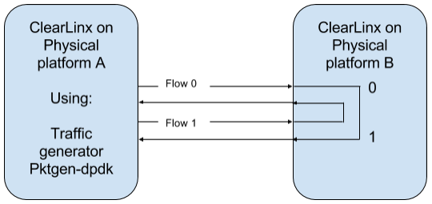

.. _ac-dpdk:

DPDK
####

Introduction
============

DPDK_ (Data Plane Development Kit) is a set of libraries and drivers for fast
packet processing.
This document describes how to run a basic use case for **l3fwd
DPDK example**. The objective is to *send packages between two platforms* using a
traffic generator called :ref:`pktgen <sec_pktgen>`, where the l3fwd example
application will forward those packages. See (:ref:`f1`)

.. _f1:

   Figure 1: environment for l3fwd DPDK application.

**Requirements:**

* Two platforms using Clear Linux* for Intel® Architecture (recommended release
  `13330`_ or higher).
* Both images have the **kernel-native bundle** added.
* Install of **network-basic-dev** bundle:

  .. code-block:: bash

     # swupd bundle-add network-basic-dev

* The platforms must have two NICs, at least one each. It's very important to
  check network card compatibility with the DPDK project. You can do this on
  the `dpdk.org NICS`_ site.
* Two network cables.

Installing dpdk and build l3fwd example (Platform B)
====================================================

#. Move to ``l3fwd`` example.

   .. code-block:: bash

      # cd /usr/share/dpdk/examples/l3fwd

#. Assign ``RTE_SDK var`` to the makefiles path.

   .. code-block:: bash

      # export RTE_SDK=/usr/share/dpdk/

#. Assign ``RTE_TARGET var`` the value where the gcc config file is located.

   .. code-block:: bash

      # export RTE_TARGET=x86_64-native-linuxapp-gcc

#. Build the ``l3fwd`` application, and add the configuration header to
   the ``CFLAGS`` var.

   .. code-block:: bash

      # make CFLAGS+="-include /usr/include/rte_config.h"

.. _sec_pktgen:

Building Pktgen (Platform A)
============================

Since the **pktgen** project is currently not included in Clear Linux OS for
Intel Architecture, you must download it from upstream and build it:

#. Download the `pktgen tar package`_ 3.1.2 or newer.

#. Decompress packages and move to uncompressed source directory.

#. Assign ``RTE_SDK var`` the path where makefiles are located.

   .. code-block:: bash

      # export RTE_SDK=/usr/share/dpdk/

#. Assign ``RTE_TARGET var`` the value where the gcc config file is located.

   .. code-block:: bash

      # export RTE_TARGET=x86_64-native-linuxapp-gcc

#. Build pktgen project, and set the ``CONFIG_RTE_BUILD_SHARED_LIB`` variable
   with "n".

   .. code-block:: bash

      # make CONFIG_RTE_BUILD_SHARED_LIB=n

Binding NICs to DPDK kernel drivers (Platforms A and B)
=======================================================

The ``l3fwd`` application uses two NICs. DPDK has useful tools for binding NICs to
DPDK modules to run DPDK applications.

#. Load the dpdk I/O kernel module

   .. code-block:: bash

      # modprobe vfio-pci

#. Check the status of your NICs; this will show which network cards are not busy. When
   another application is using them, the status shows ``Active``, and those NICs cannot be
   bound.

   .. code-block:: bash

      # dpdk-devbind --status

#. Bind two available NICs. The general syntax for binding is
   **dpdk-devbind --bind=vfio-pci <device-entry>**,
   and the following is a working example:

   .. code-block:: bash

      # dpdk-devbind --bind=vfio-pci 01:00.0

#. Check that your NICs binded correctly by checking the status; ``drv`` should have ``igb_uio``
   value; at this point, the NICs are using the DPDK modules.

Setting hugepages (platforms A and B)
=====================================

Clear Linux OS for Intel Architecture supports ``hugepages`` for the large memory pool
allocation used for packet buffers.

#. Set number of hugepages.

   .. code-block:: bash

      # echo 1024 > /sys/kernel/mm/hugepages/hugepages-2048kB/nr_hugepages

#. Allocate pages on NUMA machines.

   .. code-block:: bash

      # echo 1024 > /sys/devices/system/node/node0/hugepages/hugepages-2048kB/nr_hugepages
      # echo 1024 > /sys/devices/system/node/node1/hugepages/hugepages-2048kB/nr_hugepages

#. Make memory available for DPDK.
   
   .. code-block:: bash

      # mkdir -p /mnt/huge $ mount -t hugetlbfs nodev /mnt/huge

   If you would like to know more about this, refer to the `DPDK guide`_.

Setting a physical environment (Platforms A and B)
==================================================

To achieve the model proposed in the introduction of this topic, (:ref:`f1`), we need
to connect the first Grantley’s NICs to the second Grantley’s NICs using the network cables
(:ref:`f2`).

.. _f2:

.. figure:: _static/images/pyshical_net.png

    Figure 2: Physical network environment.

Running l3fwd application (Platform B)
======================================

The ``l3fwd`` application is one of the DPDK examples available when you install the ``dpdk-dev``
bundle; this application forwards packages from one NIC to another.

#. Open the l3fwd example directory.

   .. code-block:: bash

      # cd  /usr/share/dpdk/examples/l3fwd

#. **This step is very important.** DPDK needs poll drivers for work; these poll drivers are
   shared objects in :file:`/usr/lib64`. DPDK supports some NICs. The full list available at the
   `dpdk.org NICS`_ docs. You should know which kernel module the NIC is using and choose a poll
   driver according to your NICs.

#. At this point the system must have ``hugepages`` requirements. The NICs bound and the
   configuration for running ``pktgen`` depends upon network use cases and available system
   resources. Use the ``-d`` flag for setting the pull driver. For example, if the NICs are
   using ``e1000`` network driver, they are going to use ``e1000`` poll driver
   (``librte_pmd_e1000.so``); it should be in :file:`/usr/lib64` in Clear Linux OS for Intel Architecture, and it
   should be enough to add the name. For example

   .. code-block:: bash

      # ./build/l3fwd -c 0x3 -n 2 -d librte_pmd_e1000.so -- -p 0x3 --config="(0,0,0),(1,0,1)"

#. When the application starts to run, it will show information about the ``l3fwd`` running, so
   pay attention when the application is Initializing ports. After port 0 initialization, you'll
   see a MAC address and the same for port 1. Save this information for setting configuration
   to `Pktgen` project.

Running Pktgen application (Platform A)
===========================================

The `Pktgen` is network traffic generator. It measures the network packaging performance
in a forwarding use case.

#. At this point the system must have ``hugepages`` requirements and the NICs bound. The
   configuration for running ``pktgen`` depends upon the network use case and the available
   system resources. The following is a basic configuration.

   .. code-block:: bash

      # ./app/app/x86_64-native-linuxapp-gcc/pktgen -c 0xf -n 4 -- -p 0xf -P -m "1.0, 2.1"

#. Enable active colorful output (optional).

   .. code-block:: console

      Pktgen> theme enable

#. The ``l3fwd`` application showed a MAC address per-port initialized; this MAC addresses
   should have been set in the pktgen environment::

   > set mac <port number> <mac address>

   And a working example:

   .. code-block:: console

      Pktgen> set mac 0 00:1E:67:CB:E8:C9
      Pktgen> set mac 1 00:1E:67:CB:E8:C9

#. Start to send packages using the next command:

   .. code-block:: console

      Pktgen> start 0-1

#. If you followed these steps correctly, you'll see that ``pktgen`` is sending and receiving
   packages. For more information, see the `Pktgen documentation`_.

Annex A: Using pass-through for running on virtual machines
===========================================================

This section explains how to set up a virtual environment where virtual machines
control the host's NICs.

#. Create a new directory and move to it.

#. Download or create a ``start_qemu.sh`` script for running a kvm virtual machine:

   .. code-block:: bash

      $ curl -O https://download.clearlinux.org/image/start_qemu.sh

#. Download a bare-metal image of Clear Linux OS for Intel Architecture and rename it as ``clear.img``.

#. Look for an entry for device and vendor & device ID:

   .. code-block:: bash

      $ lspci -nn | grep Ethernet

   An output example from the last step::

       03:00.0 Ethernet controller [0200]: Intel Corporation I350 Gigabit Network Connection [8086:1521]

   where ``8086:1521`` is ``vendor:device ID`` and ``03:00.0`` is the entry for device.  Make
   note of this information; it is necessary for unbinding a host's NICs.

#. Unbind NICs from host to do passthrough with virtual machines. Clear Linux OS for Intel Architecture 
   currently supports this action. You can use the following commands::

      echo "vendor device_ID" > /sys/bus/pci/drivers/pci-stub/new_id
      echo "entry for device" > /sys/bus/pci/drivers/igb/unbind
      echo "entry for device" > /sys/bus/pci/drivers/pci-stub/bind
      echo "vendor device_ID" > /sys/bus/pci/drivers/pci-stub/remove_id

   .. code-block:: bash

      $ echo "8086 1521" > /sys/bus/pci/drivers/pci-stub/new_id
      $ echo "0000:03:00.0" > /sys/bus/pci/drivers/igb/unbind
      $ echo "0000:03:00.0" > /sys/bus/pci/drivers/pci-stub/bind
      $ echo "8086 1521" > /sys/bus/pci/drivers/pci-stub/remove_id

#. Assign to the KVM virtual machine (guest) the unbound NICs previously noted. Modify the
   ``start_qemu.sh`` script in ``qemu-system-x86_64`` arguments, and add the lines with
   the host's NICs information::

   -device pci-assign,host="<entry for device>",id=passnic0,addr=03.0
   -device pci-assign,host="<entry for device>",id=passnic1,addr=04.0

   A working example:

   .. code-block:: bash

      -device pci-assign,host=03:00.0,id=passnic0,addr=03.0 \
      -device pci-assign,host=03:00.3,id=passnic1,addr=04.0 \

#. If you would like to add more NUMA machines to the virtual machine, you can add the next
   line in the Makefile boot target::

      -numa node,mem=<memory>,cpus=<number of cpus>

   As a working example for a virtual machine with 4096 of memory and four CPUs, the configuration
   would look like this::

    -numa node,mem=2048,cpus=0-1 \
    -numa node,mem=2048,cpus=2-3 \

   This means that each NUMA machine has to use the same quantity of memory.

#. Finally, run the ``start_qemu.sh`` script.

.. _13330: https://download.clearlinux.org/releases/13330/
.. _DPDK: http://dpdk.org
.. _dpdk.org NICS: http://dpdk.org/doc/nics
.. _pktgen tar package: http://dpdk.org/browse/apps/pktgen-dpdk/refs
.. _DPDK guide: http://dpdk.org/doc/guides/linux_gsg/sys_reqs.html
.. _Pktgen documentation: `Pktgen documentation`_ https://media.readthedocs.org/pdf/pktgen/latest/pktgen.pdf
