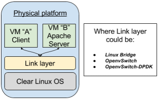

.. _ac-ovs-dpdk:

OpenvSwitch and DPDK
####################

Introduction
============

Using *DPDK* support on **OpenvSwitch project**, gets an important network performance, an easy way for 
understanding the magnitude of this increment is to compare to another software solution and 
even compare with itself without using DPDK support, this document describes the "HOWTO" about 
a simple use case (:ref:`f1ovs`) where one virtual machine sends 1 million of HTTP requests to 
another virtual machine using Linux bridges, OpenvSwitch bridges and of course 
OpenvSwitch-DPDK bridges as a network link.

.. _f1ovs:

    Figure 1: Basic virtual network environment.

**Requirements:**

* 1 platform using Clear Linux (recommended release 7160) for host
* The Clear Linux image for host has to use kernel-native
* Install "network-advanced" and "os-clr-on-clr" bundles

 .. code-block:: bash
	
		# swupd bundle-add network-advanced os-clr-on-clr

* Get 2 Clear Linux kvm images (recommended release 7160), these images will be the guest virtual machines, you can download them https://download.clearlinux.org/releases/. The virtual machines must have installed "network-basic" and "lamp-basic" bundles.
 
 .. code-block:: bash

        # swupd bundle-add network-basic lamp-basic

Using Linux Bridges
===================

1. Create an UP script for linux bridge in a virtual machine **(qemu-ifup)**.

 .. code-block:: bash

	#!/bin/bash
	set -x
	switch=br0
	if [ -n "$1" ];then
		tunctl -u whoami -t $1
		ip link set $1 up
		sleep 0.5s
		brctl addif $switch $1
		exit 0
	else
		echo "Error: no interface specified"
		exit 1
	fi
	
2. Change permissions to up script.

 .. code-block:: bash

    # chmod a+x qemu-ifup

3. Create a bridge using the openvswitch tool, you can verify if the bridge was created using ip tool.

 .. code-block:: bash

    # brctl addbr br0

 Note: At this point as an option is possible to add a NIC with the next command: **brctl addif br0 <network interface>** e.g: 

 .. code-block:: bash

    # brctl addif br0 enp3s0f0

 If the last option is used, and the NIC is connected to DHCP server, the 1 and 2 steps should be omitted in "Setting ip address" section.

4. Setup the linux bridge

 .. code-block:: bash

    # ip link set dev br0 up

5. Run guest virtual machine A using the next configuration as reference, where **$IMAGE** var is the clear linux image name.

 .. code-block:: bash

	qemu-system-x86_64 \
		-enable-kvm -m 1024 \
		-bios OVMF.fd \
		-smp cpus=2,cores=1 -cpu host \
		-vga none -nographic \
		-drive file="$IMAGE",if=virtio,aio=threads \
		-net nic,macaddr=00:11:22:33:44:55,model=virtio -net tap,script=qemu-ifup \
		-debugcon file:debug.log -global isa-debugcon.iobase=0x402

6. Run guest virtual machine B using the configuration from step 4, only it's necessary to change the mac address, example: 00:11:22:33:44:56

7. Follow instructions from "Setting ip address" section.

8. In order to clean the previous environment, turn off the virtual machines and delete the bridge.

 .. code-block:: bash

	# ip link set dev br0 down
	# brctl delbr br0

Using OpenvSwitch
=================

1. Start OpenvSwitch service.

 .. code-block:: bash

    # systemctl start openvswitch.service

2. Create a bridge using the openvswitch tool, you can verify if the bridge was created using ip tool.

 .. code-block:: bash

	# ovs-vsctl add-br br0
	# ip a

3. Create **UP-DOWN** scripts, this is in order to bring up the tap devices into the bridge created in the step 2 for **ovs-ifdown** script:

 .. code-block:: bash

	#!/bin/sh
	switch="br0"
	/usr/bin/ifconfig $1 0.0.0.0 down
	ovs-vsctl del-port ${switch} $1

 and for **ovs-ifup script**:

 .. code-block:: bash

	#!/bin/sh
	switch="br0"
	/usr/bin/ifconfig $1 0.0.0.0 up
	ovs-vsctl add-port ${switch} $1

4. Change permissions to up-down scripts

 .. code-block:: bash

	# chmod a+x ovs-ifdown
	# chmod a+x ovs-ifup

5. Run guest virtual machine A using the next configuration as reference, where **$IMAGE** var is the clear linux image name, notice that network configuration use the up-down scripts (step ).

 .. code-block:: bash

    qemu-system-x86_64 \
        -enable-kvm -m 1024 \
        -bios OVMF.fd \
        -smp cpus=2,cores=1 -cpu host \
        -vga none -nographic \
        -drive file="$IMAGE",if=virtio,aio=threads \
        -net nic,model=virtio,macaddr=00:11:22:33:44:55 -net tap,script=ovs-ifup,downscript=ovs-ifdown \
        -debugcon file:debug.log -global isa-debugcon.iobase=0x402

6. Run guest virtual machine B using the configuration from step 5, only it's necessary to change the mac address, you could use this: *00:11:22:33:44:56*

7. Follow instructions from "Setting ip address" section.

Using Linux OpenvSwitch-DPDK
============================

1. Use a new environment and add **iommu=pt intel_iommu=on**  to kernel command line.

 .. code-block:: bash

      # systemctl start boot.mount
      # cd /boot/loader/entries/

 Edit Clear-linux-native-<kernel-version>.conf and add **iommu=pt intel_iommu=on** in the end of the line, umount and reboot.
 
 .. code-block:: bash

      # cd /
      # systemctl stop boot.mount
      # reboot
    

2. Set number of hugepages

 .. code-block:: bash

	# echo 1024 > /sys/kernel/mm/hugepages/hugepages-2048kB/nr_hugepages

3. Allocate pages on NUMA machines

 .. code-block:: bash

	# echo 1024 > /sys/devices/system/node/node0/hugepages/hugepages-2048kB/nr_hugepages
	# echo 1024 > /sys/devices/system/node/node1/hugepages/hugepages-2048kB/nr_hugepages

4. Making memory available for DPDK.

 .. code-block:: bash

	# mkdir -p /mnt/huge
	# mount -t hugetlbfs nodev /mnt/huge

5. Add cores and memory configuration to OpenvSwitch example, the file **/usr/share/openvswitch/scripts/ovs-ctl** can be edited in the line 256 and add DPDK configuration it should look like this:  **set ovs-vswitchd --dpdk -c 0x2 -n 4 --socket-mem 2048 -- unix:"$DB_SOCK"** or the next regular expression could be helpful:

 .. code-block:: bash

	# sed -i s/"set ovs-vswitchd unix:"/"set ovs-vswitchd --dpdk -c 0x2 -n 4 --socket-mem 2048 -- unix:"/g /usr/share/openvswitch/scripts/ovs-ctl

6. Start OpenvSwitch service

 .. code-block:: bash

	# systemctl start openvswitch.service

7. Create a virtual bridge using openvswitch

 .. code-block:: bash

	# ovs-vsctl add-br br0 -- set bridge br0 datapath_type=netdev

8. Add dpdk ports to the bridge

 .. code-block:: bash

	# ovs-vsctl add-port br0 vhost-user1 -- set Interface vhost-user1 type=dpdkvhostuser
	# ovs-vsctl add-port br0 vhost-user2 -- set Interface vhost-user2 type=dpdkvhostuser

9. Run guest virtual machine A using the next configuration as reference, where **$IMAGE** var is the clear linux image name.

 .. code-block:: bash
 
    qemu-system-x86_64 \
        -enable-kvm -m 1024 \
        -bios OVMF.fd \
        -smp 4 -cpu host \
        -vga none -nographic \
        -drive file="$IMAGE",if=virtio,aio=threads \
        -chardev socket,id=char1,path=/run/openvswitch/vhost-user1 \
        -netdev type=vhost-user,id=mynet1,chardev=char1,vhostforce \
        -device virtio-net-pci,mac=00:00:00:00:00:01,netdev=mynet1 \
        -object memory-backend-file,id=mem,size=1024M,mem-path=/dev/hugepages,share=on \
        -numa node,memdev=mem -mem-prealloc \
        -debugcon file:debug.log -global isa-debugcon.iobase=0x402

10. Run guest virtual machine B, use the configuration from step 6, only it's necessary change the mac address and the port socket, you can use 00:00:00:00:00:02 as a mac address and vhost-user2 as a socket.

11. Follow instructions from "Setting ip address" section.

Setting ip address
======================

1. Set ip address to virtual machine for virtual machine A:

   .. code-block:: bash

      # ip addr add dev enp0s2 10.0.0.5/24

   for virtual machine B:

   .. code-block:: bash

      # ip addr add dev enp0s2 10.0.0.6/24

2. Check if there is communication between both virtual machines using ping tool.

3. Verify if apache service is running:

   .. code-block:: bash

      # systemctl status httpd.service
      # systemctl start httpd.service 

   (start httpd service only if it is inactive).
   Use apache benchmark in order to get information about the
   network performance between both virtual machines.

   .. code-block:: bash

      # ab -n 1000000 -c 100 http://10.0.0.6/

