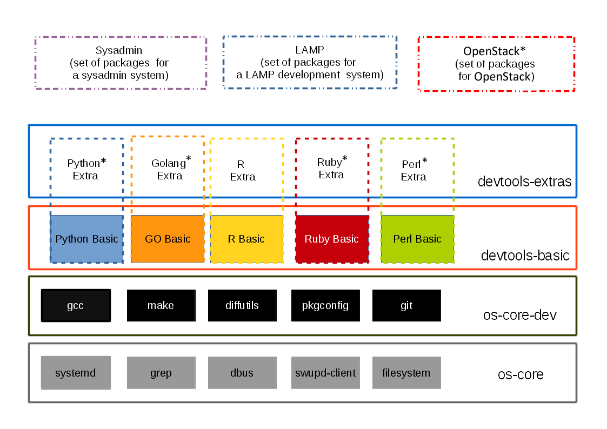

.. _bundles_overview:

Bundles overview
################

Linux-based operating systems contain the code of several hundred, if
not thousands, of open source projects. To make this manageable,
distributions use a concept called "packages" to configure and compile
the source code of these projects into binaries.

Many distributions then split the content of these compiled packages
into so-called sub-packages, which are the granularity at which these
distributions deploy their software. With those kinds of distributions,
system administrators can then install and update sub-packages
individually or as a set, using tools such as "yum" and "apt-get."

The Clear Linux* OS for Intel® Architecture takes a slightly different
approach. While we also use the concept of packages to manage compiling
source code into binaries, we do not use the package concept to deploy
software. Instead, we provide "bundles" that  provide a set of functionality
to the system administrator, independent of how many and which pieces of
the upstream open source projects are needed for this functionality. The
diagram below gives an overall picture of it.

To add a bundle
===============

``# swupd bundle-add [bundle name]``

To see a list of installed bundles
==================================

``# swupd bundle-add --list``

Or

``# ls /usr/share/clear/bundles``

Current list of available bundles: 

.. raw:: html
   
   <head>
	<title>Bundles in ClearLinux</title>
	
	</head>
    
    <table>
    <tr>
        <th align=left>Bundle Name</th>
        <th align=center>Status</th>
        <th align=left>Description</th>
    </tr>
    <tr>
        <td class="bundlename">
            <a href="https://github.com/clearlinux/clr-bundles/tree/master/bundles/bat">bat</a>
        </td>
        <td class="bundlestatus">ACTIVE</td>
        <td class="bundledesc">
            
Provides the neccesary bundles to perform BAT succesfully

            <li>Includes (devtools-extras) bundle.

                <li>Includes (openstack-test-suite) bundle.

                    <li>Includes (pnp-tools-advanced) bundle.

                        <li>Includes (openstack-all-in-one) bundle.

                            <li>Includes (storage-utils) bundle.

                                <li>Includes (sysadmin-hostmgmt) bundle.

                                    <li>Includes (kvm-host) bundle.

        </td>
    </tr>
    <tr>
        <td class="bundlename">
            <a href="https://github.com/clearlinux/clr-bundles/tree/master/bundles/bootloader">bootloader</a>
        </td>
        <td class="bundlestatus">ACTIVE</td>
        <td class="bundledesc">
            
UEFI bootloaders

        </td>
    </tr>
    <tr>
        <td class="bundlename">
            <a href="https://github.com/clearlinux/clr-bundles/tree/master/bundles/cloud-control">cloud-control</a>
        </td>
        <td class="bundlestatus">WIP</td>
        <td class="bundledesc">
            
Support packages for a cloud control surface

            <li>Includes (os-utils) bundle.

                <li>Includes (kvm-host) bundle.

                    <li>Includes (net-utils) bundle.

        </td>
    </tr>
    <tr>
        <td class="bundlename">
            <a href="https://github.com/clearlinux/clr-bundles/tree/master/bundles/cloud-dashboard">cloud-dashboard</a>
        </td>
        <td class="bundlestatus">WIP</td>
        <td class="bundledesc">
            
A graphical, web-based frontend UI for a cloud scheduler service. Dependencies only for now.

            <li>Includes (nodejs-basic) bundle.

        </td>
    </tr>
    <tr>
        <td class="bundlename">
            <a href="https://github.com/clearlinux/clr-bundles/tree/master/bundles/cloud-network">cloud-network</a>
        </td>
        <td class="bundlestatus">WIP</td>
        <td class="bundledesc">
            
Support for cloud networking agents

            <li>Includes (openssh-server) bundle.

                <li>Includes (net-utils) bundle.

        </td>
    </tr>
    <tr>
        <td class="bundlename">
            <a href="https://github.com/clearlinux/clr-bundles/tree/master/bundles/clr-devops">clr-devops</a>
        </td>
        <td class="bundlestatus">ACTIVE</td>
        <td class="bundledesc">
            
Provides build/release tools for Clear devops team

        </td>
    </tr>
    <tr>
        <td class="bundlename">
            <a href="https://github.com/clearlinux/clr-bundles/tree/master/bundles/containers-basic">containers-basic</a>
        </td>
        <td class="bundlestatus">WIP</td>
        <td class="bundledesc">
            
Installs rkt base for Clear Containers

            <li>Includes (storage-utils) bundle.

                <li>Includes (network-basic) bundle.

                    <li>Includes (kernel-container) bundle.

        </td>
    </tr>
    <tr>
        <td class="bundlename">
            <a href="https://github.com/clearlinux/clr-bundles/tree/master/bundles/cryptography">cryptography</a>
        </td>
        <td class="bundlestatus">ACTIVE</td>
        <td class="bundledesc">
            
Cryptographic tools

        </td>
    </tr>
    <tr>
        <td class="bundlename">
            <a href="https://github.com/clearlinux/clr-bundles/tree/master/bundles/database-mariadb">database-mariadb</a>
        </td>
        <td class="bundlestatus">ACTIVE</td>
        <td class="bundledesc">
            
Provides components needed to run MariaDB

        </td>
    </tr>
    <tr>
        <td class="bundlename">
            <a href="https://github.com/clearlinux/clr-bundles/tree/master/bundles/database-mariadb-dev">database-mariadb-dev</a>
        </td>
        <td class="bundlestatus">ACTIVE</td>
        <td class="bundledesc">
            
Provides MariaDB development tools (libraries and drivers)

            <li>Includes (database-mariadb) bundle.

        </td>
    </tr>
    <tr>
        <td class="bundlename">
            <a href="https://github.com/clearlinux/clr-bundles/tree/master/bundles/database-mongodb">database-mongodb</a>
        </td>
        <td class="bundlestatus">Deprecated</td>
        <td class="bundledesc">
            
Provides components needed to run mongodb

        </td>
    </tr>
    <tr>
        <td class="bundlename">
            <a href="https://github.com/clearlinux/clr-bundles/tree/master/bundles/devtools-basic">devtools-basic</a>
        </td>
        <td class="bundlestatus">ACTIVE</td>
        <td class="bundledesc">
            
Provides basic set of languages and tools for development

            <li>Includes (R-basic) bundle.

                <li>Includes (go-basic) bundle.

                    <li>Includes (hpc-basic) bundle.

                        <li>Includes (os-core-dev) bundle.

                            <li>Includes (os-dev-extras) bundle.

                                <li>Includes (perl-basic) bundle.

                                    <li>Includes (python-basic) bundle.

                                        <li>Includes (ruby-basic) bundle.

        </td>
    </tr>
    <tr>
        <td class="bundlename">
            <a href="https://github.com/clearlinux/clr-bundles/tree/master/bundles/devtools-extras">devtools-extras</a>
        </td>
        <td class="bundlestatus">ACTIVE</td>
        <td class="bundledesc">
            
Provides extra set of languages and tools for development

            <li>Includes (R-extras) bundle.

                <li>Includes (devtools-basic) bundle.

                    <li>Includes (go-extras) bundle.

                        <li>Includes (perl-extras) bundle.

                            <li>Includes (python-extras) bundle.

                                <li>Includes (ruby-extras) bundle.

        </td>
    </tr>
    <tr>
        <td class="bundlename">
            <a href="https://github.com/clearlinux/clr-bundles/tree/master/bundles/dev-utils">dev-utils</a>
        </td>
        <td class="bundlestatus">ACTIVE</td>
        <td class="bundledesc">
            
Provides a limited set of development utilities

        </td>
    </tr>
    <tr>
        <td class="bundlename">
            <a href="https://github.com/clearlinux/clr-bundles/tree/master/bundles/dev-utils-dev">dev-utils-dev</a>
        </td>
        <td class="bundlestatus">ACTIVE</td>
        <td class="bundledesc">
            
All packages required to build the dev-utils bundle.

            <li>Includes (dev-utils) bundle.

                <li>Includes (os-core-dev) bundle.

                    <li>Includes (os-dev-extras) bundle.

        </td>
    </tr>
    <tr>
        <td class="bundlename">
            <a href="https://github.com/clearlinux/clr-bundles/tree/master/bundles/dev-utils-doc">dev-utils-doc</a>
        </td>
        <td class="bundlestatus">ACTIVE</td>
        <td class="bundledesc">
            
Provides documentation and manpages for dev-utils

            <li>Includes (dev-utils) bundle.

        </td>
    </tr>
    <tr>
        <td class="bundlename">
            <a href="https://github.com/clearlinux/clr-bundles/tree/master/bundles/dpdk-dev">dpdk-dev</a>
        </td>
        <td class="bundlestatus">ACTIVE</td>
        <td class="bundledesc">
            
All headers and libraries necessary to develop with the Data Plane Development Kit.

            <li>Includes (os-core-dev) bundle.

                <li>Includes (os-dev-extras) bundle.

        </td>
    </tr>
    <tr>
        <td class="bundlename">
            <a href="https://github.com/clearlinux/clr-bundles/tree/master/bundles/editors">editors</a>
        </td>
        <td class="bundlestatus">ACTIVE</td>
        <td class="bundledesc">
            
Provides popular text editors

        </td>
    </tr>
    <tr>
        <td class="bundlename">
            <a href="https://github.com/clearlinux/clr-bundles/tree/master/bundles/editors-dev">editors-dev</a>
        </td>
        <td class="bundlestatus">ACTIVE</td>
        <td class="bundledesc">
            
All packages required to build the editors bundle.

            <li>Includes (editors) bundle.

                <li>Includes (os-core-dev) bundle.

                    <li>Includes (os-dev-extras) bundle.

        </td>
    </tr>
    <tr>
        <td class="bundlename">
            <a href="https://github.com/clearlinux/clr-bundles/tree/master/bundles/editors-doc">editors-doc</a>
        </td>
        <td class="bundlestatus">ACTIVE</td>
        <td class="bundledesc">
            
Provides documentation and manpages for editors

            <li>Includes (editors) bundle.

        </td>
    </tr>
    <tr>
        <td class="bundlename">
            <a href="https://github.com/clearlinux/clr-bundles/tree/master/bundles/file-utils">file-utils</a>
        </td>
        <td class="bundlestatus">ACTIVE</td>
        <td class="bundledesc">
            
Provides basic set of file manipulation utilities

        </td>
    </tr>
    <tr>
        <td class="bundlename">
            <a href="https://github.com/clearlinux/clr-bundles/tree/master/bundles/file-utils-dev">file-utils-dev</a>
        </td>
        <td class="bundlestatus">ACTIVE</td>
        <td class="bundledesc">
            
All packages required to build the file-utils bundle.

            <li>Includes (file-utils) bundle.

                <li>Includes (os-core-dev) bundle.

                    <li>Includes (os-dev-extras) bundle.

        </td>
    </tr>
    <tr>
        <td class="bundlename">
            <a href="https://github.com/clearlinux/clr-bundles/tree/master/bundles/file-utils-doc">file-utils-doc</a>
        </td>
        <td class="bundlestatus">ACTIVE</td>
        <td class="bundledesc">
            
Provides documentation and manpages for file-utils

            <li>Includes (file-utils) bundle.

        </td>
    </tr>
    <tr>
        <td class="bundlename">
            <a href="https://github.com/clearlinux/clr-bundles/tree/master/bundles/games">games</a>
        </td>
        <td class="bundlestatus">ACTIVE</td>
        <td class="bundledesc">
            
A colossal, but entertaining waste of time

            <li>Includes (libX11client) bundle.

        </td>
    </tr>
    <tr>
        <td class="bundlename">
            <a href="https://github.com/clearlinux/clr-bundles/tree/master/bundles/go-basic">go-basic</a>
        </td>
        <td class="bundlestatus">ACTIVE</td>
        <td class="bundledesc">
            
Provides basic Go language development

        </td>
    </tr>
    <tr>
        <td class="bundlename">
            <a href="https://github.com/clearlinux/clr-bundles/tree/master/bundles/go-extras">go-extras</a>
        </td>
        <td class="bundlestatus">ACTIVE</td>
        <td class="bundledesc">
            
Most popular Golang libraries

            <li>Includes (go-basic) bundle.

        </td>
    </tr>
    <tr>
        <td class="bundlename">
            <a href="https://github.com/clearlinux/clr-bundles/tree/master/bundles/hpc-basic">hpc-basic</a>
        </td>
        <td class="bundlestatus">ACTIVE</td>
        <td class="bundledesc">
            
Provides basic suite of MPI/HPC development tools

            <li>Includes (os-core-dev) bundle.

                <li>Includes (os-dev-extras) bundle.

        </td>
    </tr>
    <tr>
        <td class="bundlename">
            <a href="https://github.com/clearlinux/clr-bundles/tree/master/bundles/internet-console-utils">internet-console-utils</a>
        </td>
        <td class="bundlestatus">WIP</td>
        <td class="bundledesc">
            
Includes internet console tools to interact with internet

        </td>
    </tr>
    <tr>
        <td class="bundlename">
            <a href="https://github.com/clearlinux/clr-bundles/tree/master/bundles/internet-console-utils-dev">internet-console-utils-dev</a>
        </td>
        <td class="bundlestatus">WIP</td>
        <td class="bundledesc">
            
All packages required to build the internet-console-utils bundle.

            <li>Includes (internet-console-utils) bundle.

                <li>Includes (os-core-dev) bundle.

                    <li>Includes (os-dev-extras) bundle.

        </td>
    </tr>
    <tr>
        <td class="bundlename">
            <a href="https://github.com/clearlinux/clr-bundles/tree/master/bundles/internet-console-utils-doc">internet-console-utils-doc</a>
        </td>
        <td class="bundlestatus">WIP</td>
        <td class="bundledesc">
            
Provides documentation and manpages for internet-console-utils

            <li>Includes (internet-console-utils) bundle.

        </td>
    </tr>
    <tr>
        <td class="bundlename">
            <a href="https://github.com/clearlinux/clr-bundles/tree/master/bundles/iot">iot</a>
        </td>
        <td class="bundlestatus">Deprecated</td>
        <td class="bundledesc">
            
The IoT (Internet of Things) base bundle

            <li>Includes (iot-extras) bundle.

        </td>
    </tr>
    <tr>
        <td class="bundlename">
            <a href="https://github.com/clearlinux/clr-bundles/tree/master/bundles/iot-base">iot-base</a>
        </td>
        <td class="bundlestatus">WIP</td>
        <td class="bundledesc">
            
The IoT (Internet of Things) base bundle

            <li>Includes (kernel-iot) bundle.

        </td>
    </tr>
    <tr>
        <td class="bundlename">
            <a href="https://github.com/clearlinux/clr-bundles/tree/master/bundles/iot">iot</a>
        </td>
        <td class="bundlestatus"># [STATUS]:</td>
        <td class="bundledesc">
            
The IoT (Internet of Things) base bundle

            <li>Includes (iot-base) bundle.

        </td>
    </tr>
    <tr>
        <td class="bundlename">
            <a href="https://github.com/clearlinux/clr-bundles/tree/master/bundles/iot-extras">iot-extras</a>
        </td>
        <td class="bundlestatus">WIP</td>
        <td class="bundledesc">
            
The IoT (Internet of Things) base bundle

            <li>Includes (iot-base) bundle.

                <li>Includes (nodejs-basic) bundle.

                    <li>Includes (iot-message-broker) bundle.

        </td>
    </tr>
    <tr>
        <td class="bundlename">
            
        </td>
        <td class="bundlestatus"></td>
        <td class="bundledesc">
            

        </td>
    </tr>
    <tr>
        <td class="bundlename">
            <a href="https://github.com/clearlinux/clr-bundles/tree/master/bundles/java-basic">java-basic</a>
        </td>
        <td class="bundlestatus">ACTIVE</td>
        <td class="bundledesc">
            
Provides all openjdk tools

            <li>Includes (libX11client) bundle.

        </td>
    </tr>
    <tr>
        <td class="bundlename">
            <a href="https://github.com/clearlinux/clr-bundles/tree/master/bundles/kernel-container">kernel-container</a>
        </td>
        <td class="bundlestatus">WIP</td>
        <td class="bundledesc">
            
Provides a Linux kernel appropriate for a Clear Container

        </td>
    </tr>
    <tr>
        <td class="bundlename">
            <a href="https://github.com/clearlinux/clr-bundles/tree/master/bundles/kernel-embedded">kernel-embedded</a>
        </td>
        <td class="bundlestatus">Deprecated</td>
        <td class="bundledesc">
            
Provides a Linux kernel appropriate for embedded devices

            <li>Includes (kernel-iot) bundle.

        </td>
    </tr>
    <tr>
        <td class="bundlename">
            <a href="https://github.com/clearlinux/clr-bundles/tree/master/bundles/kernel-hyperv">kernel-hyperv</a>
        </td>
        <td class="bundlestatus">ACTIVE</td>
        <td class="bundledesc">
            
Provides a Linux kernel appropriate for running under HyperV

            <li>Includes (bootloader) bundle.

        </td>
    </tr>
    <tr>
        <td class="bundlename">
            <a href="https://github.com/clearlinux/clr-bundles/tree/master/bundles/kernel-iot">kernel-iot</a>
        </td>
        <td class="bundlestatus">ACTIVE</td>
        <td class="bundledesc">
            
Provides a Linux kernel appropriate for iot devices

            <li>Includes (bootloader) bundle.

        </td>
    </tr>
    <tr>
        <td class="bundlename">
            <a href="https://github.com/clearlinux/clr-bundles/tree/master/bundles/kernel-kvm">kernel-kvm</a>
        </td>
        <td class="bundlestatus">ACTIVE</td>
        <td class="bundledesc">
            
Provides a Linux kernel appropriate for running under KVM

            <li>Includes (bootloader) bundle.

        </td>
    </tr>
    <tr>
        <td class="bundlename">
            <a href="https://github.com/clearlinux/clr-bundles/tree/master/bundles/kernel-lts">kernel-lts</a>
        </td>
        <td class="bundlestatus">ACTIVE</td>
        <td class="bundledesc">
            
Provides a Linux LTS kernel appropriate for physical machines

            <li>Includes (bootloader) bundle.

        </td>
    </tr>
    <tr>
        <td class="bundlename">
            <a href="https://github.com/clearlinux/clr-bundles/tree/master/bundles/kernel-native">kernel-native</a>
        </td>
        <td class="bundlestatus">ACTIVE</td>
        <td class="bundledesc">
            
Provides a Linux kernel appropriate for physical machines

            <li>Includes (bootloader) bundle.

        </td>
    </tr>
    <tr>
        <td class="bundlename">
            <a href="https://github.com/clearlinux/clr-bundles/tree/master/bundles/kernel-pxe">kernel-pxe</a>
        </td>
        <td class="bundlestatus">Deprecated</td>
        <td class="bundledesc">
            
Provides a Linux kernel linking an initramfs as root

        </td>
    </tr>
    <tr>
        <td class="bundlename">
            <a href="https://github.com/clearlinux/clr-bundles/tree/master/bundles/koji">koji</a>
        </td>
        <td class="bundlestatus">WIP</td>
        <td class="bundledesc">
            
Sets up a koji build service (builder-only, for now) based on NFS mounts.

        </td>
    </tr>
    <tr>
        <td class="bundlename">
            <a href="https://github.com/clearlinux/clr-bundles/tree/master/bundles/kvm-host">kvm-host</a>
        </td>
        <td class="bundlestatus">WIP</td>
        <td class="bundledesc">
            
Provides necessary tools to run usable virtual machines with QEMU-KVM (independently of OpenStack).

            <li>Includes (libX11client) bundle.

        </td>
    </tr>
    <tr>
        <td class="bundlename">
            <a href="https://github.com/clearlinux/clr-bundles/tree/master/bundles/lamp-basic">lamp-basic</a>
        </td>
        <td class="bundlestatus">ACTIVE</td>
        <td class="bundledesc">
            
Basic LAMP Server (apache2, mariadb, php5)

        </td>
    </tr>
    <tr>
        <td class="bundlename">
            <a href="https://github.com/clearlinux/clr-bundles/tree/master/bundles/libX11client">libX11client</a>
        </td>
        <td class="bundlestatus">ACTIVE</td>
        <td class="bundledesc">
            
Provides basic client libraries for X11 applications

        </td>
    </tr>
    <tr>
        <td class="bundlename">
            <a href="https://github.com/clearlinux/clr-bundles/tree/master/bundles/lnmp-basic">lnmp-basic</a>
        </td>
        <td class="bundlestatus">WIP</td>
        <td class="bundledesc">
            
Basic LNMP Server (nginx, mariadb, php5)

        </td>
    </tr>
    <tr>
        <td class="bundlename">
            <a href="https://github.com/clearlinux/clr-bundles/tree/master/bundles/machine-learning-basic">machine-learning-basic</a>
        </td>
        <td class="bundlestatus">ACTIVE</td>
        <td class="bundledesc">
            
Basic components for machine learning development 

            <li>Includes (os-core-dev) bundle.

                <li>Includes (devtools-extras) bundle.

        </td>
    </tr>
    <tr>
        <td class="bundlename">
            <a href="https://github.com/clearlinux/clr-bundles/tree/master/bundles/mail-utils">mail-utils</a>
        </td>
        <td class="bundlestatus">WIP</td>
        <td class="bundledesc">
            
Provides utilities for reading and sending email

        </td>
    </tr>
    <tr>
        <td class="bundlename">
            <a href="https://github.com/clearlinux/clr-bundles/tree/master/bundles/mail-utils-dev">mail-utils-dev</a>
        </td>
        <td class="bundlestatus">WIP</td>
        <td class="bundledesc">
            
All packages required to build the mail-utils bundle.

            <li>Includes (mail-utils) bundle.

                <li>Includes (os-core-dev) bundle.

                    <li>Includes (os-dev-extras) bundle.

        </td>
    </tr>
    <tr>
        <td class="bundlename">
            <a href="https://github.com/clearlinux/clr-bundles/tree/master/bundles/message-broker-rabbitmq">message-broker-rabbitmq</a>
        </td>
        <td class="bundlestatus">ACTIVE</td>
        <td class="bundledesc">
            
Provides the RabbitMQ messaging service

        </td>
    </tr>
    <tr>
        <td class="bundlename">
            <a href="https://github.com/clearlinux/clr-bundles/tree/master/bundles/mixer">mixer</a>
        </td>
        <td class="bundlestatus">WIP</td>
        <td class="bundledesc">
            
Provide required utilities to make derivative releases

            <li>Includes (os-clr-on-clr) bundle.

        </td>
    </tr>
    <tr>
        <td class="bundlename">
            <a href="https://github.com/clearlinux/clr-bundles/tree/master/bundles/net-utils">net-utils</a>
        </td>
        <td class="bundlestatus">ACTIVE</td>
        <td class="bundledesc">
            
Provides an essential suite of core networking configuration and debug tools

        </td>
    </tr>
    <tr>
        <td class="bundlename">
            <a href="https://github.com/clearlinux/clr-bundles/tree/master/bundles/network-advanced">network-advanced</a>
        </td>
        <td class="bundlestatus">WIP</td>
        <td class="bundledesc">
            
More utilities for advanced host-level networking; bridge, switch, netfilter, vpn etc.

            <li>Includes (network-basic) bundle.

        </td>
    </tr>
    <tr>
        <td class="bundlename">
            <a href="https://github.com/clearlinux/clr-bundles/tree/master/bundles/network-basic">network-basic</a>
        </td>
        <td class="bundlestatus">ACTIVE</td>
        <td class="bundledesc">
            
Provides a basic suite of networking utilities

        </td>
    </tr>
    <tr>
        <td class="bundlename">
            <a href="https://github.com/clearlinux/clr-bundles/tree/master/bundles/network-basic-dev">network-basic-dev</a>
        </td>
        <td class="bundlestatus">ACTIVE</td>
        <td class="bundledesc">
            
All packages required to build the network-basic bundle.

            <li>Includes (network-basic) bundle.

                <li>Includes (os-core-dev) bundle.

                    <li>Includes (os-dev-extras) bundle.

        </td>
    </tr>
    <tr>
        <td class="bundlename">
            <a href="https://github.com/clearlinux/clr-bundles/tree/master/bundles/network-basic-doc">network-basic-doc</a>
        </td>
        <td class="bundlestatus">ACTIVE</td>
        <td class="bundledesc">
            
Provides documentation and manpages for network-basic

            <li>Includes (network-basic) bundle.

        </td>
    </tr>
    <tr>
        <td class="bundlename">
            <a href="https://github.com/clearlinux/clr-bundles/tree/master/bundles/network-proxy-client">network-proxy-client</a>
        </td>
        <td class="bundlestatus">WIP</td>
        <td class="bundledesc">
            
Tools for dealing with client-side network proxy settings.

        </td>
    </tr>
    <tr>
        <td class="bundlename">
            <a href="https://github.com/clearlinux/clr-bundles/tree/master/bundles/network-proxy-client-dev">network-proxy-client-dev</a>
        </td>
        <td class="bundlestatus">WIP</td>
        <td class="bundledesc">
            
All packages required to build the network-proxy-client bundle.

            <li>Includes (network-proxy-client) bundle.

                <li>Includes (os-core-dev) bundle.

                    <li>Includes (os-dev-extras) bundle.

        </td>
    </tr>
    <tr>
        <td class="bundlename">
            <a href="https://github.com/clearlinux/clr-bundles/tree/master/bundles/network-proxy-client-doc">network-proxy-client-doc</a>
        </td>
        <td class="bundlestatus">WIP</td>
        <td class="bundledesc">
            
Provides documentation and manpages for network-proxy-client

            <li>Includes (network-proxy-client) bundle.

        </td>
    </tr>
    <tr>
        <td class="bundlename">
            <a href="https://github.com/clearlinux/clr-bundles/tree/master/bundles/nfs-utils">nfs-utils</a>
        </td>
        <td class="bundlestatus">WIP</td>
        <td class="bundledesc">
            
Provides NFS binaries, associated utilities, and tools. Currently only client services are fully supported.

        </td>
    </tr>
    <tr>
        <td class="bundlename">
            <a href="https://github.com/clearlinux/clr-bundles/tree/master/bundles/nodejs-basic">nodejs-basic</a>
        </td>
        <td class="bundlestatus">ACTIVE</td>
        <td class="bundledesc">
            
NodeJS and associated dev tools

        </td>
    </tr>
    <tr>
        <td class="bundlename">
            <a href="https://github.com/clearlinux/clr-bundles/tree/master/bundles/opencontainers-dev">opencontainers-dev</a>
        </td>
        <td class="bundlestatus">WIP</td>
        <td class="bundledesc">
            
Includes required components for developing against the Open Container Specification

            <li>Includes (go-basic) bundle.

                <li>Includes (network-advanced) bundle.

        </td>
    </tr>
    <tr>
        <td class="bundlename">
            <a href="https://github.com/clearlinux/clr-bundles/tree/master/bundles/openssh-server">openssh-server</a>
        </td>
        <td class="bundlestatus">ACTIVE</td>
        <td class="bundledesc">
            
Provides an SSH server (and client)

        </td>
    </tr>
    <tr>
        <td class="bundlename">
            <a href="https://github.com/clearlinux/clr-bundles/tree/master/bundles/openstack-all-in-one">openstack-all-in-one</a>
        </td>
        <td class="bundlestatus">WIP</td>
        <td class="bundledesc">
            
Provides an All-in-one OpenStack deployment

            <li>Includes (database-mariadb) bundle.

                <li>Includes (message-broker-rabbitmq) bundle.

                    <li>Includes (openstack-block-storage) bundle.

                        <li>Includes (openstack-block-storage-controller) bundle.

                            <li>Includes (openstack-dashboard) bundle.

                                <li>Includes (openstack-identity) bundle.

                                    <li>Includes (openstack-image) bundle.

                                        <li>Includes (openstack-object-storage) bundle.

                                            <li>Includes (openstack-orchestration) bundle.

                                                <li>Includes (openstack-python-clients) bundle.

        </td>
    </tr>
    <tr>
        <td class="bundlename">
            <a href="https://github.com/clearlinux/clr-bundles/tree/master/bundles/openstack-block-storage">openstack-block-storage</a>
        </td>
        <td class="bundlestatus">WIP</td>
        <td class="bundledesc">
            
Provides an OpenStack Cinder service

            <li>Includes (openstack-common) bundle.

        </td>
    </tr>
    <tr>
        <td class="bundlename">
            <a href="https://github.com/clearlinux/clr-bundles/tree/master/bundles/openstack-block-storage-controller">openstack-block-storage-controller</a>
        </td>
        <td class="bundlestatus">WIP</td>
        <td class="bundledesc">
            
Provides an OpenStack Cinder controller service

            <li>Includes (openstack-common) bundle.

        </td>
    </tr>
    <tr>
        <td class="bundlename">
            <a href="https://github.com/clearlinux/clr-bundles/tree/master/bundles/openstack-common">openstack-common</a>
        </td>
        <td class="bundlestatus">WIP</td>
        <td class="bundledesc">
            
common components for OpenStack functionalit

            <li>Includes (python-basic) bundle.

        </td>
    </tr>
    <tr>
        <td class="bundlename">
            <a href="https://github.com/clearlinux/clr-bundles/tree/master/bundles/openstack-compute">openstack-compute</a>
        </td>
        <td class="bundlestatus">Deprecated</td>
        <td class="bundledesc">
            
Provides an OpenStack nova-compute node

        </td>
    </tr>
    <tr>
        <td class="bundlename">
            <a href="https://github.com/clearlinux/clr-bundles/tree/master/bundles/openstack-compute-controller">openstack-compute-controller</a>
        </td>
        <td class="bundlestatus">Deprecated</td>
        <td class="bundledesc">
            
Provides an OpenStack Nova control server

        </td>
    </tr>
    <tr>
        <td class="bundlename">
            <a href="https://github.com/clearlinux/clr-bundles/tree/master/bundles/openstack-configure">openstack-configure</a>
        </td>
        <td class="bundlestatus">Deprecated</td>
        <td class="bundledesc">
            
Provides a suggested default configuration for OpenStack on Clear Linux.

        </td>
    </tr>
    <tr>
        <td class="bundlename">
            <a href="https://github.com/clearlinux/clr-bundles/tree/master/bundles/openstack-controller">openstack-controller</a>
        </td>
        <td class="bundlestatus">Deprecated</td>
        <td class="bundledesc">
            
Provides an OpenStack multi-service control server

        </td>
    </tr>
    <tr>
        <td class="bundlename">
            <a href="https://github.com/clearlinux/clr-bundles/tree/master/bundles/openstack-dashboard">openstack-dashboard</a>
        </td>
        <td class="bundlestatus">WIP</td>
        <td class="bundledesc">
            
Provides an OpenStack Horizon server

            <li>Includes (openstack-common) bundle.

        </td>
    </tr>
    <tr>
        <td class="bundlename">
            <a href="https://github.com/clearlinux/clr-bundles/tree/master/bundles/openstack-database">openstack-database</a>
        </td>
        <td class="bundlestatus">Deprecated</td>
        <td class="bundledesc">
            
Provides a Database as a Service server

        </td>
    </tr>
    <tr>
        <td class="bundlename">
            <a href="https://github.com/clearlinux/clr-bundles/tree/master/bundles/openstack-data-processing">openstack-data-processing</a>
        </td>
        <td class="bundlestatus">Deprecated</td>
        <td class="bundledesc">
            
Provides a simple means to provision a data-intensive application cluster 

        </td>
    </tr>
    <tr>
        <td class="bundlename">
            <a href="https://github.com/clearlinux/clr-bundles/tree/master/bundles/openstack-identity">openstack-identity</a>
        </td>
        <td class="bundlestatus">WIP</td>
        <td class="bundledesc">
            
Provides an OpenStack Keystone server

            <li>Includes (openstack-common) bundle.

        </td>
    </tr>
    <tr>
        <td class="bundlename">
            <a href="https://github.com/clearlinux/clr-bundles/tree/master/bundles/openstack-image">openstack-image</a>
        </td>
        <td class="bundlestatus">WIP</td>
        <td class="bundledesc">
            
Provides an OpenStack Glance server

            <li>Includes (openstack-common) bundle.

        </td>
    </tr>
    <tr>
        <td class="bundlename">
            <a href="https://github.com/clearlinux/clr-bundles/tree/master/bundles/openstack-lbaas">openstack-lbaas</a>
        </td>
        <td class="bundlestatus">Deprecated</td>
        <td class="bundledesc">
            
Provides Load Balancing as a Service

        </td>
    </tr>
    <tr>
        <td class="bundlename">
            <a href="https://github.com/clearlinux/clr-bundles/tree/master/bundles/openstack-network">openstack-network</a>
        </td>
        <td class="bundlestatus">Deprecated</td>
        <td class="bundledesc">
            
Provides an OpenStack Neutron server

        </td>
    </tr>
    <tr>
        <td class="bundlename">
            <a href="https://github.com/clearlinux/clr-bundles/tree/master/bundles/openstack-object-storage">openstack-object-storage</a>
        </td>
        <td class="bundlestatus">WIP</td>
        <td class="bundledesc">
            
Provides an OpenStack Swift service

            <li>Includes (openstack-common) bundle.

        </td>
    </tr>
    <tr>
        <td class="bundlename">
            <a href="https://github.com/clearlinux/clr-bundles/tree/master/bundles/openstack-orchestration">openstack-orchestration</a>
        </td>
        <td class="bundlestatus">WIP</td>
        <td class="bundledesc">
            
Provides an OpenStack Heat service

            <li>Includes (openstack-common) bundle.

        </td>
    </tr>
    <tr>
        <td class="bundlename">
            <a href="https://github.com/clearlinux/clr-bundles/tree/master/bundles/openstack-python-clients">openstack-python-clients</a>
        </td>
        <td class="bundlestatus">WIP</td>
        <td class="bundledesc">
            
Provides OpenStack command-line utilities

            <li>Includes (openstack-common) bundle.

        </td>
    </tr>
    <tr>
        <td class="bundlename">
            <a href="https://github.com/clearlinux/clr-bundles/tree/master/bundles/openstack-telemetry">openstack-telemetry</a>
        </td>
        <td class="bundlestatus">Deprecated</td>
        <td class="bundledesc">
            
Provides an OpenStack Telemetry server

        </td>
    </tr>
    <tr>
        <td class="bundlename">
            <a href="https://github.com/clearlinux/clr-bundles/tree/master/bundles/openstack-telemetry-controller">openstack-telemetry-controller</a>
        </td>
        <td class="bundlestatus">Deprecated</td>
        <td class="bundledesc">
            
Provides an OpenStack Telemetry server

        </td>
    </tr>
    <tr>
        <td class="bundlename">
            <a href="https://github.com/clearlinux/clr-bundles/tree/master/bundles/openstack-test-suite">openstack-test-suite</a>
        </td>
        <td class="bundlestatus">WIP</td>
        <td class="bundledesc">
            
Provides an OpenStack Tempest/test suite 

            <li>Includes (openstack-common) bundle.

        </td>
    </tr>
    <tr>
        <td class="bundlename">
            <a href="https://github.com/clearlinux/clr-bundles/tree/master/bundles/openstack-vpnaas">openstack-vpnaas</a>
        </td>
        <td class="bundlestatus">Deprecated</td>
        <td class="bundledesc">
            
Provides VPN as a Service

        </td>
    </tr>
    <tr>
        <td class="bundlename">
            <a href="https://github.com/clearlinux/clr-bundles/tree/master/bundles/os-cloudguest">os-cloudguest</a>
        </td>
        <td class="bundlestatus">WIP</td>
        <td class="bundledesc">
            
Provides clr-cloud-init cloud guest configuration utilities

            <li>Includes (openssh-server) bundle.

        </td>
    </tr>
    <tr>
        <td class="bundlename">
            <a href="https://github.com/clearlinux/clr-bundles/tree/master/bundles/os-cloudguest-azure">os-cloudguest-azure</a>
        </td>
        <td class="bundlestatus">WIP</td>
        <td class="bundledesc">
            
Basic requirements for a cloud guest image on MS Azure

            <li>Includes (openssh-server) bundle.

        </td>
    </tr>
    <tr>
        <td class="bundlename">
            <a href="https://github.com/clearlinux/clr-bundles/tree/master/bundles/os-cloudguest-cci">os-cloudguest-cci</a>
        </td>
        <td class="bundlestatus">WIP</td>
        <td class="bundledesc">
            
Retired bundle - now provided by os-cloudguest

            <li>Includes (os-cloudguest) bundle.

        </td>
    </tr>
    <tr>
        <td class="bundlename">
            <a href="https://github.com/clearlinux/clr-bundles/tree/master/bundles/os-clr-on-clr">os-clr-on-clr</a>
        </td>
        <td class="bundlestatus">WIP</td>
        <td class="bundledesc">
            
content for development of the Clear Linux OS on the Clear Linux OS

            <li>Includes (os-core-dev) bundle.

                <li>Includes (os-dev-extras) bundle.

                    <li>Includes (mail-utils) bundle.

                        <li>Includes (storage-utils) bundle.

                            <li>Includes (os-core-update) bundle.

                                <li>Includes (python-basic) bundle.

                                    <li>Includes (perl-basic) bundle.

                                        <li>Includes (os-utils) bundle.

        </td>
    </tr>
    <tr>
        <td class="bundlename">
            <a href="https://github.com/clearlinux/clr-bundles/tree/master/bundles/os-clr-on-clr-dev">os-clr-on-clr-dev</a>
        </td>
        <td class="bundlestatus">WIP</td>
        <td class="bundledesc">
            
All packages required to build the os-clr-on-clr bundle.

            <li>Includes (os-clr-on-clr) bundle.

                <li>Includes (os-core-dev) bundle.

                    <li>Includes (os-dev-extras) bundle.

                        <li>Includes (mail-utils) bundle.

                            <li>Includes (storage-utils) bundle.

                                <li>Includes (os-core-update) bundle.

                                    <li>Includes (python-basic) bundle.

                                        <li>Includes (perl-basic) bundle.

                                            <li>Includes (os-utils) bundle.

                                                <li>Includes (mail-utils-dev) bundle.

                                                    <li>Includes (storage-utils-dev) bundle.

                                                        <li>Includes (os-core-update-dev) bundle.

                                                            <li>Includes (python-basic-dev) bundle.

                                                                <li>Includes (perl-basic-dev) bundle.

                                                                    <li>Includes (os-utils-dev) bundle.

        </td>
    </tr>
    <tr>
        <td class="bundlename">
            <a href="https://github.com/clearlinux/clr-bundles/tree/master/bundles/os-core">os-core</a>
        </td>
        <td class="bundlestatus">ACTIVE</td>
        <td class="bundledesc">
            
The basic core OS components of Clear Linux for iA 

        </td>
    </tr>
    <tr>
        <td class="bundlename">
            <a href="https://github.com/clearlinux/clr-bundles/tree/master/bundles/os-core-dev">os-core-dev</a>
        </td>
        <td class="bundlestatus">ACTIVE</td>
        <td class="bundledesc">
            
All packages required to build the os-core bundle.

            <li>Includes (os-core) bundle.

        </td>
    </tr>
    <tr>
        <td class="bundlename">
            <a href="https://github.com/clearlinux/clr-bundles/tree/master/bundles/os-core-doc">os-core-doc</a>
        </td>
        <td class="bundlestatus">ACTIVE</td>
        <td class="bundledesc">
            
Provides documentation and manpages for os-core

            <li>Includes (os-core) bundle.

        </td>
    </tr>
    <tr>
        <td class="bundlename">
            <a href="https://github.com/clearlinux/clr-bundles/tree/master/bundles/os-core-update">os-core-update</a>
        </td>
        <td class="bundlestatus">ACTIVE</td>
        <td class="bundledesc">
            
Provides basic suite for running the Clear Linux for iA Updater

            <li>Includes (os-core) bundle.

        </td>
    </tr>
    <tr>
        <td class="bundlename">
            <a href="https://github.com/clearlinux/clr-bundles/tree/master/bundles/os-core-update-dev">os-core-update-dev</a>
        </td>
        <td class="bundlestatus">ACTIVE</td>
        <td class="bundledesc">
            
All packages required to build the os-core-update bundle.

            <li>Includes (os-core-update) bundle.

                <li>Includes (os-core-dev) bundle.

                    <li>Includes (os-dev-extras) bundle.

                        <li>Includes (os-core) bundle.

                            <li>Includes (os-core-dev) bundle.

        </td>
    </tr>
    <tr>
        <td class="bundlename">
            <a href="https://github.com/clearlinux/clr-bundles/tree/master/bundles/os-dev-extras">os-dev-extras</a>
        </td>
        <td class="bundlestatus">ACTIVE</td>
        <td class="bundledesc">
            
Development utilities and helpful base Linux dev environment tools

        </td>
    </tr>
    <tr>
        <td class="bundlename">
            <a href="https://github.com/clearlinux/clr-bundles/tree/master/bundles/os-dev-full">os-dev-full</a>
        </td>
        <td class="bundlestatus">WIP</td>
        <td class="bundledesc">
            
A bundle containing all development libraries and headers

        </td>
    </tr>
    <tr>
        <td class="bundlename">
            <a href="https://github.com/clearlinux/clr-bundles/tree/master/bundles/os-installer">os-installer</a>
        </td>
        <td class="bundlestatus">ACTIVE</td>
        <td class="bundledesc">
            
Provides an installer for Clear Linux for iA

            <li>Includes (telemetrics) bundle.

                <li>Includes (network-proxy-client) bundle.

        </td>
    </tr>
    <tr>
        <td class="bundlename">
            <a href="https://github.com/clearlinux/clr-bundles/tree/master/bundles/os-testsuite">os-testsuite</a>
        </td>
        <td class="bundlestatus">WIP</td>
        <td class="bundledesc">
            
Provides basic test suite for Clear Linux for iA

        </td>
    </tr>
    <tr>
        <td class="bundlename">
            <a href="https://github.com/clearlinux/clr-bundles/tree/master/bundles/os-testsuite-phoronix">os-testsuite-phoronix</a>
        </td>
        <td class="bundlestatus">ACTIVE</td>
        <td class="bundledesc">
            
All the required pieces for running the Phoronix Test Suite

            <li>Includes (os-utils-gui) bundle.

                <li>Includes (devtools-extras) bundle.

                    <li>Includes (lamp-basic) bundle.

                        <li>Includes (machine-learning-basic) bundle.

        </td>
    </tr>
    <tr>
        <td class="bundlename">
            <a href="https://github.com/clearlinux/clr-bundles/tree/master/bundles/os-utils">os-utils</a>
        </td>
        <td class="bundlestatus">ACTIVE</td>
        <td class="bundledesc">
            
Provides a core set of OS utilities

            <li>Includes (editors) bundle.

                <li>Includes (dev-utils) bundle.

                    <li>Includes (sysadmin-basic) bundle.

                        <li>Includes (network-basic) bundle.

                            <li>Includes (file-utils) bundle.

                                <li>Includes (network-proxy-client) bundle.

                                    <li>Includes (internet-console-utils) bundle.

        </td>
    </tr>
    <tr>
        <td class="bundlename">
            <a href="https://github.com/clearlinux/clr-bundles/tree/master/bundles/os-utils-dev">os-utils-dev</a>
        </td>
        <td class="bundlestatus">ACTIVE</td>
        <td class="bundledesc">
            
All packages required to build the os-utils bundle.

            <li>Includes (os-utils) bundle.

                <li>Includes (os-core-dev) bundle.

                    <li>Includes (os-dev-extras) bundle.

                        <li>Includes (editors) bundle.

                            <li>Includes (dev-utils) bundle.

                                <li>Includes (sysadmin-basic) bundle.

                                    <li>Includes (network-basic) bundle.

                                        <li>Includes (file-utils) bundle.

                                            <li>Includes (network-proxy-client) bundle.

                                                <li>Includes (internet-console-utils) bundle.

                                                    <li>Includes (editors-dev) bundle.

                                                        <li>Includes (dev-utils-dev) bundle.

                                                            <li>Includes (sysadmin-basic-dev) bundle.

                                                                <li>Includes (network-basic-dev) bundle.

                                                                    <li>Includes (file-utils-dev) bundle.

                                                                        <li>Includes (network-proxy-client-dev) bundle.

                                                                            <li>Includes (internet-console-utils-dev) bundle.

        </td>
    </tr>
    <tr>
        <td class="bundlename">
            <a href="https://github.com/clearlinux/clr-bundles/tree/master/bundles/os-utils-doc">os-utils-doc</a>
        </td>
        <td class="bundlestatus">ACTIVE</td>
        <td class="bundledesc">
            
Provides documentation and manpages for os-utils

            <li>Includes (os-utils) bundle.

                <li>Includes (editors-doc) bundle.

                    <li>Includes (dev-utils-doc) bundle.

                        <li>Includes (sysadmin-basic-doc) bundle.

                            <li>Includes (network-basic-doc) bundle.

                                <li>Includes (file-utils-doc) bundle.

                                    <li>Includes (network-proxy-client-doc) bundle.

                                        <li>Includes (internet-console-utils-doc) bundle.

        </td>
    </tr>
    <tr>
        <td class="bundlename">
            <a href="https://github.com/clearlinux/clr-bundles/tree/master/bundles/os-utils-gui">os-utils-gui</a>
        </td>
        <td class="bundlestatus">ACTIVE</td>
        <td class="bundledesc">
            
Provides a graphical desktop environment 

            <li>Includes (os-utils) bundle.

                <li>Includes (python-basic) bundle.

                    <li>Includes (xfce4-desktop) bundle.

        </td>
    </tr>
    <tr>
        <td class="bundlename">
            <a href="https://github.com/clearlinux/clr-bundles/tree/master/bundles/perl-basic">perl-basic</a>
        </td>
        <td class="bundlestatus">ACTIVE</td>
        <td class="bundledesc">
            
Provides essential Perl language and dev tools

        </td>
    </tr>
    <tr>
        <td class="bundlename">
            <a href="https://github.com/clearlinux/clr-bundles/tree/master/bundles/perl-basic-dev">perl-basic-dev</a>
        </td>
        <td class="bundlestatus">ACTIVE</td>
        <td class="bundledesc">
            
All packages required to build the perl-basic bundle.

            <li>Includes (perl-basic) bundle.

                <li>Includes (os-core-dev) bundle.

                    <li>Includes (os-dev-extras) bundle.

        </td>
    </tr>
    <tr>
        <td class="bundlename">
            <a href="https://github.com/clearlinux/clr-bundles/tree/master/bundles/perl-extras">perl-extras</a>
        </td>
        <td class="bundlestatus">ACTIVE</td>
        <td class="bundledesc">
            
Provides extra libraries for Perl

            <li>Includes (perl-basic) bundle.

        </td>
    </tr>
    <tr>
        <td class="bundlename">
            <a href="https://github.com/clearlinux/clr-bundles/tree/master/bundles/pnp-tools-advanced">pnp-tools-advanced</a>
        </td>
        <td class="bundlestatus">WIP</td>
        <td class="bundledesc">
            
Provides advanced Power and Performance measurement tools

            <li>Includes (pnp-tools-intermediate) bundle.

        </td>
    </tr>
    <tr>
        <td class="bundlename">
            <a href="https://github.com/clearlinux/clr-bundles/tree/master/bundles/pnp-tools-basic">pnp-tools-basic</a>
        </td>
        <td class="bundlestatus">WIP</td>
        <td class="bundledesc">
            
Provides basic Power and Performance testing tools

        </td>
    </tr>
    <tr>
        <td class="bundlename">
            <a href="https://github.com/clearlinux/clr-bundles/tree/master/bundles/pnp-tools-intermediate">pnp-tools-intermediate</a>
        </td>
        <td class="bundlestatus">WIP</td>
        <td class="bundledesc">
            
Provides a deeper-level suite of Power and Performance testing tools

            <li>Includes (pnp-tools-basic) bundle.

        </td>
    </tr>
    <tr>
        <td class="bundlename">
            <a href="https://github.com/clearlinux/clr-bundles/tree/master/bundles/pxe-server">pxe-server</a>
        </td>
        <td class="bundlestatus">ACTIVE</td>
        <td class="bundledesc">
            
All the bits to run a PXE server for Clear Linux

        </td>
    </tr>
    <tr>
        <td class="bundlename">
            <a href="https://github.com/clearlinux/clr-bundles/tree/master/bundles/python-basic">python-basic</a>
        </td>
        <td class="bundlestatus">ACTIVE</td>
        <td class="bundledesc">
            
Provides core Python language and libraries

        </td>
    </tr>
    <tr>
        <td class="bundlename">
            <a href="https://github.com/clearlinux/clr-bundles/tree/master/bundles/python-basic-dev">python-basic-dev</a>
        </td>
        <td class="bundlestatus">ACTIVE</td>
        <td class="bundledesc">
            
All packages required to build the python-basic bundle.

            <li>Includes (python-basic) bundle.

                <li>Includes (os-core-dev) bundle.

                    <li>Includes (os-dev-extras) bundle.

        </td>
    </tr>
    <tr>
        <td class="bundlename">
            <a href="https://github.com/clearlinux/clr-bundles/tree/master/bundles/python-extras">python-extras</a>
        </td>
        <td class="bundlestatus">ACTIVE</td>
        <td class="bundledesc">
            
Provides extra libraries for Python

            <li>Includes (python-basic) bundle.

        </td>
    </tr>
    <tr>
        <td class="bundlename">
            <a href="https://github.com/clearlinux/clr-bundles/tree/master/bundles/R-basic">R-basic</a>
        </td>
        <td class="bundlestatus">ACTIVE</td>
        <td class="bundledesc">
            
Provides core R language and libraries

            <li>Includes (libX11client) bundle.

        </td>
    </tr>
    <tr>
        <td class="bundlename">
            <a href="https://github.com/clearlinux/clr-bundles/tree/master/bundles/R-extras">R-extras</a>
        </td>
        <td class="bundlestatus">ACTIVE</td>
        <td class="bundledesc">
            
Provides deeper functionality R language libraries

            <li>Includes (R-basic) bundle.

        </td>
    </tr>
    <tr>
        <td class="bundlename">
            <a href="https://github.com/clearlinux/clr-bundles/tree/master/bundles/ruby-basic">ruby-basic</a>
        </td>
        <td class="bundlestatus">ACTIVE</td>
        <td class="bundledesc">
            
Top 3 basic Ruby Libraries

        </td>
    </tr>
    <tr>
        <td class="bundlename">
            <a href="https://github.com/clearlinux/clr-bundles/tree/master/bundles/ruby-extras">ruby-extras</a>
        </td>
        <td class="bundlestatus">ACTIVE</td>
        <td class="bundledesc">
            
Top 3 to 6 basic Ruby Libraries

            <li>Includes (ruby-basic) bundle.

        </td>
    </tr>
    <tr>
        <td class="bundlename">
            <a href="https://github.com/clearlinux/clr-bundles/tree/master/bundles/rust-basic">rust-basic</a>
        </td>
        <td class="bundlestatus">ACTIVE</td>
        <td class="bundledesc">
            
rust compiler and cargo packaging tool

        </td>
    </tr>
    <tr>
        <td class="bundlename">
            <a href="https://github.com/clearlinux/clr-bundles/tree/master/bundles/shells">shells</a>
        </td>
        <td class="bundlestatus">ACTIVE</td>
        <td class="bundledesc">
            
All available shell programs for Clear, along with ancillary files

        </td>
    </tr>
    <tr>
        <td class="bundlename">
            <a href="https://github.com/clearlinux/clr-bundles/tree/master/bundles/storage-cluster">storage-cluster</a>
        </td>
        <td class="bundlestatus">WIP</td>
        <td class="bundledesc">
            
Ceph Cluster Storage

            <li>Includes (storage-utils) bundle.

        </td>
    </tr>
    <tr>
        <td class="bundlename">
            <a href="https://github.com/clearlinux/clr-bundles/tree/master/bundles/storage-utils">storage-utils</a>
        </td>
        <td class="bundlestatus">ACTIVE</td>
        <td class="bundledesc">
            
Provides basic storage-related utilities

        </td>
    </tr>
    <tr>
        <td class="bundlename">
            <a href="https://github.com/clearlinux/clr-bundles/tree/master/bundles/storage-utils-dev">storage-utils-dev</a>
        </td>
        <td class="bundlestatus">ACTIVE</td>
        <td class="bundledesc">
            
All packages required to build the storage-utils bundle.

            <li>Includes (storage-utils) bundle.

                <li>Includes (os-core-dev) bundle.

                    <li>Includes (os-dev-extras) bundle.

        </td>
    </tr>
    <tr>
        <td class="bundlename">
            <a href="https://github.com/clearlinux/clr-bundles/tree/master/bundles/sysadmin">sysadmin</a>
        </td>
        <td class="bundlestatus">ACTIVE</td>
        <td class="bundledesc">
            
Moved to sysadmin-basic

            <li>Includes (sysadmin-basic) bundle.

        </td>
    </tr>
    <tr>
        <td class="bundlename">
            <a href="https://github.com/clearlinux/clr-bundles/tree/master/bundles/sysadmin-advanced">sysadmin-advanced</a>
        </td>
        <td class="bundlestatus">ACTIVE</td>
        <td class="bundledesc">
            
Toolchest that a sysadmin needs to diagnose issues

            <li>Includes (sysadmin-basic) bundle.

                <li>Includes (pnp-tools-advanced) bundle.

        </td>
    </tr>
    <tr>
        <td class="bundlename">
            <a href="https://github.com/clearlinux/clr-bundles/tree/master/bundles/sysadmin-basic">sysadmin-basic</a>
        </td>
        <td class="bundlestatus">ACTIVE</td>
        <td class="bundledesc">
            
Provides a basic set of system administration utilities.

        </td>
    </tr>
    <tr>
        <td class="bundlename">
            <a href="https://github.com/clearlinux/clr-bundles/tree/master/bundles/sysadmin-basic-dev">sysadmin-basic-dev</a>
        </td>
        <td class="bundlestatus">ACTIVE</td>
        <td class="bundledesc">
            
All packages required to build the sysadmin-basic bundle.

            <li>Includes (sysadmin-basic) bundle.

                <li>Includes (os-core-dev) bundle.

                    <li>Includes (os-dev-extras) bundle.

        </td>
    </tr>
    <tr>
        <td class="bundlename">
            <a href="https://github.com/clearlinux/clr-bundles/tree/master/bundles/sysadmin-basic-doc">sysadmin-basic-doc</a>
        </td>
        <td class="bundlestatus">ACTIVE</td>
        <td class="bundledesc">
            
Provides documentation and manpages for sysadmin-basic

            <li>Includes (sysadmin-basic) bundle.

        </td>
    </tr>
    <tr>
        <td class="bundlename">
            <a href="https://github.com/clearlinux/clr-bundles/tree/master/bundles/sysadmin-hostmgmt">sysadmin-hostmgmt</a>
        </td>
        <td class="bundlestatus">WIP</td>
        <td class="bundledesc">
            
Utilities and Services for managing large-scale clusters of networked hosts

            <li>Includes (os-utils) bundle.

                <li>Includes (pxe-server) bundle.

                    <li>Includes (python-basic) bundle.

        </td>
    </tr>
    <tr>
        <td class="bundlename">
            <a href="https://github.com/clearlinux/clr-bundles/tree/master/bundles/tcl-basic">tcl-basic</a>
        </td>
        <td class="bundlestatus">WIP</td>
        <td class="bundledesc">
            
Components related to the TCL interpreter and associated tools

            <li>Includes (libX11client) bundle.

        </td>
    </tr>
    <tr>
        <td class="bundlename">
            <a href="https://github.com/clearlinux/clr-bundles/tree/master/bundles/telemetrics">telemetrics</a>
        </td>
        <td class="bundlestatus">ACTIVE</td>
        <td class="bundledesc">
            
Provides the Telemetrics client for Clear Linux for iA

        </td>
    </tr>
    <tr>
        <td class="bundlename">
            <a href="https://github.com/clearlinux/clr-bundles/tree/master/bundles/virtualbox-guest">virtualbox-guest</a>
        </td>
        <td class="bundlestatus">ACTIVE</td>
        <td class="bundledesc">
            
Include the modules and binaries meant to be used as a VirtualBox instance

            <li>Includes (kernel-lts) bundle.

        </td>
    </tr>
    <tr>
        <td class="bundlename">
            <a href="https://github.com/clearlinux/clr-bundles/tree/master/bundles/xfce4-desktop">xfce4-desktop</a>
        </td>
        <td class="bundlestatus">ACTIVE</td>
        <td class="bundledesc">
            
Provides the XFCE4 graphical desktop environment 

            <li>Includes (libX11client) bundle.

        </td>
    </tr>
    </table>

