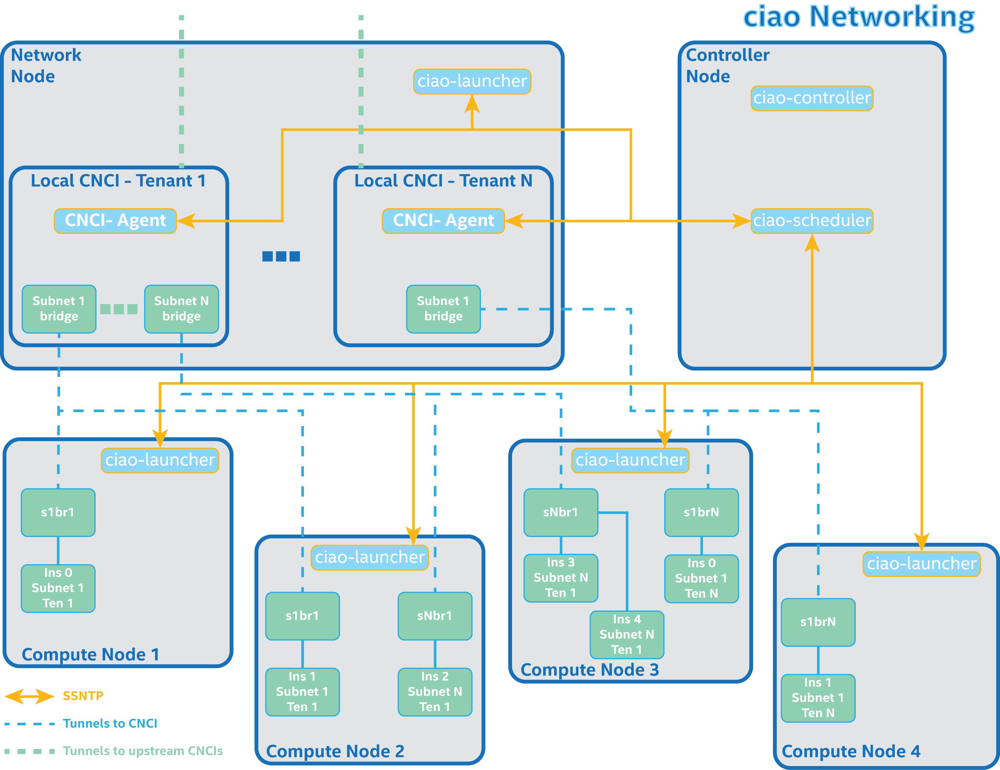

.. _ciao-cluster-setup:

.. contents::

Getting started with ciao
#########################

This topic explains how to set up a cluster of machines running Clear Linux* OS
for Intel® Architecture with :abbr:`Cloud Integrated Advanced Orchestrator (CIAO)`, or ciao.

While the table of contents provides links to specific points of information, this
topic is intended as an ordered workflow. Be sure to start your cluster components
in the correct order as explained below.

Infrastructure prerequisites
============================

Hardware needs
--------------

You'll need at least four machines and a switch connecting them to form
your beginning ciao cluster. The switch is assumed to be plugged directly
into an "upstream" network running a DHCP server. See the illustration below as an example:

The following examples assume you have four nodes on a ``192.168.0.0/16`` network:

Controller node
~~~~~~~~~~~~~~~

* IP ``192.168.0.101``
* Runs Controller, Scheduler, SSL Keystone.

Network node ("nn")
~~~~~~~~~~~~~~~~~~~

* IP ``192.168.0.102``
* Runs Launcher
* Has CNCI image in ``/var/lib/ciao/images``. See below for more on CNCI image preparation.

Compute node 1 ("cn1")
~~~~~~~~~~~~~~~~~~~~~~

* IP ``192.168.0.103``
* Runs Launcher
* Has workload images in ``/var/lib/ciao/images``

Compute node 2 ("cn2")
~~~~~~~~~~~~~~~~~~~~~~

* ``IP 192.168.0.104``
* Runs Launcher
* Has workload images in ``/var/lib/ciao/images``

Network needs
-------------

Our system assumes cluster nodes have full connectivity at a routed
IP level.  Additionally, the network node must have access to a DHCP
server offering addresses that are routable across the cluster.

Node setup
==========

Install Clear Linux OS for Intel Architecture as host on all nodes
------------------------------------------------------------------

Install Clear Linux OS for Intel Architecture as the host
OS on all nodes by following the instructions in the topic
:ref:`gs_installing_clr_as_host`. The current April 2016
`downloadable installer images`_ are compatible with ciao.

After the base installation on each node add the following additional
bundle, which adds components needed by ciao::

    $ swupd bundle-add cloud-control

Build the ciao software
-----------------------

Ciao is written in the Go programming language. It requires Go 1.6 to
build. Most Linux distributions have out of date versions of Go in their
repositories, so you will probably need to download and install a recent
version of Go. This can be easily done by following the
`Go installation instructions <https://golang.org/doc/install>`__.

On a Linux development machine with Go language development tooling
present, use the ``go get`` tool to fetch and build ciao and its go
dependencies::

    $ cd $GOPATH/src
    $ go get -v -u github.com/01org/ciao/...

The binaries will install to ``$GOPATH/bin``. You should have
``ciao-cli``, ``ciao-cert``, ``ciao-cnci-agent``, ``ciao-launcher``,
``ciao-controller``, and ``ciao-scheduler``.

Build certificates
------------------

Create the ssntp-internal communications certificates
~~~~~~~~~~~~~~~~~~~~~~~~~~~~~~~~~~~~~~~~~~~~~~~~~~~~~

On your development machine, generate the certificates for each of your
roles; general instructions can be found under the `ciao-cert`_ documentation.

When generating the certificates, pass in the IP and host name for
the host on which you will be running the scheduler in the ``-ip`` and
``-host`` arguments, respectively. The scheduler acts as the cluster
SSNTP server, and connecting clients will validate credentials matched by
those embedded in the certificates.

Create unique certificates for each of your scheduler, compute node, network
node launchers, cnci agent, controller, and the CNCI launcher; save each with a
unique name. The names, locations, and contents (signer and role) of the
certificates are very important. The rest of this topic will consistently use
the following example filenames:

* ``CAcert-[scheduler-node-hostname].pem``: copy to all nodes' ``/etc/pki/ciao`` and the CNCI image's ``/var/lib/ciao``. See below for more on CNCI image preparation.
* ``cert-CNAgent-localhost.pem``: copy to all compute nodes' ``/etc/pki/ciao``.
* ``cert-CNCIAgent-localhost.pem``: copy into your network node's ``/var/lib/ciao``. A script later will copy it into the CNCI appliance image.  See below for more on CNCI image preparation.
* ``cert-Controller-localhost.pem``: copy into your controller node's ``/etc/pki/ciao``.
* ``cert-NetworkingAgent-localhost.pem``: copy into your network node's ``/etc/pki/ciao``.
* ``cert-Scheduler-[scheduler-node-hostname].pem``: copy into your controller node's ``/etc/pki/ciao``.

Create the controller web certificates
~~~~~~~~~~~~~~~~~~~~~~~~~~~~~~~~~~~~~~

On your development box, generate ssl certificates for the controller's https service::

    $ openssl req -x509 -nodes -days 365 -newkey rsa:2048 -keyout controller_key.pem -out controller_cert.pem

Copy the ``controller_cert.pem`` and ``controller_key.pem`` files to your
controller node. You can use the same location where you will be storing
your controller binary (``ciao-controller``).

You'll also need to pull that certificate into your browser as noted below in
the `Starting a workload` section.

Keystone node
-------------

You need to run a Keystone service.  General documentation on
`installing Keystone`_ and
`setting up Keystone`_ services can be found at the OpenStack developer website.
Once your Keystone is running, we need a few configuration points. For example:::

  $ openstack service create --name ciao compute
  $ openstack user create --password hello csr
  $ openstack role add --project service --user csr admin
  $ openstack user create --password giveciaoatry demo
  $ openstack role add --project demo --user demo user

This adds a ciao compute service, a keystone user and project for the
controller (a.k.a. csr) node, and a demo user with the password
``giveciaoatry``.

Controller node setup
---------------------

The controller node will host your controller and scheduler. Certificates are assumed
to be in ``/etc/pki/ciao``, generated with the correct roles and names
as previously described.

Cluster Configuration
~~~~~~~~~~~~~~~~~~~~~
Ciao's cluster configuration is stored and fetched from a cluster specific storage backend.
Supported backends are plain **local file**, **etcd** [WIP] and **ZooKeeper** [WIP].

For more details about Cluster Configuration Architecture: `CIAO Configuration Architecture`_

- Local File backend

  - Create the ``/etc/ciao/configuration.yaml`` file. Example::

      configure:
        scheduler:
	  storage_uri: /etc/ciao/configuration.yaml
        controller:
          compute_ca: /etc/pki/ciao/compute_ca.pem
	  compute_cert: /etc/pki/ciao/compute_key.pem
	  identity_user: controller
	  identity_password: ciao
	launcher:
	  compute_net: 192.168.1.110
	  mgmt_net: 192.168.1.111
	image_service:
	  url: http://glance.example.com
	identity_service:
	  url: http://keystone.example.com

  - More examples at: `CIAO Configuration examples`_

Scheduler
~~~~~~~~~

Copy in the scheduler binary from your build/development machine to any
location, then launch it first (does not require root)::

    $ ./ciao-scheduler --cacert=/etc/pki/ciao/CAcert-[scheduler-node-hostname].pem --cert=/etc/pki/ciao/cert-Scheduler-[scheduler-node-hostname].pem --heartbeat

With the optional ``--heartbeat`` option, the scheduler console will
output once per-second a heartbeat message showing connected Controller
and Compute Node client statistics. It also displays a line of
information for each command or event traversing the SSNTP server.
As the sole SSNTP server in the ciao cluster, it is a key debugging point
to understand failed flows of actions/reactions across your cluster.
Launching it first means this console output helps confirm your subsequent
cluster configurations actions are indeed succeeding.

ciao-controller
~~~~~~~~~~~~~~~

**Important: Do not start the ciao controller just yet!** It should only
be started after a network node is connected to the scheduler; otherwise
workloads may fail to start. This restriction will be addressed once
`ciao issue #12`_ is closed.

Compute node setup
------------------

Each compute node needs one launcher daemon connected to the scheduler.
Certificates are assumed to be in ``/etc/pki/ciao``, generated with the
correct roles and names as previously described.

Copy in the launcher binary from your build/development machine to any
location.

Prepopulate the OS image cache
~~~~~~~~~~~~~~~~~~~~~~~~~~~~~~

Ciao has not yet integrated with an existing image server; so for
simplicity, presume a prepopulated image cache for each compute
node in ``/var/lib/ciao/images``.

We have tested the `Fedora* 23 Cloud`_, Clear Linux OS for Intel
Architecture cloud `downloadable cloud images`_, and Ubuntu* images. Each image
will be referenced very specifically by a UUID in our configuration
files, so follow the instructions here exactly. You may wish to create
the needed UUID named image files as symlinks to a more human readable
and descriptively named image files as is done in the following example::

  $ mkdir -p /var/lib/ciao/images
  $ cd /var/lib/ciao/images

Fedora Cloud::

  $ curl -O https://dl.fedoraproject.org/pub/fedora/linux/releases/23/Cloud/x86_64/Images/Fedora-Cloud-Base-23-20151030.x86_64.qcow2
  $ ln -s Fedora-Cloud-Base-23-20151030.x86_64.qcow2 73a86d7e-93c0-480e-9c41-ab42f69b7799

Clear Linux OS for Intel Architecture Cloud::

  $ LATEST=$(curl https://download.clearlinux.org/latest)
  $ curl -O https://download.clearlinux.org/image/clear-${LATEST}-cloud.img.xz
  $ xz -T0 --decompress clear-${LATEST}-cloud.img.xz
  $ ln -s clear-${LATEST}-cloud.img df3768da-31f5-4ba6-82f0-127a1a705169

Docker* images will be pulled down automatically at the time of first usage.

Each compute node needs its ``/var/lib/ciao/images`` directory populated with
images with which you wish to test.

Start the compute node launcher
~~~~~~~~~~~~~~~~~~~~~~~~~~~~~~~

The launcher is run with options for declaring certificates. For example::

    $ sudo ./ciao-launcher --cacert=/etc/pki/ciao/CAcert-[scheduler-node-hostname].pem --cert=/etc/pki/ciao/cert-CNAgent-localhost.pem

Optionally, add ``-logtostderr`` (more verbose with also ``-v=2``) to get
console logging output.

The launcher runs as root because launching QEMU/KVM virtual machines
requires ``/dev/kvm`` and other restricted resource access.

Network node setup
------------------

The network node hosts VMs running the :abbr:`Compute Network Concentrators
Instance (CNCI)` or the **CNCI Agent**, one for each tenant. These VMs
are automatically launched by the controller.

Certificates are assumed to be in ``/etc/pki/ciao``, generated with the
correct roles and names as previously described.

Pre-populate the CNCI image cache
~~~~~~~~~~~~~~~~~~~~~~~~~~~~~~~~~

This section describes how to generate a CNCI image from a vanilla
Clear Cloud qcow2 image::

  $ cd /var/lib/ciao/images
  $ curl -O https://download.clearlinux.org/demos/ciao/clear-8260-ciao-networking.img.xz
  $ xz -T0 --decompress clear-8260-ciao-networking.img.xz
  $ ln -s clear-8260-ciao-networking.img 4e16e743-265a-4bf2-9fd1-57ada0b28904
  $ $GOPATH/src/github.com/01org/ciao/networking/ciao-cnci-agent/scripts/update_cnci_cloud_image.sh /var/lib/ciao/images/clear-8260-ciao-networking.img /etc/pki/ciao/

Start the network node launcher
~~~~~~~~~~~~~~~~~~~~~~~~~~~~~~~

The network node's launcher is run similarly to the compute node's launcher::

  $ sudo ./ciao-launcher --cacert=/etc/pki/ciao/CAcert-[scheduler-node-hostname].pem --cert=/etc/pki/ciao/cert-NetworkingAgent-localhost.pem

Start the controller
--------------------

Starting the Controller on the controller node is what truly activates your
cluster for use. **NOTE: Before starting the controller, you must have a scheduler
and network node already up and running together.**

#. Copy in the ciao-controller binary from your build/development machine to any
   location. Certificates are assumed to be in ``/etc/pki/ciao``, generated with
   the correct roles and names as previously described.

#. Copy in the initial database table data from the ciao-controller source
   (``$GOPATH/src/github.com/01org/ciao/ciao-controller/tables`` on your
   build/development) to ``./tables`` in the same directory as the
   ciao-controller binary.  Copying in ``*.csv`` will work if you are testing
   a Clear Cloud image, Fedora image and Docker. Other images will require
   edits to the csv config files.  This location is the default, but can be
   changed by modifying the controller command line to include
   ``--tables_init_path=<your tables path>``.

#. Copy in the test workload definitions from
   ``$GOPATH/src/github.com/01org/ciao/ciao-controller/workloads`` on your
   build/development machine to ``./workloads`` in the same directory as the
   ciao-controller binary.  This location is the default, but can be changed
   by modifying the controller command line to include
   ``--workloads_path=<your workloads path>``.

The `ciao-controller workload_resources.csv`_ and the
`ciao-controller workload_template.csv`_ have four stanzas, so yours
should as well, in order to successfully run each of the four images
currently described earlier on this page (Fedora, Clear, Docker Ubuntu,
CNCI). To run other images of your choosing, follow a process similar to
the above: pre-populate OS images and edit each of these two files on
your controller node.

In order for the ciao-controller's go code to correctly use the CA
certificate(s) generated earlier when you built your keystone server,
this certificate needs to be installed in the control node and be
part of the control node CA root. On Clear Linux OS for Intel
Architecture, this is accomplished with::

    $ sudo mkdir /etc/ca-certs
    $ sudo cp cacert.pem /etc/ca-certs
    $ sudo c_hash /etc/ca-certs/cacert.pem

Note the generated hash from the prior command and use it in the next commands::

    $ sudo ln -s /etc/ca-certs/cacert.pem /etc/ca-certs/<hashvalue>
    $ sudo mkdir /etc/ssl
    $ sudo ln -s /etc/ca-certs/ /etc/ssl/certs
    $ sudo ln -s /etc/ca-certs/cacert.pem /usr/share/ca-certs/<hashvalue>

You will need to tell the controller where the keystone service is located and
pass the ciao service username and password to it. DO NOT USE
localhost for your server name; **it must be the fully qualified DNS
name of the system that is hosting the keystone service**.
An SSL-enabled Keystone is required, with additional parameters
for ciao-controller pointing at its certificates::

  $ sudo ./ciao-controller --cacert=/etc/pki/ciao/CAcert-[scheduler-node-hostname].pem --cert=/etc/pki/ciao/cert-Controller-localhost.pem

Optionally add ``-logtostderr`` (more verbose with also ``-v=2``) to get
console logging output.

Use the `ciao-cli`_ command line tool to verify that your cluster is
now up and running::

  $ ciao-cli -username admin -password <admin_password> node status
  $ ciao-cli -username admin -password <admin_password> node list -compute
  $ ciao-cli -username admin -password <admin_password> node list -cnci

``node status`` shows the number of nodes in your cluster, and the
status of each.

``node list -compute`` displays a more detailed view (number of instances per node,
available resources per node, etc.).

``node list -cnci`` provides information about the current CNCI VMs, and their statuses.

Interacting with your cluster
=============================

Ciao Web UI setup
-----------------

In addition to `ciao-cli`_, a node.js-based web UI offers a means of
interacting with your cluster visually.  Documentation for this is in
the `ciao-webui`_ github repository.  A simple JSON configuration file
allows you to specify the webui configuration and point its back end to
your keystone and ciao-controller systems.

Ciao CLI setup
--------------

The `ciao-cli`_ command-line tool can be set up by exporting a set of ciao-
specific environment variables:

* ``CIAO_CONTROLLER`` exports the ciao controller FQDN
* ``CIAO_IDENTITY`` exports the ciao keystone instance FQDN
* ``CIAO_COMPUTEPORT`` exports the ciao compute alternative port
* ``CIAO_USERNAME`` exports the ciao username
* ``CIAO_PASSWORD`` export the ciao password for ``CIAO_USERNAME``

For example::

  $ cat ciao-cli-example.sh

  export CIAO_CONTROLLER=ciao-ctl.intel.com
  export CIAO_IDENTITY=https://ciao-identity.intel.com:35357
  export CIAO_USERNAME=user
  export CIAO_PASSWORD=ciaouser

  $ source ciao-cli-example.sh

Defining those variables is optional. The same pieces of information
can be passed to `ciao-cli`_ through the various command line options.
The command line options will take precedence over the ciao environment
variables and override them:

* ``CIAO_CONTROLLER`` can be defined by the ``--controller`` option
* ``CIAO_IDENTITY`` can be defined by the ``--identity`` option
* ``CIAO_COMPUTEPORT`` can be defined by the ``--computeport`` option
* ``CIAO_USERNAME`` can be defined by the ``--username`` option
* ``CIAO_PASSWORD`` can be defined by the ``--password`` option

Start a workload
================

As a valid user, the `ciao-cli`_ tool allows you to start a workload.

First, you may want to know which workloads are available::

  $ ciao-cli workload list

Then you can launch one or more workloads::

  $ ciao-cli instance add -workload <workload UUID> -instances <number of instances to launch>

And you can monitor all your instances statuses (``pending`` or ``running``)::

  $ ciao-cli instance list

Performance data can be obtained (optionally) by adding a specific label
to all your instances::

  $ ciao-cli instance add -label <instance-label> -workload <workload UUID> -instances <number of instances to launch>

And eventually fetch the performance data::

  $ ciao-cli trace show <label>

You will also see activity related to this launch across your cluster
components if you have consoles open and logging to standard output as
described above.

Reset your cluster
==================

First you should delete all instances with the `ciao-cli`_ command line
tool::

  $ ciao-cli instance delete -all

On your scheduler node, run the following command::

  $ sudo killall -w -9 qemu-system-x86_64

On your controller node, go to the directory in which you ran the
ciao-controller binary and run the following commands::

  $ sudo killall -w -9 ciao-controller
  $ sudo rm $HOME/bin/ciao-controller.db /tmp/ciao-controller-stats.db

On the node running your keystone VM, run the following command::

  $ sudo killall -w -9 qemu-system-x86_64

On the network node, run the following commands::

  $ sudo ./launcher --hard-reset
  $ sudo reboot

If you were unable to successfully delete all workload VM instances
through the UI, then on each compute node run these commands::

  $ sudo ./launcher --hard-reset
  $ sudo reboot

Restart your scheduler, network node launcher, compute node launcher,
and controller.

Debug tips
==========

For general debugging, you can:

* Reset you cluster.
* Pull in updated go binaries.
* Enable verbose console logging with ``-logtostderr -v=2`` on the go
  binaries' command lines.
* Reduce your tenants to one (specifically the one with no limits).
* Launch fewer VMs in a herd. A small Intel NUC with 16GB of RAM can handle as many as
  50-100 2vcpu 218MB RAM VMs starting at once per compute node. Larger dual socket
  many thread CPU with hundreds of GB RAM Haswell-EP servers can handle as many as 500
  such VMs starting at once per compute node.
* Tweak the launcher to enable remote access: go get with ``--tags=debug`` to enable
  a netcat based console redirection for each VM.  The launcher console verbose output
  will indicate per VM how to connect to the console. For example::

  $  netcat 192.168.0.102 6309

* Ssh into the compute node(s) by IP, looking at top, df, ps, ip a, ip r, netstat -a, etc.
* Ssh into the CNCI(s) by IP, looking at top, df, ps, ip a, ip r, netstat -a, etc.
* Ssh into the workload instance VMs via CNCI IP and port redirection.  Each VM will be
  at a port composed from the VM's IP address added to 33000. For example::

   33000+ip[2]<<8+ip[3]

  The VM IP is available in the `ciao-cli`_.
* Instance credentials for netcat or ssh connectivity depend on the contents of
  the cloud-init configuration used by ciao-controller for the workload.

Please contact our `mailing list`_ for more help with initial bringup and
testing.

.. _ciao issue #12: https://github.com/01org/ciao/issues/12
.. _ciao-controller workload_resources.csv: https://github.com/01org/ciao/blob/master/ciao-controller/workload_resources.csv
.. _ciao-controller workload_template.csv: https://github.com/01org/ciao/blob/master/ciao-controller/workload_template.csv
.. _downloadable installer images: https://download.clearlinux.org/image
.. _downloadable cloud images: https://download.clearlinux.org/image
.. _Fedora 23 Cloud: https://download.fedoraproject.org/pub/fedora/linux/releases/23/Cloud/x86_64/Images/Fedora-Cloud-Base-23-20151030.x86_64.qcow2
.. _installing Keystone: http://docs.openstack.org/developer/keystone/installing.html
.. _setting up Keystone: http://docs.openstack.org/developer/keystone/setup.html
.. _go: https://golang.org/doc/articles/go_command.html
.. _ciao-cert: https://github.com/01org/ciao/blob/master/ssntp/ciao-cert/README.md
.. _CNCI Agent: https://github.com/01org/ciao/tree/master/networking/ciao-cnci-agent
.. _mailing list: https://lists.clearlinux.org/mailman/listinfo/ciao-devel
.. _ciao-cli: https://github.com/01org/ciao/tree/master/ciao-cli
.. _ciao-webui: https://github.com/01org/ciao-webui
.. _CIAO Configuration Architecture: https://github.com/01org/ciao/wiki/Configuration
.. _CIAO Configuration Examples: https://github.com/01org/ciao/tree/master/configuration#configuration-examples
