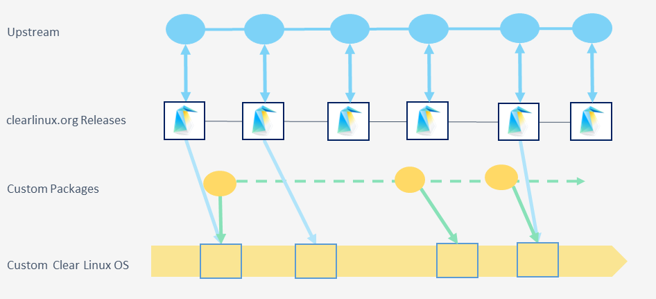

.. _mixer-about:

Mixer
#####

|CL-ATTR| is a powerful, modular, and customizable OS. Upstream |CL| offers
many images to support different environments and use-cases.  There are
hundreds of bundles that will meet most, if not all, of your OS and software
needs.

However, if you need additional customization or content, |CL| provides the
mixer tool. Depending on your needs, the mixer tool allows you to:

* :ref:`create-mix` to create a distinct derivative of the |CL| that
   contains your custom software.

.. _create-mix:

Create a mix
============

When creating a mix, you can

* Use any existing upstream bundles with no modification.
* Redefine what goes into existing bundles.
* Create completely new, custom bundles with your own custom packages.

With mixer you are not required to incorporate every upstream release into
your mix. You decide which upstream versions to update your derivative to, as
illustrated in Figure 1.

   Figure 1: With a custom mix, you add your custom bundle and decide which
   upstream versions to update your mix to, on your own release cycle.

Creating your own mix forks away from the |CL| upstream and requires that you
act as your own OSV. There is a greater level of responsibility, requiring
more infrastructure and processes to adopt. However, with this approach, you
have a higher degree of control and customization of your custom |CL|.

Related topics
==============

|CL| provides flexibility in how you customize your OS. Learn more about
mixer and related topics to decide which customization approach is best for
you.

* :ref:`mixer`
* :ref:`bundles-about`
* :ref:`swupd-about`
* :ref:`deploy-at-scale`
