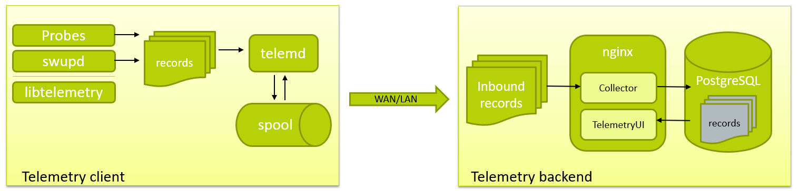

.. _telemetry-about:

Telemetrics
###########

One of the key features of |CL| is telemetry, which is used to
monitor system health. Telemetry enables developers to observe and proactively
address issues before end users are impacted.

*Telemetrics* is a combination word made from:

*	*Telemetry* which is sensing and reporting data.
*	*Analytics* which is using visualization and statistical inferencing to make
	sense of the reported data.

|CL| telemetry reports system-level debug/crash information using specialized probes. The
probes monitor system tasks such as :abbr:`swupd (software updater)`, kernel
oops, machine error checks, and BIOS error report table for unhandled hardware
failures. Telemetry enables real-time issue reporting to allow system
developers to quickly focus on an issue and monitor corrective actions.

|CL| telemetry is fully customizable and can be used during software development
for debugging purposes. You can use **libtelemetry** in your code to create custom
telemetry records. You can also use **telem-record-gen** in script files or call
it from another program.

Architecture
************

|CL| telemetry has two fundamental components, which are shown in figure 1:

*	Client:  generates and delivers records to the backend server via the network.
*	Backend: captures records sent from the client and displays the cumulative
	content through a specialized interface.

	.. note::

		If you want to capture your own records for analysis, you must set up
		your own backend server.

   Figure 1: Clear Linux Telemetry Architecture.

The telemetry client provides the front end of a complete telemetrics solution
and includes the following components:

*	**telemprobd**, a daemon that prepares the telemetry records and spools them on disk prior to delivery
* **telempostd**, a daemon that takes the records, verifies and then sends to the telemetry server or spools on disk in case the server is unavailable.

*	**probes**, that collect specific types of data from the operating system.
*	**libtelemetry**, that telemetrics probes use to create telemetrics records and
	send them to the telemprobd daemon for further processing.

The telemetry backend provides the server-side component of a complete telemetrics solution and
consists of:

*	Nginx web server.
*	Two Flask apps:

	*	Collector, an ingestion web app for records received from telemetrics-client probes.
	*	TelemetryUI, a web app that exposes several views to visualize the telemetry data
		and also provides a REST API to perform queries.

*	PostgreSQL as the underlying database server.

The default telemetry backend server reports back to the |CL| development team
and is not viewable outside the Intel firewall. If you want to collect your
own records, then you must set up your own telemetry backend server.

Next steps
**********

To put this concept into practice, see the following resources:

*	:ref:`telemetry-enable`
*	:ref:`telemetry-backend`
*	`Telemetry feature description`_

.. _`Telemetry feature description`:
	https://clearlinux.org/features/telemetry
