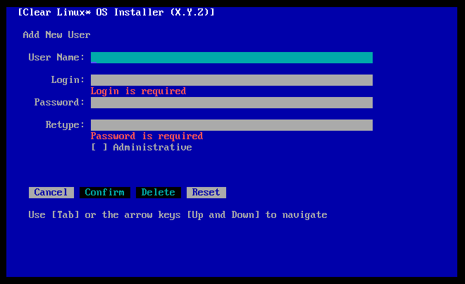

.. _bare-metal-install-beta:

Install |CL-ATTR| from the live desktop beta image
##################################################

The live desktop beta image allows you to boot |CL-ATTR| into a GNOME
desktop without modifying the host system. Using the live image, you can
explore the possibilities of developing with |CL|. You can also launch the
new installer and install |CL| on your target system.

.. contents:: :local:
   :depth: 1

System requirements
*******************

Assure that your target system supports the installation:

* :ref:`system-requirements`
* :ref:`compatibility-check`

Preliminary steps
*****************

#. `Navigate to the image directory`_.

#. Download the file :file:`clear-<release number>-live-desktop-beta.img.xz`

   .. note::

      ``<release-number>`` is the latest |CL| auto-numbered release.

#. Follow your OS instructions to create a bootable USB drive.

   * :ref:`bootable-usb-linux-all`
   * :ref:`bootable-usb-mac-all`
   * :ref:`bootable-usb-windows-all`

.. _install-from-live-image:

Install from live image
***********************

After you've downloaded and burned the live desktop image on a
USB drive, follow these steps.

#. Insert the USB drive into an available USB slot.

#. Power on the system.

#. Open the system BIOS setup menu by pressing the F2 key.

   .. note::

    Your BIOS setup menu entry point may vary.

#. In the setup menu, enable the UEFI boot and set the USB drive as the
   first option in the device boot order.

#. Save these settings and exit.

#. Reboot the target system.

Launch the installer
====================

#. After the |CL| live desktop image boots, select the :guilabel:`Activities`   menu in the upper left.

#. Select the icon, :guilabel:`Install Clear Linux OS`, shown in Figure 1.

   .. figure:: figures/bare-metal-install-beta-1.png
     :scale: 50 %
     :alt: Install Clear Linux OS icon

     Figure 1: Install Clear Linux OS icon

#. Upon selecting the icon, the installer is launched, as shown in Figure 2.

   .. figure:: figures/bare-metal-install-beta-2.png
     :scale: 50 %
     :alt: Clear Linux OS Installer

     Figure 2: Clear Linux OS Installer

.. _minimum-installation-requirements:

Minimum installation requirements
*********************************

To fulfill minimum installation requirements, complete the
:guilabel:`Required options`. :guilabel:`Advanced options` are optional. Additional user help is described below.

.. note::

   * The :kbd:`Install` button is only highlighted **after** you complete the
     :ref:`required-options-installation`, and after you enter all required
     values in submenus of :ref:`required-options-installation` and
     :ref:`advanced-options-installation`.

   * You must choose whether or not to participate in :ref:`telemetrics`
     before you can finish installation.

   * You may wish to :ref:`test-network-settings` before you
     :ref:`configure-network-interfaces`. Assure that a ``Success`` message is received before installation.

Main Menu
*********

In the |CL| Installer Main Menu, two tabs appear:
:guilabel:`[R] Required options` and :guilabel:`[A] Advanced options`.
Navigate between tabs using the arrow keys or these shortcut keys:

* :kbd:`Shift+A` for :guilabel:`[A] Advanced options`
* :kbd:`Shift+R` for :guilabel:`[R] Required options`

To meet the minimum requirements, enter your choices in the
:guilabel:`Required options`. After confirmation, your selections appear
below menu options in the Main Menu, beside the :guilabel:`>>` chevron.

Navigation
**********

* Select :kbd:`Tab` or :kbd:`Up/Down` arrows to highlight your choice.

* Select :kbd:`Enter` or :kbd:`Spacebar` to confirm your choice.

* Select :kbd:`Cancel` or :kbd:`Esc` to cancel your choice.

  The |CL| Installer Main Menu appears as shown in Figure 3.

  .. figure:: figures/bare-metal-install-beta-3.png
     :scale: 100 %
     :alt: Clear Linux OS Installer Main Menu

     Figure 3: :guilabel:`Clear Linux OS Installer Main Menu`

.. _required-options-installation:

Required options
****************

Choose Timezone
===============

#. From the Main Menu, select :guilabel:`Choose Timezone`.

#. Select :kbd:`Enter` to continue.

#. In :guilabel:`Select System Timezone`, navigate to
   the desired timezone.

#. Use :kbd:`Tab` to navigate to :guilabel:`Confirm`.

#. Select :kbd:`Enter` to :kbd:`Confirm`.

   .. note::

      Select :guilabel:`Cancel` to restore the previously defined value and
      return to the Main Menu.

   .. figure:: figures/bare-metal-install-beta-4.png
      :scale: 100 %
      :alt: Select System Timezone

      Figure 4: :guilabel:`Select System Timezone`

Choose Language
===============

#. From the Main Menu, select :guilabel:`Choose Language`.

#. Select :kbd:`Enter`.

#. In :guilabel:`Select System Language`, navigate to your desired language.

#. Select :kbd:`Tab` to highlight :kbd:`Confirm`.

#. Select :kbd:`Enter` to :kbd:`Confirm`.

   .. note::

      Select :guilabel:`Cancel` to restore the previously defined value and return to the Main Menu.

   .. figure:: figures/bare-metal-install-beta-5.png
      :scale: 100 %
      :alt: Select System Language

      Figure 5: :guilabel:`Select System Language`

Configure the Keyboard
======================

#. From the Main Menu, select :guilabel:`Configure the Keyboard`.

#. Select :kbd:`Enter`.

#. In :guilabel:`Select Keyboard`, navigate to the desired option.

#. In :guilabel:`Test keyboard`, type text to assure that the keys map to
   your keyboard.

#. Select :kbd:`Tab` to highlight :guilabel:`Confirm`.

#. Select :kbd:`Enter` to :kbd:`Confirm`.

   .. note::

      Select :guilabel:`Cancel` to restore the previously defined value and return to the Main Menu.

   .. figure:: figures/bare-metal-install-beta-6.png
      :scale: 100 %
      :alt: Select Keyboard menu

      Figure 6: :guilabel:`Select Keyboard menu`

Configure Media
===============

#. From the Main Menu, select :guilabel:`Configure Media`.

   .. note::

      Available media appear by default.

#. Navigate to the desired media until highlighted.

   .. figure:: figures/bare-metal-install-beta-7.png
      :scale: 100 %
      :alt: Configure Media menu

      Figure 7: :guilabel:`Configure Media menu`

      .. note::

         Use additional options as necessary during partitioning:

         * Select :guilabel:`Revert` to cancel changes and revert to the
           original configuration.
         * Select :guilabel:`Rescan` to show media connected to the host
           machine.

#. Select :kbd:`Enter` or :kbd:`Spacebar` to select it.

   Two options for partitioning appear.

#. Select :guilabel:`Auto Partition` to accept the default configuration, or
   :guilabel:`Add Partition` to add partitions manually. See instructions
   below.

#. Select :kbd:`Enter` to :kbd:`Confirm`.

#. Choose one partitioning option and continue below:

   * :ref:`auto-partition`
   * :ref:`add-partition`

.. _auto-partition:

Auto Partition
==============

Auto partition will configure the media to meet the minimum requirements.

#. Select :guilabel:`Auto Partition` as shown in Figure 8.

#. Select :kbd:`Enter` or :kbd:`Spacebar` to highlight
   :guilabel:`Auto partition`.

#. Select :kbd:`Enter` to :kbd:`Confirm`.

   This action returns you to the Main Menu.

   .. figure:: figures/bare-metal-install-beta-8.png
      :scale: 100 %
      :alt: Auto Partition

      Figure 8: :guilabel:`Auto Partition`

#. You may skip to the :ref:`telemetry-tui` section below.

Disk encryption
===============

For greater security, disk encryption is supported by use of LUKS for all
partitions **except boot** on |CL|. Encryption is optional. To encrypt a
partition, see the example below to encrypt :ref:`encrypt-root`.

Encryption Passphrase
---------------------

|CL| supports use of a single passphrase for all encrypted partitions.
Therefore, if you turn on encryption for one partition, the same passphrase
is used for all partitions.

.. note::

   For example, suppose you encrypt the `root` partition first and the `swap`
   partition second. Upon selecting encryption for the `swap` partition, the
   :guilabel:`Encryption Passphrase` dialogue appears showing the default
   Passphrase assigned to the `root`. Select :guilabel:`Confirm` and press
   :kbd:`Enter` to use the same Passphrase.

.. _add-partition:

Add Partition
=============

Minimum requirements
--------------------

To add partitions manually, assign partitions per the minimum
requirements shown in Table 1:

.. list-table:: **Table 1. Disk Partition Setup**
   :widths: 33, 33, 33
   :header-rows: 1

   * - FileSystem
     - Mount Point
     - Minimum size
   * - ``VFAT``
     - /boot
     - 150M
   * - ``swap``
     -
     - 256MB
   * - ``root``
     - /
     - *Size depends upon use case/desired bundles.*

#. In the Configure Media menu, select :guilabel:`Add Partition`.

   .. note:: To change an existing partition, navigate to the partition,
      and select :guilabel:`Enter`.

boot partition
--------------

#. In the :guilabel:`File System` menu, select :kbd:`Up/Down` arrows to
   select the file system type.  See Figure 9.

#. In :guilabel:`Mount Point`, enter the ``/boot`` partition.

#. In :guilabel:`Size`, enter an appropriate size (e.g., 150M) per Table 1.

#. Navigate to :guilabel:`Confirm` until highlighted.

#. Select :guilabel:`Enter` to confirm.

   .. figure:: figures/bare-metal-install-beta-9.png
      :scale: 100 %
      :alt: boot partition

      Figure 9: :guilabel:`boot partition`

swap partition
--------------

#. In the :guilabel:`File System` menu, select :kbd:`Up/Down` arrows to
   select the file system type. See Figure 10.

#. In :guilabel:`Mount Point`, the field remains blank.

   .. note::

      The Mount Point field is disabled.

#. In :guilabel:`Size`, enter an appropriate size (e.g., 256MB) per Table 1.

#. Navigate to :guilabel:`Add`.

#. Select :guilabel:`Enter` to continue.

   .. figure:: figures/bare-metal-install-beta-10.png
      :scale: 100 %
      :alt: swap partition

      Figure 10: :guilabel:`swap partition`

.. _encrypt-root:

root partition
--------------

#. In the :guilabel:`File System` menu, select :kbd:`Up/Down` arrows to
   select the file system type. See Figure 11.

   #. Optional: Select :guilabel:`[X] Encrypt` to encrypt the partition.

      .. figure:: figures/bare-metal-install-beta-11.png
         :scale: 100 %
         :alt: Encrypt partition

         Figure 11: :guilabel:`Encrypt partition`

   #. The :guilabel:`Encryption Passphrase` dialogue appears.

      .. note::

         Minimum length is 8 characters. Maximum length is 94 characters.

         .. figure:: figures/bare-metal-install-beta-12.png
            :scale: 100 %
            :alt: Encryption Passphrase

            Figure 12: :guilabel:`Encryption Passphrase`

   #. Enter the same passphrase in the first and second field.

   #. Navigate to :guilabel:`Confirm` and press :kbd:`Enter`.

      .. note::

         :guilabel:`Confirm` is only highlighted if passphrases match.

#. Optional: In :guilabel:`[Optional] Label:`, enter your desired
   label for the partition.

#. In :guilabel:`Mount Point`, enter ``/``. See Figure 11.

#. In :guilabel:`Size`, enter an appropriate size per Table 1.

   .. note::

      The remaining available space shows by default.

#. Navigate to :guilabel:`Add` until highlighted.

#. Select :guilabel:`Enter` to continue.

   You are returned to the :guilabel:`Configure media` menu.

#. Select :guilabel:`Confirm` to complete the media selection. See Figure 13.

#. You are returned to the :guilabel:`Configure media` menu. Your partitions
   should be similar to those shown in Figure 13.

   .. figure:: figures/bare-metal-install-beta-13.png
      :scale: 100 %
      :alt: Partitions

      Figure 13: :guilabel:`Partitions`

#. Navigate to :guilabel:`Confirm` until highlighted.

#. Select :guilabel:`Enter` to complete adding partitions.

.. _telemetry-tui:

Telemetry
=========

To fulfill the :guilabel:`Required options`, choose whether or not to
participate in `telemetry`_.  :ref:`telemetrics` is a |CL| feature that
reports failures and crashes to the |CL| development team for improvements.
For more detailed information, visit our :ref:`telemetry-about` page.

#. In the Main Menu, navigate to :guilabel:`Telemetry` and select
   :kbd:`Enter`.

#. Select :kbd:`Tab` to highlight your choice.

#. Select :kbd:`Enter` to confirm.

   .. figure:: figures/bare-metal-install-beta-14.png
      :scale: 100 %
      :alt: Enable Telemetry

      Figure 14: :guilabel:`Enable Telemetry`

Skip to finish installation
===========================

After selecting values for all :guilabel:`Required options`, you may skip
directly to :ref:`finish-cl-installation`

In the Main Menu, select the :guilabel:`Advanced options` if you wish to
configure network interfaces or proxy settings, add bundles, add/manage
users, and more. Continue to the next section.

.. _advanced-options-installation:

Advanced Options
****************

.. _configure-network-interfaces:

Configure Network Interfaces
============================

By default, |CL| is configured to automatically detect the host network
interface using DHCP. However, if you want to use a static IP address or if
you do not have a DHCP server on your network, follow these instructions to
manually configure the network interface. Otherwise, default network
interface settings are automatically applied.

.. note::

   If DHCP is available, no user selection may be required.

#. Navigate to :guilabel:`Configure Network Interfaces` and
   select :kbd:`Enter`.

#. Navigate to the network :guilabel:`interface` you wish to change.

#. When the desired :guilabel:`interface` is highlighted, select
   :guilabel:`Enter` to edit.

   .. note:: Multiple network interfaces may appear.

   .. figure:: figures/bare-metal-install-beta-15.png
      :scale: 100 %
      :alt: Configure Network Interfaces

      Figure 15: :guilabel:`Configure Network Interfaces`

#. Notice :guilabel:`Automatic / dhcp` is selected by default (at bottom).

   Optional: Navigate to the checkbox :guilabel:`Automatic / dhcp` and select
   :kbd:`Spacebar` to deselect.

   .. figure:: figures/bare-metal-install-beta-16.png
      :scale: 100 %
      :alt: Network interface configuration

      Figure 16: :guilabel:`Network interface configuration`

#. Navigate to the appropriate fields and assign the desired
   network configuration.

#. To save settings, navigate to :guilabel:`Confirm` and select
   :kbd:`Enter`.

   .. note::

      To revert to previous settings, navigate to the :guilabel:`Cancel`
      and select :kbd:`Enter`.

#. Upon confirming network configuration, the :guilabel:`Testing Networking`
   dialogue appears. Assure the result shows success. If a failure occurs,
   your changes will not be saved.

#. Upon confirmation, you are returned to :guilabel:`Network interface`
   settings.

#. Navigate to and select :guilabel:`Main Menu`.

Optional: :ref:`Skip to finish installation <finish-cl-installation>`.

Proxy
=====

|CL| automatically attempts to detect proxy settings, as described in
`Autoproxy`_. If you need to manually assign proxy settings, follow this
instruction.

#. From the Advanced options menu, navigate to :guilabel:`Proxy`, and
   select :kbd:`Enter`.

#. Navigate to the field :guilabel:`HTTPS Proxy`.

   .. figure:: figures/bare-metal-install-beta-17.png
      :scale: 100 %
      :alt: Configure the network proxy

      Figure 17: :guilabel:`Configure the network proxy`

#. Enter the desired proxy address and port using conventional syntax,
   such as: \http://address:port.

#. Navigate to :guilabel:`Confirm` and select :kbd:`Enter`.

#. To revert to previous settings, navigate to :guilabel:`Cancel`
   and select :guilabel:`Cancel`.

Optional: :ref:`Skip to finish installation <finish-cl-installation>`.

.. _test-network-settings:

Test Network Settings
=====================

To manually assure network connectivity before installing |CL|,
select :guilabel:`Test Network Settings` and select :guilabel:`Enter`.

A progress bar appears as shown in Figure 18.

   Figure 18: :guilabel:`Testing Networking dialogue`

.. note::

   Any changes made to network settings are automatically tested
   during configuration.

Optional: :ref:`Skip to finish installation <finish-cl-installation>`.

Bundle Selection
================

#. On the Advanced menu, select :guilabel:`Bundle Selection`

#. Navigate to the desired bundle using :kbd:`Tab` or :kbd:`Up/Down` arrows.

#. Select :kbd:`Spacebar` to select the checkbox for each desired bundle.

   .. figure:: figures/bare-metal-install-beta-19.png
      :scale: 100 %
      :alt: Bundle Selection

      Figure 19: :guilabel:`Bundle Selection`

#. Select :kbd:`Confirm` or :kbd:`Cancel`.

   You are returned to the :guilabel:`Advanced options` menu.

Optional: :ref:`Skip to finish installation <finish-cl-installation>`.

User Manager
============

Add New User
------------

#. In Advanced Options, select :guilabel:`User Manager`.

#. Select :guilabel:`Add New User` as shown in Figure 20.

   .. figure:: figures/bare-metal-install-beta-20.png
      :scale: 100 %
      :alt: Add New User, User Name

      Figure 20: :guilabel:`Add New User`

#. Optional: Enter a :guilabel:`User Name`.

   .. note:

      The User Name must be alphanumeric and can include spaces, commas, or hyphens. Maximum length is 64 characters.

   .. figure:: figures/bare-metal-install-beta-21.png
      :scale: 100 %
      :alt: User Name

      Figure 21: :guilabel:`User Name`

#. Enter a :guilabel:`Login`.

   .. note::

      The User Login must be alphanumeric and can include hyphens and underscores. Maximum length is 31 characters.

#. Enter a :guilabel:`Password`.

   .. note:

       Minimum length is 8 characters. Maximum length is 255 characters.

#. In :guilabel:`Retype`, enter the same password.

#. Optional: Navigate to the :guilabel:`Administrative` checkbox and select
   :kbd:`Spacebar` to assign administrative rights to the user.

   .. note::

      Selecting this option enables sudo privileges for the user.

   .. figure:: figures/bare-metal-install-beta-22.png
      :scale: 100 %
      :alt: Administrative rights

      Figure 22: :guilabel:`Administrative rights`

#. Select :kbd:`Confirm`.

   .. note::

      If desired, select :guilabel:`Reset` to reset the form.

#. In :guilabel:`User Manager`, navigate to :guilabel:`Confirm`.

#. With :guilabel:`Confirm` highlighted, select :kbd:`Enter`.

Modify / Delete User
--------------------

#. In User Manager, select :guilabel:`Tab` to highlight the user, as shown
   in Figure 23.

#. Select :kbd:`Enter` to modify the user.

   .. figure:: figures/bare-metal-install-beta-23.png
      :scale: 100 %
      :alt: Modify User

      Figure 23: :guilabel:`Modify User`

#. Modify user details as desired.

   Optional: To delete the user, navigate to the :guilabel:`Delete`
   button and select :kbd:`Enter`

#. Navigate to :kbd:`Confirm` until highlighted.

   .. note::

      Optional: Select :guilabel:`Reset` to rest the form.

#. Select :guilabel:`Confirm` to save the changes you made.

You are returned to the User Manager menu.

Optional: :ref:`Skip to finish installation <finish-cl-installation>`.

Kernel Command Line
===================

For advanced users, |CL| provides the ability to add or remove kernel
arguments. If you want to append a new argument, enter the argument here.
This argument will be used every time you install or update a
new kernel.

#. In Advanced Options, select :guilabel:`Tab` to highlight
   :guilabel:`Kernel Command Line`.

#. Select :kbd:`Enter`.

#. To add or remove arguments, choose one of the following options.

   .. figure:: figures/bare-metal-install-beta-24.png
      :scale: 100 %
      :alt: kernel command line

      Figure 24: :guilabel:`kernel command line`

#. To add arguments, enter the argument in :guilabel:`Add Extra Arguments`.

#. To remove an existing argument, enter the argument in
   :guilabel:`Remove Arguments`.

#. Select :kbd:`Confirm`.

Optional: :ref:`Skip to finish installation <finish-cl-installation>`.

Kernel Selection
================

#. Select a kernel option. By default, the latest kernel release is
   selected.

   .. note::

      To choose a different kernel, such as Native, shown in Figure 25, navigate to it using :guilabel:`Tab`.

   .. figure:: figures/bare-metal-install-beta-25.png
      :scale: 100 %
      :alt: Kernel selection

      Figure 25: :guilabel:`Kernel selection`

#. Select :kbd:`Spacebar` to select the desired option.

#. Select :kbd:`Confirm`.

Optional: :ref:`Skip to finish installation <finish-cl-installation>`.

Swupd Mirror
============

If you have your own custom mirror of |CL|, you can add its URL.

#. In Advanced Options, select :guilabel:`Swupd Mirror`.

#. To add a local swupd mirror, enter a valid URL in :guilabel:`Mirror URL:`

#. Select :kbd:`Confirm`.

   .. figure:: figures/bare-metal-install-beta-26.png
      :scale: 100 %
      :alt: Swupd Mirror

      Figure 26: :guilabel:`Swupd Mirror`

Optional: :ref:`Skip to finish installation <finish-cl-installation>`.

Assign Hostname
===============

#. In Advanced Options, select :guilabel:`Assign Hostname`.

#. In :guilabel:`Hostname`, enter the hostname only (excluding the domain).

   .. note::

      Hostname does not allow empty spaces. Hostname must start with an
      alphanumeric character but may also contain hyphens. Maximum length of
      63 characters.

   .. figure:: figures/bare-metal-install-beta-27.png
      :scale: 100 %
      :alt: Assign Hostname

      Figure 27: :guilabel:`Assign Hostname`

#. Navigate to :kbd:`Confirm` until highlighted.

#. Select :kbd:`Confirm`.

Optional: :ref:`Skip to finish installation <finish-cl-installation>`.

Automatic OS Updates
====================

In the rare case that you need to disable automatic software updates,
follow the onscreen instructions.

#. In Advanced Options, select :guilabel:`Automatic OS Updates`.

#. Select the desired option.

   .. figure:: figures/bare-metal-install-beta-28.png
      :scale: 100 %
      :alt: Automatic OS Updates

      Figure 28: :guilabel:`Automatic OS Updates`

You are returned to the :guilabel:`Main Menu`.

.. _finish-cl-installation:

Finish installation
*******************

#. When you are satisfied with your installation configuration, navigate to
   :guilabel:`Install` and select :kbd:`Enter`.

   .. note::

      Whenever installation is finished, a ``reboot`` button appears.

#. Select ``reboot``.

#. When the system reboots, remove any installation media present.

**Congratulations!**

You have successfully installed |CL| on bare metal using the new installer.

.. _Navigate to the image directory: https://download.clearlinux.org/image/
.. _Autoproxy: https://clearlinux.org/features/autoproxy
.. _telemetry: https://clearlinux.org/features/telemetry
