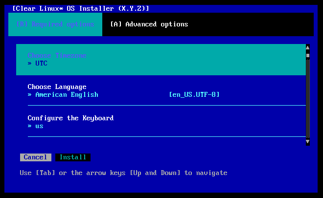
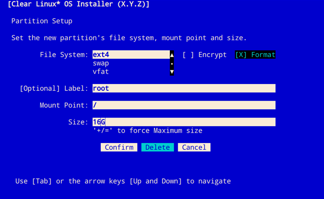
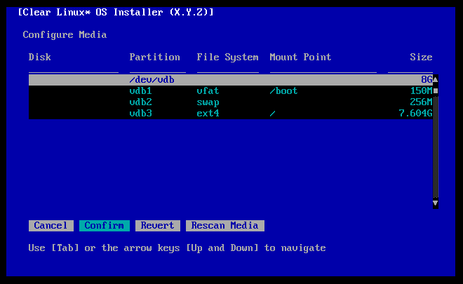
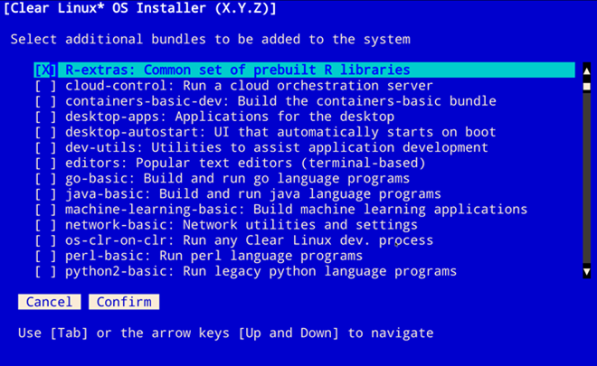

.. _bare-metal-install-beta:

Install |CL-ATTR| from the live desktop beta image
##################################################

The live desktop beta image allows you to boot |CL-ATTR| into a GNOME
desktop without modifying the host system. Using the live image, you can
explore the possibilities of developing with |CL|.

You can also launch the installer to install |CL| on your target system.
If you proceed with installation, this document assumes you follow the
`Recommended options`_.

.. contents:: :local:
   :depth: 1

System requirements
*******************

Assure that your target system supports the installation:

* :ref:`system-requirements`
* :ref:`compatibility-check`

Preliminary steps
*****************

#. `Navigate to the image directory`_.

#. Download the file :file:`clear-<release number>-live-desktop-beta.img.xz`

   .. note::

      <release-number> is the latest |CL| auto-numbered release.

#. Follow your OS instructions to create a bootable USB drive.

   * :ref:`bootable-usb`

.. _install-on-target-start:

Install from live image
***********************

After you've downloaded and burned the live desktop image on a
USB drive, follow these steps.

#. Insert the USB drive into an available USB slot.

#. Power on the system.

#. Open the system BIOS setup menu by pressing the :kbd:`F2` key.

   .. note::

      Your BIOS setup menu entry point may vary.

#. In the setup menu, enable the UEFI boot and set the USB drive as the
   first option in the device boot order.

#. Save these settings and exit.

#. Reboot the target system.

.. _install-on-target-end:

Launch the installer
====================

#. After the |CL| live desktop image boots, select the :guilabel:`Activities`   menu in the upper left.

#. Select the icon, :guilabel:`Install Clear Linux OS`, shown in Figure 1.

   .. figure:: figures/bare-metal-install-beta-1.png
      :scale: 50 %
      :alt: Install Clear Linux OS icon

      Figure 1: Install Clear Linux OS icon

#. Upon selecting the icon, the installer is launched, as shown in Figure 2.

   .. figure:: figures/bare-metal-install-beta-2.png
      :scale: 50 %
      :alt: Clear Linux OS Installer

      Figure 2: Clear Linux OS Installer

.. _incl-bare-metal-beta-start:

Minimum installation requirements
*********************************

To fulfill minimum installation requirements, complete the
`Required options`_. We also encourage you to install `Recommended options`_ for a full desktop experience. `Advanced options`_ are optional.

.. note::

   * The :kbd:`Install` button is **only highlighted after** you complete
     `Required options`_.

   * You must choose whether or not to participate in :ref:`telem-guide`
     before you can finish installation.

   * You may `Test Network Settings`_ before installation
     `Configure Network Interfaces`_. Assure a *Success* message appears before installation.

Main Menu
*********
The |CL| Installer Main Menu appears as shown in Figure 3.

   Figure 3: Clear Linux OS Installer Main Menu

The |CL| Installer Main Menu has two tabs: :guilabel:`[R] Required options`
and :guilabel:`[A] Advanced options`. Navigate between tabs using the arrow
keys or these shortcut keys:

* :kbd:`Shift+A` for :guilabel:`[A] Advanced options`
* :kbd:`Shift+R` for :guilabel:`[R] Required options`

To meet the minimum requirements, enter your choices in the
:guilabel:`Required options`. After confirmation, your selections appear
beside the :guilabel:`>>` chevron, below the menu options.

Navigation
**********

* Select :kbd:`Tab` or :kbd:`Up/Down` arrows to highlight your choice.

* Select :kbd:`Enter` or :kbd:`Spacebar` to confirm your choice.

* Select :kbd:`Cancel` or :kbd:`Esc` to cancel your choice.

Required options
****************

Choose Timezone
===============

#. From the Main Menu, select :guilabel:`Choose Timezone`.

#. Select :kbd:`Enter` to continue.

#. In :guilabel:`Select System Timezone`, navigate to
   the desired timezone.

#. Use :kbd:`Tab` to navigate to :guilabel:`Confirm`.

#. Select :kbd:`Enter` to :kbd:`Confirm`.

   .. note::

      Select :guilabel:`Cancel` to restore the previously defined value and
      return to the Main Menu.

   .. figure:: figures/bare-metal-install-beta-4.png
      :scale: 100%
      :alt: Select System Timezone

      Figure 4: Select System Timezone

Choose Language
===============

#. From the Main Menu, select :guilabel:`Choose Language`.

#. Select :kbd:`Enter`.

#. In :guilabel:`Select System Language`, navigate to your desired language.

#. Select :kbd:`Tab` to highlight :kbd:`Confirm`.

#. Select :kbd:`Enter` to :kbd:`Confirm`.

   .. note::

      Select :guilabel:`Cancel` to restore the previously defined value and return to the Main Menu.

   .. figure:: figures/bare-metal-install-beta-5.png
      :scale: 100%
      :alt: Select System Language

      Figure 5: Select System Language

Configure the Keyboard
======================

#. From the Main Menu, select :guilabel:`Configure the Keyboard`.

#. Select :kbd:`Enter`.

#. In :guilabel:`Select Keyboard`, navigate to the desired option.

#. In :guilabel:`Test keyboard`, type text to assure that the keys map to
   your keyboard.

#. Select :kbd:`Tab` to highlight :guilabel:`Confirm`.

#. Select :kbd:`Enter` to :kbd:`Confirm`.

   .. note::

      Select :guilabel:`Cancel` to restore the previously defined value and return to the Main Menu.

   .. figure:: figures/bare-metal-install-beta-6.png
      :scale: 100%
      :alt: Select Keyboard menu

      Figure 6: Select Keyboard menu

Configure Installation Media
============================

#. From the Main Menu, select :guilabel:`Configure Installation Media`.

#. Choose an installation method: `Safe Installation`_;
   `Destructive Installation`_; or `Advanced Configuration`_

   .. figure:: figures/bare-metal-install-beta-7.png
      :scale: 100%
      :alt: Select Installation Media

      Figure 7: Select Installation Media

Safe Installation
-----------------

Use this method to safely install |CL| on media with available space,
or alongside existing partitions, and accept the recommended partitioning
schema. If an unallocated partition exists with enough space, safe
installation is allowed.

If a warning message appears that no media or space is available:

- Verify that target media has enough unallocated disk space
- Confirm target media is properly connected or mounted
- Review the size of existing partitions on the target media:

  - Linux\* OS: :command:`lsblk -a`
  - Windows\* OS:  :command:`diskpart`, then :command:`list disk`
  - macOS\* platform: :command:`diskutil list`

Destructive Installation
------------------------

Use this method to destroy the contents of the target device, install |CL|,
and accept the recommended partitioning schema. If no safe options exist,
:guilabel:`Destructive Installation` will appear by default.

.. note::

   From the :guilabel:`Select Installation Media` menu, select
   :guilabel:`Enable Encryption` to encrypt the root filesystem for either option above. See also `Disk encryption`_ for more information.

Partition minimum requirements
-------------------------------

To add partitions manually, see `Advanced configuration`_ below and create
partitions per requirements in Table 1.

.. list-table:: **Table 1. Disk Partition Setup: Minimum requirements**
   :widths: 33, 33, 33
   :header-rows: 1

   * - FileSystem
     - Mount Point
     - Minimum size
   * - ``VFAT``
     - /boot
     - 150M
   * - ``swap``
     -
     - 256MB
   * - ``root``
     - /
     - *Size depends upon use case/desired bundles.*

Advanced Configuration
----------------------

Use this method to manually configure partitions. Partitions
must meet `Partition minimum requirements`_.
You may also choose `Disk encryption`_ during partitioning.

.. note::

   Advanced Configuration is available in the installer versions 1.2.0 and above.

#. In :guilabel:`Advanced Configuration`, press
   :kbd:`Enter` to activate editing.

   .. figure:: figures/bare-metal-install-beta-8.png
      :scale: 100%
      :alt: Advanced configuration menu

      Figure 8: Advanced configuration menu

#. Choose one of these options:

   :guilabel:`Auto Partition`

   #. Select this option to accept the recommended partitioning schema.

   #. Navigate to and press :guilabel:`Confirm`.

   #. Continue with installation configuration.

   :guilabel:`Manual Partition`

   #. Continue below.

Manual Partition
----------------

We provide a simple example below.

#. Navigate to the unallocated media (e.g.,`sdb1`) until highlighted.

#. Select :guilabel:`Enter` to edit the partition.

#. The :guilabel:`Partition Setup` menu appears, shown in Figure 9.

   .. note::

      After adding the first partition, select :guilabel:`Free Space` to add another partition.

root partition
--------------

We configure the `root` partition as shown in Figure 9.

   Figure 9: root partition

boot partition
--------------

We configure the `boot` partition as shown in Figure 10.

   Figure 10: boot partition

swap partition
--------------

#. In the :guilabel:`File System` pulldown menu, we select `swap`, and
   enter its label. We enter the minimum required size (e.g., 256M).

   .. figure:: figures/bare-metal-install-beta-11.png
      :scale: 100%
      :alt: swap partition

      Figure 11: swap partition

#. Next, navigate to :guilabel:`Confirm` and press :guilabel:`Enter`,
   shown in Figure 12.

   .. figure:: figures/bare-metal-install-beta-12.png
      :scale: 100%
      :alt: Final configuration of disk partitions

      Figure 12: Final configuration of disk partitions

#. You may skip to the `Telemetry`_ section below.

Disk encryption
===============

For greater security, disk encryption is supported using LUKS for the
any partition except `/boot` on |CL|. To encrypt the root partition, see the
example below. Encryption is optional.

Encryption Passphrase
---------------------

|CL| uses a single passphrase for encrypted partitions. Additional or
different keys may be configured post-installation using the ``cryptsetup``
tool.

#. Optional: Select :guilabel:`[X] Encrypt` to encrypt the root partition,
   as shown in Figure 13.

   .. figure:: figures/bare-metal-install-beta-13.png
      :scale: 100%
      :alt: Encrypt partition

      Figure 13: Encrypt partition

#. The :guilabel:`Encryption Passphrase` dialogue appears.

   .. note::

      Minimum length is 8 characters. Maximum length is 94 characters.

   .. figure:: figures/bare-metal-install-beta-14.png
      :scale: 100%
      :alt: Encryption Passphrase

      Figure 14: Encryption Passphrase

#. Enter the same passphrase in the first and second field.

#. Navigate to :guilabel:`Confirm` and press :kbd:`Enter`.

   .. note::

      :guilabel:`Confirm` is only highlighted if passphrases match.

Telemetry
=========

To fulfill :guilabel:`Required options`, choose whether to participate in
the `telemetry option`_. :ref:`telem-guide` is a |CL| feature that reports
failures and crashes to the |CL| development team for improvements. For more
detailed information, visit our :ref:`telemetry-about` page.

#. In the Main Menu, navigate to :guilabel:`Telemetry` and select
   :kbd:`Enter`.

#. Select :kbd:`Tab` to highlight your choice.

#. Select :kbd:`Enter` to confirm.

   .. figure:: figures/bare-metal-install-beta-15.png
      :scale: 100%
      :alt: Enable Telemetry

      Figure 15: Enable Telemetry

Recommended options
*******************

After you complete the `Required options`_, we highly recommend completing
a few `Advanced options`_ at minimum:

* `Bundle Selection`_ Add basic utlities and tools:

  * :file:`desktop-autostart`
  * :file:`user-basic`

* `User Manager`_ Assign a new user with administrative rights
* `Assign Hostname`_ Simplify your development environment

This document assumes you follow these additional steps.

Skip to finish installation
===========================

After selecting values for all :guilabel:`Required options`, you may skip
to `Finish installation`_.

Otherwise, continue below. In the Main Menu, select
:guilabel:`Advanced options` for additional configuration.

Advanced options
****************

Configure Network Interfaces
============================

By default, |CL| is configured to automatically detect the host network
interface using DHCP. However, if you want to use a static IP address or if
you do not have a DHCP server on your network, follow these instructions to
manually configure the network interface. Otherwise, default network
interface settings are automatically applied.

.. note::

   If DHCP is available, no user selection may be required.

#. Navigate to :guilabel:`Configure Network Interfaces` and
   select :kbd:`Enter`.

#. Navigate to the network :guilabel:`interface` you wish to change.

#. When the desired :guilabel:`interface` is highlighted, select
   :guilabel:`Enter` to edit.

   .. note:: Multiple network interfaces may appear.

   .. figure:: figures/bare-metal-install-beta-16.png
      :scale: 100%
      :alt: Configure Network Interfaces

      Figure 16: Configure Network Interfaces

#. Notice :guilabel:`Automatic / dhcp` is selected by default (at bottom).

   Optional: Navigate to the checkbox :guilabel:`Automatic / dhcp` and select
   :kbd:`Spacebar` to deselect.

   .. figure:: figures/bare-metal-install-beta-17.png
      :scale: 100%
      :alt: Network interface configuration

      Figure 17: Network interface configuration

#. Navigate to the appropriate fields and assign the desired
   network configuration.

#. To save settings, navigate to :guilabel:`Confirm` and select
   :kbd:`Enter`.

   .. note::

      To revert to previous settings, navigate to the :guilabel:`Cancel`
      and select :kbd:`Enter`.

#. Upon confirming network configuration, the :guilabel:`Testing Networking`
   dialogue appears. Assure the result shows success. If a failure occurs,
   your changes will not be saved.

#. Upon confirmation, you are returned to :guilabel:`Network interface`
   settings.

#. Navigate to and select :guilabel:`Main Menu`.

Optional: Skip to `Finish installation`_.

Proxy
=====

|CL| automatically attempts to detect proxy settings, as described in
`Autoproxy`_. If you need to manually assign proxy settings, follow this
instruction.

#. From the Advanced options menu, navigate to :guilabel:`Proxy`, and
   select :kbd:`Enter`.

#. Navigate to the field :guilabel:`HTTPS Proxy`.

   .. figure:: figures/bare-metal-install-beta-18.png
      :scale: 100%
      :alt: Configure the network proxy

      Figure 18: Configure the network proxy

#. Enter the desired proxy address and port using conventional syntax,
   such as: \http://address:port.

#. Navigate to :guilabel:`Confirm` and select :kbd:`Enter`.

#. To revert to previous settings, navigate to :guilabel:`Cancel`
   and select :guilabel:`Cancel`.

Optional: Skip to `Finish installation`_.

Test Network Settings
=====================

To manually assure network connectivity before installing |CL|,
select :guilabel:`Test Network Settings` and select :guilabel:`Enter`.

A progress bar appears as shown in Figure 19.

   Figure 19: Testing Networking dialogue

.. note::

   Any changes made to network settings are automatically tested
   during configuration.

Optional: Skip to `Finish installation`_.

Bundle Selection
================

#. On the Advanced menu, select :guilabel:`Bundle Selection`

#. Navigate to the desired bundle using :kbd:`Tab` or :kbd:`Up/Down` arrows.

#. Select :kbd:`Spacebar` to select the checkbox for each desired bundle.

#. We recommend adding :file:`desktop-autostart` and :file:`user-basic`.

   .. figure:: figures/bare-metal-install-beta-20.png
      :scale: 100%
      :alt: Bundle Selection

      Figure 20: Bundle Selection

   .. note::

      The default bundle choices and selections differ between the
      :file:`clear-<XXXXX>.live-desktop-beta.img` and the
      :file:`clear-<XXXXX>.installer.img`.

#. Select :kbd:`Confirm` or :kbd:`Cancel`.

   You are returned to the :guilabel:`Advanced options` menu.

Optional: Skip to `Finish installation`_.

User Manager
============

Add New User
------------

#. In Advanced Options, select :guilabel:`User Manager`.

#. Select :guilabel:`Add New User` as shown in Figure 21.

   .. figure:: figures/bare-metal-install-beta-21.png
      :scale: 100%
      :alt: Add New User, User Name

      Figure 21: Add New User

#. Optional: Enter a :guilabel:`User Name`.

   .. note:

      The User Name must be alphanumeric and can include spaces, commas, or hyphens. Maximum length is 64 characters.

   .. figure:: figures/bare-metal-install-beta-22.png
      :scale: 100%
      :alt: User Name

      Figure 22: User Name

#. Enter a :guilabel:`Login`.

   .. note::

      The User Login must be alphanumeric and can include hyphens and underscores. Maximum length is 31 characters.

#. Enter a :guilabel:`Password`.

   .. note:

      Minimum length is 8 characters. Maximum length is 255 characters.

#. In :guilabel:`Retype`, enter the same password.

#. Optional: Navigate to the :guilabel:`Administrative` checkbox and select
   :kbd:`Spacebar` to assign administrative rights to the user.

   .. note::

      Selecting this option enables sudo privileges for the user.

   .. figure:: figures/bare-metal-install-beta-23.png
      :scale: 100%
      :alt: Administrative rights

      Figure 23: Administrative rights

#. Select :kbd:`Confirm`.

   .. note::

      If desired, select :guilabel:`Reset` to reset the form.

#. In :guilabel:`User Manager`, navigate to :guilabel:`Confirm`.

#. With :guilabel:`Confirm` highlighted, select :kbd:`Enter`.

Modify / Delete User
--------------------

#. In User Manager, select :guilabel:`Tab` to highlight the user, as shown
   in Figure 24.

#. Select :kbd:`Enter` to modify the user.

   .. figure:: figures/bare-metal-install-beta-24.png
      :scale: 100%
      :alt: Modify User

      Figure 24: Modify User

#. Modify user details as desired.

   Optional: To delete the user, navigate to the :guilabel:`Delete`
   button and select :kbd:`Enter`

#. Navigate to :kbd:`Confirm` until highlighted.

   .. note::

      Optional: Select :guilabel:`Reset` to rest the form.

#. Select :guilabel:`Confirm` to save the changes you made.

You are returned to the User Manager menu.

Optional: Skip to `Finish installation`_.

Kernel Command Line
===================

For advanced users, |CL| provides the ability to add or remove kernel
arguments. If you want to append a new argument, enter the argument here.
This argument will be used every time you install or update a
new kernel.

#. In Advanced Options, select :guilabel:`Tab` to highlight
   :guilabel:`Kernel Command Line`.

#. Select :kbd:`Enter`.

#. To add or remove arguments, choose one of the following options.

   .. figure:: figures/bare-metal-install-beta-25.png
      :scale: 100%
      :alt: kernel command line

      Figure 25: kernel command line

#. To add arguments, enter the argument in :guilabel:`Add Extra Arguments`.

#. To remove an existing argument, enter the argument in
   :guilabel:`Remove Arguments`.

#. Select :kbd:`Confirm`.

Optional: Skip to `Finish installation`_.

Kernel Selection
================

#. Select a kernel option. By default, the latest kernel release is
   selected. Native kernel is shown in Figure 26.

#. To select a differnt kernel, navigate to it using :guilabel:`Tab`.

   .. figure:: figures/bare-metal-install-beta-26.png
      :scale: 100%
      :alt: Kernel selection

      Figure 26: Kernel selection

#. Select :kbd:`Spacebar` to select the desired option.

#. Select :kbd:`Confirm`.

Optional: Skip to `Finish installation`_.

Swupd Mirror
============

If you have your own custom mirror of |CL|, you can add its URL.

#. In Advanced Options, select :guilabel:`Swupd Mirror`.

#. To add a local swupd mirror, enter a valid URL in :guilabel:`Mirror URL:`

#. Select :kbd:`Confirm`.

   .. figure:: figures/bare-metal-install-beta-27.png
      :scale: 100%
      :alt: Swupd Mirror

      Figure 27: Swupd Mirror

Optional: Skip to `Finish installation`_.

Assign Hostname
===============

#. In Advanced Options, select :guilabel:`Assign Hostname`.

#. In :guilabel:`Hostname`, enter the hostname only (excluding the domain).

   .. note::

      Hostname does not allow empty spaces. Hostname must start with an
      alphanumeric character but may also contain hyphens. Maximum length of
      63 characters.

   .. figure:: figures/bare-metal-install-beta-28.png
      :scale: 100%
      :alt: Assign Hostname

      Figure 28: Assign Hostname

#. Navigate to :kbd:`Confirm` until highlighted.

#. Select :kbd:`Confirm`.

Optional: Skip to `Finish installation`_.

Automatic OS Updates
====================

In the rare case that you need to disable automatic software updates,
follow the onscreen instructions shown in Figure 29.

#. In Advanced Options, select :guilabel:`Automatic OS Updates`.

#. Select the desired option.

   .. figure:: figures/bare-metal-install-beta-29.png
      :scale: 100%
      :alt: Automatic OS Updates

      Figure 29: Automatic OS Updates

You are returned to the :guilabel:`Main Menu`.

Finish installation
*******************

#. When you are satisfied with your installation configuration, navigate to
   :guilabel:`Install` and select :kbd:`Enter`.

#. Select :guilabel:`reboot`.

   .. note::

      If you do not perform `Recommended options`_, upon rebooting, a
      :file:`login:` prompt will appear. At the prompt, enter `root` and change your password immediately.

#. When the system reboots, remove any installation media present.

   .. note::

      Allow time for the graphical login to appear. This shows the administrative user that you created in `Recommended options`_.

#. Log in as the adminstrative user.

Next steps
**********

:ref:`enable-user-space`

.. _Navigate to the image directory: https://cdn.download.clearlinux.org/image/
.. _Autoproxy: https://clearlinux.org/features/autoproxy
.. _telemetry option: https://clearlinux.org/features/telemetry
