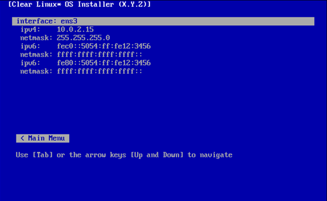
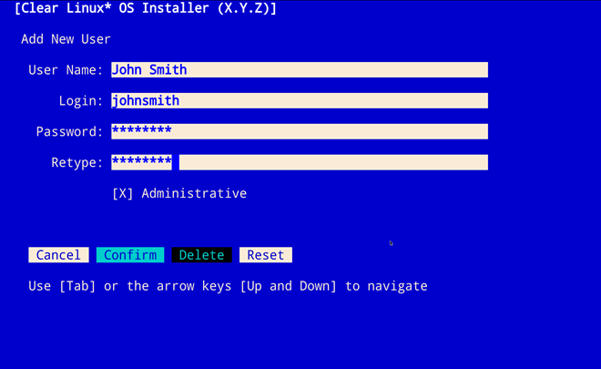

.. _bare-metal-install-beta:

Install |CL-ATTR| on bare metal
###############################

These instructions guide you through installation of |CL-ATTR| on bare metal 
using the new installer. 

.. contents:: :local:
   :depth: 1

.. _minimum-installation-requirements: 

Minimum installation requirements
*********************************

To fulfill minimum installation requirements, complete 
:guilabel:`Required options`. All other menu items are optional.

.. note::

   * In the Main menu, the :kbd:`Install` button is highlighted 
     **only after** you complete :ref:`required-options-installation`.

   * You must choose whether or not to participate in :ref:`telemetrics`
     before you can :ref:`complete-cl-installation`.

   * You may wish to :ref:`test-network-settings` before you 
     :ref:`configure-network-interfaces`. Assure that a ``Success`` message is received.

Main menu
*********

In the |CL| Installer main menu, two tabs appear: 
:guilabel:`[R] Required options` and :guilabel:`[A] Advanced options`.
Navigate between tabs using the arrow keys or these shortcut keys:

* :kbd:`Shift+A` for :guilabel:`[A] Advanced options`
* :kbd:`Shift+R` for :guilabel:`[R] Required options`

To meet the minimum requirements, enter your choices in the 
:guilabel:`Required options`. After confirmation, your selections appear 
below menu options in the Main Menu, beside the :guilabel:`>>` chevron.

Navigation
**********

* Select :kbd:`Tab` or :kbd:`Up/Down` arrows to highlight your choice.

* Select :kbd:`Enter` or :kbd:`Spacebar` to confirm your choice.

* Select :kbd:`Cancel` or :kbd:`Esc` to cancel your choice.

  The |CL| Installer main menu appears as shown in Figure 1.

  .. figure:: figures/bare-metal-install-beta-1.png
     :scale: 100 %
     :alt: Clear Linux OS Installer main menu

     Figure 1: :guilabel:`Clear Linux OS Installer main menu`

.. _required-options-installation:

Required options
****************

Choose Timezone
===============

#. From the main menu, select :guilabel:`Choose Timezone`.

#. Select :kbd:`Enter` to continue.

#. In :guilabel:`Select System Timezone`, navigate to
   the desired timezone.

#. Use :kbd:`Tab` to navigate to :guilabel:`Confirm`.

#. Select :kbd:`Enter` to :kbd:`Confirm`.

   .. note::

      Select :guilabel:`Cancel` to restore the previously defined value and
      return to the main menu.

   .. figure:: figures/bare-metal-install-beta-2.png
      :scale: 100 %
      :alt: Select System Timezone

      Figure 2: :guilabel:`Select System Timezone`

Choose Language
===============

#. From the main menu, select :guilabel:`Choose Language`.

#. Select :kbd:`Enter`.

#. In :guilabel:`Select System Language`, navigate to your desired language.

#. Select :kbd:`Tab` to highlight :kbd:`Confirm`. 

#. Select :kbd:`Enter` to :kbd:`Confirm`.
   
   .. note:: 

      Select :guilabel:`Cancel` to restore the previously defined value and return to the main menu.  

   .. figure:: figures/bare-metal-install-beta-3.png
      :scale: 100 %
      :alt: Select System Language 

      Figure 3: :guilabel:`Select System Language`

Configure the Keyboard
======================

#. From the main menu, select :guilabel:`Configure the Keyboard`.

#. Select :kbd:`Enter`. 

#. In :guilabel:`Select Keyboard`, navigate to the desired option.

#. In :guilabel:`Test keyboard`, type text to assure that the keys map to
   your keyboard. 

#. Select :kbd:`Tab` to highlight :guilabel:`Confirm`.

#. Select :kbd:`Enter` to :kbd:`Confirm`.

   .. note:: 

      Select :guilabel:`Cancel` to restore the previously defined value and return to the main menu.  

   .. figure:: figures/bare-metal-install-beta-4.png
      :scale: 100 %
      :alt: Select Keyboard menu

      Figure 4: :guilabel:`Select Keyboard menu`

Configure Media
===============

#. From the main menu, select :guilabel:`Configure Media`.

   .. note::
       
      Available media appear by default. 

#. Navigate to the desired media until highlighted. 

    .. TODO: Add another screenshot showing contextual menu. 

#. Select :kbd:`Enter` or :kbd:`Spacebar` to select it.

   Two options for partitioning appear. 

#. Select :guilabel:`Auto Partition` to accept the default configuration, or
   :guilabel:`Add Partition` to add partitions manually. See instructions
   below.

   .. figure:: figures/bare-metal-install-beta-5.png
      :scale: 100 %
      :alt: Configure Media menu 

      Figure 5: :guilabel:`Configure Media menu`

      .. note:: 

         Use additional options as necessary during partitioning: 

         * Select :guilabel:`Revert` to cancel changes and revert to the 
           original configuration. 
         * Select :guilabel:`Rescan` to show media connected to the host 
           machine.

#. Select :kbd:`Enter` to :kbd:`Confirm`.

Choose one partitioning option below 
------------------------------------

* :ref:`auto-partition` 
* :ref:`add-partition`  

.. _auto-partition: 

Auto Partition
==============

Auto partition will configure the media to meet the minimum requirements. 

#. Select :guilabel:`Auto Partition` as shown in Figure 6. 

#. Select :kbd:`Enter` or :kbd:`Spacebar` to highlight 
   :guilabel:`Auto partition`. 

#. Select :kbd:`Enter` to :kbd:`Confirm`.

   This action returns you to the Main Menu. 

   .. figure:: figures/bare-metal-install-beta-6.png
      :scale: 100 %
      :alt: Auto Partition 

      Figure 6: :guilabel:`Auto Partition`

#. You may skip to the :ref:`telemetry-tui` section below. 

.. _add-partition: 

Add Partition
=============

Minimum requirements
====================

To add partitions manually, assign partitions per the minimum 
requirements shown in Table 1:

.. list-table:: **Table 1. Disk Partition Setup**
   :widths: 33, 33, 33
   :header-rows: 1

   * - FileSystem 
     - Mount Point
     - Minimum size
   * - ``VFAT``
     - /boot
     - 150M
   * - ``swap``
     - 
     - 256MB
   * - ``root``
     - /
     - *Size depends upon use case/desired bundles.* 

#. In the Configure Media menu, select :guilabel:`Add Partition`. 

   .. note:: To change an existing partition, navigate to the partition, 
      and select :guilabel:`Enter`.

boot partition
--------------

#. In the :guilabel:`File System` menu, select :kbd:`Up/Down` arrows to 
   select the file system type.  See Figure 7.

#. In :guilabel:`Mount Point`, enter the ``/boot`` partition. 

#. In :guilabel:`Size`, enter an appropriate size (e.g., 150M) per Table 1.

#. Navigate to :guilabel:`Confirm` until highlighted. 

#. Select :guilabel:`Enter` to confirm. 

   .. figure:: figures/bare-metal-install-beta-7.png
      :scale: 100 %
      :alt: boot partition 

      Figure 7: :guilabel:`boot partition`

swap partition
--------------

#. In the :guilabel:`File System` menu, select :kbd:`Up/Down` arrows to 
   select the file system type. See Figure 8.

#. In :guilabel:`Mount Point`, the field remains blank. 

   .. note:: 

      The Mount Point field is disabled. 

#. In :guilabel:`Size`, enter an appropriate size (e.g., 256MB) per Table 1.

#. Navigate to :guilabel:`Add`. 

#. Select :guilabel:`Enter` to continue. 

   .. figure:: figures/bare-metal-install-beta-8.png
      :scale: 100 %
      :alt: swap partition 

      Figure 8: :guilabel:`swap partition`

root partition
--------------

#. In the :guilabel:`File System` menu, select :kbd:`Up/Down` arrows to 
   select the file system type. See Figure 9.

#. In :guilabel:`Mount Point`, enter ``/root``.

#. In :guilabel:`Size`, enter an appropriate size per Table 1.

   .. note:: 

      The remaining available space shows by default. 

#. Navigate to :guilabel:`Add` until highlighted. 

#. Select :guilabel:`Enter` to continue. 

   You are returned to the :guilabel:`Configure media` menu. 

#. Select :guilabel:`Confirm` to complete the media selection. 

   .. figure:: figures/bare-metal-install-beta-9.png
      :scale: 100 %
      :alt: root partition 

      Figure 9: :guilabel:`root partition`

   You are returned to the :guilabel:`Configure media` menu. Your partitions should appear similar to those shown in Figure 10. 

   .. figure:: figures/bare-metal-install-beta-10.png
      :scale: 100 %
      :alt: root partition 

   Figure 10: :guilabel:`root partition`

#. Navigate to :guilabel:`Confirm` until highlighted.

#. Select :guilabel:`Enter` to complete adding partitions. 

.. _telemetry-tui: 

Telemetry
=========

To fulfill the :guilabel:`Required options`, choose whether or not to 
participate in `telemetry`_.  :ref:`telemetrics` is a |CL| feature that 
reports failures and crashes to the |CL| development team for improvements. 
For more detailed information, see our :ref:`telemetry-about` page. 

#. In the main menu, navigate to :guilabel:`Telemetry` and select 
   :kbd:`Enter`. 

#. Select :kbd:`Tab` to highlight your choice.

#. Select :kbd:`Enter` to confirm.

   .. figure:: figures/bare-metal-install-beta-11.png
      :scale: 100 %
      :alt: Enable Telemetry 

      Figure 11: :guilabel:`Enable Telemetry`  

Skip to complete installation
=============================

After selecting values for all :guilabel:`Required options`, you may skip directly to :ref:`complete-cl-installation`

If you wish to configure network interfaces or proxy settings, 
or add bundles, or add/manage users, continue to the next section.  

Advanced Options
****************

.. _configure-network-interfaces:

Configure Network Interfaces 
============================

By default, |CL| is configured to automatically detect the host network
interface using DHCP. However, if you want to use a static IP address or if
you do not have a DHCP server on your network, follow these instructions to
manually configure the network interface. Otherwise, default network
interface settings are automatically applied. 

.. note:: 
   
   If DHCP is available, no user selection may be required. 

#. Navigate to :guilabel:`Configure network interface` and
   select :kbd:`Enter`. 

#. Navigate to the network :guilabel:`interface` you wish to change. 

#. When the desired :guilabel:`interface` is highlighted, select 
   :guilabel:`Enter` to edit.

   .. note:: Multiple network interfaces may appear.  

   .. figure:: figures/bare-metal-install-beta-12.png
      :scale: 100 %
      :alt: CAPTION BELOW 

      Figure 12: :guilabel:`CAPTION BELOW`  

#. Notice :guilabel:`Automatic / dhcp` is selected by default (at bottom). 

   Optional: Navigate to the checkbox :guilabel:`Automatic / dhcp` and select
   :kbd:`Spacebar` to deselect. 

   .. figure:: figures/bare-metal-install-beta-13.png
      :scale: 100 %
      :alt: Network interface configuration

      Figure 13: :guilabel:`Network interface configuration`  

#. Navigate to the appropriate fields and assign the desired
   network configuration. 

#. To save settings, navigate to :guilabel:`Confirm` and select 
   :kbd:`Enter`.

   .. note::  

      To revert to previous settings, navigate to the :guilabel:`Cancel`
      and select :kbd:`Enter`.

#. Upon confirming network configuration, the :guilabel:`Testing Networking`
   dialogue appears. Assure the result shows success. If a failure occurs, 
   your changes will not be saved.    

#. Upon confirmation, you are returned to :guilabel:`Network interface`
   settings. 

#. Navigate to and select :guilabel:`Main Menu`. 

Optional: :ref:`Skip to complete installation <complete-cl-installation>`.

Proxy
=====

|CL| automatically attempts to detect proxy settings, as described in
`Autoproxy`_. If you need to manually assign proxy settings, follow this 
instruction.  

#. From the Advanced options menu, navigate to :guilabel:`Proxy`, and 
   select :kbd:`Enter`.
 
#. Navigate to the field :guilabel:`HTTPS Proxy`. 
   
   .. figure:: figures/bare-metal-install-beta-14.png
      :scale: 100 %
      :alt: Configure the network proxy

      Figure 14: :guilabel:`Configure the network proxy`  

#. Enter the desired proxy address and port using conventional syntax,
   such as: http://address:port. 

#. Navigate to :guilabel:`Confirm` and select :kbd:`Enter`.

#. To revert to previous settings, navigate to :guilabel:`Cancel` 
   and select :guilabel:`Cancel`. 

Optional: :ref:`Skip to complete installation <complete-cl-installation>`.

.. _test-network-settings:

Test Network Settings
=====================

To manually assure network connectivity before installing |CL|, 
select :guilabel:`Test Network Settings` and select :guilabel:`Enter`.

A progress bar appears as shown in Figure 15. 

   Figure 15: :guilabel:`Testing Networking dialogue`  

.. note:: 
   
   Any changes made to network settings are automatically tested 
   during configuration. 

Optional: :ref:`Skip to complete installation <complete-cl-installation>`.

Bundle Selection
================

#. On the Advanced menu, select :guilabel:`Bundle selection`

#. Navigate to the desired bundle using :kbd:`Tab` or :kbd:`Up/Down` arrows.

#. Select :kbd:`Spacebar` to select the checkbox for each desired bundle. 
   

   .. figure:: figures/bare-metal-install-beta-16.png
      :scale: 100 %
      :alt: Bundle selection

      Figure 16: :guilabel:`Bundle selection`  

#. Select :kbd:`Confirm` or :kbd:`Cancel`.

   You are returned to the :guilabel:`Advanced options` menu. 

Optional: :ref:`Skip to complete installation <complete-cl-installation>`.

User Manager
============

Add New User
------------

#. In Advanced Options, select :guilabel:`User Manager`. 

#. Select :guilabel:`Add New User` as shown in Figure 17. 

   .. figure:: figures/bare-metal-install-beta-17.png
      :scale: 100 %
      :alt: Add New User, User Name 

      Figure 17: :guilabel:`Add New User`  

   
#. Optional: Enter a :guilabel:`User Name`.

   .. note: 

      The User Name must be alphanumeric and can include spaces, commas, or hyphens. Maximum length is 64 characters. 

   .. figure:: figures/bare-metal-install-beta-18.png
      :scale: 100 %
      :alt: User Name 

      Figure 18: :guilabel:`User Name`  

#. Enter a :guilabel:`Login`.

   .. note:: 

      The User Login must be alphanumeric and can include hyphens and underscores. Maximum length is 31 characters. 

#. Enter a :guilabel:`Password`.

   .. note: 

       Minimum length is 8 characters. Maximum length is 255 characters.

#. In :guilabel:`Retype`, enter the same password. 

#. Optional: Navigate to the :guilabel:`Administrative` checkbox and select 
   :kbd:`Spacebar` to assign administrative rights to the user. 

   .. note:: 

      Selecting this option enables sudo privileges for the user. 

   .. figure:: figures/bare-metal-install-beta-19.png
      :scale: 100 %
      :alt: Administrative rights

      Figure 19: :guilabel:`Administrative rights`  
      
#. Select :kbd:`Confirm`. 

   .. note::

      If desired, select :guilabel:`Reset` to reset the form. 

Modify / Delete User
--------------------

#. In User Manager, Select :guilabel:`Tab` to highlight the user. 

#. Select :kbd:`Enter` to modify the user. 

   .. figure:: figures/bare-metal-install-beta-20.png
      :scale: 100 %
      :alt: Modify User

      Figure 20: :guilabel:`Modify User`  

#. Modify user details as desired. 

   Optional: To delete the user, navigate to the :guilabel:`Delete` 
   button and select :kbd:`Enter`   

#. Navigate to :kbd:`Confirm` until highlighted. 
   
   .. note::

      Optional: Select :guilabel:`Reset` to rest the form. 

#. Select :guilabel:`Confirm` to save the changes you made.     

You are returned to the User Manager menu. 

Optional: :ref:`Skip to complete installation <complete-cl-installation>`.

Kernel Command Line 
===================

For more advanced users, |CL| provides the ability to add, or remove, kernel 
arguments. If you want to append a new argument, enter the argument here. 
This argument will be used every time you install a new kernel or update a 
new kernel.  

#. In Advanced Options, select :guilabel:`Tab` to highlight 
   :guilabel:`Kernel Command Line`. 

#. Select :kbd:`Enter`. 

#. To add or remove arguments, choose one of the following options. 

   .. figure:: figures/bare-metal-install-beta-21.png
      :scale: 100 %
      :alt: kernel command line

      Figure 21: :guilabel:`kernel command line`  

#. To add arguments, enter the argument in :guilabel:`Add Extra Arguments`. 

#. To remove an existing argument, enter the argument in 
   :guilabel:`Remove Arguments`. 

#. Select :kbd:`Confirm`. 

Optional: :ref:`Skip to complete installation <complete-cl-installation>`.

Kernel Selection 
================

Select a kernel option. By default, the latest kernel release is selected. 

.. note:: 

   You may choose a different option, such as kernel with Long Term Support 
   (LTS). To do so, select :guilabel:`Tab` until the kernel option is highlighted. 

   Figure 22: :guilabel:`Kernel selection`  

#. Select :kbd:`Spacebar` to select the desired option. 
    
#. Select :kbd:`Confirm`. 

Optional: :ref:`Skip to complete installation <complete-cl-installation>`.

Swupd Mirror
============

If you have your own custom mirror of |CL|, you may want to add that URL. 

#. In Advanced Options, select :guilabel:`Swupd Mirror`. 

#. To add a local swupd mirror, enter a valid URL in :guilabel:`Mirror URL:`

#. Select :kbd:`Confirm`. 

   .. figure:: figures/bare-metal-install-beta-23.png
      :scale: 100 %
      :alt: Swupd Mirror

      Figure 23: :guilabel:`Swupd Mirror`  

Optional: :ref:`Skip to complete installation <complete-cl-installation>`.

Assign Hostname
===============

#. In Advanced Options, select :guilabel:`Assign Hostname`. 

#. In :guilabel:`Hostname`, enter the hostname only (excluding the domain).

   .. note::

      Hostname does not allow empty spaces. Hostname must start with an
      alphanumeric character but may also contain hyphens. Maximum length of 
      63 characters. 

   .. figure:: figures/bare-metal-install-beta-24.png
      :scale: 100 %
      :alt: Assign Hostname

      Figure 24: :guilabel:`Assign Hostname` 

#. Navigate to :kbd:`Confirm` until highlighted. 

#. Select :kbd:`Confirm`. 

Optional: :ref:`Skip to complete installation <complete-cl-installation>`.

Automatic OS Updates
====================

In the rare case that you need to disable automatic software updates, 
follow the onscreen instructions.

#. In Advanced Options, select :guilabel:`Automatic OS Updates`. 

#. Select the desired option. 

   .. figure:: figures/bare-metal-install-beta-25.png
      :scale: 100 %
      :alt: Automatic OS Updates

      Figure 25: :guilabel:`Automatic OS Updates`

You are returned to the :guilabel:`Main Menu`. 

.. _complete-cl-installation:

Complete installation
*********************

#. When you are satisfied with your installation configuration, navigate to
   :guilabel:`Install` and select :kbd:`Enter`. 

   .. note:: 

      Whenever installation is complete, a ``reboot`` button appears. 

#. Select ``reboot``. 

#. When the system reboots, remove any installation media present.

| 

**Congratulations!**

You have successfully installed |CL| on bare metal using the new installer.

.. _Autoproxy: https://clearlinux.org/features/autoproxy
.. _telemetry: https://clearlinux.org/features/telemetry