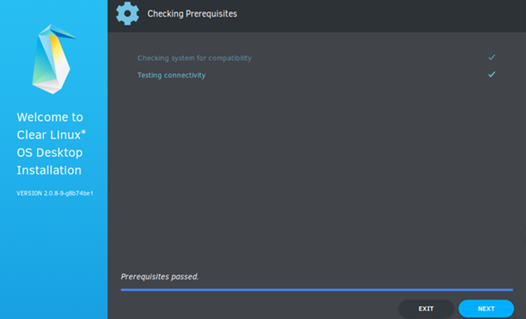

.. _bare-metal-install-desktop:

Install |CL-ATTR| from the live desktop
#######################################

The live desktop allows you to boot |CL-ATTR| in a GNOME desktop without
modifying the host system, offering you the chance to explore developing
on |CL| or install it. In this document, we show how to install |CL| on a
target system.

.. contents:: :local:
   :depth: 1

System requirements
*******************

Assure that your target system supports the installation:

* :ref:`system-requirements`
* :ref:`compatibility-check`

Preliminary steps
*****************

#. `Visit our Downloads page`_.

#. Download the file :file:`clear-<release number>-live-desktop.iso`,
   also called the |CL| Desktop.

   .. note::

      <release-number> is the latest |CL| auto-numbered release.

#. Follow your OS instructions to create a bootable USB drive.

   * :ref:`bootable-usb`

.. _install-on-target-start:

Install from live image
***********************

After you download and burn the live desktop image on a USB drive, follow
these steps.

#. Insert the USB drive into an available USB slot.

#. Power on the system.

#. Open the system BIOS setup menu by pressing the :kbd:`F2` key.
   Your BIOS setup menu entry point may vary.

#. In the setup menu, enable the UEFI boot and set the USB drive as the
   first option in the device boot order.

#. Save these settings, e.g. :kbd:`F10`, and exit.

#. Reboot the target system.

#. Select :guilabel:`Clear Linux OS` in the boot menu, shown in Figure 1.

   .. figure:: figures/bare-metal-install-desktop-01.png
      :scale: 100%
      :alt: Clear Linux OS in boot menu

      Figure 1: Clear Linux OS in boot menu

.. _install-on-target-end:

Software (optional)
===================

Explore |CL| bundles and other software. Double-click the
:guilabel:`Software` icon from the Activities menu, shown in Figure 2.
Assure a network connection exists before launching `Software`.

.. note::

   `Software` application is *only intended for exploring* available bundles,
   applications, and images. Do not attempt to install them.

Launch the |CL| installer
=========================

#. After the live desktop image boots, scroll over the vertical
   :guilabel:`Activities` menu at left.

#. Click the |CL| penguin icon to launch the installer, shown in Figure 2.

   .. figure:: figures/bare-metal-install-desktop-02.png
      :scale: 100%
      :alt: Install Clear Linux OS icon

      Figure 2: |CL| installer icon

#. After the installer is launched, it will appear as shown in Figure 3.

   .. figure:: figures/bare-metal-install-desktop-03.png
      :scale: 100%
      :alt: |CL| Desktop Installer

      Figure 3: |CL| OS Desktop Installer

#. In :guilabel:`Select Language`, select a language from the options, or
   type your preferred language in the search bar.

#. Select :guilabel:`Next`.

Checking prerequisites
======================

The installer automatically launches :guilabel:`Checking Prerequisites`,
which checks your target system for compatibility and network connectivity.

After the installer shows `Prerequisites passed`, select :guilabel:`Next` to
proceed with installation.

   Figure 4: Checking Prerequisites

Network Proxy (optional)
------------------------

#. Configure :guilabel:`Network Proxy` settings.

#. In the top right menu bar, select the :guilabel:`Power button`.

#. Select :guilabel:`Wired Connected` and then :guilabel:`Wired Settings`.

   #. In :guilabel:`Network Proxy`, select the :guilabel:`Gear` icon to view
      options.

   #. Select an option from `Automatic`, `Manual` or `Disabled`.

   #. Close :guilabel:`Network Proxy`.

#. Close :guilabel:`Settings`.

.. _incl-bare-metal-beta-start:

Minimum installation requirements
*********************************

To fulfill minimum installation requirements, complete the
`Required options`_. We also recommend completing `Advanced options`_.

.. note::

   * The :kbd:`Install` button is only highlighted **after** you complete
     `Required options`_.

   * Check marks indicate a selection has been made.

   * An Internet connection is required. You may want to launch a browser
     prior to installation to verify your Internet connection.

|CL| Desktop Installer
**********************

The |CL| Desktop Installer Main Menu appears as shown in Figure 5. To meet
the minimum requirements, enter values in all submenus for the
:guilabel:`Required options`. After you complete them, your selections appear
below submenus and a check mark appears at right.

.. figure:: figures/bare-metal-install-desktop-05.png
   :scale: 100%
   :alt: Clear Linux OS Desktop Installer - Main Menu

   Figure 5: Clear Linux OS Desktop Installer - Main Menu

Navigation
**********

* Use the :kbd:`mouse` to navigate or select options.

* Use :kbd:`Tab` key to navigate between :guilabel:`Required options`
  and :guilabel:`Advanced options`

* Use :kbd:`Up` or :kbd:`Down` arrow keys to navigate the submenus.

* Select :kbd:`Confirm`, or :kbd:`Cancel` in submenus.

Required options
****************

Select Time Zone
================

#. From the Main Menu, select :guilabel:`Select Time Zone`. `UTC` is selected
   by default.

#. In :guilabel:`Select Time Zone`, navigate to the desired time zone.
   Or start typing the region and then the city.
   (.e.g., :file:`America/Los_Angeles`).

#. Select :guilabel:`Confirm`.

   .. figure:: figures/bare-metal-install-desktop-06.png
      :scale: 100%
      :alt: Select System Timezone

      Figure 6: Select System Time Zone

Select Keyboard
===============

#. From the Main Menu, select :guilabel:`Select Keyboard`.

#. Navigate to your desired keyboard layout. We select "us" for the
   United States.

#. Select :guilabel:`Confirm`.

   .. figure:: figures/bare-metal-install-desktop-07.png
      :scale: 100%
      :alt: Select Keyboard menu

      Figure 7: Select Keyboard menu

Select Installation Media
=========================

#. From the Main Menu, select :guilabel:`Select Installation Media`.

#. Choose an installation method: `Safe Installation`_ or
   `Destructive Installation`_.

   .. figure:: figures/bare-metal-install-desktop-08.png
      :scale: 100%
      :alt: Select Installation Media

      Figure 8: Select Installation Media

Safe Installation
-----------------

Use this method to safely install |CL| on media with available space, or
alongside existing partitions, and accept the `Default partition schema`_.
If enough free space exists, safe installation is allowed.

.. note::

   |CL| allows installation alongside another OS. Typically, when you boot
   your system, you can press an `F key` to view and select a bootable
   device or partition during the BIOS POST stage. Some BIOSes present the
   |CL| partition, and you can select and boot it. However, other
   BIOSes may only show the primary partition, in which case you will not be
   able boot |CL|. Be aware of this possible limitation.

Destructive Installation
------------------------

Use this method to destroy the contents of the target device, install |CL|
on it, and accept the `Default partition schema`_.

Disk encryption
===============

For greater security, disk encryption is supported using LUKS. Encryption is
optional.

#. To encrypt the root partition, select :guilabel:`Enable Encryption`,
   as shown in Figure 9.

   .. figure:: figures/bare-metal-install-desktop-09.png
      :scale: 100%
      :alt: Enable Encryption

      Figure 9: Enable Encryption

#. When :guilabel:`Encryption Passphrase` appears, enter a passphrase.

   .. figure:: figures/bare-metal-install-desktop-10.png
      :scale: 100%
      :alt: Encryption Passphrase

      Figure 10: Encryption Passphrase

   .. note::

      Minimum length is 8 characters. Maximum length is 94 characters.

#. Enter the same passphrase in the second field.

#. Select :guilabel:`Confirm` in the dialogue box.

   .. note::

      :guilabel:`Confirm` is only highlighted if passphrases match.

#. Select :guilabel:`Confirm` in submenu.

Advanced configuration
======================

Use this method to manually configure partitions using `gparted`.
Our example uses the `Default partition schema`_. The space you allocate for
for your ``root``, or additional partitions, may vary.

boot partition
--------------

#. Select :guilabel:`Advanced Configuration` to launch `gparted`.

#. Select the available target media.

#. Choose :menuselection:`Device --> Create Partition Table`.

#. In the `Warning` screen, under :guilabel:`Select new partition table type`
   , select `gpt` from the pull-down menu.

#. Select :guilabel:`Apply`.

#. Right-click the :guilabel:`unallocated` to view the submenu.
   Alternatively, choose :menuselection:`Partition --> New`.

#. Select :guilabel:`New`, as shown in Figure 11X.

   .. figure:: figures/bare-metal-install-desktop-11X.png
      :scale: 100%
      :alt: Available target media

      Figure 11X: Available target media

   .. note::

      The `/boot` partition must be `VFAT(FAT32)`.

#. In :guilabel:`Create new Partition`, complete the following fields to
   match Figure 12X. Don't change other default values.

   * :guilabel:`New size:`                150
   * :guilabel:`Partition name:`          /boot
   * :guilabel:`File system:`             fat32
   * :guilabel:`Label:`                   /boot

   .. figure:: figures/bare-metal-install-desktop-12X.png
      :scale: 100%
      :alt: boot partition

      Figure 12X: boot partition

#. Select :guilabel:`Add`.

swap partition
--------------

#. Right-click the :guilabel:`unallocated` to view the submenu.

#. Select :guilabel:`New`.

#. In :guilabel:`Create new Partition`, complete the following fields to
   match Figure 13X. Don't change other default values.

   * :guilabel:`Partition name:`
   * :guilabel:`File system:`             linux-swap
   * :guilabel:`Label:`                   root

   .. figure:: figures/bare-metal-install-desktop-13X.png
      :scale: 100%
      :alt: swap partition

      Figure 13X: swap partition

#. Select :guilabel:`Add`.

   .. note::

      |CL| allows more than one swap partition.

root partition
--------------

#. Right-click the :guilabel:`unallocated` to view the submenu.

#. Select :guilabel:`New`.

#. In :guilabel:`Create new Partition`, complete the following fields to
   match Figure 14X. Don't change other default values.

#. In :guilabel:`New size`, enter the desired size or do not change to
   accept the *default: remaining size*.

   * :guilabel:`New size:`                *default: remaining size*
   * :guilabel:`Partition name:`          /
   * :guilabel:`File system:`             linux-swap
   * :guilabel:`Label:`                   root

   .. figure:: figures/bare-metal-install-desktop-14X.png
      :scale: 100%
      :alt: root partition

      Figure 14X: root partition

#. After all partitions are defined, verify your partition
   configuration is similar to Figure 15X.

   .. figure:: figures/bare-metal-install-desktop-15X.png
      :scale: 100%
      :alt: Final partition configuration

      Figure 15X: Final partition configuration

#. Select :guilabel:`Apply All Operations`.

#. A dialogue box appears asking "Are you sure you want to apply the pending
   operations?"

#. Select :guilabel:`Apply`.

You are returned to installer.

Manage User
===========

#. In Required Options, select :guilabel:`Manage User`.

#. In :guilabel:`User Name`, enter a user name.

   .. figure:: figures/bare-metal-install-desktop-11.png
      :scale: 100%
      :alt: Manage User

      Figure 11: Manage User

#. In :guilabel:`Login`, create a login name. It must start with a letter
   and can use numbers, hyphens, and underscores. Maximum length is 31
   characters.

#. In :guilabel:`Password`, enter a password. Minimum length is
   8 characters. Maximum length is 255 characters.

#. In :guilabel:`Confirm`, enter the same password.

   .. note::

      :guilabel:`Administrator` rights are selected by default.
      For security purposes, the default user must be assigned as an
      Administrator.

#. Select :kbd:`Confirm`.

   .. note::

      Select :guilabel:`Cancel` to return to the Main Menu.

Modify User
-----------

#. In Manager User, select :guilabel:`Manage User`.

#. Modify user details as desired.

#. Select :guilabel:`Confirm` to save the changes you made.

   .. note::

      Optional: Select :guilabel:`Cancel` to return to the Main Menu to
      revert changes.

Optional: Skip to `Finish installation`_.

Telemetry
=========

Choose whether to participate in `telemetry`. :ref:`telem-guide` is a |CL|
feature that reports failures and crashes to the |CL| development
team for improvements. For more information, see :ref:`telemetry-about`.

#. From :guilabel:`Required Options`, select :guilabel:`Telemetry`.

#. Select :kbd:`Yes`.

   .. figure:: figures/bare-metal-install-desktop-12.png
      :scale: 100%
      :alt: Enable Telemetry

      Figure 12: Enable Telemetry

#. If you don't wish to participate, select :kbd:`No`.

Advanced options
****************

After you complete the `Required options`_, we recommend completing
:guilabel:`Advanced options`--though they're not required. Doing so
customizes your development environment, so you're ready to go immediately
after reboot.

.. note::

   You can always add more bundles later with :ref:`swupd-guide`.

Bundle Selection
================

#. On the Advanced menu, select :guilabel:`Bundle Selection`

#. Select your desired bundles.

   .. figure:: figures/bare-metal-install-desktop-13.png
      :scale: 100%
      :alt: Bundle Selection

      Figure 13: Bundle Selection

#. Select :kbd:`Confirm`.

#. View the bundles that you selected.

   .. figure:: figures/bare-metal-install-desktop-14.png
      :scale: 100%
      :alt: Bundle Selections - Advanced Options

      Figure 14: Bundle Selections - Advanced Options

Optional: Skip to `Finish installation`_.

Assign Hostname
===============

#. In Advanced Options, select :guilabel:`Assign Hostname`.

#. In :guilabel:`Hostname`, enter the hostname only (excluding the domain).

   .. figure:: figures/bare-metal-install-desktop-15.png
      :scale: 100%
      :alt: Assign Hostname

      Figure 15: Assign Hostname

   .. note::

      Hostname does not allow empty spaces. Hostname must start with an
      alphanumeric character but may also contain hyphens. Maximum length of
      63 characters.

#. Select :kbd:`Confirm`.

Optional: Skip to `Finish installation`_.

Kernel Configuration
====================

#. In :guilabel:`Kernel Configuration`, navigate to select your desired
   kernel. :guilabel:`Native` is selected by default.

   .. figure:: figures/bare-metal-install-desktop-16.png
      :scale: 100%
      :alt: Kernel Configuration

      Figure 16: Kernel Configuration

#. To add arguments, enter the argument in :guilabel:`Add Extra Arguments`.

#. To remove an argument, enter the argument in :guilabel:`Remove Arguments`.

#. Select :kbd:`Confirm`.

Software Updater Configuration
==============================

#. In Advanced Options, select :guilabel:`Software Updater Configuration`.

#. In :guilabel:`Mirror URL`, follow the instructions if you wish to
   specify a different installation source.

#. :guilabel:`Enable Auto Updates` is selected by default. If you **do not**
   wish to enable automatic software updates, uncheck the box.

   .. figure:: figures/bare-metal-install-desktop-17.png
      :scale: 100%
      :alt: Software Updater Configuration

      Figure 17: Software Updater Configuration

#. Select :kbd:`Confirm`.

Finish installation
*******************

#. When you are satisfied with your installation configuration, select
   :guilabel:`Install`.

   .. figure:: figures/bare-metal-install-desktop-18.png
      :scale: 100%
      :alt: Assign Hostname

      Figure 18: Finish installation

   .. note:

      All check marks must appear in :guilabel:`Required Options` for the
      :guilabel:`Install` button to be enabled.

#. If you do not enter a selection for all :guilabel:`Required Options`,
   the :guilabel:`Install` button remains disabled, as shown
   in Figure 19. Return to `Required Options`_ and make selections.

   .. figure:: figures/bare-metal-install-desktop-19.png
      :scale: 100%
      :alt: Required Options - Incomplete

      Figure 19: Required Options - Incomplete

#. After installation is complete, select :guilabel:`Exit`.

#. Shut down the target system.

#. Remove the USB or any installation media.

#. Power on your system.

   .. note::

      Allow time for the graphical login to appear. A login prompt shows the administrative user that you created.

#. Log in as the administrative user.

Congratulations. You successfully installed |CL|.

Default partition schema
========================

Create partitions per minimum requirements in Table 1.

.. list-table:: **Table 1. Default partition schema**
   :widths: 25, 25, 25, 25
   :header-rows: 1

   * - FileSystem
     - Label
     - Mount Point
     - Minimum size

   * - ``VFAT(FAT32)``
     - boot
     - /boot
     - 150M

   * - ``linux-swap``
     - swap
     -
     - 256MB

   * - ``ext[234] or XFS``
     - root
     - /
     - *Size depends upon use case/desired bundles.*

Next steps
**********

:ref:`guides`

.. _Visit our downloads page: https://clearlinux.org/downloads

