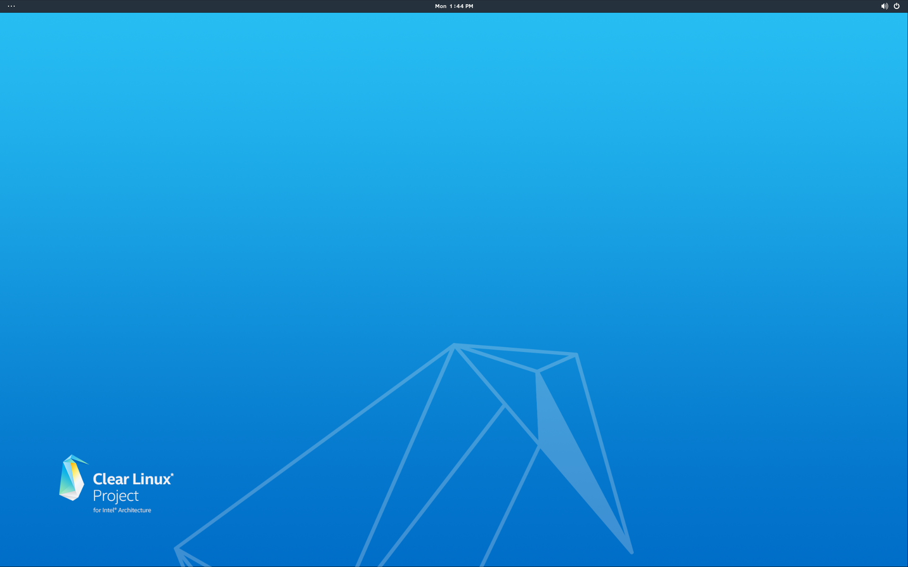

.. _bare-metal-auto-install:

Bare Metal Automatic Installation Guide
#######################################

If you only want to install the minimum components for your |CL| 
implementation the recommended action is to select the 
:guilabel:`< Automatic >` menu item shown in figure 1.  Move your cursor to 
this field and press the ``Enter`` key.

.. figure:: figures/cai4of6.png
   :scale: 50 %
   :alt: Choose installation Type

   Figure 1: :guilabel:`Choose installation Type`

This will bring you to the ``Choose target device for installation`` screen as 
shown in figure 2:

.. figure:: figures/cai5of6.png
   :scale: 50 %
   :alt: Choose target device for installation

   Figure 2: :guilabel:`Choose target device for installation`

Begin Automatic installation
----------------------------

With all the |CL| installer setup information gathered for the automatic 
installation option, the |CL| Installer will prompt you to begin the actual 
installation as shown in figure 3.  If you are satisfied with the information 
you have entered, select the :guilabel:`< Yes >` field and press ``Enter`` to 
begin installing |CL|.

.. figure:: figures/cai6of6.png
   :scale: 50 %
   :alt: Begin installation

   Figure 3: :guilabel:`Begin installation`

|CL| Installation begins...each step will show it's status as it progresses 
through the automated installation process.  Once all steps have completed, 
you will see the :guilabel:`< Ok >` prompt as shown in figure 4.  Press the 
``Enter`` key to continue.

.. figure:: figures/caisuccess.png
   :scale: 50 %
   :alt: Installation complete

   Figure 4: :guilabel:`Installation complete`

The final screen is shown in figure 5 and you will be prompted that the 
installation was successful and the system will be rebooted.  Press the 
``Enter`` key and remove the USB media while the system restarts.

.. figure:: figures/cairestart.png
   :scale: 50 %
   :alt: Successful Installation

   Figure 5: :guilabel:`Successful Installation`

With the USB device removed and the system restarted, your newly installed 
|CL| system boots and presents a full screen console requesting ``login:`` as 
shown in figure 6:

.. figure:: figures/cairoot.png
   :scale: 50 %
   :alt: Login screen

   Figure 6: :guilabel:`Login screen`

The automatic installation of |CL| is designed to install with minimal
software overhead. Therefore, some housekeeping and package installations
must occur before you have a full-featured |CL| operating system.

Set up your root and user accounts
----------------------------------

#. At the initial login prompt, enter: root
#. Once you are prompted, enter a new password
#. Re-enter the password to verify it.

You have set your root password and are logged in with root privileges.

The next step is to create a new user and set a password for
that user:

.. code-block:: console

   useradd <userid>
   passwd <userid>

Replace <userid> with the name of the user account you want to create.

Remain logged in as the root user because there are some other things to do
before we can fully enable your new user space.

Software installation and updates
---------------------------------

|CL| has a unique application and architecture to add and update applications
and to perform system updates called software update utility or 
:command:`swupd`.  Software applications are installed as bundles using the 
sub-command :command:`bundle-add`.

Next, we should install some useful applications using the software update
utility. The `os-clr-on-clr` bundle installs the vast majority of
applications useful to a system administrator or a developer. The bundle
contains other bundles such as `sysadmin-basic`, `editors`, `c-basic`, `dev-
utils-dev`, and other useful packages.

.. code-block:: console

   swupd bundle-add os-clr-on-clr

.. note::

   The image we installed may not be the latest version of |CL| available on
   the server. However, whenever the command
   :command:`swupd bundle-add <bundle>` runs, the OS is updated to the latest
   available version. Our website provides more `information about swupd`_.

We provide the full list of bundles and packages installed with the
`os-clr-on-clr`_ bundle. Additionally, we have listed
`all Clear Linux bundles`_, active or deprecated. Click any bundle on the
list to view the manifest of the bundle.

Finish setting up your new user
-------------------------------

Before logging off as root and logging into your new user account, we must
enable the :command:`sudo` command for your new `<userid>`.

To be able to execute all applications with root privileges, we must add the
`<userid>` to the `wheel group`_ and enable the wheel group in the
:file:`/etc/sudoers` file.

1. To add `<userid>` to the wheel group, enter the following command:

   .. code-block:: console

      usermod -G wheel -a <userid>

#. To open the :file:`/etc/sudoers` file, enter the following command:

   .. code-block:: console

      vi /etc/sudoers

.. note::

   Normally, we would use the visudo script to edit the :file:`/etc/sudoers`
   file to safely modify the contents of the file. In this instance, the file
   does not exist yet. Therefore, we create the initial instance of the file.

#. In the vi\* editor window, press the :kbd:`o` to open a new line.

#. Add the following line to the file:

   .. code-block:: console

      %wheel ALL=(ALL) ALL

#. To save the changes to the file and exit vi, press the :kbd:`ESC` key
   followed by the :kbd:`:` and :kbd:`x` keys.

.. important::

   Creating the file logged as the root user keeps the permissions of the
   file with the root user.

Now, we can log out of root and into our new `<userid>`.

To log off as root, enter :command:`exit`.

The command should bring you back to the `login:` prompt.

Enter your new `<userid>` and the password you created earlier.

You should now be in the home directory of `<userid>`. The bundle
`os-clr-on-clr`_ contains the majority of applications that a developer or
system administrator would want but it does not include a graphical user
interface. The `desktop` bundle includes the Gnome Desktop Manager and
additional supporting applications.

To test the :command:`sudo` command and ensure we set it up correctly, we can
install the Gnome Desktop Manager (gdm) and start it.

To install Gnome using :command:`swupd`, enter the following command:

.. code-block:: console

   sudo swupd bundle-add desktop

To start the Gnome Desktop Manager, enter the following command:

.. code-block:: console

   systemctl start gdm

You will be prompted to authenticate your user.  Enter the password for
`<userid>` and the Gnome Desktop should start as shown in figure 1:

   Figure 1: :guilabel:`Gnome Desktop`

To start the Gnome Desktop each time you start your system, enter
the following command:

.. code-block:: console

   systemctl enable gdm

**Congratulations!**

You have successfully installed |CL| on a bare metal system using the 
automatic installation method.

Additionally, you performed the following basic setup for your system:

* Setup of a root user.
* Updated the OS to its most current version using `swupd`.
* Installed the most common applications for system administrators and
  developers using bundles.
* Setup of a new user.
* Setup of `sudo` privileges for that new user.
* Installed a GUI using those `sudo` privileges.

Next steps
==========

With your system now running |CL| many paths are open for you.

Visit our :ref:`tutorials <tutorials>` page for examples on using your |CL|
system.

.. _`NUC6i5SYH product page`:
   http://www.intel.com/content/www/us/en/nuc/nuc-kit-nuc6i5syh.html

.. _`information about swupd`:
   https://clearlinux.org/features/software-update

.. _`os-clr-on-clr`:
   https://github.com/clearlinux/clr-bundles/blob/master/bundles/os-clr-on-clr

.. _`all Clear Linux bundles`:
   https://github.com/clearlinux/clr-bundles/tree/master/bundles

.. _`wheel group`:
   https://en.wikipedia.org/wiki/Wheel_(Unix_term)
