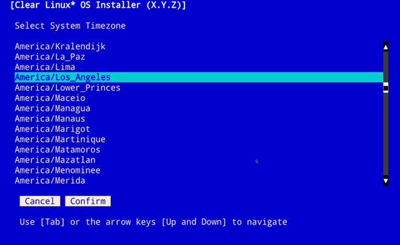
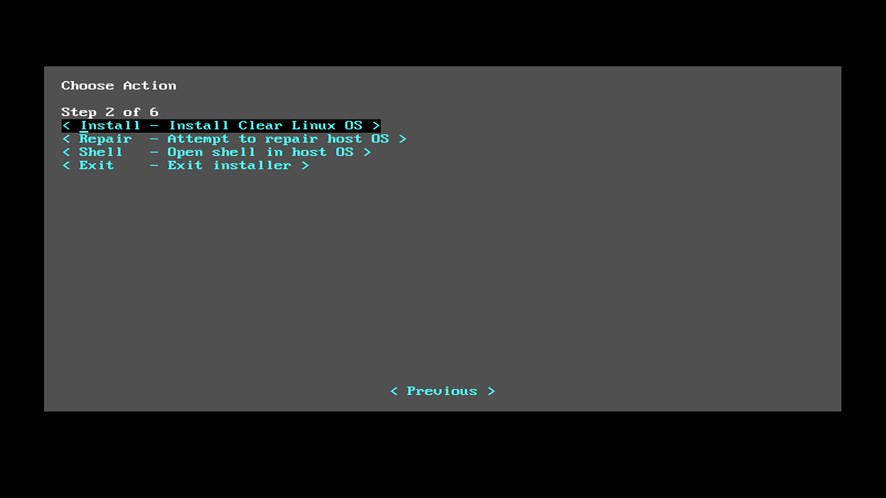
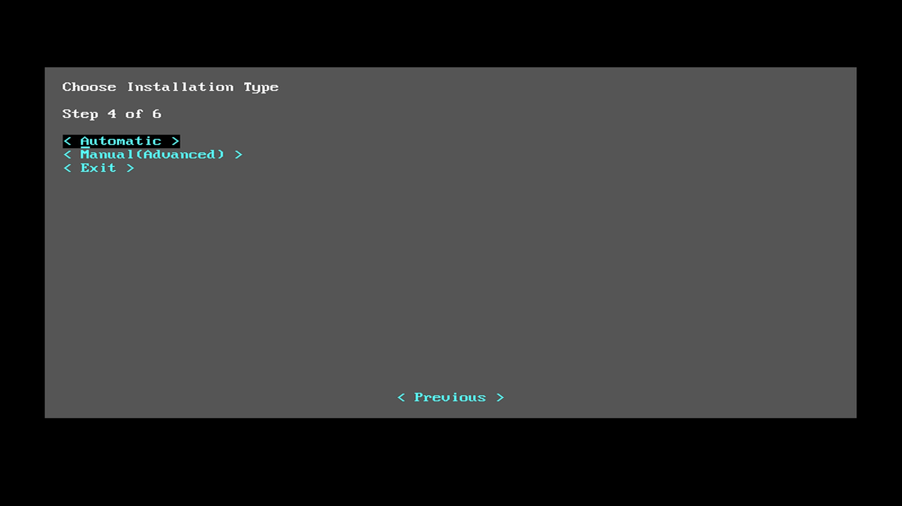
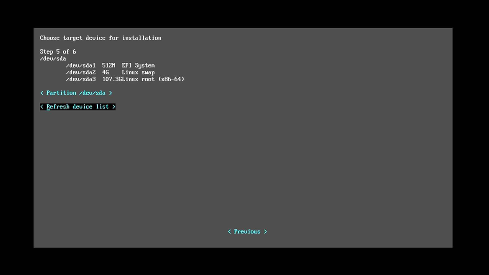
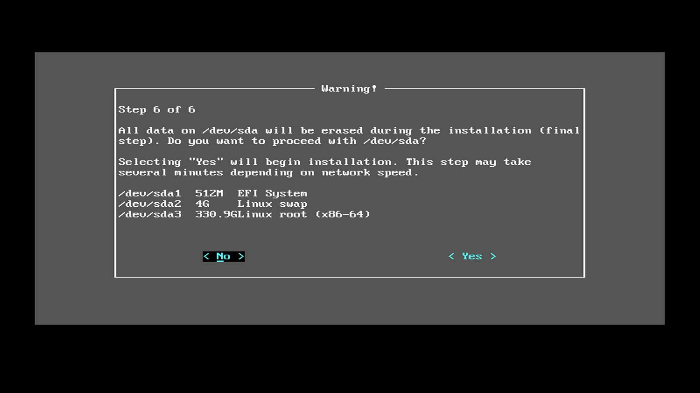
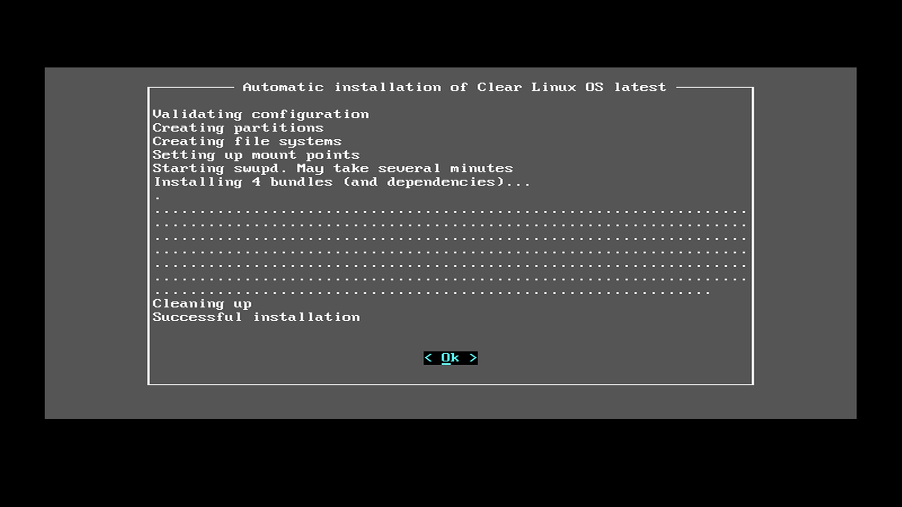
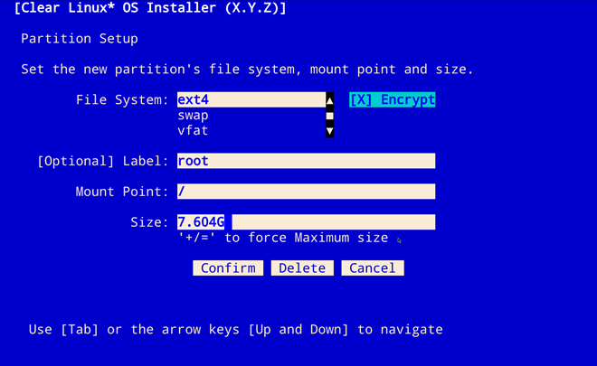
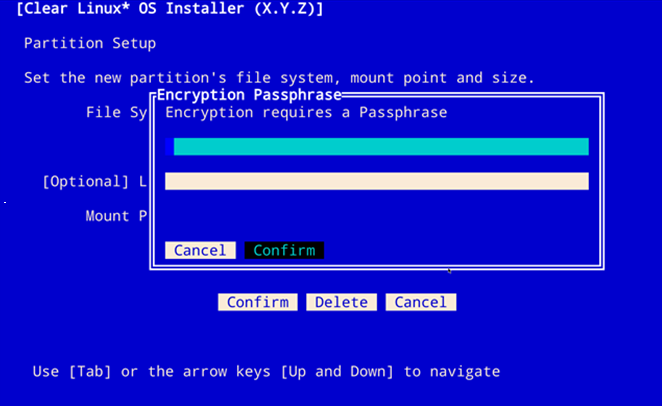

.. _bare-metal-install:

Install Clear Linux OS on bare metal
####################################

These instructions guide you through the installation of |CLOSIA|
on bare metal using a bootable USB drive.

.. include:: ../compatibility-check.rst
   :Start-after: compatibility-check:

.. include:: ../bootable-usb/bootable-usb-linux.rst
   :Start-after: bootable-usb-linux:
   :end-before: end-bootable-usb-linux-intro

.. include:: ../../guides/maintenance/types-of-cl-images.rst
  :start-after: types-of-cl-images
  
Download the latest Clear Linux installer image
===============================================

Get the latest |CL| installer image from the `image`_ directory.  
Look for the :file:`clear-[version number]-installer.img.xz` file.

.. include:: ../../guides/maintenance/download-verify-uncompress-linux.rst
   :Start-after: verify-image-checksum-on-linux:
   :end-before: uncompress-image-on-linux

.. include:: ../../guides/maintenance/download-verify-uncompress-linux.rst
   :Start-after: uncompress-image-on-linux:
   :end-before: uncompress-gz-on-linux

.. include:: ../bootable-usb/bootable-usb-linux.rst
   :Start-after: copy-usb-linux:
   :end-before: usb-next

.. _install-on-target:

Install Clear Linux on your target system
*****************************************

We formatted the previously created USB drive as a UEFI boot device. Our
target system has a hard drive installed containing a single primary
partition. The target system needs a wired Internet connection with DHCP.

Follow these steps to install |CL| on the target system:

#. Insert the USB drive into an available USB slot.

#. Power on the system.

#. Open the system BIOS setup menu, normally by pressing the :kbd:`F2` key.
   Your BIOS setup menu entry point may vary.

#. In the setup menu, enable the UEFI boot and set the USB drive as the first
   option in the device boot order.

#. Save these settings and exit.

#. Reboot the target system.

#. The |CL| Installer menu will start as shown in Figure 1.
   Select :guilabel:`Clear Linux OS for Intel Architecture` and press the
   :kbd:`Enter` key or wait five seconds to automatically select it.

   .. figure:: figures/bare-metal-install-1.png
      :scale: 50 %
      :alt: Clear Linux boot menu

      Figure 1: :guilabel:`Clear Linux boot menu`

#. This will take you into the :guilabel:`Clear Linux OS for Intel
   Architecture Installer` menu as shown in figure 2 and explains how to
   navigate through the |CL| installer setup menus.

   .. figure:: figures/bare-metal-install-2.png
      :scale: 50 %
      :alt: Clear Linux OS for Intel Architecture Installer

      Figure 2: :guilabel:`Clear Linux OS for Intel Architecture Installer`

   Press the :kbd:`Enter` key.

#. The :guilabel:`Keyboard selection` menu shown in figure 3 allows you to set
   up the keyboard layout that you will be using to navigate within the |CL|
   installer setup menus.

   .. figure:: figures/bare-metal-install-3.png
      :scale: 50 %
      :alt: Keyboard Selection

      Figure 3: :guilabel:`Keyboard Selection`

   For this guide we will select :menuselection:`Keyboard Selection -->
   < * us >` for the keyboard mapping, which should already be highlighted.
   Press the :kbd:`Enter` key to continue to the next menu.

Network requirements
====================

The :guilabel:`Network Requirements` menu, the first step of the |CL|
installer setup process, will attempt to connect to the |CL| update server
where the installer image is located. Once the connection to the |CL| update
server is established, you will see a screen similar to the one shown in
figure 4:

   Figure 4: :guilabel:`Network Requirements`

If you need to configure any :guilabel:`Proxy Settings` to gain access to the
update server, enter the appropriate address and port of your proxy server in
the :guilabel:`HTTPS proxy:` field.  Select the :guilabel:`< Set proxy
configuration >` button and press :kbd:`Enter`. You will then see the
connection to the update server established.

Optionally, set up a :guilabel:`static IP configuration` to your |CL|
installer image.  Enter the required information in the :guilabel:`Interface`,
:guilabel:`IP address`, :guilabel:`Subnet mask`, :guilabel:`Gateway` and
:guilabel:`DNS` fields and then select the :guilabel:`< Set static IP
configuration >` button and press the :kbd:`Enter` key.

The information displayed in the lower right quadrant of the screen shows the
current IP configuration for the |CL| update server where the installer image
is located.

.. note::

   If you are having difficulty establishing a connection to the update server
   and you see the message :guilabel:`none detected, install will fail`, you
   can press the :kbd:`Tab` key to highlight the :guilabel:`< Refresh >`
   button and press :kbd:`Enter` to attempt to reconnect to the |CL| update
   server. If this fails to establish a connection after multiple attempts,
   reboot your system and return to this step.

Once the connection to the |CL| udpate server is established, use the
:kbd:`Tab` key to advance to the :guilabel:`< Next >` button and press
:kbd:`Enter` to advance to the next |CL| installer setup menu.

Choose Clear Linux installer action
===================================

The :guilabel:`Choose Action` menu is where you can choose to install, repair,
open a shell, or exit the |CL| installer.  This menu is shown in figure 5:

   Figure 5: :guilabel:`Choose Action`

#. Select the :menuselection:`Choose action --> Install` menu item to continue
   the installation process.

   The :menuselection:`Choose action --> Repair` menu option will run the
   :command:`swupd --fix` command to correct any issues found with the system
   software that has already been installed on your system and correct any
   issues found by overwriting the incorrect file content, adding missing
   files, fixing permissions and any additional changes required to return the
   file to it's original content and permissions.

   The :menuselection:`Choose action --> Shell` menu item opens a terminal
   session on your system as the root user and you will be able to manage your
   system from this console.  When you are finished, type :command:`exit` to
   return to the :guilabel:`Choose Action` menu.

   The :menuselection:`Choose action --> Exit` menu option terminates the |CL|
   installation process and the system will shut down.

#. You will be prompted to join the :guilabel:`Stability Enhancement Program`
   as shown in figure 6. Press the :kbd:`Spacebar` or :kbd:`Enter` key while
   the cursor is in the :guilabel:`[ ]  Yes.` button to enable this
   functionality and then select the :guilabel:`< Next >` button to advance to
   the next menu item.

   .. figure:: figures/bare-metal-install-6.png
      :scale: 50 %
      :alt: Stability Enhancement Program

      Figure 6: :guilabel:`Stability Enhancement Program`

   If you choose not to enable this functionality during this step, you can
   install the ``telemetrics`` software bundle at a later time. As stated in
   the menu, this feature only collects anonymous information about your
   system to help improve system stability and no personally identifiable
   information is collected. Please visit our website to
   `learn more about telemetry.`_

Choose Clear Linux installation type
************************************

Figure 7 shows the next step of the |CL| installer: 
:guilabel:`Choose installation Type`. Chose whether to install |CL|
**automatically** or **manually**.  To end the installer process and shut down
the system, select the :guilabel:`< Exit >` button.

   Figure 7: :guilabel:`Choose installation Type`

If you select :guilabel:`< Automatic >` as the installation type, the |CL|
Installer will add the minimum amount of functionality required for a fully
functional |CL| system. You will not be able to modify the disk layout, add
a user or any other tasks that the manual installation process will allow.

With the :guilabel:`< Manual(Advanced) >` option, you can do the following
additional tasks during |CL| Installer setup:

* Modify the disk layout using the cgdisk utility.
* Add additional command-line parameters to the kernel.
* Create a hostname for your system.
* Create an administrative user.
* Add additional software bundles to enhance the functionality of your initial
  |CL| installation.
* Optionally, set up a static IP address for your system.

If you want to perform any of these additional tasks, select the
:guilabel:`< Manual(Advanced) >` menu item and follow the steps in our
:ref:`bare-metal-manual-install` to complete the |CL| manual installation
process. Otherwise, you can follow the |CL| automatic installation steps.

Clear Linux automatic installation
**********************************

To install the minimum components for your |CL| implementation, select the
:guilabel:`< Automatic >` menu item shown in figure 7 and press the
:kbd:`Enter` key.

The :guilabel:`Choose target device for installation` screen shown in figure 8
appears.  Move the cursor to the desired target and press the :kbd:`Enter`
key.

   Figure 8: :guilabel:`Choose target device for installation`

In this example we selected the single primary partition from our hard drive.

With all the |CL| installer setup information gathered for the automatic
installation option, the |CL| Installer prompts you to begin the actual
installation as shown in figure 9.

   Figure 9: :guilabel:`Begin installation`

When you are satisfied with the information you have entered, select the
:guilabel:`< Yes >` button and press :kbd:`Enter` to begin installing |CL|.

|CL| Installation begins and each step shows its status as it progresses
through the automated installation process.

Once all steps have completed, you will see the :guilabel:`Successful
installation` status message and the :guilabel:`< Ok >` button is highlighted
as shown in figure 10. Press the :kbd:`Enter` key to continue.

   Figure 10: :guilabel:`Installation complete`

Figure 11 shows the installer's final screen prompting you that the
installation completed successfully and the system will reboot. Press the
:kbd:`Enter` key and remove the USB media while the system restarts.

   Figure 11: :guilabel:`Successful Installation`

Set up your root account
========================

Once the |CL| installation is complete and the system boots, a full screen
console requests your login: as shown in figure 12:

   Figure 12: :guilabel:`Login screen`

#. At the initial login prompt, enter: ``root``

#. Once prompted, enter a new password.

#. Re-enter the password to verify it.

You have now set your root password and are logged in with root privileges.

**Congratulations!**

You have successfully installed |CL| on a bare metal system using the
automatic installation method and set the password for the ``root`` user.

The automatic installation of |CL| is designed to install with minimal
software overhead. Therefore, some housekeeping and package installations
could be needed before you can take full advantage of the |CL| operating
system. These instructions are captured in the :ref:`enable-user-space`.

* Create a new user
* Update the OS to its most current version using `swupd`.
* Install the most common applications for system administrators and
  developers using bundles.
* Setup a new user.
* Setup `sudo` privileges for that new user.
* Install a GUI using those `sudo` privileges.

.. _`information about stateless`:
   https://clearlinux.org/features/stateless

.. _`learn more about telemetry.`:
   https://clearlinux.org/features/telemetry

.. _`NUC6i5SYH product page`:
   http://www.intel.com/content/www/us/en/nuc/nuc-kit-nuc6i5syh.html

.. _image: https://download.clearlinux.org/image