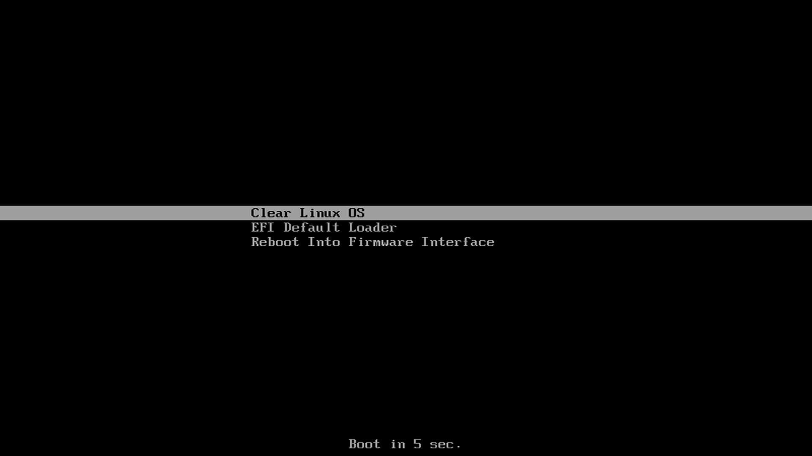

.. _bare-metal-install:

Install |CL-ATTR| on bare metal
###############################

These instructions guide you through the installation of |CL-ATTR|
on bare metal using a bootable USB drive.

.. contents::
   :local:
   :depth: 1

System requirements
*******************

Assure that your target system supports the installation:

* :ref:`system-requirements`
* :ref:`compatibility-check`

Download the latest |CL| installer image
****************************************

Get the latest |CL| installer image from the `downloads page`_. See Figure 1.
Look for the :file:`clear-[version number]-installer.img.xz` file.

   Figure 1: Visit Downloads

Optionally, you can use this command:

.. code-block:: bash

   curl -O https://download.clearlinux.org/image/$(curl https://download.clearlinux.org/image/latest-images | grep "installer")

#. Follow your OS instructions to create a bootable USB drive.

   * :ref:`bootable-usb-beta-all`

#. After downloading the image, verify and decompress the file per your OS.

.. _install-on-target:

Install |CL| on your target system
**********************************

We formatted the previously created USB drive as a UEFI boot device. Our
target system has a hard drive installed containing a single primary
partition. The target system needs a wired Internet connection with DHCP.

Follow these steps to install |CL| on the target system:

#. Insert the USB drive into an available USB slot.

#. Power on the system.

#. Open the system BIOS setup menu by pressing the :kbd:`F2` key.
   Your BIOS setup menu entry point may vary.

#. In the setup menu, enable the UEFI boot and set the USB drive as the first
   option in the device boot order.

#. Save these settings and exit.

#. Reboot the target system.

#. This action launches the |CL| installer boot menu, shown in figure 2.

   .. figure:: figures/bare-metal-install-2.png
      :scale: 100%
      :alt: Clear Linux OS Installer boot menu

      Figure 2: Clear Linux OS Installer boot menu

.. include:: ../bare-metal-install-beta/bare-metal-install-beta.rst
   :start-after: incl-bare-metal-beta-start:

.. _Autoproxy: https://clearlinux.org/features/autoproxy
.. _downloads page: https://clearlinux.org/downloads