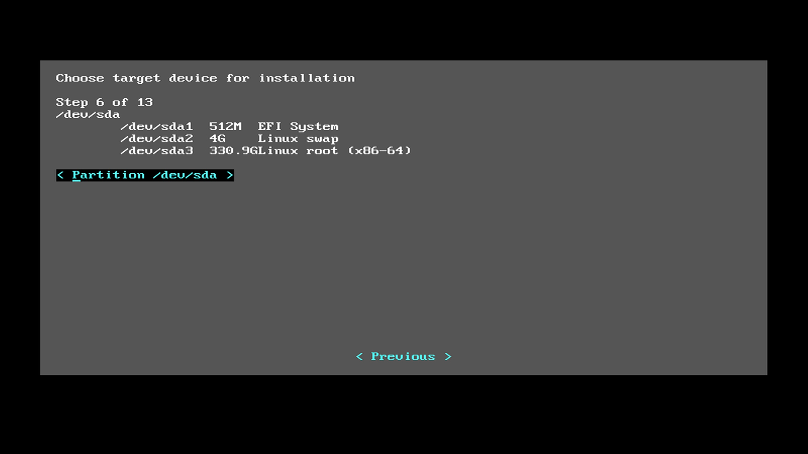

.. _bare-metal-manual-install:

Bare metal manual installation guide
####################################

This section is a continuation of steps from the :ref:`bare-metal-install`
page.

Selecting the :guilabel:`< Manual(Advanced) >` menu option as seen in figure
1, you can do the following additional tasks during the |CL| Installer setup:

* :ref:`Modify the disk layout using the cgdisk utility<cgdisk-manual-install>`
* Add additional command-line parameters to the kernel
* Create a hostname for your system
* Create an administrative user
* Add additional software bundles to enhance the functionality of your initial
  |CL| installation
* Optionally set up a static IP address for your system

Begin the manual installation process
*************************************

#. Move the cursor to the :guilabel:`< Manual(Advanced) >` menu item
   and press the :kbd:`Enter` key.

   .. figure:: figures/cmi7.png
      :scale: 50 %
      :alt: Choose installation Type

   Figure 1: :guilabel:`Choose installation Type`

#. This will bring you to the :guilabel:`Choose partitioning method` screen as
   shown in figure 2.

   .. figure:: figures/cmi5of13.png
      :scale: 50 %
      :alt: Choose partitioning method

      Figure 2: :guilabel:`Choose partitioning method`

   If your hard drive has already been partitioned for a Linux system, you can
   select the :guilabel:`< Use default partition and mount scheme on target
   device >` menu item and press :kbd:`Enter` to move to the next step of the
   installer setup process.

   .. _cgdisk-manual-setup:

   Otherwise, to set up your hard drive partitions manually before moving to
   the next step, select the :guilabel:`< Manually configure mounts and
   partitions >` menu item and follow the instructions for :ref:`using CGDISK
   to set up your Clear Linux hard drive<cgdisk-manual-install>`.

.. _choose-target-device:

Choose target device for installation
=====================================

The :guilabel:`Choose target device for installation` menu, shown in figure 3,
will appear with the current device and partition information displayed. In
this example, ``/dev/sda`` is the only drive on the system with three
partitions defined and assigned. The menu cursor is highlighting the partition
to install |CL| onto.

#. Select the :guilabel:`< Partition /dev/sda >` button and press the
   :kbd:`Enter` key.

   .. note::

      To return to the previous menu, press the :kbd:`Tab` key
      to highlight the :guilabel:`< Previous >` button and press :kbd:`Enter`
      to return to the previous menu.

   Figure 3: :guilabel:`Choose target device for installation`

#. After selecting the :guilabel:`< Partition /dev/sda >` button you will be
   presented with a warning screen as shown in figure 4 with the
   :guilabel:`< No >` button highlighted. If you are satisfied this is the
   device that you want to install |CL| onto, use the :kbd:`Tab` key to
   highlight the :guilabel:`< Yes >` button and press :kbd:`Enter` to proceed
   to the next step.

   .. figure:: figures/cmi7of13.png
      :scale: 50 %
      :alt: Device installation warning

      Figure 4: :guilabel:`Device installation warning`

Additional manual installer settings
====================================

The next steps of the manual installer setup process will allow you to set up
any additional command-line parameters to the kernel, create a hostname for
your system, set up an administrative user, install additional software
bundles and optionally create a static IP address for your system.

#. On the menu :guilabel:`Append to kernel cmdline`, you can add additional
   options to the kernel command-line to further customize your installation
   as shown in figure 5. Normally this is not required but if there are
   specific options that need to be set in the Linux kernel you can enter them
   here. For a complete list of command-line parameters for the Linux kernel
   you can visit the official documentation of the `latest kernel's
   command-line parameters`_.

   Add any additional command-line parameters in the :guilabel:`Append to
   cmdline:` field and then press the :kbd:`Tab` key to move to the
   :guilabel:`< Next >` button and press :kbd:`Enter`.

   .. figure:: figures/cmi8of13.png
      :scale: 50 %
      :alt: Append to kernel cmdline

      Figure 5: :guilabel:`Append to kernel cmdline`

#. The next menu, :guilabel:`Configuring Hostname`, will start off suggesting
   a hostname string prefaced with "clr" as shown in figure 6. You can make
   your hostname anything meaningful and unique. Once complete, press the
   :kbd:`Tab` key to move to the :guilabel:`< Next >` button and press
   :kbd:`Enter`.

   .. figure:: figures/cmi9of13.png
      :scale: 50 %
      :alt: Configure Hostname

   Figure 6: :guilabel:`Configure Hostname`

   To learn more about hostname naming conventions and restrictions, you can
   check this `wiki page about hostnames`_.

#. The :guilabel:`User configuration` menu shown in figure 7 gives you the
   option to create a userid with administrative privileges. Select the field
   :guilabel:`< Create an administrative user >` and press :kbd:`Enter` to go
   to the second page of this menu item. If you do not want to create a user
   at this time, select :guilabel:`< No user creation (login as root) >` to
   skip this step and proceed to the :guilabel:`Bundle selector` menu.

   .. figure:: figures/cmi10of13.png
      :scale: 50 %
      :alt: User configuration

      Figure 7: :guilabel:`User configuration`

#. To create a user you will be presented with the second :guilabel:`User
   configuration` menu shown in figure 8. You are only required to fill in the
   :guilabel:`Username`, :guilabel:`Password` and :guilabel:`Confirm password`
   fields. To give this user administrative privileges, select the
   :guilabel:`Add user to the sudoers?` field to add this user to the
   ``wheel`` group. This will enable using the :command:`sudo` command for
   this new user.

   Once you have entered all the data for this menu, press the :kbd:`Tab` key
   to highlight the :guilabel:`< Next >` button and press :kbd:`Enter`.

   .. figure:: figures/cmi10of13a.png
      :scale: 50 %
      :alt: User configuration - create user

   Figure 8: :guilabel:`User configuration - create user`

#. The :guilabel:`Bundle selector` menu shown in figure 9 will allow you to
   add additional software bundles to your initial |CL| installation. In this
   example we will select all additional bundles offered by pressing the
   :kbd:`Tab` key to go to each field and pressing the :kbd:`Spacebar` or the
   :kbd:`Enter` key to select each bundle. This menu will also list the
   additional :guilabel:` --- required ---` software bundles that will be
   installed during the |CL| installation.

   .. figure:: figures/cmi11of13.png
      :scale: 50 %
      :alt: Bundle selector

      Figure 9: :guilabel:`Bundle selector`

For a complete description of the content of these additional bundles, go to
the `software bundle list`_ and select the name for a specific bundle to show
the contents within the bundle.

Target system network configuration
===================================

The final step of the installer setup process before the actual installation
of |CL| begins, is to set up the :guilabel:`Network configuration`. This menu
is shown in figure 10. For this guide installation we will select
:guilabel:`< Use DHCP >` to have an IP address automatically assigned when the
system boots up.

.. figure:: figures/cmi12of13.png
   :scale: 50 %
   :alt: Network configuration

   Figure 10: :guilabel:`Network configuration`

You can optionally set up a static IP address for your system by selecting the
:guilabel:`< Use static IP configuration >` menu item and filling in the
required fields.

Begin installation
******************

With all the |CL| installer setup information gathered for the manual
installation option, the |CL| Installer prompts you to begin the actual
installation as shown in figure 11.

.. figure:: figures/cmi13of13.png
   :scale: 50 %
   :alt: Begin installation

   Figure 11: :guilabel:`Begin installation`

When you are satisfied with the information you have entered, select the
:guilabel:`< Yes >` button and press :kbd:`Enter` to begin installing |CL|.

|CL| Installation begins and each step shows its status as it progresses
through the manual installation process as shown in figure 12.

.. figure:: figures/cmi17.png
   :scale: 50 %
   :alt: Installation status

   Figure 12: :guilabel:`Installation status`

Once all steps have completed, you will see the ``Successful installation``
status message and the :guilabel:`< Ok >` button is highlighted as shown in
figure 13. Press the :kbd:`Enter` key to continue.

.. figure:: figures/cmi18.png
   :scale: 50 %
   :alt: Installation complete

   Figure 13: :guilabel:`Installation complete`

Figure 14 shows the installer's final screen prompting you that the
installation completed successfully and the system will reboot. Press the
:kbd:`Enter` key and remove the USB media while the system restarts.

.. figure:: figures/cmi19.png
   :scale: 50 %
   :alt: Successful Installation

   Figure 14: :guilabel:`Successful Installation`

Once the |CL| installation is complete and the system boots, you will be
presented with the Gnome Desktop sign-in screen to begin using your system as
shown in figure 15:

   .. figure:: figures/cmi20.png
      :scale: 50 %
      :alt: Gnome sign-in screen

      Figure 15: :guilabel:`Gnome sign-in screen`

Click on the :guilabel:`username` that you created earlier, enter the password
that was also created and you will logged into the system. The Gnome 3
desktop will appear as shown in figure 16:

.. figure:: figures/cmi22.png
   :scale: 50 %
   :alt: Gnome Desktop Manager

   Figure 16: :guilabel:`Gnome Desktop Manager`

**Congratulations!**

You have successfully installed |CL| on a bare metal system using the
manual installation method.

Visit our :ref:`tutorials <tutorials>` page for examples on using your |CL|
system.

.. _`information about stateless`:
   https://clearLinux.org/features/stateless

.. _`wiki page about Hostnames`:
   https://en.wikipedia.org/wiki/Hostname

.. _`software bundle list`:
   https://clearLinux.org/documentation/clear-Linux/reference/bundles/available-bundles.html#available-bundles

.. _`learn more about telemetry.`:
   https://clearLinux.org/features/telemetry

.. _`latest kernel's command-line parameters`:
   https://www.kernel.org/doc/html/latest/admin-guide/kernel-parameters.html