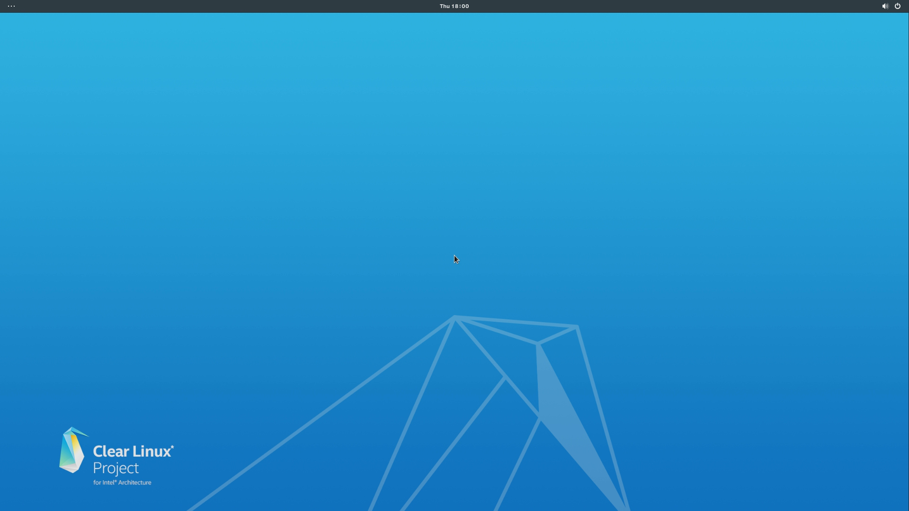

.. _bare-metal-manual-install:

Install Clear Linux OS on bare metal (manual)
#############################################

This section contains the steps for a |CL| manual installation.  It picks up
where the :ref:`bare-metal-install` left off.

To perform additional tasks during the |CL| Installer setup, select the 
:guilabel:`< Manual(Advanced) >` menu option (figure 1).  

* :ref:`Modify the disk layout using the cgdisk utility<cgdisk-manual-install>`
* Add additional command-line parameters to the kernel
* Create a hostname for your system
* Create an administrative user
* Add additional software bundles to enhance the functionality of your
  initial |CL| installation
* Optionally set up a static IP address for your system

Begin the manual installation process
*************************************

#. Move the cursor to the :guilabel:`< Manual(Advanced) >` menu item
   and press the :kbd:`Enter` key.

   .. figure:: figures/bare-metal-manual-install-1.png
      :scale: 50 %
      :alt: Choose installation Type

   Figure 1: :guilabel:`Choose installation Type`

#. The screen :guilabel:`Choose partitioning method` will
   appear (figure 2).

   .. figure:: figures/bare-metal-manual-install-2.png
      :scale: 50 %
      :alt: Choose partitioning method

      Figure 2: :guilabel:`Choose partitioning method`

   If your hard drive has already been partitioned for a Linux system, you 
   can select the :guilabel:`< Use default partition and mount scheme on 
   target device >` menu item and press :kbd:`Enter` to move to the next
   step of the installer setup process.

   .. _cgdisk-manual-setup:

   Otherwise, to set up your hard drive partitions manually before moving to
   the next step, select the :guilabel:`< Manually configure mounts and
   partitions >` menu item and follow the instructions for :ref:`using CGDISK
   to set up your Clear Linux hard drive<cgdisk-manual-install>`.

.. _choose-target-device:

Choose target device for installation
=====================================

The :guilabel:`Choose target device for installation` menu, shown in figure 
3, displays the current device and partition information. In
this example, ``/dev/sda`` is the only drive on the system with three
partitions defined and assigned. The menu cursor highlights the partition
to install |CL| onto.

#. Select the :guilabel:`< Partition /dev/sda >` button and press the
   :kbd:`Enter` key.

   .. note::

      To return to the previous menu, press the :kbd:`Tab` key
      to highlight the :guilabel:`< Previous >` button and press :kbd:`Enter`
      to return to the previous menu.

   .. figure:: figures/bare-metal-manual-install-3.png
      :scale: 50 %
      :alt: Choose target device for installation

      Figure 3: :guilabel:`Choose target device for installation`

#. Next, you will be presented with a warning screen (figure 4) with
   :guilabel:`< No >` highlighted by default. If this is the device onto
   which you wish to install |CL|, press :kbd:`Tab` to highlight
   the :guilabel:`< Yes >` button. 

#. Press :kbd:`Enter` to proceed.

   .. figure:: figures/bare-metal-manual-install-4.png
      :scale: 50 %
      :alt: Device installation warning

      Figure 4: :guilabel:`Device installation warning`

.. _Additional_manual_installer_settings:

Additional manual installer settings
====================================

The next steps of the manual installer setup process allows you to:

* Set up any additional command-line parameters to the kernel.
* Create a hostname for your system.
* Set up an administrative user.
* Install additional software bundles.
* Optionally create a static IP address for your system.

#. The :guilabel:`Append to kernel cmdline` menu shown in figure 5 allows you
   to add more options to the kernel command-line to further customize
   your installation.  Normally this is not required; however, if there are
   specific options that need to be set in the Linux kernel, you can enter
   them here. For a complete list of command-line parameters for the Linux
   kernel you can visit the official documentation of the `latest kernel's
   command-line parameters`_.

   Add any additional command-line parameters in the :guilabel:`Append to
   cmdline:` field and then press the :kbd:`Tab` key to move to the
   :guilabel:`< Next >` button and press :kbd:`Enter`.

   .. figure:: figures/bare-metal-manual-install-5.png
      :scale: 50 %
      :alt: Append to kernel cmdline

      Figure 5: :guilabel:`Append to kernel cmdline`

#. The :guilabel:`Configuring Hostname` menu shown in figure 6 suggests
   a hostname string prefaced with "clr". You can make your hostname anything
   meaningful and unique. Once complete, press the :kbd:`Tab` key to move to
   the :guilabel:`< Next >` button and press :kbd:`Enter`.

   .. figure:: figures/bare-metal-manual-install-6.png
      :scale: 50 %
      :alt: Configure Hostname

   Figure 6: :guilabel:`Configure Hostname`

   To learn more about hostname naming conventions and restrictions, you can
   check this `wiki page about hostnames`_.

#. The :guilabel:`User configuration` menu shown in figure 7 allows you to
   create a userid with administrative privileges. If you do not want to 
   create a user at this time, select 
   :guilabel:`< No user creation (login as root) >` to skip this step and
   proceed to the :guilabel:`Bundle selector` menu.

   .. figure:: figures/bare-metal-manual-install-7.png
      :scale: 50 %
      :alt: User configuration

   Figure 7: :guilabel:`User configuration`

   #. To create a userid, select the :guilabel:`< Create an administrative 
      user >` field and press :kbd:`Enter` to go to the the next screen.
   #. You will be presented with the second :guilabel:`User configuration` 
      menu shown in figure 8. You are only required to fill in the
      :guilabel:`Username`, :guilabel:`Password`, and :guilabel:`Confirm 
      password` fields.
   #. To give a user administrative privileges, press :kbd:`Tab` until
      cursor appears in the field :guilabel:`Add user to the sudoers?` and
      select. This adds the user to the ``wheel`` group and allows entry of 
      the :command:`sudo` command.

      After entering all data, press :kbd:`Tab` until :guilabel:`< Next >`
      is highlighted. Then press :kbd:`Enter`.

      .. figure:: figures/bare-metal-manual-install-8.png
         :scale: 50 %
         :alt: User configuration - create user

      Figure 8: :guilabel:`User configuration - create user`

#. In the menu :guilabel:`Bundle selector` (figure 9), you can add
   software bundles to your initial |CL| installation. Press the :kbd:`Tab`
   key to highlight additional bundles, and then press :kbd:`Spacebar` or 
   :kbd:`Enter` to select each bundle. This menu will also list the
   additional :guilabel:`--- required ---` software bundles that will be
   installed during the |CL| installation.

   .. figure:: figures/bare-metal-manual-install-9.png
      :scale: 50 %
      :alt: Bundle selector

      Figure 9: :guilabel:`Bundle selector`

For a complete description of the content of these additional bundles, go to
the :ref:`software bundle list<bundles>` and select the name for a
specific bundle to show the contents within the bundle.

Target system network configuration
===================================

Before the actual |CL| installation begins, we must set up the
:guilabel:`Network configuration` shown in figure 10. Select
:guilabel:`< Use DHCP >` to have an IP address automatically assigned when
the system boots up.

.. figure:: figures/bare-metal-manual-install-10.png
   :scale: 50 %
   :alt: Network configuration

   Figure 10: :guilabel:`Network configuration`

You can optionally set up a static IP address for your system.  Select the
:guilabel:`< Use static IP configuration >` menu item and fill in the
required fields.

Begin installation
******************

The |CL| installer is now ready to use the information you provided on the
previous sections to begin the actual installation. Figure 11 shows the
installer's prompt to begin the installation.

.. figure:: figures/bare-metal-manual-install-11.png
   :scale: 50 %
   :alt: Begin installation

   Figure 11: :guilabel:`Begin installation`

When you are satisfied with the information entered, select the
:guilabel:`< Yes >` button and press :kbd:`Enter` to begin installing |CL|.

The |CL| Installation begins and each step shows its status as it progresses
through the manual installation process as shown in figure 12.

.. figure:: figures/bare-metal-manual-install-12.png
   :scale: 50 %
   :alt: Installation status

   Figure 12: :guilabel:`Installation status`

Once all steps have completed, you will see the ``Successful installation``
status message and the :guilabel:`< Ok >` button is highlighted as shown in
figure 13. Press the :kbd:`Enter` key to continue.

.. figure:: figures/bare-metal-manual-install-13.png
   :scale: 50 %
   :alt: Installation complete

   Figure 13: :guilabel:`Installation complete`

Congratulations! The installation completed successfully and the system will
reboot. Figure 14 shows the installer's final prompt. Press the :kbd:`Enter`
key and remove the USB media while the system restarts.

.. figure:: figures/bare-metal-manual-install-14.png
   :scale: 50 %
   :alt: Successful Installation

   Figure 14: :guilabel:`Successful Installation`

Once the system boots, the Gnome Desktop sign-in screen shown in figure 15
appears:

.. figure:: figures/bare-metal-manual-install-15.png
   :scale: 50 %
   :alt: Gnome sign-in screen

   Figure 15: :guilabel:`Gnome sign-in screen`

Click on the :guilabel:`username` you created, enter the password, and you
will be logged into the system. The Gnome 3 desktop appears as shown in
figure 16:

   Figure 16: :guilabel:`Gnome Desktop Manager`

**Congratulations!**

You have successfully installed |CL| on a bare metal system using the
manual installation method.

Visit our :ref:`tutorials <tutorials>` section for examples on using your
|CL| system.

.. _`information about stateless`:
   https://clearLinux.org/features/stateless

.. _`wiki page about Hostnames`:
   https://en.wikipedia.org/wiki/Hostname

.. _`learn more about telemetry.`:
   https://clearLinux.org/features/telemetry

.. _`latest kernel's command-line parameters`:
   https://www.kernel.org/doc/html/latest/admin-guide/kernel-parameters.html
