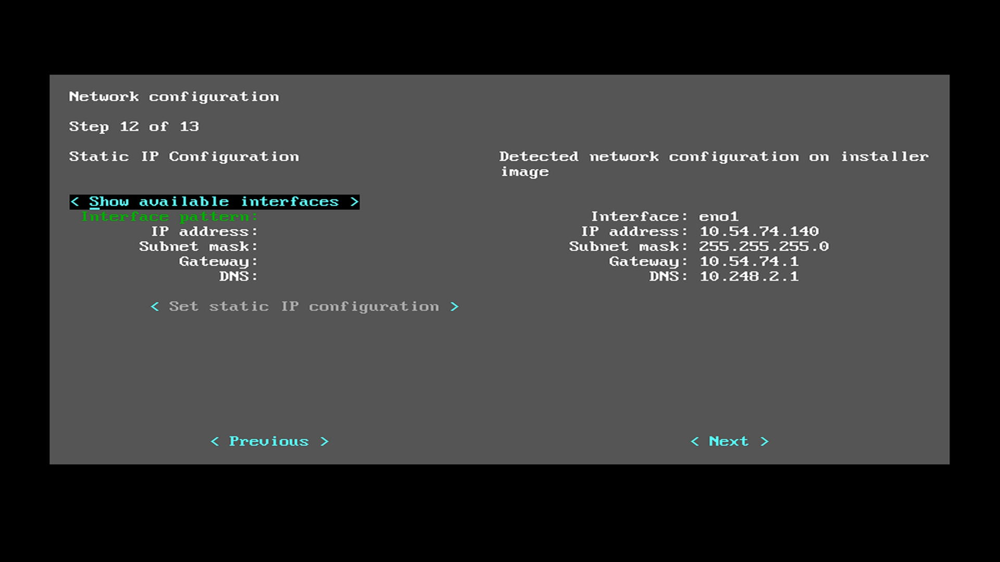

.. _bare-metal-manual-install:

Bare Metal Manual Installation Guide
####################################

 TODO: it is assumed that you came here from the |CLOSIA| bare-metal-install-intro 
 guide...if not, start there first...

With the :guilabel:`< Manual(Advanced) >` option you can do the following 
additional tasks during |CL| Installer setup:

* modify the disk layout using the cgdisk utility
* add additional command-line parameters to the kernel
* create a hostname for your system
* create an administrative user
* add additional software bundles to enhance the functionality of your initial 
  |CL| installation
* optionally set up a static IP address for your system

If you are planning to perform any of these tasks the recommended action is to 
select the :guilabel:`< Manual(Advanced) >` menu item.  Move your cursor to 
this field and press the ``Enter`` key.

.. figure:: figures/cmi7.png
   :scale: 50 %
   :alt: Choose installation Type

   Figure 7: :guilabel:`Choose installation Type`

This will bring you to the ``Choose partitioning method`` screen as shown in 
figure 8:

.. figure:: figures/cmi5of13.png
   :scale: 50 %
   :alt: Choose partitioning method

   Figure 8: :guilabel:`Choose partitioning method`

If you have already set up your hard drive for a linux system then you can
select the :guilabel:`< Use default partition and mount scheme on target device >` 
menu item and press ``Enter`` to move to the next step of the installer 
setup process.  This is the option that we will take for this guide.

If you want to set up your hard drive partitions before moving to the next 
step, select the :guilabel:`< Manually configure mounts and partitions >` menu 
item and follow the instructions to set up your |CL| hard drive.

  TODO: this needs to have a link to the steps to set up the disk using 
  cgdisk along with a simple linux partitioning primer that I will write 
  after I finish the first draft.

.. _choose-target-device:

Choose target device for installation
-------------------------------------

The ``Choose target device for installation`` menu, shown in figure 9, will 
appear with the current device and partition information displayed.  In this 
example, ``/dev/sda`` is the only drive on the system with 3 partitions 
defined and assigned.  The menu cursor is highlighting the device to install 
|CL| onto.  Select :guilabel:`< Partition /dev/sda >` and press ``Enter``.  
If you want to return to the previous menu, press the ``Tab`` key to highlight 
the :guilabel:`< Previous >` field and press ``Enter`` to return to the 
``< Choose partitioning method >`` menu.

.. figure:: figures/cmi6of13.png
   :scale: 50 %
   :alt: Choose target device for installation

   Figure 9: :guilabel:`Choose target device for installation`

After selecting the :guilabel:`< Partition /dev/sda >` field you will be 
presented with a warning screen as shown in figure 10 with the 
:guilabel:`< No >` field highlighted:

.. figure:: figures/cmi7of13.png
   :scale: 50 %
   :alt: Device installation warning

   Figure 10: :guilabel:`Device installation warning`

Use the ``Tab`` key to highlight the :guilabel:`< Yes >` field and press 
``Enter`` to proceed to the next step if this is the device that you want to 
install |CL| onto.

Additional manual installer settings
------------------------------------

The next steps of the manual installer setup process will allow you to set up 
any additional command-line parameters to the kernel, create a hostname for 
your system, set up an administrative user, install any additional software 
bundles to enhance your system and optionally create a static IP address for 
your system. 

On the menu ``Append to kernel cmdline``, you can add additional options to 
the kernel command-line to further customize your installation as shown in 
figure 11.  Normally this would not be required but if there is something 
specific that needs to be set you can do it here.  For a complete list of 
command-line parameters for the Linux kernel you can visit the 
`latest kernel's command-line parameters`_ at kernel.org and explore through 
the documents listed there.  Add any additional command-line parameters in the 
:guilabel:`Append to cmdline:` and then press the ``Tab`` key to highlight the 
:guilabel:`< Next >` and press ``Enter``.

.. figure:: figures/cmi8of13.png
   :scale: 50 %
   :alt: Append to kernel cmdline

   Figure 11: :guilabel:`Append to kernel cmdline`

The next menu, ``Configuring Hostname``, will start off suggesting a hostname 
string prefaced with "clr" as shown in figure 12.  You can make your hostname 
anything meaningful and unique.  Once complete, press the ``Tab`` key to move 
to the :guilabel:`< Next >` field and press ``Enter``.  To learn more about 
hostname naming conventions and restrictions, you can check this 
`wiki page about hostnames`_ for more information.

.. figure:: figures/cmi9of13.png
   :scale: 50 %
   :alt: Configure Hostname

   Figure 12: :guilabel:`Configure Hostname`

The ``User configuration`` menu shown in figure 13 gives you the option to  
create a user with administrative priveleges.  Select the field 
:guilabel:`< Create an administrative user >` and press ``Enter`` to go to the 
second page of this menu item.  If you want to create a user at a later time, 
select :guilabel:`< No user creation (login as root) >` to skip this step and 
proceed to the ``Bundle selector`` menu.

.. figure:: figures/cmi10of13.png
   :scale: 50 %
   :alt: User configuration

   Figure 13: :guilabel:`User configuration`

If you choose to create a user you will be presented with the second ``User 
configuration`` menu shown in figure 14.  You are only required to fill in 
the :guilabel:`Username`, :guilabel:`Password` and guilabel:`Confirm password` 
fields but it is recommended that you also enter a meaningful name and to also 
select the :guilabel:`Add user to the sudoers?` if you want this user to be 
able to execute the :command:`sudo` command.  Once you have entered all the 
data for this menu, press the ``Tab`` key to highlight the 
:guilabel:`< Next >` field and press ``Enter``.

.. figure:: figures/cmi10of13a.png
   :scale: 50 %
   :alt: User configuration - create user

   Figure 14: :guilabel:`User configuration - create user`

The ``Bundle selector`` menu shown in figure 15 will allow you to add 
additional software bundles to your initial |CL| installation.  In this 
example we will select all additional bundles offered by pressing the ``Tab`` 
key to go to each field and pressing the ``Spacebar`` or the ``Enter`` key to 
select each additional bundle.  This menu also lists the additional software 
bundles that will be installed during the |CL| installation.

.. figure:: figures/cmi11of13.png
   :scale: 50 %
   :alt: Bundle selector

   Figure 15: :guilabel:`Bundle selector`

For a complete description of the content of these additional bundles, go to 
the `software bundle list`_ and select the name for a specific bundle to show 
the contents within the specified bundle.

Network configuration
---------------------

The final step of the installer setup process before the actual installation 
of |CL| begins is to set up the ``Network configuration``.  This menu is 
shown in figure 16 and for this guide we will select :guilabel:`< Use DHCP >` 
to have an IP address automatically assigned when the system boots up.

.. figure:: figures/cmi12of13.png
   :scale: 50 %
   :alt: Network configuration

   Figure 16: :guilabel:`Network configuration`

You can optionally set up a static IP address for your system by selecting the 
:guilabel:`< Use static IP configuration >` menu item.

   TODO:  Add the Network configuration/Static IP Configuration menu as a 
   separate link to another guide for setting this up and describe the 
   fields.  Here is one of the screen shots...

   Figure 16a: :guilabel:`Network configuration`

Begin installation
------------------

With all the |CL| installer setup information gathered, the |CL| Installer 
will prompt you to begin the actual installation as shown in figure 17.  If 
you are satisfied with the information you have entered, select the 
:guilabel:`< Yes >` field and press ``Enter`` to begin installing |CL|.

.. figure:: figures/cmi13of13.png
   :scale: 50 %
   :alt: Begin installation

   Figure 17: :guilabel:`Begin installation`

|CL| Installation begins...each step will show it's status as it progresses 
through each step as illustrated in figure 18

.. figure:: figures/cmi17.png
   :scale: 50 %
   :alt: Installation status

   Figure 18: :guilabel:`Installation status`

Once all steps have completed, you will see the :guilabel:`< Ok >` prompt as 
shown in figure 19.  Press the ``Enter`` key to continue.

.. figure:: figures/cmi18.png
   :scale: 50 %
   :alt: Installation complete

   Figure 19: :guilabel:`Installation complete`

The final screen is shown in figure 20 and you will be prompted that the 
installation was successful and the system will be rebooted.  Press the 
``Enter`` key and remove the USB media while the system restarts.

.. figure:: figures/cmi19.png
   :scale: 50 %
   :alt: Successful Installation

   Figure 20: :guilabel:`Successful Installation`

With the USB device removed and the system restarted, you will be presented 
with the Gnome Desktop sign-in screen to begin using your system as shown in 
figure 21:

.. figure:: figures/cmi20.png
   :scale: 50 %
   :alt: Gnome sign-in screen

   Figure 21: :guilabel:`Gnome sign-in screen`

Click on the :guilabel:`username` that you created earlier, enter the password 
that was also created and you will logged into the system.  The Gnome 3 
desktop will appear as shown in figure 22:

.. figure:: figures/cmi22.png
   :scale: 50 %
   :alt: Gnome Desktop Manager

   Figure 22: :guilabel:`Gnome Desktop Manager`

Next steps
==========

**Congratulations!**

You have successfully installed |CL| on a bare metal system using the 
manual installation method.

Visit our :ref:`tutorials <tutorials>` page for examples on using your |CL|
system.

.. _`information about stateless`:
   https://clearlinux.org/features/stateless

.. _`wiki page about Hostnames`:
   https://en.wikipedia.org/wiki/Hostname

.. _`software bundle list`:
   https://clearlinux.org/documentation/clear-linux/reference/bundles/available-bundles.html#available-bundles

.. _`learn more about telemetry.`:
   https://clearlinux.org/features/telemetry

.. _`latest kernel's command-line parameters`:
   https://www.kernel.org/doc/html/latest/admin-guide/kernel-parameters.html