.. _vmware-esxi-2:

Run |CL| as a VMWare ESXi guest OS
##################################

This section explains how to run |CLOSIA| in a virtualized environment using 
VMWare ESXi 6.5 Update 1. 

There are 2 ways to create a |CL| VM to run in VMWare:

#.  Fresh installation of |CL| into new VM.  This provides flexibility 
    in configuring the VM size, partitions, and initial bundles installation.
#.  Use a ready-made VMWare |CL| image.  

Both methods are discussed below.

Download the latest |CL| image
==============================

#.  Go to the |CL| `image`_ repository and download the desired type:

  * ISO installer image: `clear-<version>-installer.iso.xz` (for Method 1)
  * VMWare image: `clear-<version>-vmware.img.xz` (for Method 2)

  For older versions, see the `releases`_ page.

#.  Although not required, it is recommended to download the corresponding 
    checksum file (designated with `-SHA512SUMS` at the end of the filename) 
    for the image in order to verify its integrity.

Verify the integrity of the download (recommended)
==================================================

* For Linux distros and macOS:

  #.  Start a terminal emulator.
  #.  Go to the directory with the downloaded files.
  #.  To verify the integrity of the image, enter the following (an installer '
      image is used as an example):

      .. code-block:: console

        $ sha512sum ./clear-<version>-installer.iso.xz | diff ./clear-<version>-installer.iso.xz-SHA512SUMS -

      If the checksum of the downloaded image is different than the original
      checksum, the differences will displayed. An empty output indicates a match.

* For Windows:

  #.  Start Command-Prompt.
  #.  Go to the directory with the downloaded files.
  #.  To verify the integrity of the image, enter the following commands:

      .. code-block:: console

        C:\> CertUtil -hashfile ./clear-<version>-installer.iso.xz | findstr -v file

      Compare the output with the original checksum to make sure they match.

Uncompress the image
====================

* For Linux distros (an ISO installer image is used as an example):

  .. code-block:: console

    $ unxz clear-<version>-installer.iso.xz

* For macOS:

  .. code-block:: console

    $ gunzip clear-<version>-installer.iso.xz

* For Windows:

  Use `7zip`_ to exact it.

Method 1: Fresh install of |CL| into a new VM 
=============================================

The general process for performing a fresh install of Clear into a new VM is 
as follows (with expanded details below):

* Upload the |CL| installer ISO the VMWare server
* Create a new VM and configure it
* Attach the installer ISO to it
* Install |CL|
* Detach the installer ISO
* Change the boot option from BIOS to EFI
* Boot the VM

Upload the |CL| installer ISO to the VMWare server
**************************************************

#.  Connect to the VMWare server and log into an account with root privileges.
#.  Under the `Navigator` window, go to `Storage`.
    
    |vmware-01|

    Figure 1: VMWare ESXi - Navigator > Storage 

#.  Click `Datastore browser`.
#.  Click `Create directory`.

    |vmware-02|

    Figure 2: VMWare ESXi - Datastore > Create directory 
   
#.  Click `Create directory` and name it `ISOs`.
#.  Select the newly created directory and click `Upload`.

    |vmware-03|

    Figure 3: VMWare ESXi - Datastore > Upload ISO 
   
#.  Select the |CL| installer ISO file and upload it.

Create and configure a new VM settings
**************************************

#.  Connect to the VMWare server and log into an account with root privileges.
#.  Under the `Navigator` window, go to `Virtual Machines`.

    |vmware-04|

    Figure 4: VMWare ESXi - Navigator > Virtual Machines
   
#.  On the right window, click `Create / Register VM`.
#.  On the `Select creation type` step, select `Create a new virtual machine`  
    and click `Next`.

    |vmware-05|

    Figure 5: VMWare ESXi - Create a new virtual machine
   
#.  On the `Select a name and guest OS` step:

    * Give the new VM a name.  
    * Set `Compatability` to `EXSi 6.5 virtual machine`.
    * Set `Guest OS family` to `Linux`.
    * Set `Guest OS version` to `Other 3.x or later Linux (64-bit)`
    * Click `Next`.

    |vmware-06|

    Figure 6: VMWare ESXi - Select a name and guest OS

#.  On the `Select storage` step, accept the default option and click `Next`.
#.  On the `Customize settings` > `Virtual Hardware` step:
    
    * Configure `CPU`, `Memory`, and `Hard disk` size as desired.
    * Set `CD/DVD Drive 1` to `Datastore ISO file` and select the |CL| 
      installer ISO that was previously uploaded.
    * Click `Next`.

    |vmware-07|

    Figure 7: VMWare ESXi - Customize virtual hardware settings

#.  Click `Finish`.

Install |CL| into the new VM
****************************

#.  Select the newly created VM and click `Power on`.  
#.  Click on the icon representing the VM to maximize and bring it into view.  

    |vmware-08|

    Figure 8: VMWare ESXi - Navigator > Virtual Machines > Power on VM

#.  Follow the :ref:`bare-metal-install` guide to complete the installation of 
    |CL|.
#.  After the installation is complete, reboot it.  This will restart the 
    installer again.  

Reconfigure the VM settings to boot the newly installed |CL|
************************************************************

#.  Click `Actions` (top-right corner) and go to `Power` and select `Power off`.  

    |vmware-09|

    Figure 9: VMWare ESXi - Actions > Power off

#.  Click `Actions` again and select `Edit settings`.  

    |vmware-10|

    Figure 10: VMWare ESXi - Actions > Edit settings

#.  Under `Virtual Hardware` > `CD/DVD Drive 1`, uncheck `Connect`. 

    |vmware-11|

    Figure 11: VMWare ESXi - Disconnect CD/DVD drive

#.  Under `VM Options` > `Boot Options` > `Firmware`, select `EFI`.

    |vmware-12|

    Figure 12: VMWare ESXi - Set boot firmware to EFI

#.  Click `Save`.
#.  Power up the VM again.   

Method 2: Use a VMWare ready-made |CL| image 
============================================

The general process for using a VMWare ready-made |CL| image is as follows 
(with expanded details below):

* Upload the VMWare ready-made |CL| image the VMWare server
* Create a new VM and configure it
* Attach the installer ISO to it
* Boot the VM

Upload the |CL| VMWare image to the VMWare server
*************************************************

#.  Connect to the VMWare server and log into an account with root privileges.
#.  Under the `Navigator` window, go to `Storage`.
    
    |vmware-01|

    Figure 13: VMWare ESXi - Navigator > Storage 

#.  Click `Datastore browser`.
#.  Click `Create directory`.

    |vmware-02|

    Figure 14: VMWare ESXi - Datastore > Create directory 
   
#.  Click `Create directory` and name it `Clear Linux`.
#.  Select the newly created directory and click `Upload`.

    |vmware-15|

    Figure 15: VMWare ESXi - Datastore > Upload VMWare image 

#.  Select the |CL| VMWare image file and upload it.
   
Create and configure a new VM settings
**************************************

#.  Connect to the VMWare server and log into an account with root privileges.
#.  Under the `Navigator` window, go to `Virtual Machines`.

    |vmware-04|

    Figure 16: VMWare ESXi - Navigator > Virtual Machines

#.  On the right window, click `Create / Register VM`.
#.  On the `Select creation type` step, select `Create a new virtual machine`  
    and click `Next`.

    |vmware-05|

    Figure 17: VMWare ESXi - Create a new virtual machine
   
#.  On the `Select a name and guest OS` step:

    * Give the new VM a name.  
    * Set `Compatability` to `EXSi 6.5 virtual machine`.
    * Set `Guest OS family` to `Linux`.
    * Set `Guest OS version` to `Other 3.x or later Linux (64-bit)`
    * Click `Next`.

    |vmware-06|

    Figure 18: VMWare ESXi - Select a name and guest OS

#.  On the `Select storage` step, accept the default option and click `Next`.
#.  On the `Customize settings` > `Virtual Hardware` step:
    
    * Configure `CPU` and `Memory` size as desired.
    * Remove the default `Hard drive 1` feature.

    |vmware-19|

    Figure 19: VMWare ESXi - Customize virtual hardware settings > Remove default hard drive

    * Click `Add hard disk` and select `Existing hard disk`.

    |vmware-20|

    Figure 20: VMWare ESXi - Customize virtual hardware settings

    * On the `Datastore browser` window, find and select the |CL| VMware image
      that was previously uploaded.
 
    |vmware-21|

    Figure 21: VMWare ESXi - Select |CL| VMWare image

#.  On the `Customize settings` > `VM Options` step:
    
    * Select `Boot Options` > `Firmware`, select `EFI`.

    |vmware-12|

    Figure 22: VMWare ESXi - Set boot firmware to EFI

#.  Click `Next`.
#.  Click `Finish`.
#.  Select the newly created VM and click `Power on`.  
#.  Click on the icon representing the VM to maximize and bring it into view.  

    |vmware-08|

    Figure 23: VMWare ESXi - Navigator > Virtual Machines > Power on VM

.. _7zip: http://www.7-zip.org/
.. _VirtualBox: https://www.virtualbox.org/
.. _image: https://download.clearlinux.org/image
.. _releases: https://download.clearlinux.org/releases
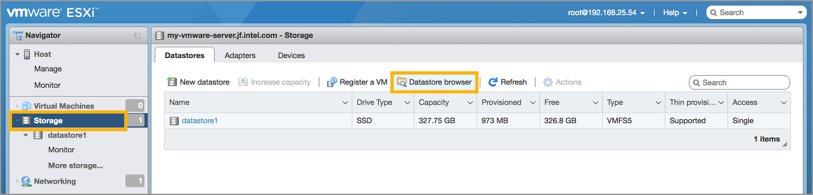
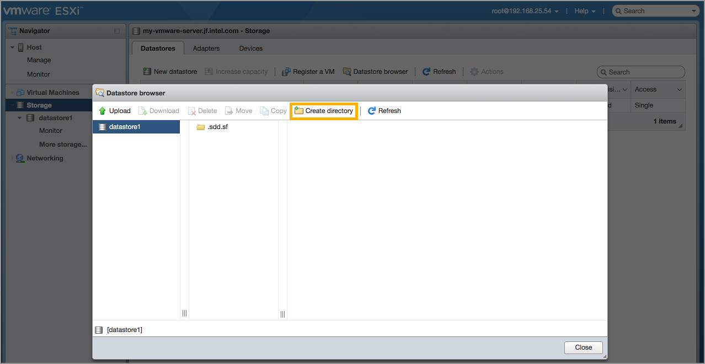
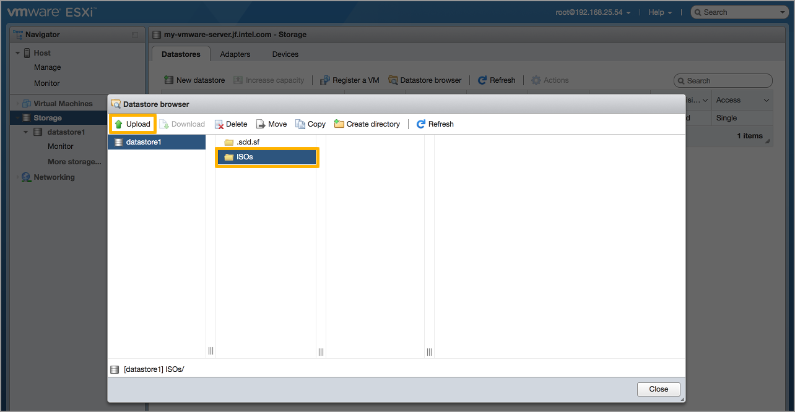
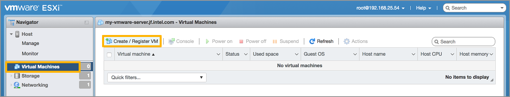
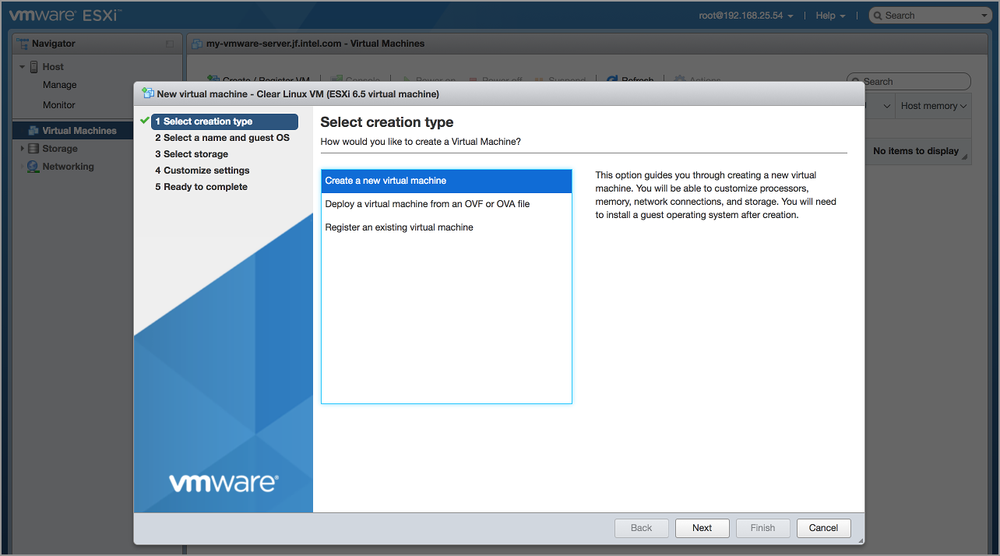
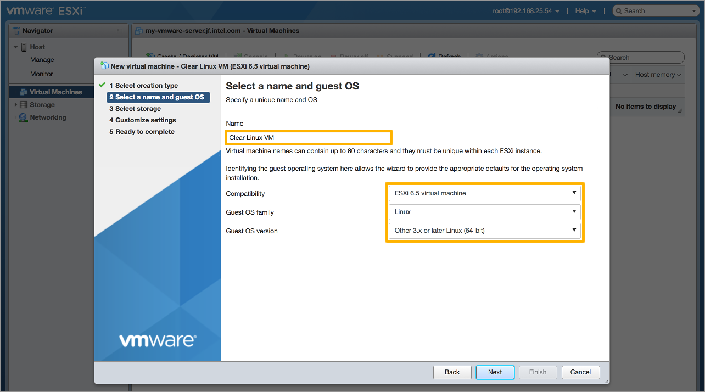
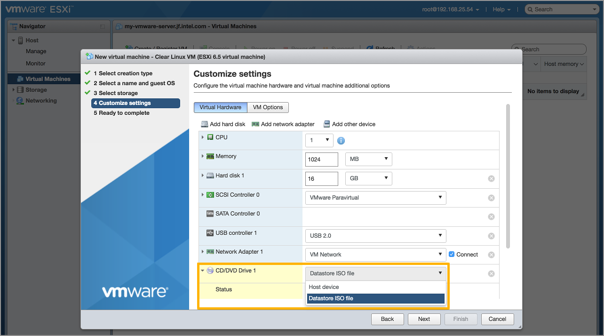
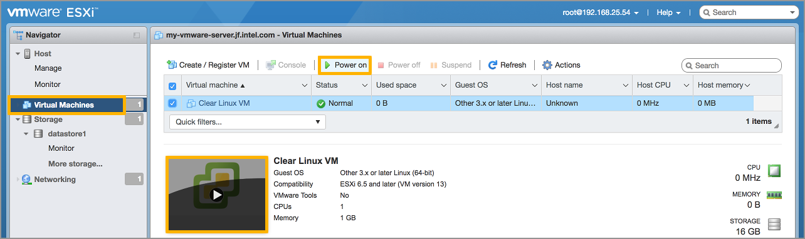
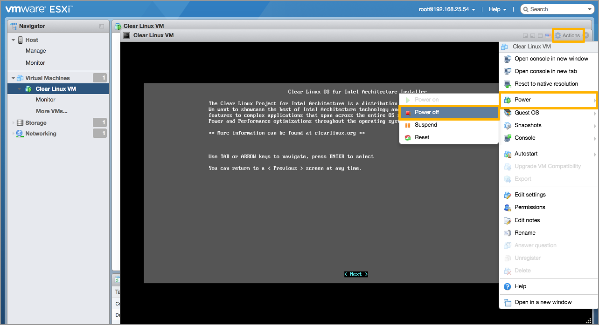
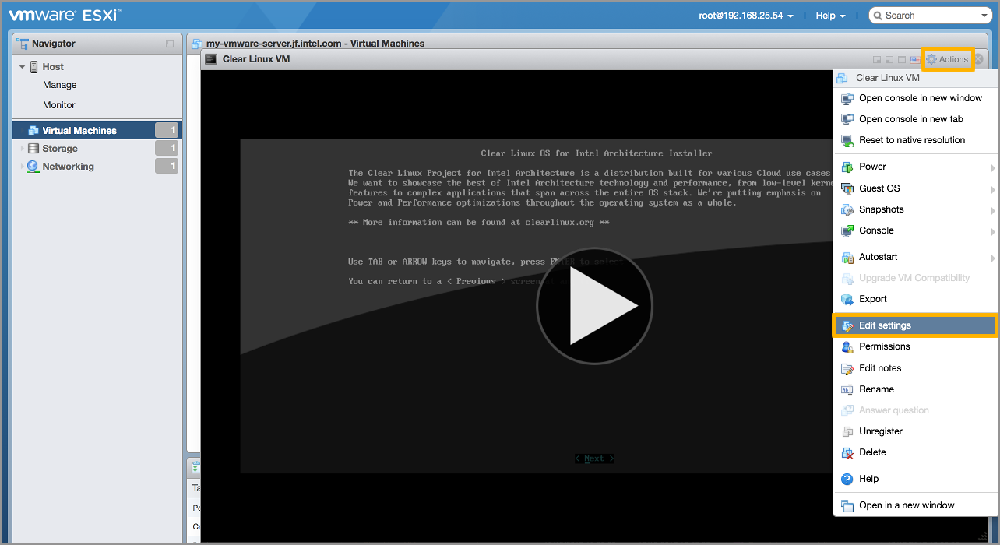
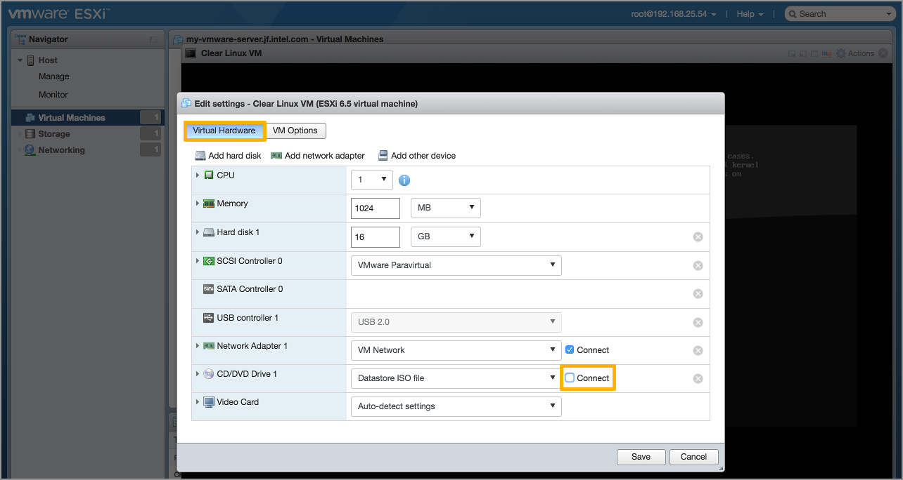
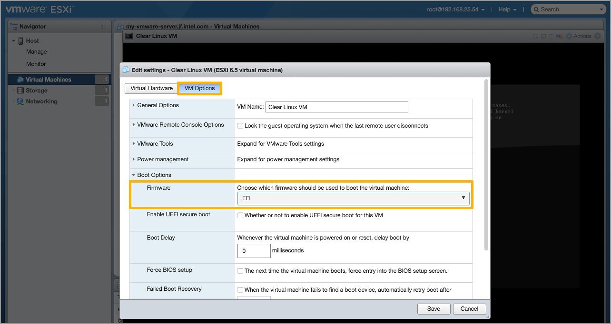
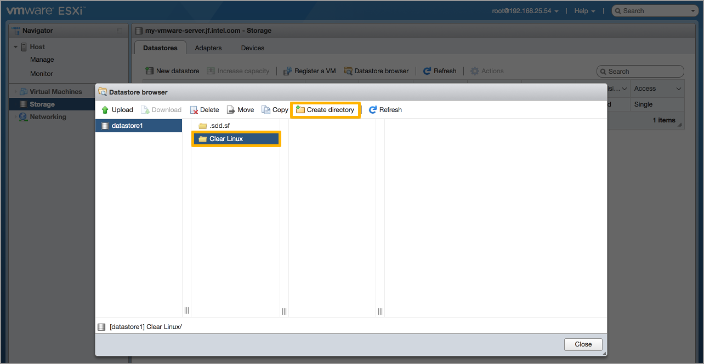
.. |vmware-19| image:: figures/vmware-figure-19.png
.. |vmware-20| image:: figures/vmware-figure-20.png
.. |vmware-21| image:: figures/vmware-figure-21.png