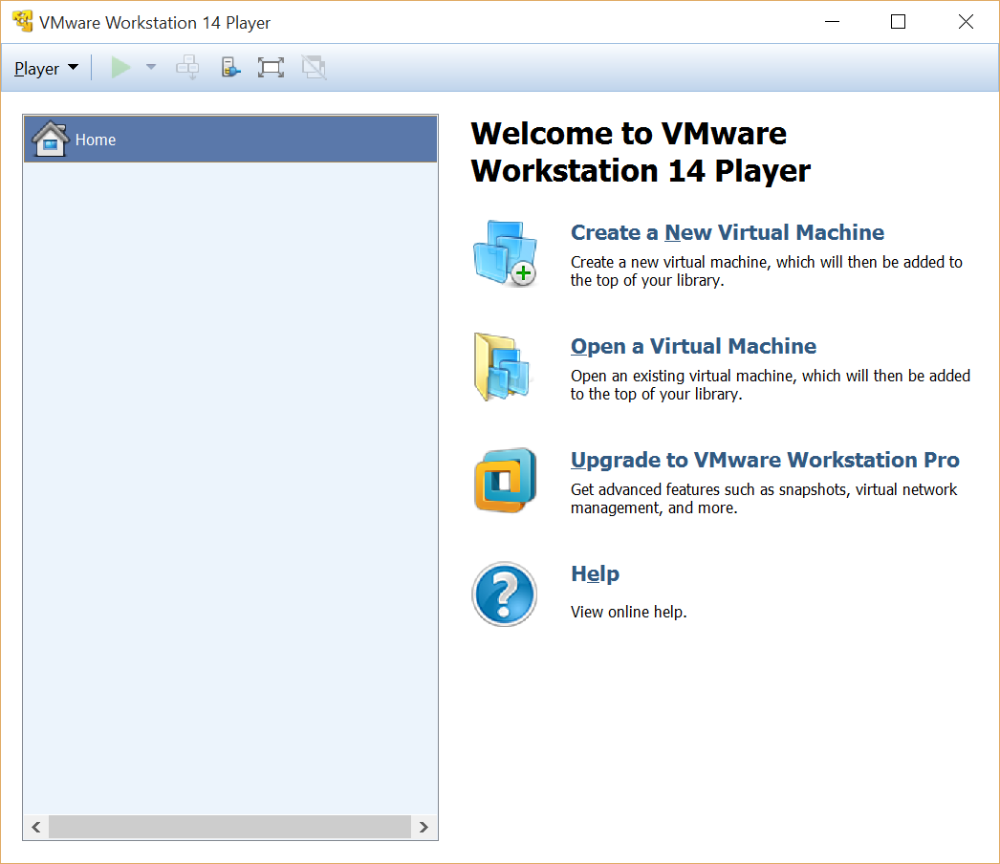
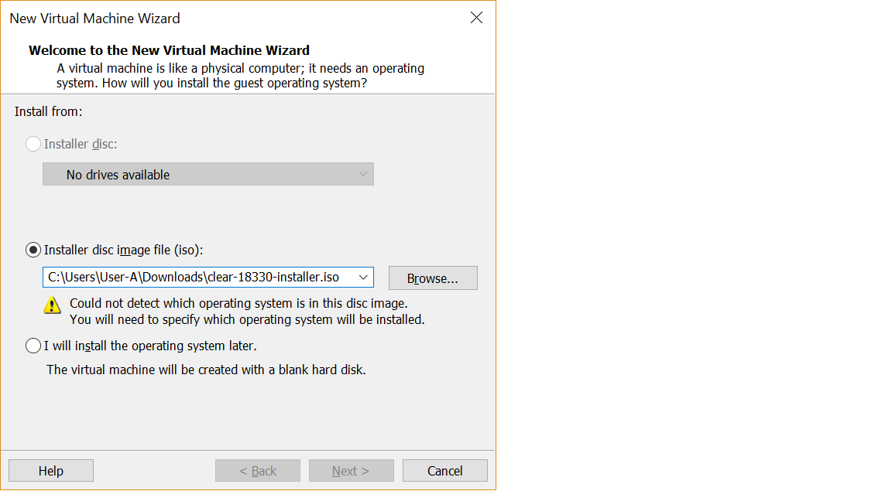
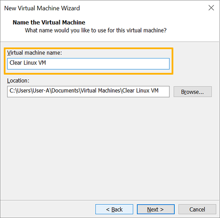
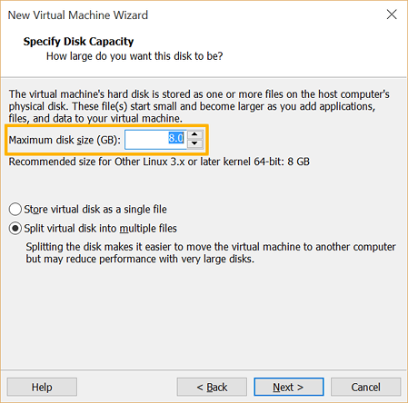
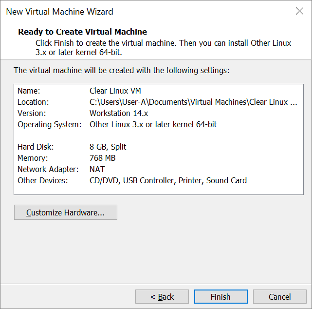
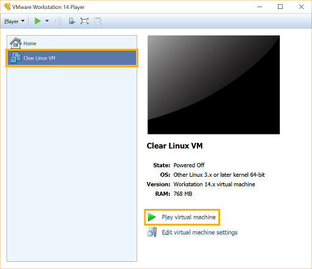
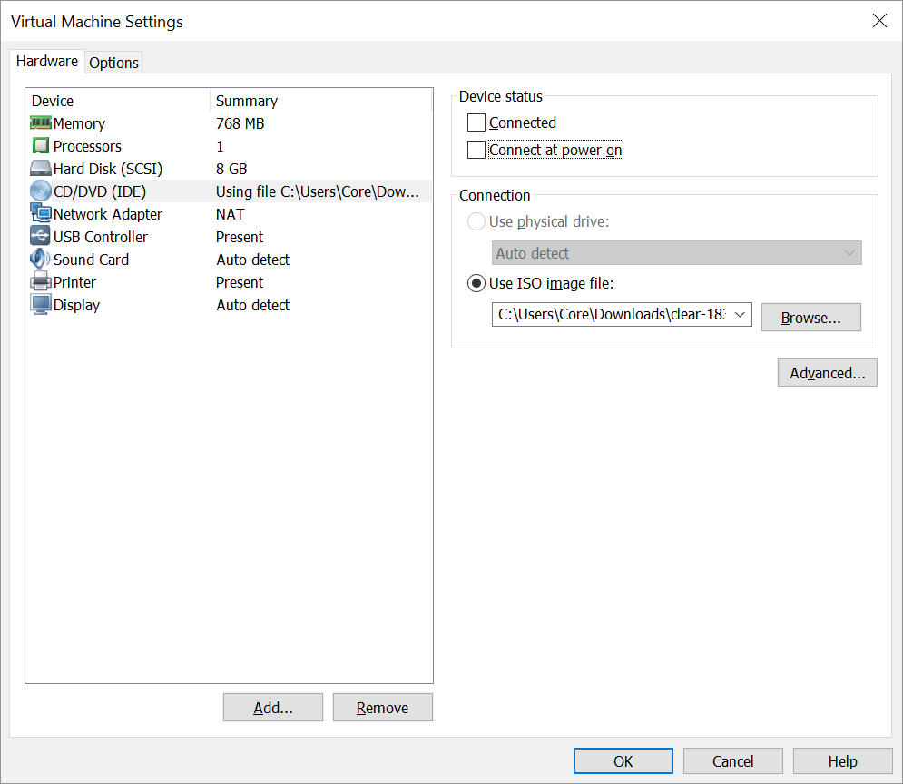

.. _vmware-player:

Use VMware\* Workstation Player
###############################

This section explains how to run |CLOSIA| using the 
`VMware Workstation 14 Player`_ hypervisor.

There are 2 ways to create a |CL| VM to run in VMware:

#.  Fresh installation of |CL| into new VM.  This provides flexibility 
    in configuring the VM size, partitions, and initial |CL| bundles selection.
#.  Use a ready-made VMWare |CL| image.  

Both methods are discussed below.

Install VMware Workstation Player
=================================

VMware Workstation 14 Player is available for Windows and Linux.  Download and
install the preferred version.  

Enable `Intel® Virtualization Technology
<http://www.intel.com/content/www/us/en/virtualization/virtualization-technology/intel-virtualization-technology.html>`_
(Intel® VT) and `Intel® Virtualization Technology for Directed I/O
<https://software.intel.com/en-us/articles/intel-virtualization-technology-for-directed-io-vt-d-enhancing-intel-platforms-for-efficient-virtualization-of-io-devices>`_
(Intel® VT-d) on the host system's BIOS/UEFI firmware configuration.

* For Linux distros: 

  .. code-block:: console

    $ sudo bash ./VMware-Player-<version>.x86_64.bundle

* Player on Windows:

  - Start the installer and follow the Setup Wizard.

Download the latest |CL| image
==============================

#.  Go to the |CL| `image`_ repository and download the desired type:

  * ISO installer image: `clear-<version>-installer.iso.xz` (for Method 1)
  * VMWare image: `clear-<version>-vmware.img.xz` (for Method 2)

  For older versions, see the `releases`_ page.

#.  Although not required, it is recommended to download the corresponding 
    checksum file (designated with `-SHA512SUMS` at the end of the filename) 
    for the image in order to verify its integrity.

Verify the integrity of the download (recommended)
==================================================

* For Linux distros and macOS:

  #.  Start a terminal emulator.
  #.  Go to the directory with the downloaded files.
  #.  To verify the integrity of the image, enter the following (an installer '
      image is used as an example):

      .. code-block:: console

        $ sha512sum ./clear-<version>-installer.iso.xz | diff ./clear-<version>-installer.iso.xz-SHA512SUMS -

      If the checksum of the downloaded image is different than the original
      checksum, the differences will displayed. An empty output indicates a match.

* For Windows:

  #.  Start Command-Prompt.
  #.  Go to the directory with the downloaded files.
  #.  To verify the integrity of the image, enter the following commands:

      .. code-block:: console

        C:\> CertUtil -hashfile ./clear-<version>-installer.iso.xz | findstr -v file

      Compare the output with the original checksum to make sure they match.

Uncompress the image
====================

* For Linux distros (an ISO installer image is used as an example):

  .. code-block:: console

    $ unxz clear-<version>-installer.iso.xz

* For macOS:

  .. code-block:: console

    $ gunzip clear-<version>-installer.iso.xz

* For Windows:

  Use `7zip`_ to uncompress it.

Method 1: Fresh installation of |CL| into a new VM 
==================================================

The general process for performing a fresh installation of Clear into a new VM 
is as follows (with expanded details below):

* Create a new VM and configure it
* Attach the installer ISO to it
* Install |CL|
* Detach the installer ISO
* Change the boot option from BIOS to EFI
* Boot the VM

Create and configure a new VM 
*****************************

#.  Start the VMware Workstation Player app.
#.  On the home screen, click `Create a New Virtual Machine`.

    |vmware-player-01|

    Figure 1: VMware Workstation 14 Player - Create a new virtual machine
   
#.  On the `Welcome to the New Virtual Machine Wizard` step, select `Installer 
    disc image file (iso)`.
#.  Click `Browse` and select the uncompressed |CL| installer ISO. 

    |vmware-player-02|

    Figure 2: VMware Workstation 14 Player - Select |CL| installer ISO
   
    * Click `Next`.

#.  On the `Select a Guest Operating System` step:

    * Set `Guest operating system` to `Linux`.
    * Set `Version` to `Other Linux 3.x or later kernel 64-bit`

    |vmware-player-03|

    Figure 3: VMware Workstation 14 Player - Select guest operating system type

    * Click `Next`.

#.  On the `Name the Virtual Machine` step, give it a name.

    |vmware-player-04|

    Figure 4: VMware Workstation 14 Player - Name virtual machine

    * Click `Next`.

#.  On the `Specify Disk Capacity` step, set the desired size.

    |vmware-player-05|

    Figure 5: VMware Workstation 14 Player - Set disk capacity

    * Click `Next`.

#.  On the `Ready to Create Virtual Machine` step, review the settings.

    |vmware-player-06|

    Figure 6: VMware Workstation 14 Player - Review settings

#.  Click `Customize Hardware...` > `Processors` > `Virtualization engine` and 
    check `Virtualize Intel VT-x/EPT or AMD-V/RVI`

    |vmware-player-07|

    Figure 7: VMware Workstation 14 Player - Set virtualization engine option

    * Click `Close`.

    * Click `Finish`.

Install |CL| into the new VM
****************************

#.  Select the newly created VM and click `Play virtual machine`.  

    |vmware-player-08|

    Figure 8: VMware Workstation 14 Player - Power on virtual machine

#.  Follow the :ref:`bare-metal-install` guide to complete the installation of 
    |CL|.
#.  After the installation is complete, reboot it.  This will restart the 
    installer again.  

Reconfigure the VM settings to boot the newly installed |CL|
************************************************************

#.  Click `Actions` (top-right corner) and go to `Power` and select `Power off`.  

    |vmware-09|

    Figure 9: VMWare ESXi - Actions > Power off

#.  Click `Actions` again and select `Edit settings`.  

    |vmware-10|

    Figure 10: VMWare ESXi - Actions > Edit settings

#.  Under `Virtual Hardware` > `CD/DVD Drive 1`, uncheck `Connect`. 

    |vmware-11|

    Figure 11: VMWare ESXi - Disconnect CD/DVD drive

#.  Under `VM Options` > `Boot Options` > `Firmware`, select `EFI`.

    |vmware-12|

    Figure 12: VMWare ESXi - Set boot firmware to EFI

#.  Click `Save`.
#.  Power up the VM again.   

Prepare Image
=============

#. Download the `latest`_ |CL| **live** version (clear-XXXX-live.img.xz)

#. Decompress the downloaded image. Uncompressed image size is ~ **5GB**.

   + On Linux ::

       $ xz -d clear-XXXX-live.img.xz

   + On Windows you can use `7zip`_.

     - Right-click the file to *extract in the same directory*.

       .. image:: ./figures/7zipwin.png
          :alt: 7zip extract here command

#. Convert the installer to :abbr:`VMDK (Virtual Machine Disk)` format.

   * On Linux, you can use ``qemu-img convert``::

      $ qemu-img convert -O vmdk clear-VERSION-live.img clear.vmdk

   * On Windows, you can convert the live image to VMDK format
     (from RAW format to VMDK) with a tool like *VBoxManage* from
     `VirtualBox`_. You can refer on
     :ref:`how to create a VM on VirtualBox <create_vm_vbox>` as example.

Run using VMware Player
=======================

Create a new virtual machine by following the next steps.

#. Launch **VMWare Workstation Player**.

#. On main window click on “Create a new Virtual Machine”.

   * Select “**I will install the operating system later**”, and click on
     “Next”.
   * Select “**Linux**” as “Guest operating system” and version **Other Linux
     3.x kernel 64-bit**.
   * Type a name for the new virtual machine.
   * Perform the *remaining steps* using the default options.

#. Change boot type to EFI.  You must change the VMware virtual machine
   *configuration* to **Support EFI firmware**; you can do this by editing
   the configuration ``.vmx`` file located in the virtual machine folder and
   adding the following line::

     firmware = "efi"

#. Attach the prepared image as SATA disk.  And when you have a new virtual
   machine, edit its configuration as follows:

   * Click on “Edit virtual machine settings”.
   * Remove any default attached hard disk.
   * Click on “Add” option below devices list tab and choose Hard disk.

     * Choose **SATA** as the virtual disk type.
     * Use the existing Clear Linux OS for Intel Architecture virtual disk

     The live disk must be set as ``SATA 0:1 Hard Disk (SATA)``; you can
     verify this under the “Advanced" section of the disk settings.

Start the virtual machine
=========================

After configuring the settings above, start the virtual machine.

.. _VMware Workstation 14 Player: https://www.vmware.com/products/workstation-player.html
.. _latest: https://download.clearlinux.org/image/
.. _7zip: http://www.7-zip.org/
.. _VirtualBox: https://www.virtualbox.org/
.. _image: https://download.clearlinux.org/image
.. _releases: https://download.clearlinux.org/releases

.. |vmware-player-03| image:: figures/vmware-player/vmware-player-3.png

.. |vmware-player-07| image:: figures/vmware-player/vmware-player-7.png

.. |vmware-player-09| image:: figures/vmware-player/vmware-player-9.png
