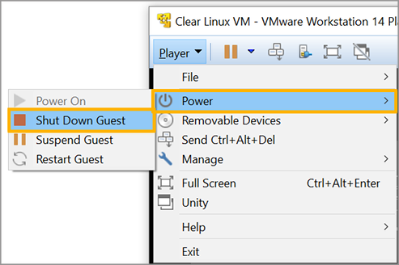
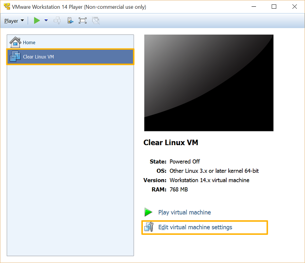

.. _vmware-player:

Use VMware\* Workstation Player
###############################

This section explains how to run |CLOSIA| as a virtual machine using the 
`VMware Workstation 14 Player`_ hypervisor.

There are 2 ways to create a |CL| VM to run in VMware:

* `Method #1`: Fresh installation of |CL| into new VM.  This provides flexibility 
  in configuring the VM size, partitions, initial |CL| bundles selection, etc.
* `Method #2`: Use a ready-made VMware |CL| image with minimally required bundles.  

Both are discussed below.  

.. note::

  The figures shown throughout this document are from the Windows version of 
  VMware Workstation 14 Player.  They are applicable for the Linux version as
  well (with minor differences).

Install the VMware Workstation Player hypervisor
================================================

#.  Enable `Intel® Virtualization Technology
    <http://www.intel.com/content/www/us/en/virtualization/virtualization-technology/intel-virtualization-technology.html>`_
    (Intel® VT) and `Intel® Virtualization Technology for Directed I/O
    <https://software.intel.com/en-us/articles/intel-virtualization-technology-for-directed-io-vt-d-enhancing-intel-platforms-for-efficient-virtualization-of-io-devices>`_
    (Intel® VT-d) on the host system's BIOS/UEFI firmware configuration.
#.  VMware Workstation 14 Player is available for Windows and Linux.  Download 
    the preferred version of choice.
#.  Install it.

    * For Linux distros: 

      #.  Enable a GUI desktop.  
      #.  Start a terminal emulator.
      #.  Start the installer and follow the guided steps.

        .. code-block:: console

          $ sudo sh ./VMware-Player-<version>.x86_64.bundle

    * For Windows:

      #.  Start the installer and follow the Setup Wizard.

For additional help, see the `VMware Workstation Player guide`_.

Download the latest |CL| image
==============================

Go to the |CL| `image`_ repository and download the desired type:

* ISO installer image: `clear-<version>-installer.iso.xz` (for Method 1)
* VMware image: `clear-<version>-vmware.vmdk.xz` (for Method 2)

For older versions, see the `releases`_ page.

Although not required, it is recommended to download the corresponding 
checksum file (designated with `-SHA512SUMS` at the end of the filename) 
for the image in order to verify its integrity.

Verify the integrity of the download (recommended)
==================================================

* For Linux distros:

  #.  Start a terminal emulator.
  #.  Go to the directory with the downloaded files.
  #.  To verify the integrity of the image, enter the following (an installer ISO
      image is used as an example):

      .. code-block:: console

        $ sha512sum ./clear-<version>-installer.iso.xz | diff ./clear-<version>-installer.iso.xz-SHA512SUMS -

      If the checksum of the downloaded image is different than the original
      checksum, the differences will displayed. An empty output indicates a match.

* For Windows:

  #.  Start Command-Prompt.
  #.  Go to the directory with the downloaded files.
  #.  To verify the integrity of the image, enter the following commands:

      .. code-block:: console

        C:\> CertUtil -hashfile ./clear-<version>-installer.iso.xz | findstr -v file

      Compare the output with the original checksum to make sure they match.

Uncompress the image
====================

* For Linux distros (an installer ISO image is used as an example):

  .. code-block:: console

    $ unxz clear-<version>-installer.iso.xz

* For Windows:

  Use `7zip`_ to uncompress it.

Method 1: Fresh installation of |CL| into a new VM 
==================================================

The general process for performing a fresh installation of |CL| into a new VM 
is as follows (with expanded details below):

* Create a new VM and configure its settings
* Attach the installer ISO to it
* Install |CL|
* Detach the installer ISO
* Power off the VM
* Enable EFI boot support
* Power on the VM

Create and configure a new VM 
*****************************

#.  Start the `VMware Workstation Player` app.
#.  On the home screen:

    * Click `Create a New Virtual Machine`.

      |vmware-player-01|

      Figure 1: VMware Workstation 14 Player - Create a new virtual machine
   
#.  On the `Welcome to the New Virtual Machine Wizard` step:

    * Select `Installer disc image file (iso)`.
    * Click `Browse` and select the uncompressed |CL| installer ISO. 
    * Click `Next`.

      |vmware-player-02|

      Figure 2: VMware Workstation 14 Player - Select |CL| installer ISO   

#.  On the `Select a Guest Operating System` step:

    * Set `Guest operating system` to `Linux`.
    * Set `Version` to `Other Linux 3.x or later kernel 64-bit`.
    * Click `Next`.

      |vmware-player-03|

      Figure 3: VMware Workstation 14 Player - Select guest operating system type

#.  On the `Name the Virtual Machine` step:

    * Give it a name.
    * Click `Next`.

      |vmware-player-04|

      Figure 4: VMware Workstation 14 Player - Name virtual machine

#.  On the `Specify Disk Capacity` step:

    * Set the desired disk size.
    * Click `Next`.

      |vmware-player-05|

      Figure 5: VMware Workstation 14 Player - Set disk capacity

#.  On the `Ready to Create Virtual Machine` step:

    * Click `Customize Hardware...`
    
      |vmware-player-06|

      Figure 6: VMware Workstation 14 Player - Review settings

    * Select `Processors` > `Virtualization engine` and 
      check `Virtualize Intel VT-x/EPT or AMD-V/RVI`.

      |vmware-player-07|

      Figure 7: VMware Workstation 14 Player - Set virtualization engine option

    * Click `Close`.

    * Click `Finish`.

Install |CL| into the new VM
****************************

#.  Select the newly created VM and click `Play virtual machine`.  

    |vmware-player-08|

    Figure 8: VMware Workstation 14 Player - Power on virtual machine

#.  Follow the :ref:`bare-metal-install` (starting at the `Install Clear Linux 
    on your target system` section) guide to complete the installation of 
    |CL|.

#.  After the installation is complete, follow the |CL| instruction to reboot it.  
    This will restart the installer again.  Follow the next section.  

Reconfigure the VM settings to boot the newly installed |CL|
************************************************************

#.  Enable the mouse pointer.

    - Press `<CTRL>` + `<ALT>` to enable the mouse pointer.

#.  Disconnect the CD/DVD to stop it from booting the installer ISO again.
    
    * Click `Player`.
    * Go to `Removable Devices` > `CD/DVD (IDE)` > `Settings`.

      |vmware-player-09|

      Figure 9: VMware Workstation 14 Player - Edit CD/DVD settings

    * Under `Device status`, uncheck `Connected` and `Connect at power on`.
    * Click `OK`.

      |vmware-player-10|

      Figure 10: VMware Workstation 14 Player - Disconnect CD/DVD

#.  Power off the VM.

    * Click `Player`.
    * Go to `Power` and select `Shut Down Guest`.

      |vmware-player-11|

      Figure 11: VMware Workstation 14 Player - Power off virtual machine

Enable UEFI boot support
************************

|CL| needs UEFI support in order to boot.  Enable it by appending the following 
the end of the VM's `.vmx` file (located in the directory where the VM resides
see Note below):

  .. code-block:: console

    firmware = "efi"

.. note::

  VMware VM files are typically located in:

  * Linux distros: `/home/username/vmware`
  * Windows: `C:/\Users/\username/\Documents/\Virtual Machines`

Power on the virtual machine
****************************

After configuring the settings above, power on the virtual machine.  

Method 2: Boot a ready-made VMware |CL| image
=============================================

The general process for booting a ready-made VMware |CL| image is as follows 
(with expanded details below):

* Create a new VM and configure its base settings
* Attach the ready-made VMware |CL| image
* Enable EFI boot support
* Power on the VM

Create a new VM and configure its base settings
***********************************************

#.  Start the `VMware Workstation Player` app.
#.  On the home screen:

    * Click `Create a New Virtual Machine`.

      |vmware-player-01|

      Figure 12: VMware Workstation 14 Player - Create a new virtual machine
   
#.  On the `Welcome to the New Virtual Machine Wizard` step:

    * Select `I will install the operating system later`.
    * Click `Next`.

      |vmware-player-13|

      Figure 13: VMware Workstation 14 Player - Select install operating system 
      later  

#.  On the `Select a Guest Operating System` step:

    * Set `Guest operating system` to `Linux`.
    * Set `Version` to `Other Linux 3.x or later kernel 64-bit`.
    * Click `Next`.

      |vmware-player-03|

      Figure 14: VMware Workstation 14 Player - Select guest operating system type

#.  On the `Name the Virtual Machine` step:

    * Give it a name.
    * Click `Next`.

      |vmware-player-04|

      Figure 15: VMware Workstation 14 Player - Name virtual machine

#.  On the `Specify Disk Capacity` step:

    * Click `Next`.

      |vmware-player-16|

      Figure 16: VMware Workstation 14 Player - Set disk capacity

#.  On the `Ready to Create Virtual Machine` step:

    * Click `Finish`.
    
      |vmware-player-17|

      Figure 17: VMware Workstation 14 Player - Review settings

Attach the ready-made VMware |CL| image
***************************************

#.  Move or copy the ready-made VMware |CL| image file (i.e. `clear-<version>-vmware.vmdk`)
    to the directory where the newly created VM resides.

    .. note::

      VMware VM files are typically located in:

      * Linux distros: `/home/username/vmware`
      * Windows: `C:/\Users/\username/\Documents/\Virtual Machines`

#.  On the `VMware Workstation Player` home screen:

    * Select the newly created VM.
    * Click `Edit virtual machine settings`.  

      |vmware-player-18|

      Figure 18: VMware Workstation 14 Player - Edit virtual machine settings

#.  Disconnect the CD/DVD (IDE):

    * Select `CD/DVD (IDE)` and under `Device status`, uncheck `Connect at 
      power on`. 

      |vmware-player-19|

      Figure 19: VMware Workstation 14 Player - Disconnect CD/DVD (IDE)

#.  Remove the default hard drive:

    * Under `Device status`, select `Hard Disk (SCSI)`.
    * Click `Remove`.

      |vmware-player-20|

      Figure 20: VMware Workstation 14 Player - Remove hard drive

#.  Add a new hard drive and attach the ready-made VMware |CL| image:

    * Click `Add`.
    * Under `Hardware types`, select `Hard Disk`.
    * Click `Next`.

      |vmware-player-21|

      Figure 21: VMware Workstation 14 Player - Add new hard drive

    * Select the preferred `Virtual disk type`.

      |vmware-player-22|

      Figure 22: VMware Workstation 14 Player - Select virtual disk type

    * Select `Use an existing virtual disk`.
 
      |vmware-player-23|

      Figure 23: VMware Workstation 14 Player - Use existing virtual disk
   
    * Click `Browse` and select the ready-made VMware |CL| image file.

      |vmware-player-24|

      Figure 24: VMware Workstation 14 Player - Select ready-made VMware |CL| 
      image file

    * Click `Finish`.

      .. note::
          When asked to convert the disk image, either option works. 

Enable UEFI boot support
************************

|CL| needs UEFI support in order to boot.  Enable it by appending the following 
the end of the VM's `.vmx` file (located in the directory where the VM resides
see Note below):

  .. code-block:: console

    firmware = "efi"

.. note::

  VMware VM files are typically located in:

  * Linux distros: `/home/username/vmware`
  * Windows: `C:/\Users/\username/\Documents/\Virtual Machines`

Power on the virtual machine
****************************

After configuring the settings above, power on the virtual machine.  

Also see:

   * :ref:`vmware-esxi`

.. _VMware Workstation 14 Player: https://www.vmware.com/products/workstation-player.html
.. _VMware Workstation Player guide: https://docs.vmware.com/en/VMware-Workstation-Player/index.html
.. _latest: https://download.clearlinux.org/image/
.. _7zip: http://www.7-zip.org/
.. _VirtualBox: https://www.virtualbox.org/
.. _image: https://download.clearlinux.org/image
.. _releases: https://download.clearlinux.org/releases

.. |vmware-player-01| image:: figures/vmware-player/vmware-player-1.png
.. |vmware-player-02| image:: figures/vmware-player/vmware-player-2.png
.. |vmware-player-03| image:: figures/vmware-player/vmware-player-3.png
.. |vmware-player-04| image:: figures/vmware-player/vmware-player-4.png
.. |vmware-player-05| image:: figures/vmware-player/vmware-player-5.png
.. |vmware-player-06| image:: figures/vmware-player/vmware-player-6.png
.. |vmware-player-07| image:: figures/vmware-player/vmware-player-7.png
.. |vmware-player-08| image:: figures/vmware-player/vmware-player-8.png
.. |vmware-player-09| image:: figures/vmware-player/vmware-player-9.png
.. |vmware-player-10| image:: figures/vmware-player/vmware-player-10.png

.. |vmware-player-13| image:: figures/vmware-player/vmware-player-13.png
.. |vmware-player-16| image:: figures/vmware-player/vmware-player-16.png

.. |vmware-player-18| image:: figures/vmware-player/vmware-player-18.png

.. |vmware-player-20| image:: figures/vmware-player/vmware-player-20.png
.. |vmware-player-21| image:: figures/vmware-player/vmware-player-21.png
.. |vmware-player-22| image:: figures/vmware-player/vmware-player-22.png
.. |vmware-player-23| image:: figures/vmware-player/vmware-player-23.png
.. |vmware-player-24| image:: figures/vmware-player/vmware-player-24.png