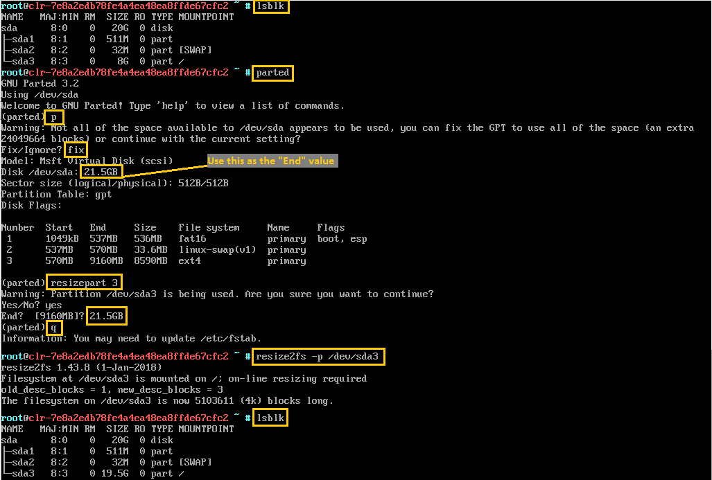

.. _increase-virtual-disk-size:

Increase Clear Linux image virtual disk size
############################################

Prebuilt |CLOSIA| images come in different sizes, ranging from 300 MB to 20
GB. This guide describes how to increase the size of your prebuilt |CL| image
if you need more capacity.

Determine the prebuilt image size
*********************************

There are two methods to find the virtual disk size of your prebuilt |CL|
image.

The first method is to check the config.JSON file of the image, located in the
`releases`_ repository. For example, to find the size of the Hyper-V\* image
version number 20450, follow these steps:

#.	Go to the `releases`_ repository.
#.	Drill down into the `20450 > clear > config > image` directory.
#.	Open the :file:`hyperv-config.json` file.
#.	Locate the `PartitionLayout` key.
	The example shows 512 MB for the EFI partition, 32 MB for the swap
	partition, and 8 GB for the root partition.

	.. code-block:: console

	   "PartitionLayout" : [ { "disk" : "hyperv.img",
	                            "partition" : 1,
	                            "size" : "512M",
	                            "type" : "EFI" },
	                          { "disk" : "hyperv.img",
	                            "partition" : 2,
	                            "size" : "32M",
	                            "type" : "swap" },
	                          { "disk" : "hyperv.img",
	                            "partition" : 3,
	                            "size" : "8G",
	                            "type" : "linux" } ],

The second method is to boot up your :abbr:`VM (Virtual Machine)` and
execute the :command:`lsblk` command as shown below:

.. code-block:: bash

	sudo lsblk

An example output: 

.. code-block:: console

	NAME   MAJ:MIN RM   SIZE RO TYPE MOUNTPOINT
	sda      8:0   0    8.5G  0 disk
	├─sdd1   8:1   0    512M  0 part
	├─sdd2   8:2   0     32M  0 part [SWAP]
	└─sdd3   8:3   0      8G  0 part /

In this example, both methods show the prebuilt Hyper-V image is about 8.5 GB.

Increase virtual disk size
**************************

To increase the virtual disk size for a prebuilt image, perform the steps below:

#.	Shut down your VM if it is running.
#.	Use an appropriate hypervisor tool to increase the virtual disk size of
	your VM.
#.	Power up the VM.
#. 	Log in to an account with root privileges.
#.	Open a terminal emulator.
#.	Add the |CL| `storage-utils` bundle to install the `parted` and
	`resize2fs` tools.

	.. code-block:: bash

		sudo swupd bundle-add storage-utils

#.	Launch the `parted` tool.

	.. code-block:: bash

		sudo parted

#.	In the `parted` tool, perform these steps:

	#.	Press :command:`p` to print the partitions table.
	#.	If the warning message below is displayed, enter :command:`Fix`.

		.. code-block:: console

			Warning: Not all of the space available to /dev/sda appears to be
			used, you can fix the GPT to use all of the space (an extra ...
			blocks) or continue with the current setting?

			Fix/Ignore?

	#.	Enter :command:`resizepart [partition number]` where
		*[partition number]* is the partition number to modify.
	#.	Enter :command:`yes` when prompted.
	#.	Enter the new `End` size.

		.. note::

			If you want a partition to take up the remaining disk space, then
			enter the total size of the disk. When you print the partitions
			table with the :command:`p` command, the total disk size is shown
			after the `Disk` label.

	#.	Enter :command:`q` to exit `parted` when you are finished resizing the
		image.

#.	Enter :command:`sudo resize2fs -p /dev/[modified partition name]` where
	*[modified partition name]* is the partition that was changed in `parted`.

Figure 1 shows how to increase the size of a |CL| Hyper-V image from 8.5
GB to 20 GB. Before the steps shown in Figure 1, we used the Hyper-V Manager
to increase the VM virtual disk size from 8.5 GB to 20 GB.

	Figure 1: Increase root partition size example.

.. _releases: https://download.clearlinux.org/releases/
