.. _multi-boot:

Multi-boot Clear Linux with other operating systems
###################################################

Starting with version 16140, |CLOSIA| uses the Systemd-Boot boot loader,
which does not support multi-booting without manual manipulation. This
document shows how to modify the boot loader for |CL| to work with other
operating systems.

The general process to install other operating systems for a
multi-booting computer is as follows:

#. Install |CL| first with a EFI partition large enough to store the kernels
   of other operating systems and their initrds in the case of Linux\*
   distributions.

#. Install the next operating system without creating its own EFI
   partition.

#. Boot into the newly installed operating system.

#. For Linux distributions, copy its kernel and `initrd` to the |CL| EFI
   partition. This step is not needed for Windows\*.

#. Add an entry for the newly installed operating system in the
   Systemd-Boot menu.

#. Make Systemd-Boot the default boot loader.

#. Repeat the previous steps for each additional operating system. Always
   install |CL| first. Install other operating systems in any order.

.. note::
   This process is not guaranteed to work with all Linux distributions and
   all their versions.

The following operating systems were tested on an Intel® NUC6i7KYK with 32GB
RAM and a 360GB SSD. Table 1 lists the information specific to the
installation of the tested operating systems.

.. csv-table:: Table 1: OS specific installation information
   :header: # , OS, Version, Partition Size [1], Swap Size [2], EFI Partition Size [3], Download Link

   1,Clear Linux,16140,50GB,8GB,1GB,https://download.clearlinux.org/image/clear-15870-installer.img.xz
   2,Windows ,Server 2016,50GB,N/A,Shared with #1,From Microsoft
   3,RedHat,Server 7.4 Beta,45GB,Shared with #1,Shared with #1,From RedHat
   4,SUSE,Server 12 SP2,45GB,Shared with #1,Shared with #1,From SUSE
   5,Ubuntu,16.04.02 LTS Desktop,40GB,Shared with #1,Shared with #1,https://www.ubuntu.com/download/desktop
   6,Mint,18.1 ?Serena? MATE,40GB,Shared with #1,Shared with #1,https://linuxmint.com/edition.php?id=228

.. [#] Configure the partition size as desired.

.. [#] To save disk space, a single swap partition can be shared among
   multiple Linux installations. Swap size was determined using these
   `recommended swap partition sizes`_.

.. [#] This partition will hold the |CL| and other operating
   systems’ kernel and boot information. The partition size is dependent on
   the number of operating systems that will be installed. In general,
   allocate about 100MB per operating system. For this demonstration, we used
   1GB.

.. note::
   Updating any installed operating systems will likely result
   in the |CL| Systemd-Boot no longer being the default
   boot loader. To restore it, see :ref:`recover-cl-bl`.

.. note::
   Updating any Linux installation may result in changes of their kernels or
   initrds. Keep their corresponding Systemd-Boot
   :file:`/boot/efi/loader/entries/*.conf` files up-to-update.

Install the Clear Linux OS
**************************

#. Create a bootable USB drive of the |CL| installer using one of the methods
   below.

   * :ref:`bootable-usb-linux`
   * :ref:`bootable-usb-mac`
   * :ref:`bootable-usb-windows`

#. Start the |CL| installer and follow the prompts.

#. On the *Choose Installation Type* screen, choose *Manual (Advanced)*,
   as shown in Figure 1.

   |multi-boot-01|

   Figure 1: |CL| installer: Choose installation type screen

   .. note::
      If you are not familiar with text-based installation
      interfaces, here are some navigation tips:

      * Use the :kbd:`Up Arrow` and :kbd:`Down Arrow` keys to move between
        the options on the screen.

      * Use the :kbd:`Space` to select or highlight an option.

      * Press :kbd:`Enter` to activate the selected option and to move ahead.

#. On the :guilabel:`Choose partitioning method` screen, choose
   :guilabel:`Manually configure mounts and partitions`, as shown in
   Figure 2.

   |multi-boot-02|

   Figure 2: |CL|: Choose partitioning method

#. Select the drive, in this case :file:`/dev/sda` and press :kbd:`Enter` to
   go into the `cgdisk` partitioning tool. See Figure 3.

   |multi-boot-03|

   Figure 3: |CL|: Choose drive to partition

#. Create a new root partition.

   #. Select :guilabel:`New`. See Figure 4.

      .. _multi-boot-04:

      |multi-boot-04|

      Figure 4: |CL|: Create new partition

   #. Accept the default first sector.

   #. Specify the desired size of the partition. For this example, we
      specified *50GB*. See Figure 5.

      |multi-boot-05|

      Figure 5: |CL|: New partition size

   #. Set the partition type to :guilabel:`8300 (Linux filesystem)`. See
      Figure 6.

      |multi-boot-06|

      Figure 6: |CL|: Set partition type

   #. Name the partition :file:`CL-root`. This name makes it easier to
      identify later. See Figure 7.

      |multi-boot-07|

      Figure 7: |CL|: Name partition

#. Create a new swap partition. See Figure 8.

   |multi-boot-08|

   Figure 8: |CL|: Create swap partition

   #. Select the `free space` partition located at the bottom of the column.

   #. Select :guilabel:`New`. See :ref:`Figure 4<multi-boot-04>`.

   #. Accept the default first sector.

   #. Specify the desired size of the swap partition. For this example, we
      used 8GB. See the `recommended swap partition sizes`_ for guidance.

   #. Set the partition type to :guilabel:`8200 (Linux swap)`.

   #. Name the partition :file:`CL-swap`.

#. Create a new EFI partition. See Figure 9.

   |multi-boot-09|

   Figure 9: |CL|: Create EFI partition

   #. In the Partition Type column, select :guilabel:`free space` located at
      the bottom of the column.

   #. Select :guilabel:`New`. See :ref:`Figure 4<multi-boot-04>`.

   #. Accept the default first sector.

   #. Specify the desired size of the partition. For this example, we used
      1024 MB. This partition will hold |CL|, the kernels of the other
      operating systems, and their boot information. Its size depends on the
      number of installed operating systems. In general, allocate about 100MB
      per operating system. For this example, we used 1024 MB.

   #. Set the partition type to :guilabel:`ef00 (EFI partition)`.

   #. Name the partition :file:`CL-EFI`.

#. Select :guilabel:`Write` to apply the new partition table.

#. Select :guilabel:`Quit` to exit the `cgdisk` tool.

#. On the :guilabel:`Set mount points` screen, specify the mount points and
   format settings as shown in Figure 10.

   |multi-boot-10|

   Figure 10: |CL|: Set mount points

#. On the :guilabel:`User configuration` screen, select
   :guilabel:`Create an administrative user`. See Figure 11.

   |multi-boot-11|

   Figure 11: |CL|: User configuration

#. Select :guilabel:`Add user to sudoers?`. See Figure 12.

   |multi-boot-12|

   Figure 12: |CL|: Add user as sudoer

#. Follow the remaining prompts to complete the installation and go through
   the out-of-box-experience of |CL|.

#. Log in.

#. Get root privileges.

   .. code-block:: console

      $ sudo -s

#. Add a timeout period for Systemd-Boot to wait, otherwise it will not
   present the boot menu and will always boot |CL|.

   .. code-block:: console

      # clr-boot-manager set-timeout 20

      # clr-boot-manager update

#. Reboot.

Install Windows\* Server 2016
*****************************

#. Start the Windows installer and follow the prompts.

#. At the :guilabel:`Type of installation` screen, choose
   :guilabel:`Custom: Install Windows only (advanced)`. See Figure 13.

   |multi-boot-13|

   Figure 13: Windows: Choose installation type

#. Select :guilabel:`Unallocated Space` and create a new partition of the
   desired size. In this example, we specified 50000 MB. See Figure 14.

   |multi-boot-14|

   Figure 14: Windows: Create new partition

   .. note::
      Windows normally creates its own EFI partition (100MB) if none exists.
      In this case, it sees the EFI partition created during the |CL|
      installation and won't create its own.

#. Select the newly created partition and follow the remaining prompts
   to complete the installation of Windows. See Figure 15.

   |multi-boot-15|

   Figure 15: Windows: Install on newly created partition

#. Go through the Windows out-of-box-experience process.

#. At this point, the ability to boot |CL| is lost because Windows is the
   default boot loader. See :ref:`recover-cl-bl` to restore the |CL|
   Systemd-Boot boot loader and add Windows to its boot menu.

Install Red Hat\* Enterprise Linux 7.4 Beta
*******************************************

#. Start the Red Hat installer and follow the prompts.

#. At the :guilabel:`INSTALLATION SUMMARY` screen, choose
   :guilabel:`INSTALLATION DESTINATION`. See Figure 16.

   |multi-boot-16|

   Figure 16: Red Hat: Installation summary

#. In the :guilabel:`Device Selection` section, select a drive on which to
   install the OS. See Figure 17.

    |multi-boot-17|

    Figure 17: Red Hat: Installation destination

#. Under the :guilabel:`Other Storage Options` section, choose
   :guilabel:`I will configure partitioning`. See Figure 17.

#. Click :guilabel:`Done`.

#. Under :menuselection:`New Red Hat Enterprise Linux 7.4 Installation --> New mount points will use the following partitioning scheme` section,
   select :menuselection:`Standard Partition` from the drop down list. See
   Figure 18.

    |multi-boot-18|

    Figure 18: Red Hat: New partition scheme

#. Create a new root partition.

   #. Click the :menuselection:`+` button on the lower left corner.

   #. Enter `/` and the new partition size. For this example, we specified 45
      GB. See Figure 19.

      |multi-boot-19|

      Figure 19: Red Hat: Create new root partition

   #. Click :guilabel:`Add mount point`.

#. Share the swap partition that was created by |CL|. See Figure
   20.

   #. Expand :guilabel:`Unknown`.

   #. Select :guilabel:`swap / sda2`.

   #. Select :guilabel:`Reformat`.

   #. Click :guilabel:`Update Settings`.

      |multi-boot-20|

      Figure 20: Red Hat: Configure swap partition

#. Share the EFI partition that was created by |CL|. See Figure
   21.

   #. Expand :guilabel:`Unknown.`

   #. Select :guilabel:`EFI System Partition / sda3`.

   #. Under :guilabel:`Mount Point`, enter `/boot/efi`.

   #. Click :guilabel:`Update Settings`.

      |multi-boot-21|

      Figure 21: Red Hat: Configure EFI partition

#. Click :guilabel:`Done`.

#. Follow the remaining prompts to complete the installation of Red Hat.

#. At this point, the ability to boot |CL| is lost because `Grub`
   was set as the default boot loader. Follow these steps to make the |CL|
   Systemd-Boot the default boot loader and add Red Hat as a boot option:

   #. Boot into Red Hat.

   #. Log in.

   #. Get root privilege with the following command:

      .. code-block:: console

         $ sudo -s

   #. Locate Fedora’s :file:`grub.cfg` file at the
      :file:`/boot/efi/EFI/redhat/` directory and look for the primary Red
      Hat :guilabel:`menuentry` section. The highlighted lines identify
      the kernel and `initrd` filenames, root partition UUID, and
      additional parameters used. This information is used to create a
      new Systemd-Boot entry for Red Hat. See Figure 22.

      |multi-boot-22|

      Figure 22: Red Hat: grub.cfg

   #. Copy the kernel and `initrd` to the EFI partition.

      .. code-block:: console

         # cp /boot/vmlinuz-3.10.0-663.el7.x86_64 /boot/efi

         # cp /boot/initramfs-3.10.0-663.el7.x86_64.img /boot/efi

   #. Create a boot entry for Red Hat. The file must, at a minimum, contain
      these settings:

      +---------+---------------------------------------------------+
      | Setting | Description                                       |
      +=========+===================================================+
      | title   | Text to show in the boot menu                     |
      +---------+---------------------------------------------------+
      | linux   | Linux kernel image                                |
      +---------+---------------------------------------------------+
      | initrd  | initramfs image                                   |
      +---------+---------------------------------------------------+
      | options | Options to pass to the EFI program or kernel boot |
      |         | parameters                                        |
      +---------+---------------------------------------------------+

      See the `systemd boot loader documentation`_ for additional
      details.

      The *options* parameters must specify the root partition UUID and any
      additional parameters that Red Hat requires.

      .. note:: The root partition UUID used below is unique to this example.

         .. code-block:: console

            # cd /boot/efi/loader/entries

            # vi redhat.conf

      Add the following lines to :file:`redhat.conf`

      .. code-block:: console

         title Red Hat Enterprise Linux 7.4 Beta

         linux /vmlinuz-3.10.0-663.el7.x86\_64

         initrd /initramfs-3.10.0-663.el7.x86\_64.img

         options root=UUID=30655c74-6cc1-4c55-8fcc-ac8bddcea4db ro
         crashkernel=auto rhgb LANG=en\_US.UTF-8

   #. Re-install Systemd-Boot to make it the default boot loader.

      .. note::
         This version of Red Hat does not support `bootctl install`. Perform
         the steps in :ref:`recover-cl-bl` instead.

   #. Reboot.

Install SUSE\* Linux Enterprise 12 SP2
**************************************

#. Start the SUSE installer and follow the prompts.

#. At the :guilabel:`Suggested Partitioning` screen, choose
   :guilabel:`Expert Partitioner`. See Figure 23.

   |multi-boot-23|

   Figure 23: SUSE: Suggested partitioning

   **Optional:** Under :guilabel:`Available Storage on Linux` section,
   right-click the SUSE :file:`/home` partition and delete it. In this example, it is :file:`/dev/sda8`. See Figure 24.

   |multi-boot-24|

   Figure 24: SUSE: Delete /home partition

#. Under :guilabel:`Available Storage on Linux` section, right-click the SUSE
   root partition and resize it. In this example, :file:`/dev/sda7` is
   resized to 45 GB. See Figure 25.

   |multi-boot-25|

   Figure 25: SUSE: Resize root partition

#. Click :guilabel:`Accept`.

#. Follow the remaining prompts to complete the installation of SUSE.

#. At this point, |CL| cannot boot because `Grub`
   is the default boot loader. Follow these steps to make the |CL|
   Systemd-Boot the default boot loader and add SUSE as a boot option:

   #. Boot into SUSE.

   #. Log in.

   #. Get root privileges with the following command:

      .. code-block:: console

         $ sudo -s

   #. Locate SUSE’s :file:`grub.cfg` in the :file:`/boot/grub2/` directory
      and look for the primary SUSE :guilabel:`menuentry` section. The
      highlighted lines identify the kernel, the :file:`initrd` filenames,
      the root partition UUID, and the additional parameters used. Use this
      information to create a new Systemd-Boot entry. See Figure 26.

      |multi-boot-26|

      Figure 26: SUSE: grub.cfg

   #. Copy the kernel and the :file:`initrd` file to the EFI partition.

      .. code-block:: console

         # cp /boot/vmlinuz-4.4.21-69-default /boot/efi

         # cp /boot/initrd-4.4.21-69-default /boot/efi

   #. Create a boot entry for SUSE. The file must at least contain these
      settings:

      +---------+---------------------------------------+
      | Setting | Description                           |
      +=========+=======================================+
      | title   | Text to show in the boot menu         |
      +---------+---------------------------------------+
      | linux   | Linux kernel image                    |
      +---------+---------------------------------------+
      | initrd  | initramfs image                       |
      +---------+---------------------------------------+
      | options | Options to pass to the EFI program or |
      |         | kernel boot parameters                |
      +---------+---------------------------------------+

      See the `systemd boot loader documentation`_ for additional
      details.

      The *options* parameter must specify the root partition UUID and
      any additional parameters SUSE requires.

      .. note:: The root partition UUID used below is unique to this example.

         .. code-block:: console

            # cd /boot/efi/loader/entries

            # vi suse.conf

         Add the following lines to the :file:`suse.conf` file:

            .. code-block:: console

               title SUSE Linux Enterprise 12 SP2

               linux /vmlinuz-4.4.21-69-default

               initrd /initrd-4.4.21-69-default

               options root=UUID=b9e25e98-a644-4ac3-b955-ae32800ee350 ro
               resume=/dev/disk/by-uuid/6a50c032-1c1e-4b4a-b799-ca365bb10dc7
               splash=silent showopts crashkernel=109M,high
               crashkernel=72M,low

#. Re-install Systemd-Boot to make it the default boot loader.

   .. code-block:: console

      # bootctl install --path /boot/efi

   .. note::
      If an older version of SUSE does not have the `bootctl` command,
      skip this step and see :ref:`recover-cl-bl` to restore the |CL|
      Systemd-Boot boot loader.

#. Reboot.

Install Ubuntu\* 16.04 LTS Desktop
**********************************

#. Start the Ubuntu installer and follow the prompts.

#. At the :guilabel:`Installation type` screen, choose
   :guilabel:`Something else`. See Figure 27.

   |multi-boot-27|

   Figure 27: Ubuntu: Installation type

#. Create a new root partition.

   #. Under the :guilabel:`Device` column, select :guilabel:`free space`. See
      Figure 28.

      |multi-boot-28|

      Figure 28: Ubuntu: Add partition

   #. Click the :guilabel:`+` button on the lower left corner.

   #. Enter the new partition size. For this example, we used *40000 MB*, as
      shown in Figure 29.

      |multi-boot-29|

      Figure 29: Ubuntu: Configure new root partition

   #. Set :guilabel:`Use as` to :guilabel:`Ext4 journaling file system`.

   #. Set the :guilabel:`Mount point` to `/`.

   #. Click :guilabel:`OK`.

   #. Under the :guilabel:`Format?` column, select the new partition to be
      formatted, in this example :file:`/dev/sda8`.

#. Share the same swap partition created by |CL|.

   #. Under the :guilabel:`Device` column, select :file:`/dev/sda2`.

   #. Click :guilabel:`Change`.

   #. Confirm :guilabel:`Use as` is set to :guilabel:`Swap area`. See Figure
      30.

      |multi-boot-30|

      Figure 30: Ubuntu - Set swap partition

#. Follow the remaining prompts to complete the installation of Ubuntu.

#. At this point, the ability to boot |CL| is lost because `Grub`
   is the default boot loader. Follow these steps to make the |CL|
   Systemd-Boot the default boot loader and add Ubuntu as a boot option.

   #. Boot into Ubuntu.

   #. Log in.

   #. Get root permissions.

      .. code-block:: console

        $ sudo -s

   #. Locate the Ubuntu :file:`grub.cfg` file in the :file:`/boot/grub/`
      directory and look for the :guilabel:`menuentry` section. The
      highlighted lines identify the kernel, the :file:`initrd` files, the
      root partition UUID, and the additional parameters used. Use this
      information to create a new Systemd-Boot entry for Ubuntu. See Figure
      31.

      |multi-boot-31|

      Figure 31: Ubuntu: grub.cfg

   #. Copy the kernel and :file:`initrd` to the EFI partition.

      .. code-block:: console

         # cp /boot/vmlinuz-4.8.0-36-generic.efi.signed /boot/efi

         # cp /boot/initrd.img-4.8.0-36-generic /boot/efi

   #. Create a boot entry for Ubuntu. The file must contain at least these
      settings:

      +---------+------------------------------------+
      | Setting | Description                        |
      +=========+====================================+
      | title   | Text to show in the boot menu      |
      +---------+------------------------------------+
      | linux   | Linux kernel image                 |
      +---------+------------------------------------+
      | initrd  | initramfs image                    |
      +---------+------------------------------------+
      | options | Options to pass to the EFI program |
      |         | or kernel boot parameters          |
      +---------+------------------------------------+

      See the `systemd boot loader documentation`_ for additional
      details.

      The *options* parameters must specify the root partition UUID and
      any additional parameters that Ubuntu requires.

      .. note:: The root partition UUID used below is unique to this example.

      .. code-block:: console

         # cd /boot/efi/loader/entries

         # vi ubuntu.conf

      Add the following lines to the :file:`ubuntu.conf` file:

      .. code-block:: console

         title Ubuntu 16.04 LTS Desktop

         linux /vmlinuz-4.8.0-36-generic.efi.signed

         initrd /initrd.img-4.8.0-36-generic

         options root=UUID=17f0aa66-3467-4f99-b92c-8b2cea1045aa ro

#. Re-install Systemd-Boot to make it the default boot loader.

   .. code-block:: console

      # bootctl install --path /boot/efi

   .. note::
      If an older version of Ubuntu does not have the `bootctl` command,
      skip this step and see :ref:`recover-cl-bl` to restore the |CL|
      Systemd-Boot boot loader.

#. Reboot.

Install Mint\* 18.1 “Serena” MATE
*********************************

#. Start the Mint installer and follow the prompts.

#. At the :guilabel:`Installation type` screen, choose
   :guilabel:`Something else`. See Figure 32.

   |multi-boot-32|

   Figure 32: Mint: Installation type

#. Create a new root partition.

   #. Under the :guilabel:`Device` column, select :guilabel:`free space`. See
      Figure 33.

      |multi-boot-33|

      Figure 33: Mint: Add partition

   #. Click the :guilabel:`+` button.

   #. In the :guilabel:`Size` field, enter a value for the new partition
      size. For this example, we used *40000 MB*, as shown in Figure 34.

      |multi-boot-34|

      Figure 34: Mint: Configure new partition settings

   #. Set :guilabel:`Use as` to :guilabel:`Ext4 journaling file system`.

   #. Set the :guilabel:`Mount point` to :guilabel:`/`.

   #. Click :guilabel:`OK`.

#. Share the same swap partition created by |CL| with the following
   steps.

   #. Under :guilabel:`Device` column, select :file:`/dev/sda2`.

   #. Click :guilabel:`Change`.

   #. Confirm :guilabel:`Use as` is set to :guilabel:`Swap area`. See Figure
      35.

      |multi-boot-35|

      Figure 35: Mint: Set swap partition

#. Follow the remaining prompts to complete the installation of Mint.

#. At this point, the ability to boot |CL| is lost because `Grub`
   is the default boot loader. Follow these steps to make the |CL|
   Systemd-Boot the default boot loader and add Mint as a boot option.

   #. Boot into Mint.

   #. Log in.

   #. Get root permissions.

      .. code-block:: console

         $ sudo -s

   #. Locate the Mint :file:`grub.cfg` file in the :file:`/boot/grub/` and
      look for the :guilabel:`menuentry` section. The highlighted lines
      identify the kernel, the :file:`initrd` files, the root partition UUID,
      and the additional parameters used. Use this information to create a
      new Systemd-Boot entry for Mint. See Figure 36.

      |multi-boot-36|

      Figure 36: Mint: grub.cfg

   #. Copy the kernel and :file:`initrd` to the EFI partition.

      .. code-block:: console

         # cp /boot/vmlinuz-4.4.0-53-generic /boot/efi

         # cp /boot/initrd.img-4.4.0-53-generic /boot/efi

   #. Create a boot entry for Mint. The file must contain at least these
      settings:

      +---------+------------------------------------+
      | Setting | Description                        |
      +=========+====================================+
      | title   | Text to show in the boot menu      |
      +---------+------------------------------------+
      | linux   | Linux kernel image                 |
      +---------+------------------------------------+
      | initrd  | initramfs image                    |
      +---------+------------------------------------+
      | options | Options to pass to the EFI program |
      |         | or kernel boot parameters          |
      +---------+------------------------------------+

      See the `systemd boot loader documentation`_ for additional
      details.

      The *options* parameters must specify the root partition UUID and
      any additional parameters that Mint requires.

      .. note:: The root partition UUID used below is unique to this example.

      .. code-block:: console

         # cd /boot/efi/loader/entries

         # vi mint.conf

      Add the following lines to the :file:`mint.conf` file:

      .. code-block:: console

         title Mint 18.1 Serena MATE

         linux /vmlinuz-4.4.0-53-generic

         initrd /initrd.img-4.4.0-53-generic

         options root=UUID=af4901e1-6238-470a-8c14-bc0f0f7715ec ro

#. Re-install Systemd-Boot to make it the default boot loader.

   .. code-block:: console

      # bootctl install --path /boot/efi

   .. note::
      If an older version of Mint does not have the `bootctl` command,
      skip this step and see :ref:`recover-cl-bl` to restore the Clear
      Linux Systemd-Boot boot loader.

#. Reboot.

.. _recover-cl-bl:

Recover the Clear Linux boot loader
***********************************

The installation of a new operating system or an upgrade of an existing
operating system can result in making the |CL| Systemd-Boot no
longer the default boot loader. To restore it, follow the steps below.

#. Boot the |CL| installer from a USB thumb drive. See :ref:`bootable-usb`.

#. At the introduction screen, press :kbd:`Control+Alt+F2` to bring up the
   |CL| console. See Figure 37.

   |multi-boot-37|

   Figure 37: |CL|: Console

#. Log in as *root*.

   .. note::
      Logging in for the first time as *root* through the console requires
      setting a new password.

#. Find the location of the |CL| EFI partition, in this example it is
   :file:`/dev/sda3`. See Figure 38.

   .. code-block:: console

      # fdisk –l

   |multi-boot-38|

   Figure 38: |CL| - fdisk -l

#. Mount the EFI partition.

   .. code-block:: console

      # mount /dev/sda3 /mnt

#. Re-install Systemd-Boot to make it the default boot loader.

   .. code-block:: console

      # bootctl install --path /mnt

#. Unmount the EFI partition.

   .. code-block:: console

      # umount /mnt

#. Reboot.

.. _recommended swap partition sizes:
   https://access.redhat.com/documentation/en-US/Red_Hat_Enterprise_Linux/5/html/Deployment_Guide/ch-swapspace.html

.. _systemd boot loader documentation:
   https://wiki.archlinux.org/index.php/Systemd-boot

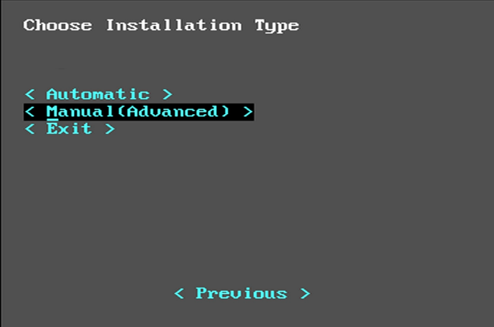

.. |multi-boot-02| image:: figures/multi-boot-02.png

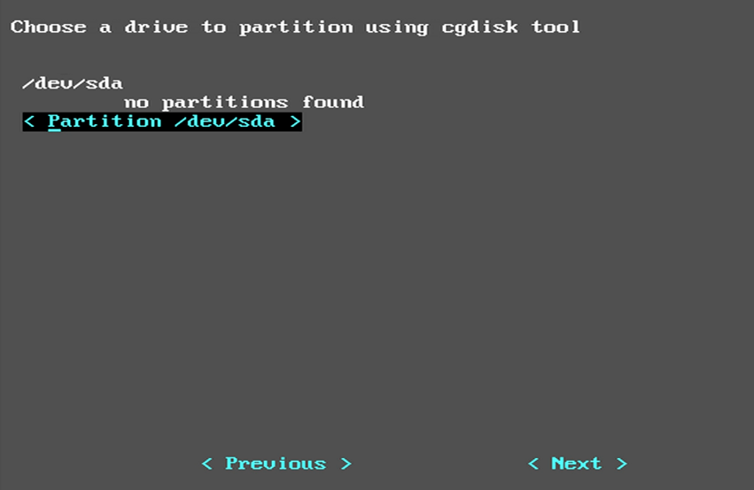

.. |multi-boot-04| image:: figures/multi-boot-04.png

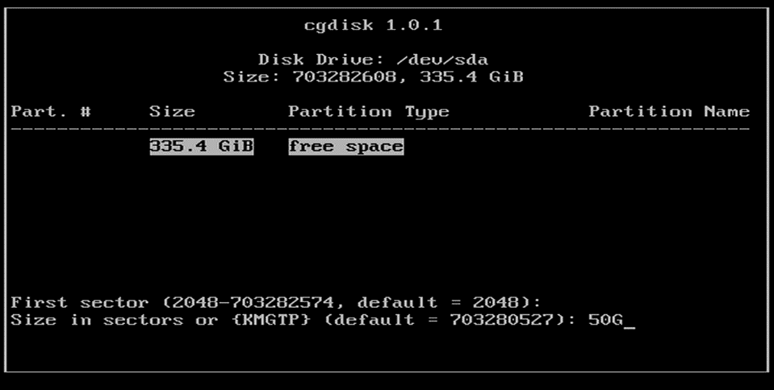

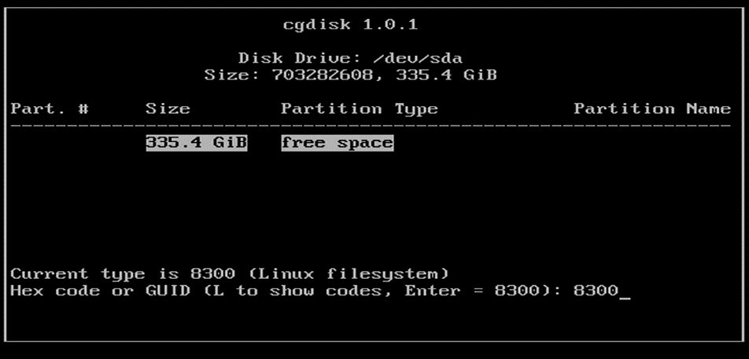

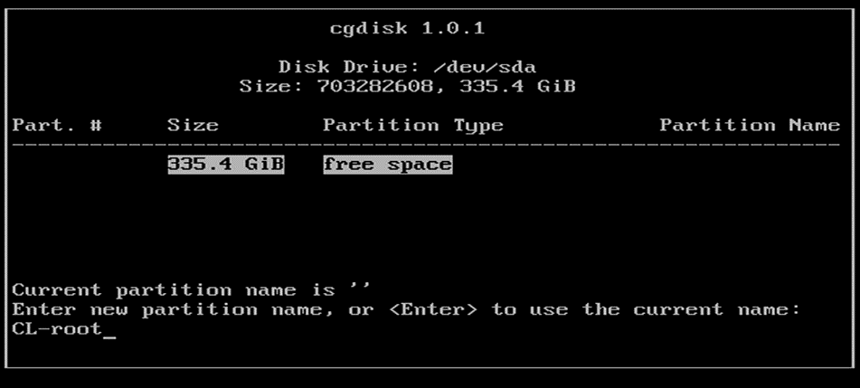

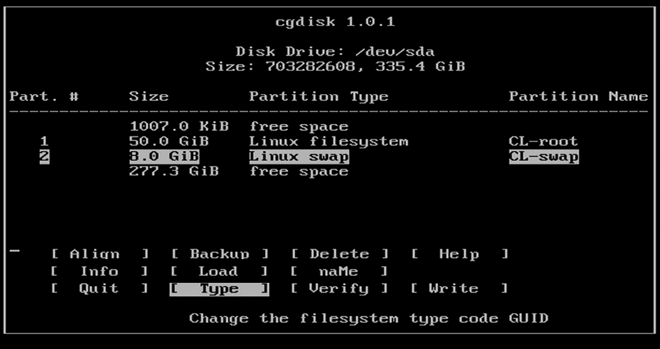

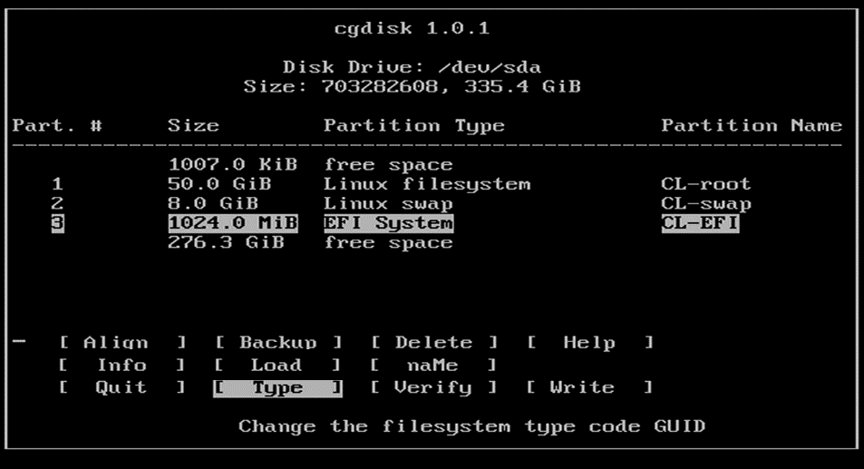

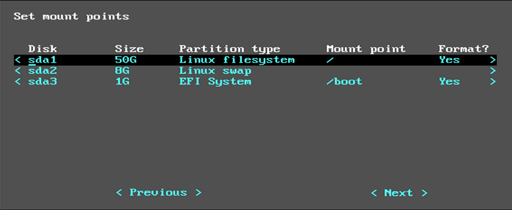

.. |multi-boot-11| image:: figures/multi-boot-11.png

.. |multi-boot-12| image:: figures/multi-boot-12.png

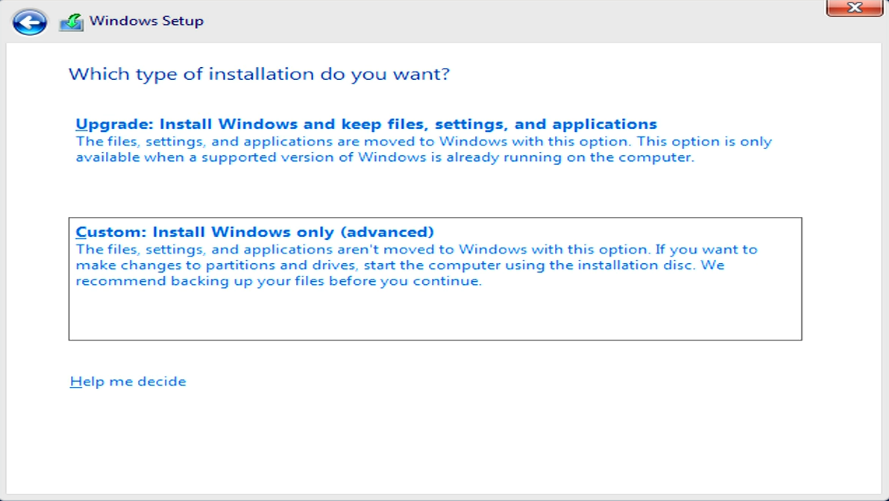

.. |multi-boot-14| image:: figures/multi-boot-14.png

.. |multi-boot-15| image:: figures/multi-boot-15.png

.. |multi-boot-16| image:: figures/multi-boot-16.png

.. |multi-boot-17| image:: figures/multi-boot-17.png

.. |multi-boot-18| image:: figures/multi-boot-18.png

.. |multi-boot-19| image:: figures/multi-boot-19.png

.. |multi-boot-20| image:: figures/multi-boot-20.png

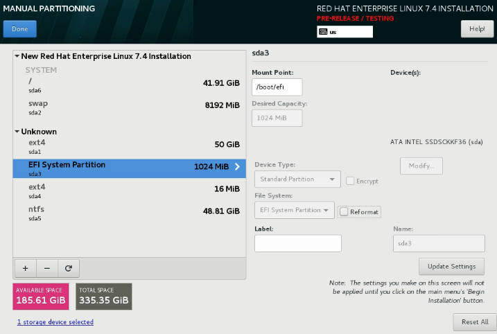

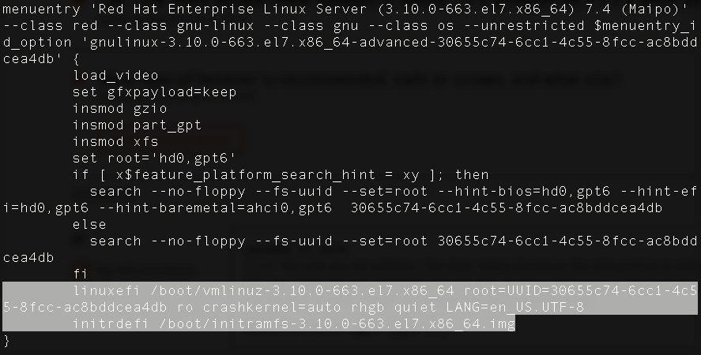

.. |multi-boot-23| image:: figures/multi-boot-23.png

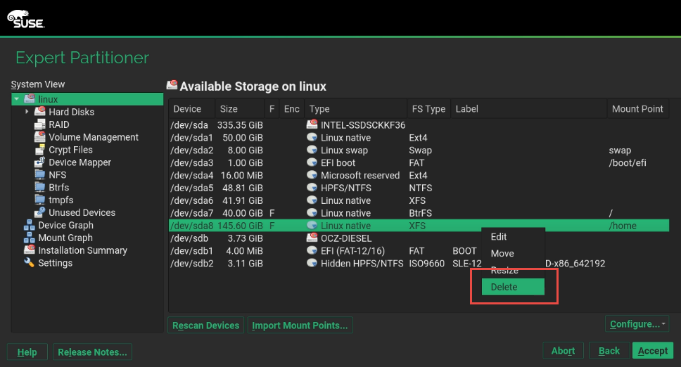

.. |multi-boot-25| image:: figures/multi-boot-25.png

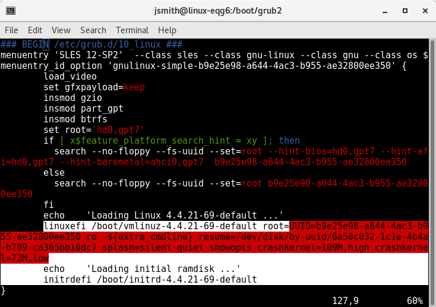

.. |multi-boot-27| image:: figures/multi-boot-27.png

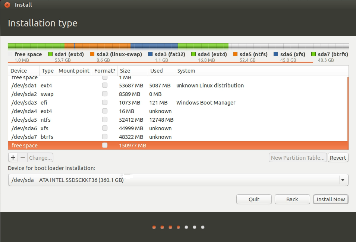

.. |multi-boot-29| image:: figures/multi-boot-29.png

.. |multi-boot-30| image:: figures/multi-boot-30.png

.. |multi-boot-31| image:: figures/multi-boot-31.png

.. |multi-boot-32| image:: figures/multi-boot-32.png

.. |multi-boot-33| image:: figures/multi-boot-33.png

.. |multi-boot-34| image:: figures/multi-boot-34.png

.. |multi-boot-35| image:: figures/multi-boot-35.png

.. |multi-boot-36| image:: figures/multi-boot-36.png

.. |multi-boot-37| image:: figures/multi-boot-37.png

.. |multi-boot-38| image:: figures/multi-boot-38.png
