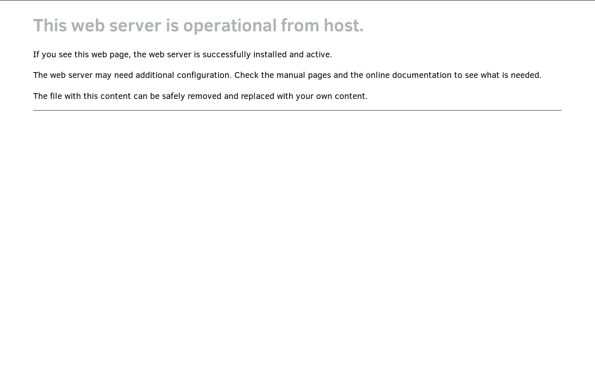

.. _web-server-install:

Creating a Clear Linux based web server
#######################################

Prerequisites
*************

In order to create a web server using |CL| as the host OS your host
system must be running |CL|. Therefore, this tutorial assumes you have
already gone through the :ref:`bare metal installation<bare-metal-install>`
instructions.

Before installing any new packages, update the |CL| OS with the
console command:

.. code-block:: console

   sudo swupd update

Creating a LAMP Server
**********************

A server with Linux\*, Apache\*, MySQL\*, and PHP\* installed is known as a
LAMP server, allows you to set up a fully functional web server, and enables
you to host your own website. This tutorial walks you through the process of
creating a LAMP server by installing and configuring each component. In place
of MySQL, we will be installing MariaDB which is a drop- in replacement for
MySQL. Once the LAMP server component installations are complete, we add
phpMyAdmin to manage your MariaDB databases.

Installing Apache
*****************

Apache is an open source HTTP web server application. It can run on several
operating systems, including |CL|. Alternatively, you could install
NGINX but this tutorial focuses on implementing an Apache server.
Go to https://httpd.apache.org/ to learn more about it.

Install the web-server-basic bundle
===================================

The web-server-basic bundle contains the packages needed to install the
Apache software bundle on |CL|.

To install the bundle, enter the following command:

.. code-block:: console

   sudo swupd bundle-add web-server-basic

To start the Apache service, enter the following commands:

.. code-block:: console

   sudo systemctl enable httpd.service
   sudo systemctl start httpd.service

To verify that the Apache server application is running, go to your web
browser and navigate to: http://localhost

If the service is running you will see the message "This web server is
operational from host." on your browser as shown in figure 1.

    Confirmation the Apache service is running.

The :file:`index.html` file is located in the :file:`/var/www/html`
directory of your host system. We will copy this file into a new location
after we modify the configuration.

Change the default configuration and data directory
***************************************************

|CL| is designed to be a stateless operating system which means that you will
need to create an optional configuration file to make changes over the default
values. The default location of the Apache configuration file,
:file:`httpd.conf`, is located in the :file:`/usr/share/defaults/httpd`
directory. |CL| can overwritte this directory as part of the stateless
paradigm. This default :file:`.conf` file includes the following directives
that allow for additional locations of configuration definitions:

.. code-block:: console

   # Virtual hosts
   IncludeOptional /usr/share/defaults/httpd/conf.d/*.conf
   IncludeOptional /usr/share/defaults/httpd/conf.modules.d/*.conf
   IncludeOptional /etc/httpd/conf.d/*.conf
   IncludeOptional /etc/httpd/conf.modules.d/*.conf

For this tutorial, we will create the directory structure for :file:`/etc/httpd/conf.d`
and then create the :file:`httpd.conf` file within :file:`/etc/httpd/conf.d` directory and
include the variable ``DocumentRoot``.

Using your favorite editor, copy the content listed below into the new file
:file:`/etc/httpd/conf.d/httpd.conf`.

.. code-block:: console

   #
   # Set a new location for DocumentRoot
   #
   DocumentRoot "/var/www/tutorial"
   
   #
   # Relax access to content within /var/www/tutorial for this example
   #
   <Directory "/var/www/tutorial">
      AllowOverride none
      Require all granted
   </Directory>

Finally, let’s create the new ``DocumentRoot`` directory structure and copy the
:file:`index.html` file from :file:`/var/www/html` directory to
:file:`/var/www/tutorial`.

.. code-block:: console

   sudo mkdir –p /var/www/tutorial
   cd /var/www/tutorial
   sudo cp /var/www/html/index.html .

To make sure that we have everything set correctly, let’s edit the new
:file:`index.html` file with your editor and change the text from
"This web server is operational from host." to
"This web server is operational from its new location.".

With the new configuration files in place, you will need to stop and then
restart the ``httpd.service``.

.. code-block:: console

   sudo systemctl stop httpd.service
   sudo systemctl start httpd.service

Now when you go to http://localhost you should see your new screen.

To continue, we must change the configuration back to the default
:file:`/var/www/html` location. To do this, edit the 
:file:`/etc/httpd/conf.d/httpd.conf` file again and replace any instance of
/var/www/tutorial with /var/www/html.

Then, stop and then restart the ``httpd.service``.

.. code-block:: console

   sudo systemctl stop httpd.service
   sudo systemctl start httpd.service

On http://localhost, you should see the default screen again.

Optionally, remove the /var/www/tutorial directory previously created.

.. code-block:: console

   sudo rm /var/www/tutorial/index.html
   sudo rmdir /var/www/tutorial

Installing PHP
**************

With Apache installed, you can display static web pages. However, enabling
PHP allows dynamic webpages to be generated and displayed. To add this
functionality to your web server we need to install PHP on your system.

To get the php components, enter the following command:

.. code-block:: console

   sudo swupd bundle-add php-basic

To enable PHP, enter the following commands:

.. code-block:: console

   sudo systemctl enable php-fpm.service
   sudo systemctl start php-fpm.service
   sudo systemctl restart httpd.service

After restarting the Apache service, we can test our PHP installation.

1. Create a file named :file:`phpinfo.php` in the
   :file:`/var/www/html/` directory using your editor.

2. Add the following line to the file:

   .. code-block:: php

      <?PHP phpinfo() ?>

3. Go to http://localhost/phpinfo.php using your browser.

   The PHP information screen should appear, see figure 2:

   .. figure:: figures/web-server-install-2.png
      :alt: PHP information screen
      :width:     600

      The PHP information screen.

If the PHP information screen is displayed, you have successfully installed
the PHP components and are now ready to add your database application to
complete your LAMP server implementation.

Installing MariaDB
******************

Most web applications require a database to store their content. Therefore,
we must install MariaDB to fulfill this need. MariaDB is a drop-in
replacement for MySQL and is available in the database-basic |CL|
bundle.

To install the database-basic bundle, enter the following command:

.. code-block:: console

   sudo swupd bundle-add database-basic

Once MariaDB is installed, we need to start the service and check its status.

To start MariaDB, enter the following commands:

.. code-block:: console

   sudo systemctl enable mariadb
   sudo systemctl start mariadb

To check the status of MariaDB, enter the following command:

.. code-block:: console

   sudo systemctl status mariadb

With the MariaDB service running, we can perform some basic security
hardening.

To add a basic layer of security, enter the following command and answer the
questions presented:

.. code-block:: console

   mysql_secure_installation

.. note:: We have included the answers after each question.

.. code-block:: console

   Enter current password for root (enter for none):

In order to secure the MariaDB, we need the current password for the root
user. For a newly installed MariaDB without a set root password, the
password is blank. Just press enter to continue.

.. code-block:: console

   OK, successfully used password, moving on...

   Set root password? [Y/n]

.. _set-password:

Setting the root password ensures nobody can log into the MariaDB
as a root user without the proper authorization.

To set a root password, type 'y'.

.. code-block:: console

   New password:

Type the desired password for the root user.

.. code-block:: console

   Re-enter new password:

Re-type the desired password for the root user.

.. code-block:: console

   Password updated successfully!
   Reloading privilege tables..
    ... Success!

   Remove anonymous users? [Y/n]

By default, a MariaDB installation has an anonymous user allowing anyone to
log into MariaDB without a user account. This anonymous user is intended only
for testing and for a smoother the installation.

To remove the anonymous user and make your database more secure, type 'y'.

.. code-block:: console

    ... Success!
   Disallow root login remotely? [Y/n]

Normally, root should only be allowed to connect from the 'localhost'.
This ensures that someone cannot guess at the root password from the network.

To block any remote root login, type 'y'.

.. code-block:: console

    ... Success!
   Remove test database and access to it? [Y/n]

By default, MariaDB comes with a database named 'test' which anyone can
access. This database is also intended only for testing and should be
removed.

To remove the test database, type 'y'.

.. code-block:: console

    - Dropping test database...
    ... Success!
    - Removing privileges on test database...
    ... Success!
   Reload privilege tables now? [Y/n]

Reloading the privilege tables ensures all changes made so far take effect
immediately.

To reload the privilege tables, type 'y'.

.. code-block:: console

    ... Success!

   Cleaning up...

   All done!  If you've completed all of the above steps, your MariaDB
   installation should now be secure.

   Thanks for using MariaDB!

The MariaDB installation is complete and we can now install phpMyAdmin to
manage the databases.

Installing phpMyAdmin
*********************

The web-based tool phpMyAdmin is a straight-forward way to manage MySQL or
MariaDB databases. Visit https://www.phpmyadmin.net for the complete
discussion regarding phpMyAdmin, its documentation, the latest downloads, and
other useful information.

This tutorial uses the latest English version of phpMyAdmin to install it on
our |CL| host system.

1. Download the :file:`phpMyAdmin-<version>-english.tar.gz` file to your
   :file:`~/Downloads` directory. Here, <version> refers to the current
   version available at https://www.phpmyadmin.net/downloads.

.. note:: This example downloads and uses version 4.6.4.

2. Once the file has been successfully downloaded and verified, uncompress
   the file and directories into the apache web server document root
   directory. Use the following commands:

.. code-block:: console

   cd /var/www/html
   sudo tar –xzvf ~/Downloads/phpMyAdmin-4.6.4-english.tar.gz

3. To keep things simple, rename the newly created
   :file:`phpMyAdmin-4.6.4-english` directory to :file:`phpMyAdmin` with the
   following command:

.. code-block:: console

   sudo mv phpMyAdmin-4.6.4-english phpMyAdmin

Using phpMyAdmin to Manage Databases
====================================

If you have successfully installed all of the components for your LAMP
server, you should be able to point your browser to
http://localhost/phpMyAdmin and see the screen shown in figure 3 in your
browser window.

.. figure:: figures/web-server-install-3.png
   :alt: phpMyAdmin login page
   :width:     600

   The `phpMyAdmin` login page after successful installation.

Log in with your root userid and the password you set up when you ran the
:ref:`mysql_secure_installation command <set-password>`. Enter your
credentials and select :guilabel:`Go` to log in:

Once logged in the main phpMyAdmin page is displayed as shown on figure 4:

.. figure:: figures/web-server-install-4.png
    :alt: phpMyAdmin dashboard
    :width:     600

    The `phpMyAdmin` dashboard after successful login.

Our next step is to set up our first database. For example, we can call
our new database WordPress.

1. Select the :guilabel:`Databases` tab in the phpMyAdmin main screen to go
   to the Databases page. Figure 5 shows the databases tab.

   .. figure:: figures/web-server-install-5.png
       :alt: Databases tab
       :width:     600

       The `Databases` tab of `phpMyAdmin`.

2. Enter 'WordPress'. in the text field below the :guilabel:`Create database`
   label.

3. Pick the :guilabel:`utf8_unicode_ci` option from the collation drop-down
   menu beside the text field.

4. Press the :guilabel:`Create` button.

Once the database is created, we need to set up the user permissions.

1. Select the WordPress database in the left panel.

2. Select the :guilabel:`Privileges` tab. Figure 6 shows the contents of the
   tab.

   .. figure:: figures/web-server-install-6.png
       :alt: Privileges tab
       :width:     600

       The `Privileges` tab of `phpMyAdmin`

3. Click on :guilabel:`Add user account`

   .. figure:: figures/web-server-install-7.png
       :alt: User accounts tab
       :width:     600

       The `User accounts` tab showing all the required information entered
       in the next steps.

4. Enter the following information in the corresponding fields:

   User name: wordpressuser

   Password: wp-example

   Re-type: wp-example

5. In the Database for user account section, select the option
   :guilabel:`Grant all privileges on database “WordPress”.`

6. At the bottom of the page and select :guilabel:`Go`.

If successful, you should see the screen shown in figure 8:

.. figure:: figures/web-server-install-8.png
    :alt: User added successfully
    :width:     600

    The user **wordpressuser** was added successfully.

Congratulations!

You have now created a fully functional LAMP server along with a WordPress-
ready database using |CL|.

As a next step, you could :ref:`create a WordPress server <wp-install>`
and present it to the world.
