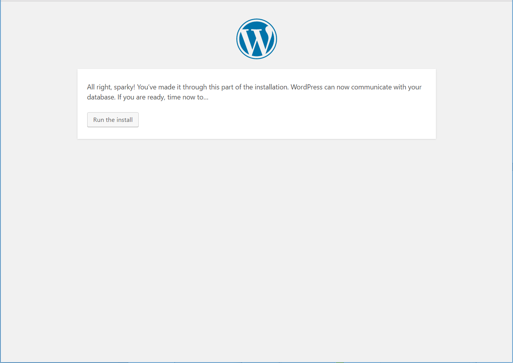

.. _wp-install:

Create a Clear Linux WordPress\* server
#######################################

This tutorial guides you through installing WordPress components on your |CL| LAMP server. During :ref:`Creating a Clear Linux based web server <web-server-install>`, you created the initial WordPress MySQL database `WordPress` using phpMyAdmin\* and MariaDB\*. Now that the LAMP server is up and running, you can add the WordPress components needed to host a WordPress website on your host system.

This tutorial assumes you have successfully installed :ref:`Clear Linux on bare metal<bare-metal-install>` and that you have :ref:`set up a LAMP web server <web-server-install>`.

Before you install new packages, update the |CL| OS with the following command:

.. code-block:: bash

   sudo swupd update

Create a WordPress server
===========================

WordPress can be installed in a variety of ways. These instructions are written for users who have installed phpMyAdmin.

This tutorial follows these steps:

1. Download WordPress and add components to the necessary directory. 
2. Set up WordPress by entering information in the WordPress admin console.
3. Run the installer to fully install WordPress on your system and create a username and password for your newly created blog. 

Note that throughout this tutorial, we reference your website name as <your_website>. 

Install WordPress
--------------------

For this tutorial, we will create a WordPress blog that can be accessed at:

http://<your_website>/blog

To accomplish this setup, you must add WordPress components to the :file:`/var/www/html/blog` directory.

Follow these steps:

1. To move to the top level of the website’s root directory, enter thefollowing command:

   .. code-block:: bash

      cd /var/www/html

2. To download the latest version of WordPress, enter the following command:

   .. code-block:: bash

      sudo curl -O https://wordpress.org/latest.tar.gz

3. To extract all files and directories from the downloaded file, enter the following command:

   .. code-block:: bash

      sudo tar –xzvf latest.tar.gz

4. To rename the top-level WordPress directory to “blog,” enter the following command:

   .. code-block:: bash

      sudo mv wordpress blog

5. To remove the downloaded tar file, enter the following command:

   .. code-block:: bash

      sudo rm latest.tar.gz

Set up WordPress
--------------------

Recall that you created a database and user when you installed phpMyAdmin during :ref:`Creating a Clear Linux based web server <web-server-install>`. To continue with the WordPress setup, go to: http://<your_website>/blog/wp-admin/install.php.

The WordPress language option screen appears, as shown in figure 1. Select :guilabel:`English` and click :guilabel:`Continue`.

.. _fig-wp-install-1:

.. figure:: figures/wp-install-1.png
    :alt: WordPress language selection
    :width:     600

    Figure 1: WordPress language selection screen.

The WordPress installation continues until the Welcome screen appears, as shown in figure 2:

.. figure:: figures/wp-install-2.png
    :alt: WordPress welcome screen
    :width:     600

    Figure 2: WordPress welcome screen.

Click :guilabel:`Let’s go!`. Enter pertinent information in the screen that appears as shown in Figure 3 below.

   Database name:       WordPress

   Database username:   wordpressuser

   Database password:   wp-example

   Database host:  localhost

   Table prefix:   wp\_

Figure 3 shows the completed fields:

.. figure:: figures/wp-install-3.png
    :alt: Database connection details
    :width:     600

    Figure 3: Information necessary for WordPress to connect to the database.

Click :guilabel:`Submit` to complete the setup.

Figure 4 shows the confirmation screen that verifies a successful setup. Click :guilabel:`Run the install`.

    Figure 4: This screen shows WordPress was able to connect to the MySQL database.

The installer runs until WordPress is fully installed on your system.

Once the installation is complete, you can name your blog and create a Wordpress username and password. See figure 5:

.. figure:: figures/wp-install-5.png
    :alt: WordPress user creation
    :width:     600

    Figure 5: WordPress site information screen.

Enter all the required information and click the :guilabel:`Install WordPress` button.

Once the installation is complete, the initial login screen appears, as shown in figure 6:

.. figure:: figures/wp-install-6.png
    :alt: WordPress login
    :width:     600

    Figure 6: The WordPress login screen.

Enter your WordPress username and password.
Check :guilabel:`Remember me` to save your credentials.
Click :guilabel:`Log in`.

Figure 7 shows the WordPress dashboard after a successful login:

.. figure:: figures/wp-install-7.png
    :alt: WordPress Dashboard
    :width:     600

    FIgure 7: The WordPress dashboard.

You are ready to go!

To view your blog as it is seen by the outside world, enter:
http://<your_website>/blog in your browser. Figure 8 shows the result:

.. figure:: figures/wp-install-8.png
    :alt: WordPress blog
    :width:     600

    Figure 8: The final result is the fully realized WordPress blog.

**Congratulations, your WordPress blog is up and running!**

You have successfully installed WordPress on a host system.

Add new entries to your blog and share them with the world using |CLOSIA|!

.. _`step-by-step guide`:
   https://codex.wordpress.org/Installing_WordPress#Famous_5-Minute_Install

.. _`NUC6i5SYH product page`:
   http://www.intel.com/content/www/us/en/nuc/nuc-kit-nuc6i5syh.html
