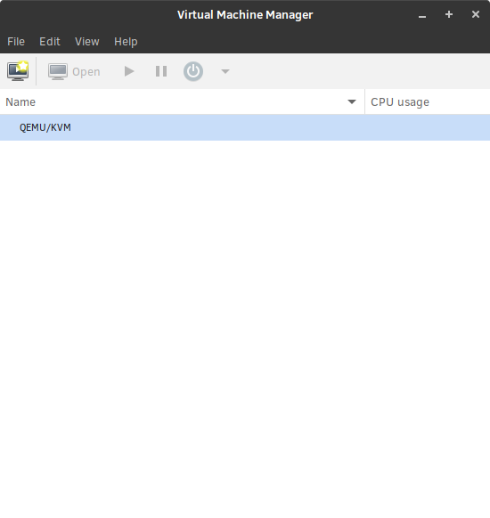

.. _virt-manager:

|CL-ATTR| using virt-manager
############################

This page explains how to create a |CL-ATTR| virtual machine using the
`virt-manager`_ desktop application with |CL| as the guest operating system.
These instructions support the |CL| live-server installer to create the |CL|
:abbr:`VM (Virtual Machine)`.

.. contents::
   :local:
   :depth: 1

Prerequisites
*************

#. Enable virtualization, such as `Intel® Virtualization Technology <https://www.intel.com/content/www/us/en/virtualization/virtualization-technology/intel-virtualization-technology.html>`_
   (Intel® VT), on the host system from the UEFI firmware setup.

#. Install the software bundles kvm-host and virt-manager-gui using 
   :command:`swupd`:

   .. code-block:: bash

      sudo swupd bundle-add kvm-host virt-manager-gui

#. Add your userid to the `kvm` and `libvirt` groups.
   
   .. code-block:: bash

      sudo usermod -G kvm -a $USER
      sudo usermod -G libvirt -a $USER

#. Enable the `libvirtd` daemon and then reboot the system to complete the 
   process.

   .. code-block:: bash

      sudo systemctl enable libvirtd
      sudo reboot

   This will add your userid to the specified groups and start the libvirtd 
   daemon after the system has rebooted.

Download the |CL| installer ISO
*******************************

There are several options available to set up and use a |CL| VM with
:command:`virt-manager`. You can either download the `KVM` image and run it as
is or download the installer ISO and run it to create a new installation of
|CL|.

This example uses the live-server-installer ISO to create a new installation.

#. Download the `Clear Linux* OS Server` from the `Downloads`_ page. I used
   Firefox and downloaded it to my `~/Downloads` directory.

#. (Optional) Validate the integrity of the downloaded image by checking the
   file hash and signatures. Refer to :ref:`validate-signatures` for detailed
   steps.

Launch and setup virt-manager
*****************************

Virt-manager is a GUI-based virtual machine manager that runs in your desktop
environment. I'm using the Gnome desktop and will launch the Virtual Machine
manager from the applications window. You will see the following application
window:

   Figure 1: Virtual Machine Manager

In the `Name` window of the application, select and highlight the `QEMU/KVM`
item and then select Edit > Connection Details. You will see the dialog box
showing the `QEMU/KVM Connection Details`.

.. figure:: figures/virtmgr/virt-manager-02.png
   :scale: 100%
   :alt: QEMU/KVM Connection Details

   Figure 2: QEMU/KVM Connection Details

On the `Overview` tab, make sure the `Autoconnect` field is checked. Select 
the
`Virtual Networks` tab and at the lower left of the dialog window, select the 
:guilabel:`+` key to add a new network connection. The 
`Create a new virtual network` dialog window will open as shown in figure 3:

.. figure:: figures/virtmgr/virt-manager-03.png
   :scale: 100%
   :alt: Create a new virtual network

   Figure 3: Create a new virtual network

To accept the default values as shown in the figure above, select the 
:guilabel:`Finish` button to create your virtual network.

Now that you have created your virtual network, you can close the 
`QEMU/KVM Connection details` dialog box and return to the main screen. You 
are ready to create your VM.

Create a new virt-manager virtual machine
*****************************************

To create a new VM you can either select `file > New Virtual Machine` or click 
on the `Create a new virtual machine` icon on the right side of the ribbon. 
This will launch the `New VM` dialog box, shown in figure 4 below.

.. figure:: figures/virtmgr/virt-manager-04.png
   :scale: 100%
   :alt: New VM

   Figure 4: New VM dialog box

#. Select the `Local install media (ISO image or CDROM)` and then select the
   :guilabel:`Forward` button.

#. This will bring you to step 2 of the wizard where you can choose ISO or 
   CDROM install media. 

   #. Before browsing for the ISO image, un-check the 
      `Automatically detect from the installation media / source` field and
      then select the :guilabel:`Browse...` button as shown in figure 5

      .. figure:: figures/virtmgr/virt-manager-05.png
         :scale: 100%
         :alt: New VM

         Figure 5: New VM dialog box

   #. In the `Choose Storage Volume` dialog, select the
      :guilabel:`Browse Local` button as shown in figure 6, find and select 
      the ISO image that you downloaded earlier and open it.

      .. figure:: figures/virtmgr/virt-manager-06.png
         :scale: 100%
         :alt: Choose storage volume

         Figure 6: Choose storage volume dialog box

   #. In the `Choose the operating system you are installing` search field, 
      begin typing `generic` until you see the `Generic default` value and 
      then select that. Once finished on this screen, select the
      :guilabel:`Forward` as shown in figure 7.

      .. figure:: figures/virtmgr/virt-manager-07.png
         :scale: 100%
         :alt: New VM

         Figure 7: New VM dialog box

      .. note::

         You may get a message that the emulator may not have search
         permissions for the path you entered for the ISO image and it will 
         want to correct that.  Select :guilabel:`Yes` to proceed to the next
         step.

#. In step 3 of the `New VM` wizard you set the memory and CPUs to allocate 
   for your new VM. Depending on the resources available to you on you host
   system, select what is appropriate. In this example I will set `Memory` to
   2048GB and `CPUs` to 1. Once complete, select the :guilabel:`Forward` as 
   shown in figure 8, to go to the next step.

   .. figure:: figures/virtmgr/virt-manager-08.png
      :scale: 100%
      :alt: New VM Choose Memory and CPU settings dialog box

      Figure 8: New VM Choose Memory and CPU settings dialog box

#. Step 4 of the `New VM` wizard will set up your storage media for your VM.
   You can create a new disk image or select to use an existing image. For
   this exercise we will select the `Enable storage for this virtual machine`
   and then create a 20GB image to go with. Once set as shown in figure 9, 
   select the :guilabel:`Forward` button.

   .. figure:: figures/virtmgr/virt-manager-09.png
      :scale: 100%
      :alt: New VM Enable storage dialog box

      Figure 9: New VM Enable storage dialog box

#. Step 5 of the wizard will show you the slections you have made and give you
   the ability to customize the configuration before running the installation.
   Select the `Customize configuration before install` check-box and then 
   select the :guilabel:`Finish` button.

   .. figure:: figures/virtmgr/virt-manager-10.png
      :scale: 100%
      :alt: New VM Ready to begin the installation dialog box

      Figure 10: New VM Ready to begin the installation dialog box

#. Clear Linux requires a UEFI firmware to boot and operate correctly so you
   need to customize the installation process by changing the firmware from
   `BIOS` to `UEFI x86_64`. In the `Firmware` field, select the
   `UEFI x86_64: /usr/share/qemu/OVMF.fd` entry as shown in figure 11 and 
   select the :guilabel:`Apply` button.

   .. figure:: figures/virtmgr/virt-manager-11.png
      :scale: 100%
      :alt: vm1 on QEMU/KVM dialog box

      Figure 11: vm1 on QEMU/KVM dialog box

#. Begin the installation by selecting the :guilabel:`Begin Installation` in
   the upper right hand corner of the `vm1 on QEMU/KVM` dialog box.

Install |CL| on the virt-manager VM
***********************************

To install |CL| in your VM, follow the instructions in the getting started
guide :ref:`bare-metal-install-server`.

.. note::
   You already have the ISO image downloaded and connected to your VM and 
   your network will show up as a wired connection so you do not need to set
   up the network as described in the installation guide.

Troubleshooting
***************

#. **Problem:** On a Microsoft\* Windows\* OS, |VB| encounters an error when
   trying to start a VM indicating *VT-X/AMD-v hardware acceleration is not
   available on your system.*

   .. figure:: figures/vbox/virtualbox-cl-installer-12.png
      :scale: 100%
      :alt: Remove Disk from Virtual Drive

      Figure 12: VirtualBox hardware acceleration error

   **Solution:** First, double check the `Prerequisites`_ section to make
   sure *Hardware accelerated virtualization* extensions have been enabled
   in the host system's EFI/BIOS.

   *Hardware accelerated virtualization*, may get disabled for |VB| when
   another hypervisor, such as *Hyper-V* is enabled.

   To disable *Hyper-V* execute this command in an
   **Administrator: Command Prompt or Powershell**, and reboot the system:

   .. code-block:: bash

      bcdedit /set {current} hypervisorlaunchtype off

   To enable Hyper-V again, execute this command in an
   **Administrator: Command Prompt or Powershell**, and reboot the system:

   .. code-block:: bash

      bcdedit /set {current} hypervisorlaunchtype Auto

.. _VirtualBox Installation Instructions: https://www.virtualbox.org/manual/ch02.html

.. _virt-manager: https://www.virt-manager.org

.. _Downloads: https://clearlinux.org/downloads

.. _`Creating Your First Virtual Machine`: https://www.virtualbox.org/manual/UserManual.html#gui-createvm

.. _7zip: http://www.7-zip.org/

.. _Intel® Virtualization Technology: https://www.intel.com/content/www/us/en/virtualization/virtualization-technology/intel-virtualization-technology.html

.. _VM VirtualBox User Manual: https://docs.oracle.com/cd/E97728_01/E97727/html/settings-system.html