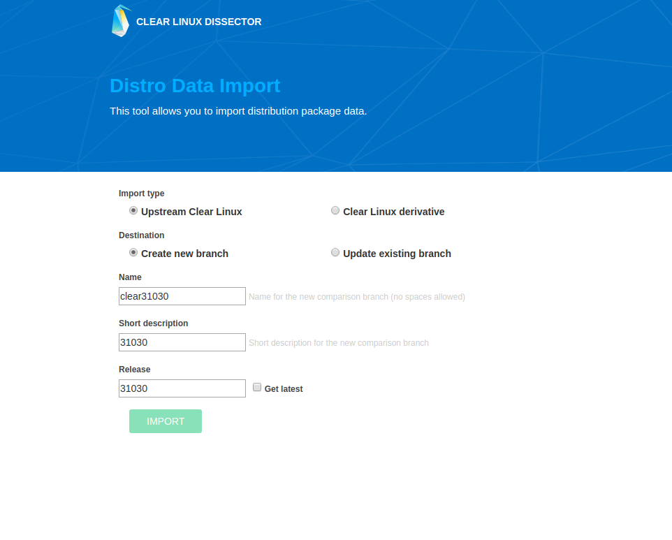
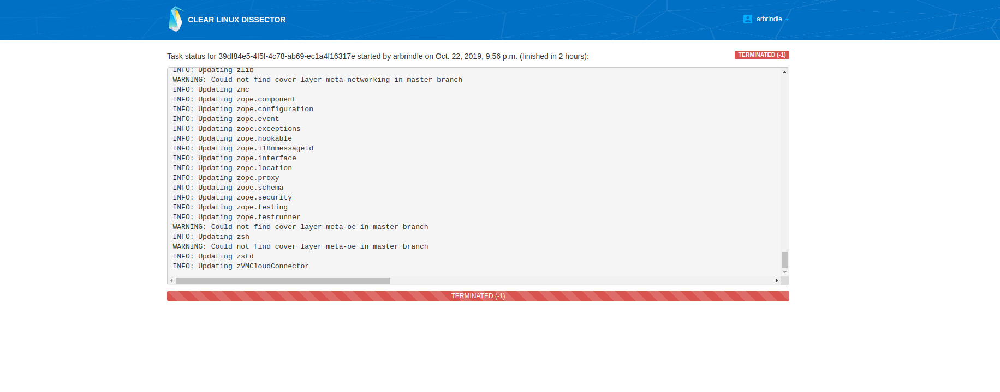
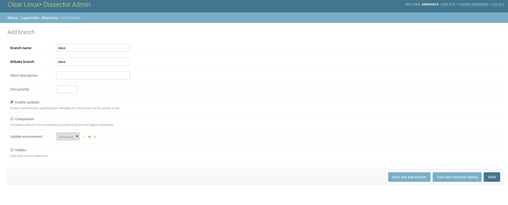

.. _clear-linux-dissector:

Clear Linux Dissector
#####################

The Clear Linux Dissector is a web application that compares contents of
Linux\*-based images.
--> compares contents - what does that mean?

.. contents:: :local:
   :depth: 1

Description
***********

If you do not have a Linux image, yet, but you have a pretty good idea of what you want to include in your image, you can `View Distro Data`_.
-->what does view distro data do?

If you already have a Yocto Project image that you would like to build with Clear, you can `Compare Images With Clear`_ to find the necessary packages. You can also compare images in order to find new patches for performance and security enhancements.
--> This is compare Yocto images, yes?

You can also `Compare Clear Releases`_ to see the changes between two Clear Linux Releases.

Set Up
******

Clear Linux Dissector is a web application, which means you will need to set up
an instance of the application in order to use it. This section describes how to
set up and instance of the Clear Linux Dissector with the necessary data for usage.

Set Up Instance
===============

#. Clone the clear-linux-dissector-web git repo.

   .. code-block:: bash

      git clone https://github.com/intel/clear-linux-dissector-web.git

#. Change directory into clear-linux-dissector-web.

   .. code-block:: bash

      cd clear-linux-dissector-web

#. Run the dockersetup.py script.

   If you are behind a proxy, you must set the command line variables
   :command:`--http-proxy`, :command:`--https-proxy`, and :command:`--socks-proxy`.

   This script will ask for a `username` and `password` to create a superuser;
   Take note of these credentials as you will use this to log in to the web interface.

   .. code-block:: bash

      ./dockersetup.py

#. After running the dockersetup.py script, the Clear Linux Dissector should be
   up and running on localhost. View the front-end interface at https://localhost:8081.

   Before using the Clear Linux Dissector, you must first import data.

Import Clear Linux Data
=======================

There are two ways to import |CL| data:

#. From the command line

#. From the user interface.

In either case, the data will be imported from http://download.clearlinux.org/releases.

Import from Command Line
------------------------

To import the latest |CL| release, run the following command,
:command:`branchname` refers to the imported |CL| release.
---> Clarify this

Do not edit the paths in the command, because they are in relation to the
`layersapp` Docker image that the application runs in.

.. code-block:: bash

    docker-compose run --rm layersapp /opt/layerindex/layerindex/tools/import_clear.py -d -p /opt/dissector -o /opt/sources -b <branchname>

To import a specific |CL| release, use the :command:`--release` flag with the
desired release number (for example 31380):

.. code-block:: bash

   docker-compose run --rm layersapp /opt/layerindex/layerindex/tools/import_clear.py -d -p /opt/dissector -o /opt/sources -b clear-31380 -r 31380

Import from User Interface
--------------------------

In a browser, navigate to the import page at https://localhost:8081/layerindex/comparison/import/.

   Figure 1: Distro Data Import Page

The first time you import |CL| data, you will need to create a new branch. You
can choose to update your branch in later imports.

To import the latest |CL| release, check the :guilabel:`Get latest` box.
To import a specific release, enter the release number in the :guilabel:`Release`
field.

Click :guilabel:`IMPORT` and you will be taken to a page that displays the task
status. It will take a long time to upload the |CL| data. 

Once the |CL| data is completely uploaded, you will see a page similar to the
following:

   Figure 2: Finished Distro Data import

Import Yocto Project Data (for comparing Yocto Project images)
==============================================================

Currently, you can only import Yocto Project Data from the command line. The
data will be imported from https://layers.openembedded.org.

To import the latest Yocto Project data from the master branch, run the following
command:

.. code-block:: bash

   docker-compose run --rm layersapp /opt/layerindex/layerindex/tools/import_layers.py https://layers.openembedded.org

You can also import Yocto Project data from a specific branch. Before doing so, you must create a branch object in the admin page. Navigate to
https://localhost:8081/admin/layerindex/branch/add/ and enter the branch name in
the :guilabel:`Branch name` field and the corresponding Bitbake branch name (for example "zeus") in the :guilabel:`Bitbake branch`.

   Figure 3: How to Create Yocto Project Branch

Now, run the following command to import a specific Yocto Project branch:

.. code-block:: bash

   docker-compose run --rm layersapp /opt/layerindex/layerindex/tools/import_layers.py https://layers.opnembedded.org -b zeus

You can also update your Yocto Project branches with the following command:

.. code-block:: bash

   docker-compose run --rm layersapp /opt/layerindex/layerindex/update.py

View Distro Data
****************

If you have a pretty good idea of what you want in your |CL| image, you can view
Distro Data to find proper packages.

#. From homepage, click on `Distro Data`.

   .. figure:: ../../_figures/clear-linux-dissector/distro-data-select.png
      :scale: 45%
      :alt: Distro Data Select

      Select Distro Data

#. Select which |CL| distribution you want to search for in the :guilabel:`Branch`
   section in the top right, and then search for the package you'd like to include.

   .. figure:: ../../_figures/clear-linux-dissector/distro-data-form.png
      :scale: 45%
      :alt: Distro Data Form

      Distro Data Form

#. Select the package you want to include.

#. You can now see the |CL| and corresponding Yocto Project versions of your
   package side by side, as well as Patches and configure options.

   --> Labels dont match screenshot

   .. figure:: ../../_figures/clear-linux-dissector/distro-data.png
      :scale: 45%
      :alt: Distro Data

      Distro Data

   .. figure:: ../../_figures/clear-linux-dissector/distro-data-patches.png
      :scale: 45%
      :alt: Distro Data Patches

      Distro Data Patches

   .. figure:: ../../_figures/clear-linux-dissector/distro-data-configure-options.png
      :scale: 45%
      :alt: Distro Data Configure Options

      Distro Data Configure Options

Compare Images With Clear
*************************

If you already have a Yocto Project image that you want to build with |CL|, you
can use Image Comparison to find the necessary packages. Before starting, make
sure that you are on the same machine that built the original Yocto Project image.

#. From homepage, click on :guilabel:`Image comparsion`.

   .. figure:: ../../_figures/clear-linux-dissector/image-comparison-select.png
      :scale: 45%
      :alt: Image Comparison Select

      Image Comparison Select

#. Follow instructions to run the `oe-image-manifest-script`. Upload the
   resulting .tar.gz file and choose which branch you want to compare it to.

   .. figure:: ../../_figures/clear-linux-dissector/image-comparison-form.png
      :scale: 45%
      :alt: Image Comparison Form

      Image Comparison Form

#. The resulting list will show which packages are in the original Yocto Project
   image and the corresponding |CL| packages.

   .. figure:: ../../_figures/clear-linux-dissector/image-comparison-result.png
      :scale: 45%
      :alt: Image Comparison Result

      Image Comparison Result

Compare Clear Releases
**********************

If you want to view the differences between two |CL| releases, use the Release
Comparison tool. Before starting, you must import the two |CL| releases that
you want to compare by following `How to Import Clear Linux Data`_.

#. From the home page, click on :guilabel:`Release comparison`.

   .. figure:: ../../_figures/clear-linux-dissector/release-comparison-select.png
      :scale: 45%
      :alt: Release Comparison Select

      Release Comparison Select

#. Select the two releases you'd like to compare and click :guilabel:`CREATE COMPARISON`.

   .. figure:: ../../_figures/clear-linux-dissector/release-comparison-form.png
      :scale: 45%
      :alt: Release Comparison Form

      Release Comparison Form

#. The resulting list will show changes between the two releases such as packages
   added, upgraded, and downgraded.

   .. figure:: ../../_figures/clear-linux-dissector/release-comparison-result.png
      :scale: 45%
      :alt: Release Comparison Result

      Result Comparison Result
