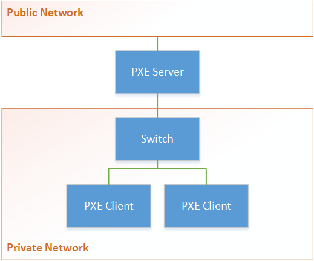

.. _network_boot:

Network Booting
################

Clear Linux* Project for Intel® Architecture is bootable from a pre-boot execution
environment (PXE) using UEFI.  PXE is an industry standard for describing the
client-server interaction to network boot software using DHCP and TFTP protocols.
One use of this environment is to automatically install an operating system.

Using an extension of PXE known as iPXE adds support for additional protocols such
as HTTP, iSCIS, ATA over Ethernet (AoE), and Fiber Channel over Ethernet (FCoE).
iPXE can also be used to enable network booting computers that lack built-in PXE
support.  This guide covers how to perform an iPXE boot using: UEFI, a private network,
and network address translation (NAT).  Figure 1 illustrates the assumed network topology.

  Figure 1: PXE network topology

Preparations
============

Before performing an iPXE boot, verify the following:

* Your PXE server has at least two network adapters
* Your PXE server and PXE clients are connected to a switch
* Your PXE server is connected to a network
* If applicable, your PXE server has secure boot disabled

.. note::

  A switch sets up a private network. Using a private network allows for greater control of which
  traffic is exposed to PXE clients by isolating them on their own network.

.. note::

  Secure boot needs disabled because the UEFI binaries for booting the Clear Linux* Project for
  Intel® Architecture are not signed.

Configuration
=============

The below steps have been automated during the installation of the `Ister Cloud Init Service`_ to quickly enable a bulk
provisioning setup.  Before running the installation scripts, modify ``parameters.conf`` with your specific configurations.

Step 1
------

Define variables that are used to parameterize the rest of the configuration of an iPXE boot.

.. code-block:: console

  web_root=/var/www
  ipxe_root=$web_root/ipxe
  tftp_root=/srv/tftp

  external_iface=eno1
  internal_iface=eno2
  pxe_subnet=192.168.1
  pxe_internal_ip=$pxe_subnet.1
  pxe_subnet_mask_ip=255.255.255.0
  pxe_subnet_bitmask=24

Step 2
------

Add the ``pxe-server`` bundle to your system.  This has all of the software needed run a PXE
server.

.. code-block:: console

   swupd bundle-add pxe-server

Step 3
------

Download the latest network-bootable release of the Clear Linux* Project for Intel® Architecture and create an iPXE boot script.  The iPXE boot script tells the PXE client which files to use for network booting the latest release.

.. code-block:: console

    rm -rf $ipxe_root
    mkdir -p $ipxe_root
    curl -o /tmp/clear-pxe.tar.xz https://download.clearlinux.org/current/clear-$(curl https://download.clearlinux.org/latest)-pxe.tar.xz
    tar -xJf /tmp/clear-pxe.tar.xz -C $ipxe_root
    ln -sf $(ls $ipxe_root | grep 'org.clearlinux.*') $ipxe_root/linux
    cat > $ipxe_root/ipxe_boot_script.txt << EOF
    #!ipxe
    kernel linux quiet init=/usr/lib/systemd/systemd-bootchart initcall_debug tsc=reliable no_timer_check noreplace-smp rw initrd=initrd
    initrd initrd
    boot
    EOF   

Step 4
-------

The ``pxe-server`` bundle comes with a lightweight nginx web server. Create a configuration file for
the web server which will serve iPXE content to PXE clients.

.. code-block:: console

  mkdir -p /etc/nginx
  cat > /etc/nginx/nginx.conf << EOF
  server {
    listen 80;
    server_name localhost;
    location / {
      root $ipxe_root;
      autoindex on;
    }
  }
  EOF

Step 5
-------

Start the nginx web server and enable startup on boot

.. code-block:: console

  systemctl start nginx
  systemctl enable nginx

Step 6
------

Enable chainloading by placing a copy of iPXE firmware on a TFTP server.  Chainloading allows
machines with both BIOS and UEFI implementations to boot using iPXE.

.. code-block:: console

  rm -rf $tftp_root
  mkdir -p $tftp_root
  ln -sf /usr/share/ipxe/ipxe-x86_64.efi $tftp_root/ipxe-x86_64.efi
  ln -sf /usr/share/ipxe/undionly.kpxe $tftp_root/undionly.kpxe
  cat > /etc/dnsmasq.conf << EOF
  enable-tftp
  tftp-root=$tftp_root
  EOF

  systemctl enable dnsmasq

.. note::

  ``dnsmasq`` is a lightweight implementation of a DNS server, a DHCP server, and a TFTP server.  It
  is only being enabled now to start automatically on boot and not started because it's DNS server
  conflicts with the DNS stub listener offered by systemd-resolved.

Step 7
-------

Configure a DNS server for PXE clients on the private network.  Set the DNS server to listen on a
dedicated IP address.  PXE clients on the private network can then use this IP address for DNS resolution.  Disable the
DNS stub listener included with systemd-resolved to avoid a conflict with the DNS server offered by
``dnsmasq``.

.. code-block:: console

  mkdir -p /etc/systemd
  cat > /etc/systemd/resolved.conf << EOF
  [Resolve]
  DNSStubListener=no
  EOF

  cat >> /etc/dnsmasq.conf << EOF
  listen-address=$pxe_internal_ip
  EOF

  systemctl stop systemd-resolved
  systemctl restart dnsmasq
  systemctl start systemd-resolved

.. note::

  Using the DNS server provided by ``dnsmasq`` so that the list of DNS servers identified by systemd-resolved
  for the network connection can be dyanmically updated for the PXE clients on the private network.  In effect, this creates a proxy DNS server.

Step 8
------

Assign a static IP address to the network adapter for the private network.  systemd-networkd will try to always
use DHCP for all network adapters, so this functionality nees disabled prior to assinging a static
IP address.

.. code-block:: console

  mkdir -p /etc/systemd/network

  ln -sf /dev/null /etc/systemd/network/80-dhcp.network

  cat > /etc/systemd/network/80-external-dynamic.network << EOF
  [Match]
  Name=$external_iface
  [Network]
  DHCP=yes
  EOF

  cat > /etc/systemd/network/80-internal-static.network << EOF
  [Match]
  Name=$internal_iface
  [Network]
  DHCP=no
  Address=$pxe_internal_ip/$pxe_subnet_bitmask
  EOF

  systemctl restart systemd-networkd

Step 9
-------

Configure a DHCP server to dyanmically allocate IP addresses to PXE clients on the private network.
Create a file where the DHCP server can maintain the leased IP addresses.

.. code-block:: console

  cat > /etc/dhcpd.conf << EOF
  option space ipxe;
  option ipxe-encap-opts code 175 = encapsulate ipxe;
  option ipxe.priority code 1 = signed integer 8;
  option ipxe.keep-san code 8 = unsigned integer 8;
  option ipxe.skip-san-boot code 9 = unsigned integer 8;
  option ipxe.syslogs code 85 = string;
  option ipxe.cert code 91 = string;
  option ipxe.privkey code 92 = string;
  option ipxe.crosscert code 93 = string;
  option ipxe.no-pxedhcp code 176 = unsigned integer 8;
  option ipxe.bus-id code 177 = string;
  option ipxe.bios-drive code 189 = unsigned integer 8;
  option ipxe.username code 190 = string;
  option ipxe.password code 191 = string;
  option ipxe.reverse-username code 192 = string;
  option ipxe.reverse-password code 193 = string;
  option ipxe.version code 235 = string;
  option iscsi-initiator-iqn code 203 = string;
  option ipxe.pxeext code 16 = unsigned integer 8;
  option ipxe.iscsi code 17 = unsigned integer 8;
  option ipxe.aoe code 18 = unsigned integer 8;
  option ipxe.http code 19 = unsigned integer 8;
  option ipxe.https code 20 = unsigned integer 8;
  option ipxe.tftp code 21 = unsigned integer 8;
  option ipxe.ftp code 22 = unsigned integer 8;
  option ipxe.dns code 23 = unsigned integer 8;
  option ipxe.bzimage code 24 = unsigned integer 8;
  option ipxe.multiboot code 25 = unsigned integer 8;
  option ipxe.slam code 26 = unsigned integer 8;
  option ipxe.srp code 27 = unsigned integer 8;
  option ipxe.nbi code 32 = unsigned integer 8;
  option ipxe.pxe code 33 = unsigned integer 8;
  option ipxe.elf code 34 = unsigned integer 8;
  option ipxe.comboot code 35 = unsigned integer 8;
  option ipxe.efi code 36 = unsigned integer 8;
  option ipxe.fcoe code 37 = unsigned integer 8;
  option ipxe.vlan code 38 = unsigned integer 8;
  option ipxe.menu code 39 = unsigned integer 8;
  option ipxe.sdi code 40 = unsigned integer 8;
  option ipxe.nfs code 41 = unsigned integer 8;

  class "PXE-Chainload" {
    match if substring(option vendor-class-identifier, 0, 9) = "PXEClient";
    
    next-server $pxe_internal_ip;
    if exists user-class and option user-class = "iPXE" {
      filename "http://$pxe_internal_ip/ipxe_boot_script.txt";
    }
    elsif substring(option vendor-class-identifier, 0, 20) = "PXEClient:Arch:00007" or substring(option vendor-class-identifier, 0, 20) = "PXEClient:Arch:00008" or substring(option vendor-class-identifier, 0, 20) = "PXEClient:Arch:00009" {
      filename "ipxe-x86_64.efi";
    }
    elsif substring(option vendor-class-identifier, 0, 20) = "PXEClient:Arch:00000" {
      filename "undionly.kpxe";
    }
  }

  subnet $pxe_subnet.0 netmask $pxe_subnet_mask_ip {
    authoritative;
    option routers $pxe_internal_ip;
    option domain-name-servers $pxe_internal_ip;
    
    pool {
      allow members of "PXE-Chainload";
      range $pxe_subnet.128 $pxe_subnet.253;
      default-lease-time 600;
      max-lease-time 3600;
    }
    
    pool {
      deny members of "PXE-Chainload";
      range $pxe_subnet.2 $pxe_subnet.127;
      default-lease-time 3600;
      max-lease-time 21600;
    }
  }
  EOF

  mkdir -p /var/db
  touch /var/db/dhcpd.leases

  systemctl enable dhcp4
  systemctl restart dhcp4

This ensures that either iPXE image (``undionly.kpxe`` for BIOS or ``ipxe.efi``
for EFI) is handed out only when the DHCP request comes from a legacy PXE client
or from a UEFI client, respectfully. Once iPXE loads, the DHCP server will direct it to
boot from options configured in your ``http://my.web.server/real_boot_script.txt``
file.

.. note::

  There are three places in which a DHCP server can be used: systemd-networkd, dnsmasq, and dhcpd.
  Using dhcpd because it's part of ISC and is more flexible for iPXE booting.

.. note::

  Include iPXE-specific options from http://www.ipxe.org/howto/dhcpd in your DHCPD

.. note::

  By defining only one subnet with the correct range, the DHCP server will be bound only to the interface
  and service requests for the private network.

Step 10
-------

Configure NAT so that traffic from the private network can be routed externally.  This effectively
turns the PXE server into a router.

.. code-block:: console

  iptables -t nat -F POSTROUTING
  iptables -t nat -A POSTROUTING -o $external_iface -j MASQUERADE
  systemctl enable iptables-save.service
  systemctl restart iptables-save.service
  systemctl enable iptables-restore.service
  systemctl restart iptables-restore.service

  mkdir -p /etc/sysctl.d
  echo net.ipv4.ip_forward=1 > /etc/sysctl.d/80-nat-forwarding.conf
  echo 1 > /proc/sys/net/ipv4/ip_forward

.. note::

  The firewall MASQUERADEs, or translates packets to make them appear as if they are coming
  from the PXE server.  This hides the PXE clients from the network.

.. note::

  Tell the Linux kernel to forward network packets on to different interfaces.  Otherwise
  NAT will not work.

PXE + GRUB
==========

Another option for network booting Clear Linux* OS for Intel Architecture is to
use the GRUB bootloader to boot in UEFI mode. The bootloader will get its files
over TFTP; it does not require having another service to host the network boot
artifacts. The following sets up up a PXE using the GRUB bootloader environment
and Clear Linux OS for Intel Architecture, but the configuration options should
apply elsewhere.

First, add the ``pxe-server`` bundle to your system with:

.. code-block:: console

   # swupd bundle-add pxe-server

DHCP configuration
------------------

Add the following content to your :file:`/etc/dhcpd.conf` file:

.. code-block:: console

   allow booting;
   allow bootp;

   # Set up a class so you can give out an IP only for devices is attempting network boot.
    {
    match if substring(option vendor-class-identifier, 0, ;
           next-server 192.168.1.1;
    grubx64.
   }

   # private network, in case you are able to run your own network wide DHCP service.
   # Works when the machine you are network booting has two network interfaces,
   # one connected to the private PXE boot network and the other connected to an external
   # network.
   subnet 192.168.1.0 netmask 255.255.255.0 {
           pool {
           allow members
                   range 192.168.1.100 192.168.1.200;
           }
   }

Where ``192.168.1.1`` is set to the address your TFTP server is using, and ``grubx64.efi`` is set
to the name of your grub bootloader file.

The subnet being used in this example is private; if the DHCPD service you use applies to your
entire network, modify the configuration as needed. Also, if multiple devices (including those
not using UEFI) are being supported by this DHCPD service, adding the following logic will allow
selection of the filename fetched from the client:

.. code-block:: console

   if exists client-arch and option client-arch = 9 {
           # client-arch = 9 (64-bit EFI)
           filename "grubx64.efi";
   } elsif exists client-arch and option client-arch = 6 {
           # client-arch = 6 (32-bit EFI)
           filename "grubx32.efi";
   } else {
           # client-arch = 0 (Standard PC BIOS)
           filename "pxelinux.0";
   }

Next, create an empty :file:`/var/db/dhcp.leases` file and start the dhcpd service with:

.. code-block:: console

   # mkdir -p /var/db
   # touch /var/db/dhcp.leases
   # systemctl start dhcp4.service

GRUB configuration
------------------

Create the GRUB bootloader file (:file:`grubx64.efi`) with the following
command; it will create the file in your current directory.

.. code-block:: console

   # grub-mkimage -O x86_64-efi -o grubx64.efi all_video boot btrfs cat
   chain configfile echo efifwsetup efinet ext2 fat font gfxmenu gfxterm
   gzio halt hfsplus iso9660 jpeg linuxefi loadenv loopback lvm mdraid09
   mdraid1x minicmd multiboot multiboot2 normal part_apple part_msdos
   part_gpt password_pbkdf2 png reboot search search_fs_uuid search_fs_file
   search_label serial sleep syslinuxcfg test tftp usbserial_pl2303
   usbserial_ftdi xfs

Next, a GRUB configuration file (:file:`grub.cfg`) should contain the
following content:

.. code-block:: console

    set pager=1

    export menuentry_id_option

    function load_video {
      if [ x$feature_all_video_module = xy ]; then
        insmod all_video
      else
        insmod efi_gop
        insmod efi_uga
        insmod ieee1275_fb
        insmod vbe
        insmod vga
        insmod video_bochs
        insmod video_cirrus
      fi
    }

    terminal_output console
    if [ x$feature_timeout_style = xy ] ; then
      set timeout_style=menu
      set timeout=5
    else
      set timeout=5
    fi

    menuentry 'Clear Linux Installation' --class gnu-linux --class gnu --class os {
      load_video
      set gfxpayload=keep
      insmod gzio
      insmod part_gpt
      insmod ext2
      linuxefi /linux
      initrdefi /initrd
    }

Where the Linux kernel is named ``linux`` and the initrd ``initrd``.

.. _TFTP: http://download.intel.com/design/archives/wfm/downloads/pxespec.pdf
.. _iPXE website: http://boot.ipxe.org/
.. _iPXE: http://ipxe.org/
.. _Ister Cloud Init Service: https://github.com/gtkramer/ister-cloud-init-svc