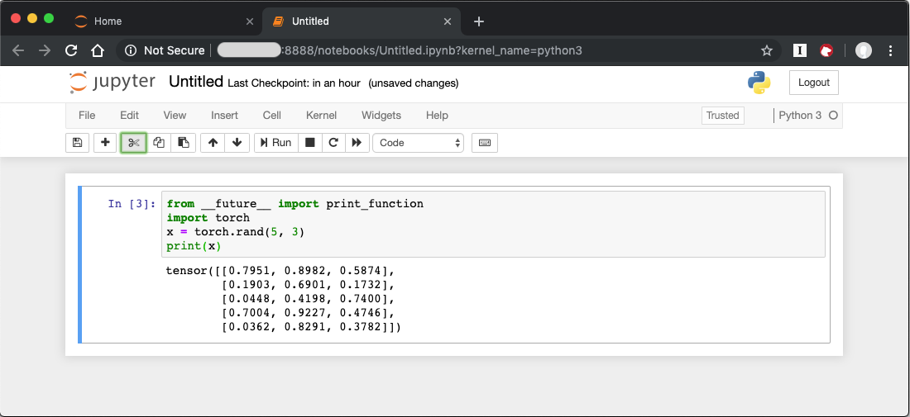

.. _dlrs:

Deep Learning Reference Stack
#############################

This guide gives examples for using the Deep Learning Reference stack to run real-world usecases, as well as benchmarking workloads for TensorFlow\*,
PyTorch\*, and Kubeflow\* in |CL-ATTR|.

.. contents::
   :local:
   :depth: 1

Overview
********

We created the Deep Learning Reference Stack to help AI developers deliver
the best experience on Intel® Architecture. This stack reduces complexity
common with deep learning software components, provides flexibility for
customized solutions, and enables you to quickly prototype and deploy Deep
Learning workloads. Use this guide to run benchmarking workloads on your
solution.

The Deep Learning Reference Stack is available in the following versions:

* `Intel MKL-DNN-VNNI`_, which is optimized using Intel® Math Kernel Library
  for Deep Neural Networks (Intel® MKL-DNN) primitives and introduces support
  for Intel® AVX-512 Vector Neural Network Instructions (VNNI).
* `Intel MKL-DNN`_, which includes the TensorFlow framework optimized using
  Intel® Math Kernel Library for Deep Neural Networks (Intel® MKL-DNN)
  primitives.
* `Eigen`_, which includes `TensorFlow`_ optimized for Intel® architecture.
* `PyTorch with OpenBLAS`_, which includes PyTorch with OpenBlas.
* `PyTorch with Intel MKL-DNN`_, which includes PyTorch optimized using Intel®
  Math Kernel Library (Intel® MKL) and Intel MKL-DNN.

.. important::

   To take advantage of the Intel® AVX-512 and VNNI functionality (including the MKL-DNN releases)  with the Deep
   Learning Reference Stack, you must use the following hardware:

   * Intel® AVX-512 images require an Intel® Xeon® Scalable Platform
   * VNNI requires a 2nd generation Intel® Xeon® Scalable Platform

Stack features
==============

* `DLRS V4.0`_ release announcement, including benchmark results.
* `DLRS V3.0`_ release announcement.
* Deep Learning Reference Stack v2.0 including current
  `PyTorch benchmark`_.
* Deep Learning Reference Stack v1.0 including current
  `TensorFlow benchmark`_ results.
* `DLRS Release notes`_  on Github\* for the latest release of Deep Learning
  Reference Stack.

.. note::

   The Deep Learning Reference Stack is a collective work, and each piece of
   software within the work has its own license.  Please see the `DLRS Terms of Use`_
   for more details about licensing and usage of the Deep Learning Reference Stack.

Prerequisites
=============

* :ref:`Install <bare-metal-install-desktop>` |CL| on your host system
* :command:`containers-basic` bundle
* :command:`cloud-native-basic` bundle

In |CL|, :command:`containers-basic` includes Docker\*, which is required for
TensorFlow and PyTorch benchmarking. Use the :command:`swupd` utility to
check if :command:`containers-basic` and :command:`cloud-native-basic` are
present:

.. code-block:: bash

   sudo swupd bundle-list

To install the :command:`containers-basic` or :command:`cloud-native-basic`
bundles, enter:

.. code-block:: bash

   sudo swupd bundle-add containers-basic cloud-native-basic

Docker is not started upon installation of the :command:`containers-basic`
bundle. To start Docker, enter:

.. code-block:: bash

   sudo systemctl start docker

To ensure that Kubernetes is correctly installed and configured, follow the
instructions in :ref:`kubernetes`.

Version compatibility
=====================

We validated these steps against the following software package versions:

* |CL| 26240 (Minimum supported version)
* Docker 18.06.1
* Kubernetes 1.11.3
* Go 1.11.12

.. note::

   The Deep Learning Reference Stack was developed to provide the best user
   experience when executed on a |CL| host.  However, as the stack runs in a
   container environment, you should be able to complete the following sections of this guide on other Linux* distributions, provided they comply with the Docker*, Kubernetes* and Go* package versions listed above. Look for your distribution documentation on how to update packages and manage Docker services.

TensorFlow single and multi-node benchmarks
*******************************************

This section describes running the `TensorFlow Benchmarks`_ in single node.
For multi-node testing, replicate these steps for each node. These steps
provide a template to run other benchmarks, provided that they can invoke
TensorFlow.

.. note::

   Performance test results for the Deep Learning Reference Stack and for this
   guide were obtained using `runc` as the runtime.

#. Download either the `Eigen`_ or the `Intel MKL-DNN`_ Docker image
   from `Docker Hub`_.

#. Run the image with Docker:

   .. code-block:: bash

      docker run --name <image name>  --rm -i -t <clearlinux/
      stacks-dlrs-TYPE> bash

   .. note::

      Launching the Docker image with the :command:`-i` argument starts
      interactive mode within the container. Enter the following commands in
      the running container.

#. Clone the benchmark repository in the container:

   .. code-block:: bash

      git clone http://github.com/tensorflow/benchmarks -b cnn_tf_v1.12_compatible

#. Execute the benchmark script:

   .. code-block:: bash

      python benchmarks/scripts/tf_cnn_benchmarks/tf_cnn_benchmarks.py --device=cpu --model=resnet50 --data_format=NHWC

.. note::

   You can replace the model with one of your choice supported by the
   TensorFlow benchmarks.

   If you are using an FP32 based model, it can be converted to an int8 model
   using `Intel® quantization tools`_.

PyTorch single and multi-node benchmarks
****************************************

This section describes running the `PyTorch benchmarks`_ for Caffe2 in
single node.

#. Download either the `PyTorch with OpenBLAS`_ or the `PyTorch with Intel
   MKL-DNN`_ Docker image from `Docker Hub`_.

#. Run the image with Docker:

   .. code-block:: bash

      docker run --name <image name>  --rm -i -t <clearlinux/stacks-dlrs-TYPE> bash

   .. note::

      Launching the Docker image with the :command:`-i` argument starts
      interactive mode within the container. Enter the following commands in
      the running container.

#. Clone the benchmark repository:

   .. code-block:: bash

      git clone https://github.com/pytorch/pytorch.git

#. Execute the benchmark script:

   .. code-block:: bash

       cd pytorch/caffe2/python
       python convnet_benchmarks.py --batch_size 32 \
                             --cpu \
                             --model AlexNet

Kubeflow multi-node benchmarks
******************************

The benchmark workload runs in a Kubernetes cluster. The guide uses
`Kubeflow`_ for the Machine Learning workload deployment on three nodes.

.. warning::

   If you choose the Intel® MKL-DNN or Intel® MKL-DNN-VNNI image, your platform
   must support the Intel® AVX-512 instruction set. Otherwise, an
   *illegal instruction* error may appear, and you won’t be able to complete this guide.

Kubernetes setup
================

Follow the instructions in the :ref:`kubernetes` tutorial to get set up on
|CL|. The Kubernetes community also has instructions for creating a cluster,
described in `Creating a single control-plane cluster with kubeadm`_.

Kubernetes networking
=====================

We used `flannel`_ as the network provider for these tests. If you
prefer a different network layer, refer to the Kubernetes network documentation
described in `Creating a single control-plane cluster with kubeadm`_ for setup.

Kubectl
=======

You can use kubectl to run commands against your Kubernetes cluster.  Refer to
the `Overview of kubectl`_ for details on syntax and operations. Once you have a
working cluster on Kubernetes, use the following YAML script to start a pod with
a simple shell script, and keep the pod open.

#. Copy this example.yaml script to your system:

   .. code-block:: console

      apiVersion: v1
      kind: Pod
      metadata:
        name: example-pod
        labels:
          app: ex-pod
      spec:
        containers:
        - name: ex-pod-container
          image: clearlinux/stacks-dlrs-mkl:latest
          command: ['/bin/bash', '-c', '--']
          args: [ "while true; do sleep 30; done" ]

#. Execute the script with kubectl:

   .. code-block:: bash

      kubectl apply –f <path-to-yaml-file>/example.yaml

This script opens a single pod. More robust solutions would create a deployment
or inject a python script or larger shell script into the container.

Images
======

You must add `launcher.py`_ to the Docker image to include the Deep
Learning Reference Stack and put the benchmarks repo in the correct
location. Note that this guide uses Kubeflow v0.4.0, and cannot guarantee results if you use a different version.

From the Docker image, run the following:

.. code-block:: bash

   mkdir -p /opt
   git clone https://github.com/tensorflow/benchmarks.git /opt/tf-benchmarks
   cp launcher.py /opt
   chmod u+x /opt/*

Your entry point becomes: :file:`/opt/launcher.py`.

This builds an image that can be consumed directly by TFJob from Kubeflow.

ksonnet\*
=========

Kubeflow uses ksonnet\* to manage deployments, so you must install it
before setting up Kubeflow.

ksonnet was added to the :command:`cloud-native-basic` bundle in |CL| version
27550. If you are using an older |CL| version (not recommended), you must
manually install ksonnet as described below.

On |CL|, follow these steps:

.. code-block:: bash

   swupd bundle-add go-basic-dev
   export GOPATH=$HOME/go
   export PATH=$PATH:$GOPATH/bin
   go get github.com/ksonnet/ksonnet
   cd $GOPATH/src/github.com/ksonnet/ksonnet
   make install

After the ksonnet installation is complete, ensure that binary `ks` is
accessible across the environment.

Kubeflow
========

Once you have Kubernetes running on your nodes, set up `Kubeflow`_ by
following these instructions from the `Getting Started with Kubeflow`_ guide.

.. code-block:: bash

   export KUBEFLOW_SRC=$HOME/kflow
   export KUBEFLOW_TAG="v0.4.1"
   export KFAPP="kflow_app"
   export K8S_NAMESPACE="kubeflow"

   mkdir ${KUBEFLOW_SRC}
   cd ${KUBEFLOW_SRC}
   ks init ${KFAPP}
   cd ${KFAPP}
   ks registry add kubeflow github.com/kubeflow/kubeflow/tree/${KUBEFLOW_TAG}/kubeflow
   ks pkg install kubeflow/common
   ks pkg install kubeflow/tf-training

Next, deploy the primary package for our purposes: tf-job-operator.

.. code-block:: bash

   ks env rm default
   kubectl create namespace ${K8S_NAMESPACE}
   ks env add default --namespace "${K8S_NAMESPACE}"
   ks generate tf-job-operator tf-job-operator
   ks apply default -c tf-job-operator

This creates the CustomResourceDefinition (CRD) endpoint to launch a TFJob.

Run a TFJob
===========

#. Get the ksonnet registries for deploying TFJobs from `dlrs-tfjob`_.

#. Install the TFJob components as follows:

   .. code-block:: bash

      ks registry add dlrs-tfjob github.com/clearlinux/dockerfiles/tree/master/stacks/dlrs/kubeflow/dlrs-tfjob

      ks pkg install dlrs-tfjob/dlrs-bench

#. Export the image name to use for the deployment:

   .. code-block:: bash

      export DLRS_IMAGE=<docker_name>

   .. note::

      Replace <docker_name> with the image name you specified in previous steps.

#. Generate Kubernetes manifests for the workloads and apply them using these
   commands:

   .. code-block:: bash

      ks generate dlrs-resnet50 dlrsresnet50 --name=dlrsresnet50 --image=${DLRS_IMAGE}
      ks generate dlrs-alexnet dlrsalexnet --name=dlrsalexnet --image=${DLRS_IMAGE}
      ks apply default -c dlrsresnet50
      ks apply default -c dlrsalexnet

This replicates and deploys three test setups in your Kubernetes cluster.

Results of running this section
===============================

You must parse the logs of the Kubernetes pod to retrieve performance
data. The pods will still exist post-completion and will be in
‘Completed’ state. You can get the logs from any of the pods to inspect the
benchmark results. More information about Kubernetes logging is available
in the Kubernetes `Logging Architecture`_ documentation.

TensorFlow Training (TFJob) with Kubeflow and DLRS
**************************************************

A `TFJob`_  is Kubeflow's custom resource used to run TensorFlow training jobs on Kubernetes. This example shows how to use a TFJob within the DLRS container.

Pre-requisites:

* A running :ref:`kubernetes` cluster

#. Deploying Kubeflow with kfctl/kustomize in |CL|

.. note::

   This example proposes a Kubeflow installation with the binary kfctl maintained by `Arrikto`_. Please download the `kfctl tarball`_ to complete the following steps

#. Download, untar and add to your PATH if necessary

   .. code-block:: bash

      KFCTL_URL="https://github.com/kubeflow/kubeflow/releases/download/v0.6.1/kfctl_v0.6.1_linux.tar.gz"
      wget -P ${KFCTL_URL} ${KFCTL_PATH}
      tar -C ${KFCTL_PATH} -xvf ${KFCTL_PATH}/kfctl_v${kfctl_ver}_linux.tar.gz
      export PATH=$PATH:${KFCTL_PATH}

#. Install `MetalLB`_

   .. code-block:: bash

      kubectl apply -f https://raw.githubusercontent.com/google/metallb/v0.8.1/manifests/metallb.yaml

#. Install Kubeflow resource and TFJob operators

   .. code-block:: bash

      # Env variables needed for your deployment
      export KFAPP="<your choice of application directory name>"
      export CONFIG="https://raw.githubusercontent.com/kubeflow/kubeflow/master/bootstrap/config/kfctl_existing_arrikto.yaml"

      kfctl init ${KFAPP} --config=${CONFIG} -V
      cd ${KFAPP}

      # deploy Kubeflow:
      kfctl generate k8s -V
      kfctl apply k8s -V

#. List the resources

   Deployment takes around 15 minutes (or more depending on the hardware) to be ready to use. After that you can use kubectl to list all the Kubeflow resources deployed and monitor their status.

   .. code-block:: bash

      kubectl get pods -n kubeflow

Submitting TFJobs
=================

We provide several `DLRS TFJob`_ examples that use the Deep Learning Reference Stack as the base image for creating the containers to run training workloads in your Kubernetes cluster.

Customizing a TFJob
===================

A TFJob is a resource with a YAML representation like the one below. Edit to use the DLRS image containing the code to be executed and modify the command for your own training code.

If you'd like to modify the number and type of replicas, resources, persistent volumes and environment variables, please refer to the `Kubeflow documentation`_

.. code-block:: console

      apiVersion: kubeflow.org/v1beta2
      kind: TFJob
      metadata:
        generateName: tfjob
        namespace: kubeflow
      spec:
        tfReplicaSpecs:
          PS:
            replicas: 1
            restartPolicy: OnFailure
            template:
              spec:
                containers:
                - name: tensorflow
                  image: dlrs-image
                  command:
                    - python
                    - -m
                    - trainer.task
                    - --batch_size=32
                    - --training_steps=1000
          Worker:
            replicas: 3
            restartPolicy: OnFailure
            template:
              spec:
                containers:
                - name: tensorflow
                  image: dlrs-image
                  command:
                    - python
                    - -m
                    - trainer.task
                    - --batch_size=32
                    - --training_steps=1000
          Master:
                replicas: 1
                restartPolicy: OnFailure
                template:
                  spec:
                    containers:
                    - name: tensorflow
                      image: dlrs-image
                      command:
                        - python
                        - -m
                        - trainer.task
                        - --batch_size=32
                        - --training_steps=1000

For more information, please refer to:
* `Distributed TensorFlow`_
* `TFJobs`_

PyTorch Training (PyTorch Job) with Kubeflow and DLRS
*****************************************************

A `PyTorch Job`_ is Kubeflow's custom resource used to run PyTorch training jobs on Kubernetes. This example builds on the framework set up in the previous example.

Pre-requisites:

* A running :ref:`kubernetes` cluster
* Please follow steps 1 - 5 of the previous example to set up your environment.

Submitting PyTorch Jobs
=======================

We provide several `DLRS PytorchJob`_ examples that use the Deep Learning Reference Stack as the base image for creating the container(s) that will run training workloads in your Kubernetes cluster.
Select one form the list below:

Using Kubeflow Seldon and OpenVINO* with the Deep Learning Reference Stack
**************************************************************************

`Seldon Core`_  is an open source platform for deploying machine learning models on a Kubernetes cluster.  Seldon Core is supported in the `DLRS V4.0`_ release.

Pre-requisites
==============
* A running :ref:`kubernetes` cluster

.. note::

   Instead of using Arrikto's configuration manifest as shown  in the preceeding example, you should use the manifest provided by `Istio`_, for this example, as Seldon deployments depend on it.

#. Install deployment tools

   .. code-block:: bash

      INSTALL_DIR=$HOME/install_dir
      BIN_DIR=${INSTALL_DIR}/bin
      SRC_DIR=${INSTALL_DIR}/source
      export PATH=${BIN_DIR}:$PATH

      mkdir -p ${BIN_DIR} && mkdir ${SRC_DIR}
      cd ${SRC_DIR}

#. Install Helm*

   .. code-block:: bash

      wget https://get.helm.sh/helm-v2.14.3-linux-amd64.tar.gz && tar xf helm-v2.14.3-linux-amd64.tar.gz
      mv linux-amd64/helm ${BIN_DIR}/helm

#. Clean the environment

   .. code-block:: bash

      rm -rf ${SRC_DIR}/*

#. Prepare the DLRS image

   The DLRS base image needs to be rebuilt with the `Dockerfile_openvino_base`_  to add Seldon and the OpenVINO inference engine.

   .. code-block:: bash

      docker build -f Dockerfile_openvino_base -t dlrs_openvino_base:0.1 .

#. Mount pre-trained models into a persistent volume

   This will also apply all PV manifests to the cluster

   .. code-block:: bash

      kubectl apply -f storage/pv-volume.yaml
      kubectl apply -f storage/model-store-pvc.yaml
      kubectl apply -f storage/pv-pod.yaml

#. Start a shell for the container used as pv:

   .. code-block:: bash

      kubectl exec -it hostpath-pvc -- /bin/bash

#. Save pre-trained models

   Now that you're inside the running container, fetch your pre-trained models and save them at `/opt/ml`

   .. code-block:: bash

      root@hostpath-pvc:/# cd /opt/ml
      root@hostpath-pvc:/# # Copy your models here
      root@hostpath-pvc:/# # exit

#. Deploy the model server

   Now you're ready to deploy the model server using the Helm chart provided.

   .. code-block:: bash

       helm install -- name=seldonov-model-server \
          --namespace kubeflow \
          --set openvino.image=dlrs_openvino_base:0.1 \
          --set openvino.model.path=/opt/ml/<models_directory> \
          --set openvino.model.name=<model_name> \
          --set openvino.model.input=data \
          --set openvino.model.output=prob
          dlrs-seldon/helm/seldon-model-server

Using the Intel® OpenVINO Model Optimizer
*****************************************

The Intel OpenVINO toolkit has two primary tools for deep learning, the inference engine and the model optimizer. The inference engine is integrated into the Deep Learning Reference Stack. It is better to use the model optimizer after training the model, and before inference begins. This example will explain how to use the model optimizer by going through a test case with a pre-trained TensorFlow model.

This example uses resources found in the following OpenVino Toolkit documentation.

`Converting a TensorFlow Model`_

`Converting TensorFlow Object Detection API Models`_

In this example, you will:

* Download a TensorFlow model
* Clone the Model Optimizer
* Install Prerequisites
* Run the Model Optimizer

#. Download a TensorFlow model

   We will be using an OpenVINO supported topology with the Model Optimizer. We will use a TensorFlow Inception V2 frozen model.

   Navigate to the `OpenVINO TensorFlow Model page`_. Then scroll down to the second section titled "Supported Frozen Topologies from TensorFlow Object Detection Models Zoo" and download "SSD Inception V2 COCO."

   Unpack the file into your chosen working directory. For example, if the tar file is in your Downloads folder and you have navigated to the directory you want to extract it into, run:

   .. code-block:: bash

     tar -xvf ~/Downloads/ssd_inception_v2_coco_2018_01_28.tar.gz

#. Clone the Model Optimizer

   Next we need the model optimizer directory, named `dldt`_.  This example  assumes the parent directory is on the same level as the model directory, ie:

   .. code-block:: console

      +--Working_Directory
         +-- ssd_inception_v2_coco_2018_01_28
         +-- dldt

   To clone the Model Optimizer, run this from inside the working directory:

   .. code-block:: bash

      git clone https://github.com/opencv/dldt.git

   If you explore the :file:`dldt` directory, you'll see both the inference engine and the model optimizer. We are only concerned with the model optimizer at this stage. Navigating into the model optimizer folder you'll find several python scripts and text files. These are the scripts you call to run the model optimizer.

#. Install Prerequisites for Model Optimizer

   Install the Python packages required to run the model optimizer by running the script dldt/model-optimizer/install_prerequisites/install_prerequisites_tf.sh.

   .. code-block:: bash

         cd dldt/model-optimizer/install_prerequisites/
         ./install_prerequisites_tf.sh
         cd ../../..

#. Run the Model Optimizer

   Running the model optimizer is as simple as calling the appropriate script, however there are many configuration options that are explainedin the documentation

   .. code-block:: bash

      python dldt/model-optimizer/mo_tf.py \
      --input_model=ssd_inception_v2_coco_2018_01_28/frozen_inference_graph.pb \
      --tensorflow_use_custom_operations_config dldt/model-optimizer/extensions/front/tf/ssd_v2_support.json \
      --tensorflow_object_detection_api_pipeline_config ssd_inception_v2_coco_2018_01_28/pipeline.config \
      --reverse_input_channels

   You should now see three files in your working directory, :file:`frozen_inference_graph.bin`, :file:`frozen_inference_graph.mapping`, and :file:`frozen_inference_graph.xml`. These are your new models in the Intermediate Representation (IR) format and they are ready for use in the OpenVINO Inference Engine.

Using the OpenVino Inference Engine
***********************************

This example walks through the basic instructions for using the inference engine.

#. Starting the Model Server

   The process is similar to how we start `Jupter notebooks` on our containers

   Run this command to spin up a OpenVino model fetched from GCP

   .. code-block:: bash

      docker run -p 8000:8000 stacks-tensorflow-mkl:latest bash -c ". /workspace/scripts/serve.sh && ie_serving model --model_name resnet --model_path gs://intelai_public_models/resnet_50_i8 --port 8000"

   Once the server is setup, use a :command:`grpc` client to communicate with served model:

   .. code-block:: bash

      git clone https://github.com/IntelAI/OpenVINO-model-server.git
      cd OpenVINO-model-server
      pip install -q -r OpenVINO-model-server/example_client/client_requirements.txt
      pip install --user -q -r OpenVINO-model-server/example_client/client_requirements.txt
      cat OpenVINO-model-server/example_client/client_requirements.txt
      cd OpenVINO-model-server/example_client

      python jpeg_classification.py --images_list input_images.txt --grpc_address localhost --grpc_port 8000 --input_name data --output_name prob --size 224 --model_name resnet

   The results of these commands will look like this:

   .. code-block:: console

         start processing:
         	Model name: resnet
         	Images list file: input_images.txt
         images/airliner.jpeg (1, 3, 224, 224) ; data range: 0.0 : 255.0
         Processing time: 97.00 ms; speed 2.00 fps 10.35
         Detected: 404  Should be: 404
         images/arctic-fox.jpeg (1, 3, 224, 224) ; data range: 0.0 : 255.0
         Processing time: 16.00 ms; speed 2.00 fps 63.89
         Detected: 279  Should be: 279
         images/bee.jpeg (1, 3, 224, 224) ; data range: 0.0 : 255.0
         Processing time: 14.00 ms; speed 2.00 fps 69.82
         Detected: 309  Should be: 309
         images/golden_retriever.jpeg (1, 3, 224, 224) ; data range: 0.0 : 255.0
         Processing time: 13.00 ms; speed 2.00 fps 75.22
         Detected: 207  Should be: 207
         images/gorilla.jpeg (1, 3, 224, 224) ; data range: 0.0 : 255.0
         Processing time: 11.00 ms; speed 2.00 fps 87.24
         Detected: 366  Should be: 366
         images/magnetic_compass.jpeg (1, 3, 224, 224) ; data range: 0.0 : 247.0
         Processing time: 11.00 ms; speed 2.00 fps 91.07
         Detected: 635  Should be: 635
         images/peacock.jpeg (1, 3, 224, 224) ; data range: 0.0 : 255.0
         Processing time: 9.00 ms; speed 2.00 fps 110.1
         Detected: 84  Should be: 84
         images/pelican.jpeg (1, 3, 224, 224) ; data range: 0.0 : 255.0
         Processing time: 10.00 ms; speed 2.00 fps 103.63
         Detected: 144  Should be: 144
         images/snail.jpeg (1, 3, 224, 224) ; data range: 0.0 : 248.0
         Processing time: 10.00 ms; speed 2.00 fps 104.33
         Detected: 113  Should be: 113
         images/zebra.jpeg (1, 3, 224, 224) ; data range: 0.0 : 255.0
         Processing time: 12.00 ms; speed 2.00 fps 83.04
         Detected: 340  Should be: 340
         Overall accuracy= 100.0 %
         Average latency= 19.8 ms

Use Jupyter Notebook
********************

This example uses the `PyTorch with OpenBLAS`_ container image. After it is
downloaded, run the Docker image with :command:`-p` to specify the shared port
between the container and the host. This example uses port 8888.

.. code-block:: bash

   docker run --name pytorchtest --rm -i -t -p 8888:8888 clearlinux/stacks-pytorch-oss bash

After you start the container, launch the Jupyter Notebook. This
command is executed inside the container image.

.. code-block:: bash

   jupyter notebook --ip 0.0.0.0 --no-browser --allow-root

After the notebook has loaded, you will see output similar to the following:

.. code-block:: console

   To access the notebook, open this file in a browser: file:///.local/share/jupyter/runtime/nbserver-16-open.html
   Or copy and paste one of these URLs:
   http://(846e526765e3 or 127.0.0.1):8888/?token=6357dbd072bea7287c5f0b85d31d70df344f5d8843fbfa09

From your host system, or any system that can access the host's IP address,
start a web browser with the following. If you are not running the browser on
the host system, replace :command:`127.0.0.1` with the IP address of the host.

.. code-block:: bash

  http://127.0.0.1:8888/?token=6357dbd072bea7287c5f0b85d31d70df344f5d8843fbfa09

Your browser displays the following:

.. figure:: ../_figures/stacks/dlrs-fig-1.png
   :scale: 50%
   :alt: Jupyter Notebook

Figure 1: :guilabel:`Jupyter Notebook`

To create a new notebook, click :guilabel:`New` and select :guilabel:`Python 3`.

.. figure:: ../_figures/stacks/dlrs-fig-2.png
   :scale: 50%
   :alt: Create a new notebook

Figure 2: Create a new notebook

A new, blank notebook is displayed, with a cell ready for input.

.. figure:: ../_figures/stacks/dlrs-fig-3.png
   :scale: 50%
   :alt: New blank notebook

To verify that PyTorch is working, copy the following snippet into the blank
cell, and run the cell.

.. code-block:: console

   from __future__ import print_function
   import torch
   x = torch.rand(5, 3)
   print(x)

.. figure:: ../_figures/stacks/dlrs-fig-4.png
   :scale: 50%
   :alt: Sample code snippet

When you run the cell, your output will look something like this:

You can continue working in this notebook, or you can download existing
notebooks to take advantage of the Deep Learning Reference Stack's optimized
deep learning frameworks. Refer to `Jupyter Notebook`_ for details.

Uninstallation
**************

To uninstall the Deep Learning Reference Stack, you can choose to stop the
container so that it is not using system resources, or you can stop the
container and delete it to free storage space.

To stop the container, execute the following from your host system:

#. Find the container's ID

   .. code-block:: bash

      docker container ls

   This will result in output similar to the following:

   .. code-block:: console

      CONTAINER ID        IMAGE                        COMMAND               CREATED             STATUS              PORTS               NAMES
      e131dc71d339        clearlinux/stacks-dlrs-oss   "/bin/sh -c 'bash'"   23 seconds ago      Up 21 seconds                           oss

#. You can then use the ID or container name to stop the container. This example
   uses the name "oss":

   .. code-block:: bash

      docker container stop oss

#. Verify that the container is not running

   .. code-block:: bash

      docker container ls

#. To delete the container from your system you need to know the Image ID:

   .. code-block:: bash

      docker images

   This command results in output similar to the following:

   .. code-block:: console

      REPOSITORY                   TAG                 IMAGE ID            CREATED             SIZE
      clearlinux/stacks-dlrs-oss   latest              82757ec1648a        4 weeks ago         3.43GB
      clearlinux/stacks-dlrs-mkl   latest              61c178102228        4 weeks ago         2.76GB

#. To remove an image use the image ID:

   .. code-block:: bash

      docker rmi 82757ec1648a

   .. code-block:: console

      # docker rmi 827
      Untagged: clearlinux/stacks-dlrs-oss:latest
      Untagged: clearlinux/stacks-dlrs-oss@sha256:381f4b604537b2cb7fb5b583a8a847a50c4ed776f8e677e2354932eb82f18898
      Deleted: sha256:82757ec1648a906c504e50e43df74ad5fc333deee043dbfe6559c86908fac15e
      Deleted: sha256:e47ecc039d48409b1c62e5ba874921d7f640243a4c3115bb41b3e1009ecb48e4
      Deleted: sha256:50c212235d3c33a3c035e586ff14359d03895c7bc701bb5dfd62dbe0e91fb486

   Note that you can execute the :command:`docker rmi` command using only the first few characters of the image ID, provided they are unique on the system.

#. Once you have removed the image, you can verify it has been deleted with:

   .. code-block:: bash

       docker images

Compiling AIXPRT with OpenMP on DLRS
************************************

To compile AIXPRT for DLRS, you will have to get the community edition of AIXPRT and update the `compile_AIXPRT_source.sh` file.AIXPRT utilizes
build configuration files, so to build AIXPRT on the image, copy, the build files from the base image, this can be done by adding these commands
to the end of the stacks-tensorflow-mkl dockerfile:

   .. code-block:: console

      COPY --from=base /dldt/inference-engine/bin/intel64/Release/ /usr/local/lib/openvino/tools/
      COPY --from=base /dldt/ /dldt/
      COPY ./airxprt/ /workspace/aixprt/
      RUN ./aixprt/install_deps.sh
      RUN ./aixprt/install_aixprt.sh

AIXPRT requires OpenCV. On |CL|, the OpenCV bundle also installs the DLDT components. To use AIXPRT in the DLRS environment you need to either remove the shared libraries for DLDT from :file:`/usr/lib64` before you run the tests, or ensure that the DLDT components in the :file:`/usr/local/lib` are being used for AIXPRT.  This can be achieved using adding LD_LIBRARY_PATH environment variable before testing.

   .. code-block:: bash

      export LD_LIBRARY_PATH=/usr/local/lib

The updates to the AIXPRT community edition have been captured in the diff file :file:`compile_AIXPRT_source.sh.patch`. The core of these changes relate to the version of model files(2019_R1) we download from the `OpenCV open model zoo`_ and location of the build files, which in our case is `/dldt`. Please refer to the patch files and make changes as necessary to the compile_AIXPRT_source.sh file as required for your environment.

Related topics
**************

* `DLRS V3.0`_ release announcement
* `TensorFlow Benchmarks`_
* `PyTorch benchmarks`_
* `Kubeflow`_
* :ref:`kubernetes` tutorial
* `Jupyter Notebook`_

.. _TensorFlow: https://www.tensorflow.org/

.. _Kubeflow: https://www.kubeflow.org/

.. _Docker Hub: https://hub.docker.com/

.. _TensorFlow Benchmarks: https://www.tensorflow.org/guide/performance/benchmarks

.. _PyTorch benchmarks: https://github.com/pytorch/pytorch/blob/master/caffe2/python/convnet_benchmarks.py

.. _Creating a single control-plane cluster with kubeadm: https://kubernetes.io/docs/setup/independent/create-cluster-kubeadm/

.. _flannel: https://github.com/coreos/flannel

.. _Getting Started with Kubeflow: https://www.kubeflow.org/docs/started/getting-started/

.. _Eigen: https://hub.docker.com/r/clearlinux/stacks-dlrs-oss/

.. _Intel MKL-DNN: https://hub.docker.com/r/clearlinux/stacks-dlrs-mkl/

.. _PyTorch with OpenBLAS: https://hub.docker.com/r/clearlinux/stacks-pytorch-oss

.. _PyTorch with Intel MKL-DNN: https://hub.docker.com/r/clearlinux/stacks-pytorch-mkl

.. _Intel MKL-DNN-VNNI: https://hub.docker.com/r/clearlinux/stacks-dlrs-mkl-vnni

.. _DLRS V3.0:  https://clearlinux.org/stacks/deep-learning-reference-stack-v3

.. _DLRS V4.0: https://clearlinux.org/news-blogs/deep-learning-reference-stack-v4

.. _dlrs-tfjob: https://github.com/clearlinux/dockerfiles/tree/master/stacks/dlrs/kubeflow/dlrs-tfjob

.. _Logging Architecture: https://kubernetes.io/docs/concepts/cluster-administration/logging/

.. _TensorFlow benchmark: https://clearlinux.org/stacks/deep-learning-reference-stack

.. _PyTorch benchmark: https://clearlinux.org/stacks/deep-learning-reference-stack-pytorch

.. _Jupyter Notebook: https://jupyter.org/

.. _Overview of kubectl: https://kubernetes.io/docs/reference/kubectl/overview/

.. _launcher.py: https://github.com/clearlinux/dockerfiles/tree/master/stacks/dlrs/kubeflow

.. _DLRS Terms of Use: https://clearlinux.org/stacks/deep-learning/terms-of-use

.. _DLRS Release notes: https://github.com/clearlinux/dockerfiles/blob/master/stacks/dlrs/releasenote.md

.. _Seldon Core: https://docs.seldon.io/projects/seldon-core/en/latest/

.. _Istio: https://raw.githubusercontent.com/kubeflow/kubeflow/master/bootstrap/config/kfctl_k8s_istio.yaml

.. _Dockerfile_openvino_base: https://github.com/clearlinux/dockerfiles/blob/master/stacks/dlrs/kubeflow/dlrs-seldon/docker/Dockerfile_openvino_base

.. _TFJob: https://www.kubeflow.org/docs/components/tftraining

.. _Arrikto: https://www.kubeflow.org/docs/started/k8s/kfctl-existing-arrikto/

.. _kfctl tarball: https://github.com/kubeflow/kubeflow/releases/download/v0.6.1/kfctl_v0.6.1_linux.tar.gz

.. _MetalLB: https://metallb.universe.tf/

.. _Kubeflow documentation: https://www.kubeflow.org/docs/components/tftraining/#what-is-tfjob

.. _Distributed TensorFlow: https://www.tensorflow.org/deploy/distributed
.. _TFJobs:  https://www.kubeflow.org/docs/components/tftraining/

.. _Intel® quantization tools:  https://github.com/IntelAI/tools/blob/master/tensorflow_quantization/README.md#quantization-tools

.. _OpenCV open model zoo: https://github.com/opencv/open_model_zoo

.. _PyTorch Job: https://www.kubeflow.org/docs/components/pytorch/

.. _Converting a TensorFlow Model: https://docs.openvinotoolkit.org/latest/_docs_MO_DG_prepare_model_convert_model_Convert_Model_From_TensorFlow.html

.. _Converting TensorFlow Object Detection API Models: https://docs.openvinotoolkit.org/latest/_docs_MO_DG_prepare_model_convert_model_tf_specific_Convert_Object_Detection_API_Models.html

.. _OpenVINO TensorFlow Model page: https://docs.openvinotoolkit.org/latest/_docs_MO_DG_prepare_model_convert_model_Convert_Model_From_TensorFlow.html

.. _dldt: https://github.com/opencv/dldt

.. _DLRS TFJob: https://github.com/clearlinux/dockerfiles/tree/master/stacks/dlrs/kubeflow/dlrs-tfjob

.. _DLRS PytorchJob: https://github.com/clearlinux/dockerfiles/tree/master/stacks/dlrs/kubeflow/dlrs-pytorchjob
