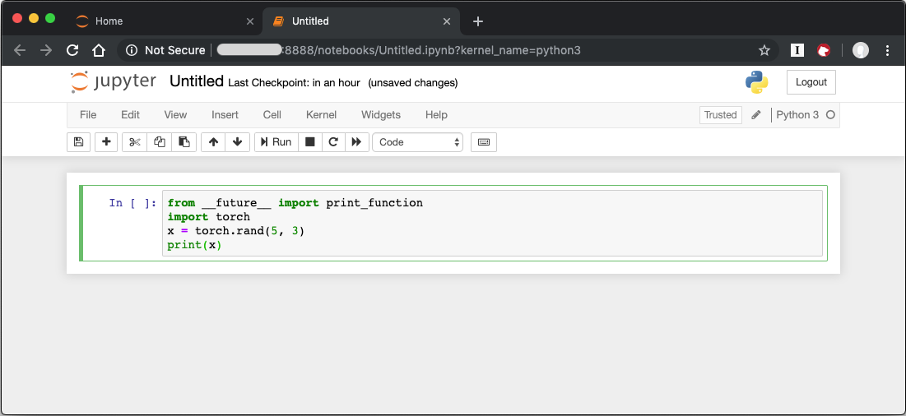

.. _dlrs:

Deep Learning Reference Stack
#############################

This tutorial describes how to run benchmarking workloads for TensorFlow\*,
PyTorch\*, and Kubeflow in |CL-ATTR| using the Deep Learning Reference Stack.

.. contents::
   :local:
   :depth: 1

Overview
********

We created the Deep Learning Reference Stack to help AI developers deliver the
best experience on Intel® Architecture. This stack reduces complexity common
with deep learning software components, provides flexibility for customized
solutions, and enables you to quickly prototype and deploy Deep Learning
workloads. Use this tutorial to run benchmarking workloads on your solution.

The Deep Learning Reference Stack is available in the following versions:

* `Intel MKL-DNN-VNNI`_, which is optimized using Intel® Math Kernel Library
  for Deep Neural Networks (Intel® MKL-DNN) primitives and introduces support
  for Intel® AVX-512 Vector Neural Network Instructions (VNNI).
* `Intel MKL-DNN`_, which includes the TensorFlow framework optimized using
  Intel® Math Kernel Library for Deep Neural Networks (Intel® MKL-DNN) primitives.
* `Eigen`_, which includes `TensorFlow`_ optimized for Intel® architecture.
* `PyTorch with OpenBLAS`_, which includes PyTorch with OpenBlas.
* `PyTorch with Intel MKL-DNN`_, which includes PyTorch optimized using Intel®
  Math Kernel Library (Intel® MKL) and Intel MKL-DNN.

.. note::

   To take advantage of the Intel® AVX-512 and VNNI functionality with the Deep
   Learning Reference Stack, you must use the following hardware:

   * Intel® AVX-512 images require an Intel® Xeon® Scalable Platform
   * VNNI requires a 2nd generation Intel® Xeon® Scalable Platform

Stack features
==============

* Deep Learning Reference Stack `V3.0 release announcement`_.
* Deep Learning Reference Stack v2.0 including current `PyTorch benchmark results`_.
* Deep Learning Reference Stack v1.0 including current `TensorFlow benchmark results`_.
* `Release notes on Github\*`_ for the latest release of Deep Learning Reference Stack.

.. note::

   Performance test results for the Deep Learning Reference Stack were
   obtained using `runc` as the runtime.

Prerequisites
=============

* :ref:`Install <bare-metal-install-desktop>` |CL| on your host system.
* :command:`containers-basic` bundle
* :command:`cloud-native-basic` bundle

In |CL|, :command:`containers-basic` includes Docker\*, which is required for
TensorFlow and PyTorch benchmarking. Use the :command:`swupd` utility to
check if :command:`containers-basic` and :command:`cloud-native-basic` are present:

.. code-block:: bash

   sudo swupd bundle-list

To install the :command:`containers-basic` or :command:`cloud-native-basic` bundles, enter:

.. code-block:: bash

   sudo swupd bundle-add containers-basic cloud-native-basic

Docker is not started upon installation of the :command:`containers-basic`
bundle. To start Docker, enter:

.. code-block:: bash

   sudo systemctl start docker

To ensure that Kubernetes is correctly installed and configured, follow the
instructions in :ref:`kubernetes`.

Version compatibility
=====================

We validated these steps against the following software package versions:

* |CL| 26240 (Lower version not supported.)
* Docker 18.06.1
* Kubernetes 1.11.3
* Go 1.11.12

TensorFlow single and multi-node benchmarks
*******************************************

This section describes running the `TensorFlow benchmarks`_ in single node.
For multi-node testing, replicate these steps for each node. These steps
provide a template to run other benchmarks, provided that they can invoke
TensorFlow.

#. Download either the `Eigen`_ or the `Intel MKL-DNN`_ Docker image
   from `Docker Hub`_.

#. Run the image with Docker:

   .. code-block:: bash

      docker run --name <image name>  --rm -i -t <clearlinux/
      stacks-dlrs-TYPE> bash

   .. note::

      Launching the Docker image with the :command:`-i` argument starts
      interactive mode within the container. Enter the following commands in
      the running container.

#. Clone the benchmark repository in the container:

   .. code-block:: bash

      git clone http://github.com/tensorflow/benchmarks -b cnn_tf_v1.12_compatible

#. Execute the benchmark script:

   .. code-block:: bash

      python benchmarks/scripts/tf_cnn_benchmarks/tf_cnn_benchmarks.py --device=cpu --model=resnet50 --data_format=NHWC

.. note::

   You can replace the model with one of your choice supported by the
   TensorFlow benchmarks.

   If you are using an FP32 based model, it can be converted to an int8 model using `Intel® quantization tools`_
   

PyTorch single and multi-node benchmarks
****************************************

This section describes running the `PyTorch benchmarks`_ for Caffe2 in
single node.

#. Download either the `PyTorch with OpenBLAS`_ or the `PyTorch with Intel
   MKL-DNN`_ Docker image from `Docker Hub`_.

#. Run the image with Docker:

   .. code-block:: bash

      docker run --name <image name>  --rm -i -t <clearlinux/stacks-dlrs-TYPE> bash

   .. note::

      Launching the Docker image with the :command:`-i` argument starts
      interactive mode within the container. Enter the following commands in
      the running container.

#. Clone the benchmark repository:

   .. code-block:: bash

      git clone https://github.com/pytorch/pytorch.git

#. Execute the benchmark script:

   .. code-block:: bash

       cd pytorch/caffe2/python
       python convnet_benchmarks.py --batch_size 32 \
                             --cpu \
                             --model AlexNet

Kubeflow multi-node benchmarks
******************************

The benchmark workload runs in a Kubernetes cluster. The tutorial uses
`Kubeflow`_ for the Machine Learning workload deployment on three nodes.

Kubernetes setup
================

Follow the instructions in the :ref:`kubernetes` tutorial to get set up on
|CL|. The Kubernetes community also has
`instructions for creating a cluster`_.

Kubernetes networking
=====================

We used `flannel`_ as the network provider for these tests. If you
prefer a different network layer, refer to the Kubernetes
`networking documentation`_ for setup.

Images
======

You must add `launcher.py` to the Docker image to include the Deep
Learning Reference Stack and put the benchmarks repo in the correct
location. From the Docker image, run the following:

.. code-block:: bash

   mkdir -p /opt
   git clone https://github.com/tensorflow/benchmarks.git /opt/tf-benchmarks
   cp launcher.py /opt
   chmod u+x /opt/*

Your entry point becomes: :file:`/opt/launcher.py`

This builds an image that can be consumed directly by TFJob from Kubeflow.

ksonnet\*
=========

Kubeflow uses ksonnet\* to manage deployments, so you must install it
before setting up Kubeflow.

ksonnet was added to the :command:`cloud-native-basic` bundle in |CL| version 27550. If
you are using an older |CL| version (not recommended), you must manually
install ksonnet as described below.

On |CL|, follow these steps:

.. code-block:: bash

   swupd bundle-add go-basic-dev
   export GOPATH=$HOME/go
   export PATH=$PATH:$GOPATH/bin
   go get github.com/ksonnet/ksonnet
   cd $GOPATH/src/github.com/ksonnet/ksonnet
   make install

After the ksonnet installation is complete, ensure that binary `ks` is
accessible across the environment.

Kubeflow
========

Once you have Kubernetes running on your nodes, set up `Kubeflow`_ by
following these instructions from the `quick start guide`_.

.. code-block:: bash

   export KUBEFLOW_SRC=$HOME/kflow
   export KUBEFLOW_TAG="v0.4.1"
   export KFAPP="kflow_app"
   export K8S_NAMESPACE="kubeflow"

   mkdir ${KUBEFLOW_SRC}
   cd ${KUBEFLOW_SRC}
   ks init ${KFAPP}
   cd ${KFAPP}
   ks registry add kubeflow github.com/kubeflow/kubeflow/tree/${KUBEFLOW_TAG}/kubeflow
   ks pkg install kubeflow/common
   ks pkg install kubeflow/tf-training

Next, deploy the primary package for our purposes: tf-job-operator.

.. code-block:: bash

   ks env rm default
   kubectl create namespace ${K8S_NAMESPACE}
   ks env add default --namespace "${K8S_NAMESPACE}"
   ks generate tf-job-operator tf-job-operator
   ks apply default -c tf-job-operator

This creates the CustomResourceDefinition (CRD) endpoint to launch a TFJob.

Run a TFJob
===========

#. Select this link for the `ksonnet registries for deploying TFJobs`_.

#. Install the TFJob components as follows:

   .. code-block:: bash

      ks registry add dlrs-tfjob github.com/clearlinux/dockerfiles/tree/master/stacks/dlrs/kubeflow/dlrs-tfjob

      ks pkg install dlrs-tfjob/dlrs-bench

#. Export the image name to use for the deployment:

   .. code-block:: bash

      export DLRS_IMAGE=<docker_name>

   .. note::

      Replace <docker_name> with the image name you specified in previous steps.

#. Generate Kubernetes manifests for the workloads and apply them using these commands:

   .. code-block:: bash

      ks generate dlrs-resnet50 dlrsresnet50 --name=dlrsresnet50 --image=${DLRS_IMAGE}
      ks generate dlrs-alexnet dlrsalexnet --name=dlrsalexnet --image=${DLRS_IMAGE}
      ks apply default -c dlrsresnet50
      ks apply default -c dlrsalexnet

This replicates and deploys three test setups in your Kubernetes cluster.

Results of running this tutorial
================================

You must parse the logs of the Kubernetes pod to retrieve performance
data. The pods will still exist post-completion and will be in
‘Completed’ state. You can get the logs from any of the pods to inspect the
benchmark results. More information about `Kubernetes logging`_ is available
from the Kubernetes community.

Use Jupyter Notebook
********************

This example uses the `PyTorch with OpenBLAS`_ container image. After it is
downloaded, run the Docker image with :command:`-p` to specify the shared port
between the container and the host. This example uses port 8888.

.. code-block:: bash

   docker run --name pytorchtest --rm -i -t -p 8888:8888 clearlinux/stacks-pytorch-oss bash

After you start the container, launch the Jupyter Notebook. This
command is executed inside the container image.

.. code-block:: bash

   jupyter notebook --ip 0.0.0.0 --no-browser --allow-root

After the notebook has loaded, you will see output similar to the following:

.. code-block:: console

   To access the notebook, open this file in a browser: file:///.local/share/jupyter/runtime/nbserver-16-open.html
   Or copy and paste one of these URLs:
   http://(846e526765e3 or 127.0.0.1):8888/?token=6357dbd072bea7287c5f0b85d31d70df344f5d8843fbfa09

From your host system, or any system that can access the host's IP address,
start a web browser with the following. If you are not running the browser on
the host system, replace :command:`127.0.0.1` with the IP address of the host.

.. code-block:: bash

  http://127.0.0.1:8888/?token=6357dbd072bea7287c5f0b85d31d70df344f5d8843fbfa09

Your browser displays the following:

.. figure:: figures/dlrs-fig-1.png
   :scale: 50 %
   :alt: Jupyter Notebook

Figure 1: :guilabel:`Jupyter Notebook`

To create a new notebook, click :guilabel:`New` and select :guilabel:`Python 3`.

.. figure:: figures/dlrs-fig-2.png
   :scale: 50%
   :alt: Create a new notebook

Figure 2: Create a new notebook

A new, blank notebook is displayed, with a cell ready for input.

.. figure:: figures/dlrs-fig-3.png
   :scale: 50%
   :alt: New blank notebook

To verify that PyTorch is working, copy the following snippet into the blank cell, and run the cell.

.. code-block:: console

   from __future__ import print_function
   import torch
   x = torch.rand(5, 3)
   print(x)

When you run the cell, your output will look something like this:

.. figure:: figures/dlrs-fig-5.png
   :scale: 50%
   :alt: code output

You can continue working in this notebook, or you can download existing
notebooks to take advantage of the Deep Learning Reference Stack's optimized
deep learning frameworks. Refer to `Jupyter Notebook`_ for details.

Related topics
**************

* Deep Learning Reference Stack `V3.0 release announcement`_
* `TensorFlow benchmarks`_
* `PyTorch benchmarks`_
* `Kubeflow`_
* :ref:`kubernetes` tutorial
* `Jupyter Notebook`_

.. _TensorFlow: https://www.tensorflow.org/

.. _Kubeflow: https://www.kubeflow.org/

.. _Docker Hub: https://hub.docker.com/

.. _TensorFlow benchmarks: https://www.tensorflow.org/guide/performance/benchmarks

.. _PyTorch benchmarks: https://github.com/pytorch/pytorch/blob/master/caffe2/python/convnet_benchmarks.py

.. _instructions for creating a cluster: https://kubernetes.io/docs/setup/independent/create-cluster-kubeadm/

.. _flannel: https://github.com/coreos/flannel

.. _networking documentation: https://kubernetes.io/docs/setup/independent/create-cluster-kubeadm/#pod-network

.. _quick start guide: https://www.kubeflow.org/docs/started/getting-started/

.. _Eigen: https://hub.docker.com/r/clearlinux/stacks-dlrs-oss/

.. _Intel MKL-DNN: https://hub.docker.com/r/clearlinux/stacks-dlrs-mkl/

.. _PyTorch with OpenBLAS: https://hub.docker.com/r/clearlinux/stacks-pytorch-oss

.. _PyTorch with Intel MKL-DNN: https://hub.docker.com/r/clearlinux/stacks-pytorch-mkl

.. _Intel MKL-DNN-VNNI: https://hub.docker.com/r/clearlinux/stacks-dlrs-mkl-vnni

.. _V3.0 release announcement:  https://clearlinux.org/stacks/deep-learning-reference-stack-v3

.. _ksonnet registries for deploying TFJobs: https://github.com/clearlinux/dockerfiles/tree/master/stacks/dlrs/kubeflow/dlrs-tfjob

.. _Kubernetes logging: https://kubernetes.io/docs/concepts/cluster-administration/logging/

.. _TensorFlow benchmark results: https://clearlinux.org/stacks/deep-learning-reference-stack

.. _PyTorch benchmark results: https://clearlinux.org/stacks/deep-learning-reference-stack-pytorch

.. _Jupyter Notebook: https://jupyter.org/

.. _Release notes on Github\*: https://github.com/clearlinux/dockerfiles/blob/master/stacks/dlrs/releasenote.md

.. _Intel® quantization tools:  https://github.com/IntelAI/tools/blob/master/tensorflow_quantization/README.md#quantization-tools
