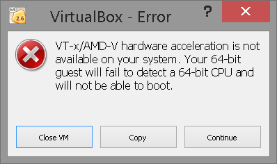

.. _vm-virtualbox:

Using VirtualBox*
#################

This section explains how to run |CLOSIA|
inside a `VirtualBox`_\* environment.

Download VirtualBox
===================

VirtualBox is a hypervisor supported by Oracle. You can
download it from the `official VirtualBox website`_ and select
the operating system you are using.

Download **version 5.0 or greater** to ensure support for
the :abbr:`AVX (Advanced Vector Extensions)` needed to run
|CLOSIA|

Create a virtual machine in VirtualBox
======================================

#. Download the `latest`_ **live** version (clear-XXXX-live.img.xz)
   from https://download.clearlinux.org/image/.

#. Decompress the downloaded image. Uncompressed image size is ~ **5GB**.

   + On Linux ::

       $ xz -d clear-XXXX-live.img.xz

   + On Windows you can use `7zip`_.

     - Right-click the file to *extract in the same directory*.

       .. image:: _static/images/7zipwin.png
          :alt: 7zip extract here command

#. To convert a raw image to :abbr:`VDI (VirtualBox Disk Image)`
   format, you can use one of the following commands::

      $ VBoxManage convertfromraw clear-XXXX-live.img clear-XXXX-live.vdi --format VDI

   or::

      $ vbox-img convert --srcfilename clear-XXXX-live.img --dstfilename clear-XXXX-live.vdi --srcformat raw --dstformat vdi

   .. note:: Be sure you have VirtualBox directory in your PATH (i.e., on
      Windows :file:`C:\\Program Files\\Oracle\\VirtualBox`).

      + On windows: launch a **Command Prompt** program and type ::

        set PATH=%PATH%;"C:\Program Files\Oracle\VirtualBox"

        .. image:: _static/images/vbox-convert-image.png
           :alt: Convert image in Windows command propt

#. Create a virtual machine using the VirtualBox assistant:

   a. Type: **Linux**
   b. Version: **Linux 2.6 / 3.x / 4.x (64-bit)**

      .. image:: _static/images/vbox-create-vm.png
          :alt: Create a new image in VirtualBox

   |
   c. Select default memory size.

      .. image:: _static/images/vbox-memory-size.png

   |
   d. Attach the virtual disk created in step number 3 as a virtual hard
      disk file. Click the folder icon (lower right) to browse to find the
      VDI file.

      .. image:: _static/images/vbox-hdisk.png

#. After it is created, go to settings to enable **EFI support**

   * System -> Enable EFI (special OSes only)

     .. image:: _static/images/vbox-efi.png
        :alt: Enable EFI on VirtualBox

Run your new VM
===============

|CLOSIA| supports VirtualBox kernel modules used
by the Linux kernel 4.9 :abbr:`LTS (Long Term Support)` (*kernel-lts bundle*).
This kernel was selected because |CL| OS's main kernel
(``kernel-native``) bundle keeps up-to-date with the upstream Linux kernel, 
and sometimes VirtualBox kernel modules aren't compatible with pre-kernel
releases.

In the first boot, |CL| will ask for a login user, type **root** and
then the system will ask you for a new password.

To install the VirtualBox kernel modules, here are the steps:

#. Install the bundle that supports VirtualBox modules::

     # swupd bundle-add kernel-lts

#. Set a timeout in the bootmanager to shows a menu at boot time::

     # clr-boot-manager set-timeout 10

#. Update the bootloader entries with::

     # clr-boot-manager update

#. Reboot your system with::

     # reboot

   and choose **clear-linux-lts-4.9.XX-YYY** kernel version.

#. (*Optional*) Unset timeout to boot directly to LTS version::

     # clr-boot-manager set-timeout 0

#. (*Mandatory*) Update bootmanger to use always LTS version::

     # clr-boot-manager update

Install Guest Additions
-----------------------

The kernel modules are shipped with the ``kernel-lts`` bundle; however,
you'll need to install the *user* Linux Guest Additions. To install the 
VirtualBox Guest Additions, follow these steps:

#. Insert Guest Additions CD image using *Devices* menu

   .. image:: _static/images/vbox-cd.png
      :alt: VirtualBox CD

#. Install Linux users Guest Additions::

     # install-vbox-lga

#. Reboot your system::

     # reboot

#. (*Optional*) To use |CL| graphical user interface,
   add the GUI bundle::

     # swupd bundle-add os-utils-gui

   once the ``os-utils-gui`` bundle is installed, start your graphical 
   user interface with::

     # startx

   |CL| doesn't provide a graphical display manager.

   .. image:: _static/images/vbox-x.png
      :alt: XFCE |CL| on Virtual Box

Troubleshooting
---------------

On Windows OS, *VirtualBox* cannot do a **Hardware Virtualization** when
*Hyper-V* is enabled.

|
To disable *Hyper-V* you should execute::

  bcdedit /set {current} hypervisorlaunchtype off

in an **Administrator: Command Prompt**, then reboot your system.

To enable Hyper-V again, you should execute::

  bcdedit /set {current} hypervisorlaunchtype Auto

.. _official VirtualBox website: https://www.virtualbox.org/wiki/Downloads
.. _VirtualBox: https://www.virtualbox.org/
.. _latest: https://download.clearlinux.org/image/
.. _7zip: http://www.7-zip.org/
